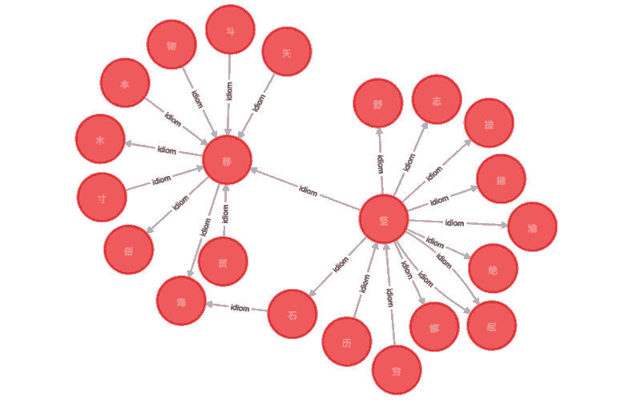
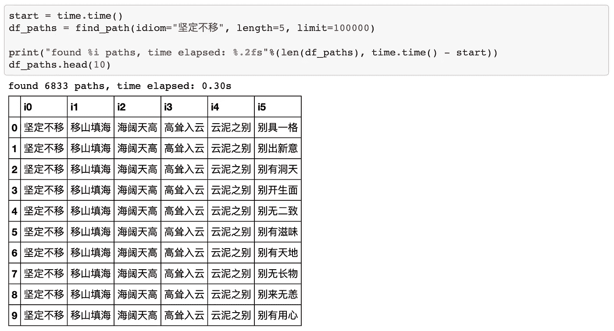

# 图形数据库案例研究:中国习语连锁店

> 原文：<https://towardsdatascience.com/a-graph-db-case-study-chinese-idioms-2b8969afdea8?source=collection_archive---------37----------------------->

## 用 20 行 Python 构建一个 Neo4J 图形数据库应用程序


与关系数据库相比，图数据库有许多优点:快速查询、灵活模式、高效存储等。但时至今日仍未得到充分利用。困难之一是与其他语言的互操作性，官方文档提供的例子很少。本文试图填补这个空白，提供了一个只有 20 行 python 代码的案例研究。


## **中华习语链球赛**

这是一个帮助小学生学习成语的经典教育游戏。一名学生坐在圆桌旁，随机拿出一个中国习语(一个由 4 个汉字组成的中国习语)。下一个学生必须快速说出另一个习语，其第一个字符与给定的习语的最后一个字符相匹配。当有人被卡住时，他必须唱首歌或跳支舞。

现在有了 graph DB 的知识，小学生可以不用再担心输了比赛，不得不在全班面前表演了！

## 图形设计

The graph structure is as simple as you can imagine. We have one types of node and one types of directed edge. It’s tempting to create a node for each idiom, because an idiom is an entity, just like a user, a movie, a product. If an edge exists between two nodes, we just create an edge. For example, there is an edge pointing from 坚定不**移** to **移**花接木, because the character **移** connects the two idioms.


Naive design

具有关系数据库背景的人可能会自然而然地想到这种设计，因为边只是连接操作中的一个匹配。对吗？不幸的是，这个看似无害的设计结果却不切实际。我们必须彻底搜索所有的边，并且一次添加一个边，导致二次时间复杂度。

通过巧妙的建模，我们可以做得更好。如果我们将习语嵌入到边中，而不是节点中，会怎么样？设位于习语开头或结尾的每个字符都是一个节点。设每条习语是一条有向边，从一个习语的最后一个字符(源节点)指向另一个习语的开始字符(目的节点)。原来这个设计是花费线性时间来构建的！



Improved design

## 履行

有了好的设计，实现就变得简单了。你需要安装 Neo4J 桌面服务器，和 py2neo 库。

```
pip install pandas py2neo
```

接下来，启动 Neo4J 服务器(参见[指令](https://neo4j.com/developer/neo4j-desktop/)，加载[数据集](https://github.com/shawlu95/IdiomGraph/blob/master/dataset/thuocl_chengyu.txt)。

现在我们可以查询结果了！让我们编写一个助手函数，让您定义初始习语、路径长度和行限制。

我们去查询数据库吧！不出所料，速度没有让人失望。为了在关系数据库中获得相同的结果，您需要自连接习语表五次。猜猜需要多长时间？(费用是 N⁵)



## 摘要

这个例子展示了我们如何利用图数据库的优势来显著地加速特定的任务，即使这些任务主要是用另一种语言编写的(在这个例子中是 Python)。

然而，阅读这篇文章并不能保证你可以在任何任务中运用同样的策略。为了做到这一点，需要牢固掌握[密码](https://neo4j.com/developer/cypher-query-language/)语言。

## 延伸阅读

下面的博客涵盖了与 AB 测试相关的主题，以及对本文中提到的关键概念的更深入的回顾。

*   可视化贝塔分布和贝叶斯更新[ [链接](/visualizing-beta-distribution-7391c18031f1)
*   理解置信区间[ [链接](/understanding-confidence-interval-d7b5aa68e3b)
*   A/B 测试的威力[ [环节](/the-power-of-a-b-testing-3387c04a14e3)
*   超越 A/B 测试:多臂强盗实验[ [链接](/beyond-a-b-testing-multi-armed-bandit-experiments-1493f709f804) ]
*   你知道可信区间[ [链接](/do-you-know-credible-interval-e5b833adf399#bce7)吗

*源代码、数据集、结果都在我的 GitHub* [*资源库*](https://github.com/shawlu95/IdiomGraph) *中。*