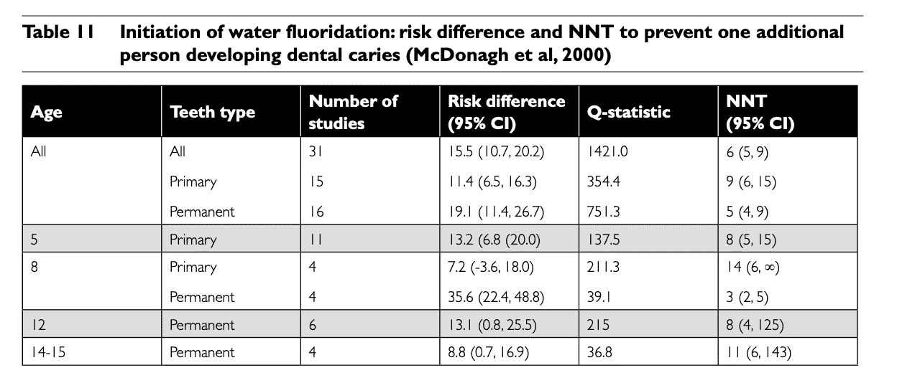
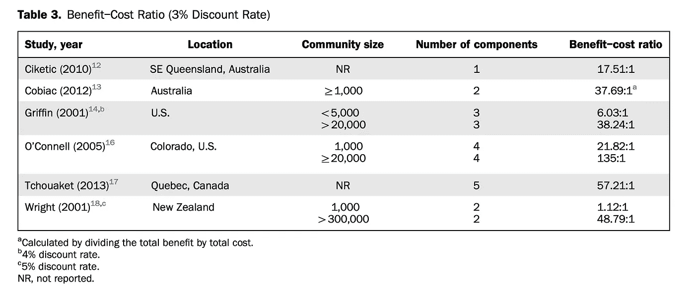

# 一个巨大的公共健康阴谋？

> 原文：<https://towardsdatascience.com/a-great-public-health-conspiracy-73f7ac6fb4e0?source=collection_archive---------13----------------------->

[(Source)](https://www.pexels.com/photo/bridge-conifers-dam-daylight-574024/)

## 科学、医学和政府在改善公众健康方面的合作。真人秀第五集。

2013 年 1 月，安大略省温莎市的[市议会做出了](https://windsorstar.com/news/local-news/windsor-votes-to-remove-fluoride-from-drinking-water)一个奇怪的选择。以 8 比 3 的投票结果，他们实施了一项计划，将该镇儿童的蛀牙率提高了 50%以上。这些议员实施了什么邪恶的行为？每年举办多次万圣节？让糖果公司做学校午餐？不，他们做了更灾难性的事情:他们故意选择忽视[堆积如山的医疗建议](https://www.cochranelibrary.com/cdsr/doi/10.1002/14651858.CD010856.pub2/full)，屈服于公众的歇斯底里，取消[上个世纪最伟大的公共卫生成就之一](https://www.cdc.gov/mmwr/preview/mmwrhtml/mm4841a1.htm)、公共用水加氟。

自 1945 年以来,[向公共供水中添加矿物质氟化物以防止蛀牙已经成为一种普遍的做法。全世界大约有 4 亿人饮用添加了氟化物的水，包括至少 66%的美国人口。数以千计的研究发现水氟化是有益且无风险的，其中](https://www.cdc.gov/mmwr/preview/mmwrhtml/mm4841a1.htm)[疾病控制和预防中心得出结论](https://www.cdc.gov/mmwr/preview/mmwrhtml/rr5014a1.htm):*氟化物在预防和控制龋齿方面既安全又有效* ( [龋齿是龋齿/蛀牙的医学术语](https://en.wikipedia.org/wiki/Tooth_decay))。尽管如此，加拿大一个小镇的政府认为他们比整个医学界都了解。

6 年后，儿童龋齿增加了 51%，低收入家庭需要牙科保健财政支持的人数增加了 300%，该镇儿童遭受了无尽的痛苦，温莎[委员会在 2018 年 12 月的一次会议上不情愿地撤销了其决定](https://nationalpost.com/news/local-news/council-votes-8-3-to-resume-fluoridating-water/wcm/ee38330d-9a7f-4543-9c0b-7ebfeee31178)。会上，5 位牙科专家作证，根据所有医学证据，全力支持水氟化[。另一方面，20 名公民——没有医学学位——基于毫无根据的恐惧和一种信念表示反对，认为政府不应该“治疗”公众*,即使药物阻止儿童去医院。*幸运的是，到了最后，理智和民意调查显示 80%的市民希望水的氟化占了上风，而温莎将再次享受到好处。](https://www.cdc.gov/mmwr/preview/mmwrhtml/rr5014a1.htm)

这个故事立即引起了我的注意，因为它有着耐人寻味的元素:一项伟大的医学成就被阴谋论者毁掉了，人们拒绝承认大量的证据，最后，科学战胜了迷信。此外，它说明了为什么[现实项目](https://towardsdatascience.com/tagged/the-reality-project)，[努力用数据](https://medium.com/@williamkoehrsen/announcing-the-reality-project-e16cc71abb64)减少对世界的误解是重要的:只有通过检查数据，我们才能找出哪些政策是有效的，然后——即使作为个体公民——为它们的实施而运动。在科学、医学和我们的世界观方面保持正确不仅仅是为了虚荣，而是为了确保我们为社会做出最好的决定。

在[现实项目的第五集中，](https://medium.com/@williamkoehrsen/announcing-the-reality-project-e16cc71abb64)我们将深入探究公共用水氟化的证据。虽然前几集关注的是大规模的想法，但这一集更私人:它涉及到你和你家人的健康。我们需要知道事实，因为虽然我们最初可能会嘲笑阴谋论者，但只有当他们开始侵蚀对政府的信任，并随之降低社会福祉时，这才是有趣的。也许我们天生倾向于寻找疯狂的理论(你点击这个是因为标题中的“阴谋”，对吗？)但事实往往更令人惊讶，因为公共用水加氟的数据证明了这一点。

# 公共用水加氟的事实

对于任何健康话题，尤其是引起争议的话题，我们必须小心我们从哪里获得数据。即使是同行评议期刊上的研究也会有偏见——有意或无意。因此，审查医学证据的最佳实践是查看[荟萃分析](https://www.meta-analysis.com/pages/why_do.php?cart=)，即评估数十或数百项研究结果的审查。英国慈善机构 [Cochrane Organization](https://www.cochrane.org/) 成立的目的是为了对医学文献进行系统综述，并为公众利益提出客观建议。我们将依靠他们[对公共水氟化](https://www.cochranelibrary.com/cdsr/doi/10.1002/14651858.CD010856.pub2/full)的荟萃分析，以及来自[澳大利亚国家健康和医学研究委员会(NHMRC](https://web.archive.org/web/20170320190155/https://www.nhmrc.gov.au/_files_nhmrc/file/publications/synopses/Eh41_Flouridation_PART_A.pdf) )的一项分析。为了进行经济分析，我们将使用来自[“社区水氟化的经济评估”](https://www.ajpmonline.org/article/S0749-3797(15)00691-1/pdf)的数据。

这些来源都不是引人入胜的读物，但是当涉及到健康时，依赖娱乐(即新闻)作为事实的来源是灾难性的。阅读实际证据是困难的，但这是不被特殊利益集团愚弄的唯一方法。[维基百科的文章可以是一个很好的起点](https://en.wikipedia.org/wiki/Water_fluoridation)，但是我们应该始终坚持引用。在这里，我将总结相关的部分，但是如果你持怀疑态度，我鼓励你阅读文章。

## 公共饮水加氟能减少蛀牙吗？

让我们从一个简单的问题开始:**水氟化能预防蛀牙和蛀牙吗？明确的答案是:是的，至少在儿童中是这样。根据 Cochrane review(基于 107 项研究),公共水氟化减少了乳牙 35%的蛀牙和恒牙 26%的蛀牙。其他荟萃分析也发现了类似的结果。来自 NHMRC 的报告发现，在所有研究中，风险降低了 9%到 35%。同一篇综述发现，需要治疗(NNT)以预防蛀牙的人数在 3-14 人之间。NNT 值为 3 意味着每 3 个人接受氟化水，就有 1 个人不会因此患上龋齿。**

[NHMRC 审查的相关调查结果见下图](https://web.archive.org/web/20170320190155/https://www.nhmrc.gov.au/_files_nhmrc/file/publications/synopses/Eh41_Flouridation_PART_A.pdf)。[龋齿是蛀牙的学名](https://www.dentalhealth.ie/dentalhealth/causes/dentalcaries.html)(和细菌产生的酸造成的蛀牙是一回事)。风险差和 NNT 是两个最有用的栏目。在所有回顾的研究中，公共供水的氟化降低了蛀牙的风险。

Table 11 from NHMRC review on the efficacy and safety of fluoridation.

Cochrane review 小心翼翼地指出，没有足够的研究证实水的氟化作用可以降低成人龋齿的发病率*。*然而，[疾病控制和预防中心(CDC)](https://www.cdc.gov/mmwr/preview/mmwrhtml/mm4841a1.htm) 引用了至少一项研究，表明成年人的蛀牙减少了 20-40 %,这表明益处可能会持续一生。重要的是，既要承认我们已有的证据——饮水氟化改善了儿童的牙齿健康——又要承认在得出结论之前我们还需要更多的研究。

## 潜在的副作用是什么？

医学干预的效果不是唯一的关键因素:不需要有有害的副作用，或者至少好处必须大于不利的结果。因此，第二个问题是:**氟化有副作用吗？反对水氟化的人列举了一系列副作用([包括癌症和低智商](https://rationalwiki.org/wiki/Water_fluoridation#Arguments_for_fluoridation))，但是，在一项又一项的研究中，医学证据指出只有一种很少发生:牙齿轻度变色。这种情况被称为氟斑牙，纯粹是美学意义上的，它只会影响牙齿的外观。其他新闻，[喝咖啡和茶也会染牙](https://www.webmd.com/oral-health/features/foods-stain-teeth-feature)！**

任何由阴谋论者鼓吹的声称发现了负面影响的研究都检验了远远超过任何社区水氟化计划所要求的剂量(百万分之 0.7 *份*)。这意味着公共饮水加氟唯一可能的副作用是轻微的色斑，就像你可能从过量的茶中得到的一样。所以，归根结底是你重视什么:如果你想让你的牙齿腐烂，但看起来无可挑剔，停止喝含氟水(和茶)！对于我们这些不喜欢牙痛和蛀牙的人来说，轻微变色的风险完全值得氟化物的好处。

如果你不相信我，也许美国牙科协会(ADA)的以下声明可以动摇你:“[ADA]毫无保留地支持社区供水的氟化，认为这是安全、有效和必要的，可以防止蛀牙”。提醒你一下，美国糖尿病协会认为 T2 会因为加氟水而失去 T3，因为这导致了患者的减少。也许是唯一从这种情况中获益的人？一名当地牙医，由于水氟化的停止，他的预约一直持续到 2020 年。

# 经济学

有效的治疗是一回事，但在实施之前对社区来说最重要的问题可能是:**值得吗**？我们无法对预防的人类痛苦定价，但我们可以将氟化的成本与减少的蛀牙治疗成本进行比较。在审查[“社区水氟化的经济评估”](https://www.ajpmonline.org/article/S0749-3797(15)00691-1/fulltext)中，对不同人口规模的 6 项不同研究进行了检查，发现每人每年的水氟化成本从 0.24 美元到 4.85 美元不等，取决于社区规模(人口越多意味着人均成本越低)。将这些数字放在背景中，每人每年提供的平均福利从 5.49 美元到 93.19 美元不等。

并排比较成本和收益，社区水氟化每投资 1 美元可获得 135 美元。在每项研究中，收益都超过了成本，如下表所示:

Cost to benefit ratios of water fluoridation from 6 studies [(Source)](https://www.ajpmonline.org/article/S0749-3797(15)00691-1/fulltext)

有趣的是，成本收益比通常随着社区规模的增加而增加。这是有道理的:基础设施是最昂贵的部分，氟化物本身相对便宜。因此，同一供水系统服务的人越多，人均成本就越低。

我们希望我们的退休基金能够带来正回报，我们也应该从公共卫生干预中获得同样的回报。你可以做得比把你的钱投入公共水氟化更糟糕:它不仅减少了你社区的儿童的痛苦，而且还可以获得 135 倍的投资回报！任何选择在水中加氟的社区不仅能改善其公民的牙齿健康，还能带来社会利益。

# 可供选择的事物

有没有其他方法可以在不往水里放氟化物的情况下获得同样的好处？答案是肯定的:牛奶和盐都可以加氟，最常见的替代品是局部选择，包括凝胶和牙膏。现在美国大约 90%的牙膏都含有氟化物。更重要的是，牙膏中的浓度几乎是水氟化物的 1000 倍( [1000+ ppm，相比之下，水](https://www.cdc.gov/mmwr/preview/mmwrhtml/rr5014a1.htm)的浓度为 0.7 ppm)。对于那些担心氟化对健康有潜在影响的人来说，明确的解决办法不是避免饮用自来水，而是停止刷牙。

其他氟化物来源的流行可能是为什么在过去的几十年里，公共水的氟化作用已经下降。在 20 世纪 50 年代和 60 年代进行的初步研究[发现，当引入氟化物时，龋齿减少了 50–70%](https://www.cdc.gov/mmwr/preview/mmwrhtml/mm4841a1.htm)。然而，正如我们在上面所了解到的,[提出的证据](https://www.cochranelibrary.com/cdsr/doi/10.1002/14651858.CD010856.pub2/full)表明了一个更加适度的减少，大约 20-35%。这是一个好消息，因为美国的整体蛀牙率下降，含氟和非含氟社区之间的牙齿健康差距缩小。然而，应该注意的是，在社会经济水平较低的地区，含氟牙膏和替代来源的获取受到限制，而这些地区恰恰是最需要含氟牙膏的地方。疾控中心总结得很好:

> 水氟化对社会经济地位低的社区尤其有益。这些社区的龋齿负担不成比例，并且比高收入社区更难获得牙齿保健服务和其他氟化物来源……尽管有其他含氟产品，但水氟化仍然是向大多数社区的所有成员提供氟化物的最公平和最具成本效益的方法，无论年龄、教育程度或收入水平如何。

与替代品相比，公共水氟化最好的部分是它不会基于财富进行歧视。与每人每年花费 100 美元的氟化物凝胶相比，它也便宜得多。反对公共用水加氟的人普遍认为，所有其他选择都意味着不再需要加氟。然而，如果是这样的话，那如何解释温莎市在短短几年内蛀牙率的快速上升呢？虽然这只是一个轶事，但是其他研究已经发现一旦停止水的氟化会有类似的不良影响。是的，有替代品，但它们要求人们能够负担得起，并知道他们应该使用它们。在公共用水中加入氟化物，覆盖所有的基地，并接触到那些最脆弱的人，这要有效得多。

# 为什么推迟？

鉴于上述证据:氟化物是预防蛀牙的有效、安全和最便宜的选择，尤其是对儿童而言，很难想象有人会反对这一措施。尽管如此，还是有反对水氟化的呼声，通常来自那些反对任何形式的政府干预的人。 [Rational Wiki 有一个很棒的页面](https://rationalwiki.org/wiki/Water_fluoridation#Arguments_for_fluoridation)，揭穿了许多反对水氟化的不合逻辑的论点，但是在这里我只提到两个。

## 1.世界卫生组织反对氟化

的确，世卫组织已经发布了关于从饮用水中去除氟化物的出版物。然而，世卫组织并没有谈论受控的公共水氟化，而只是过度的自然氟化。这只适用于世界上很少一部分人，他们生活在氟化物自然供应量极高的地区。任何东西在极端的量下都是危险的，包括许多维生素，将这些地方与公共水氟化相比较是错误的逻辑。在美国，用于给公共用水加氟的百万分之 0.7 远低于国家资源委员会认为安全的百万分之 4。

事实上，世卫组织是水氟化最坚定的支持者之一，[明确声明](https://web.archive.org/web/20160911165215/http://www.who.int:80/water_sanitation_health/oralhealth/en/index2.html):“在可能的情况下，水供应的氟化是预防龋齿的最有效的公共卫生措施。”引用水氟化减少健康不平等的能力，世卫组织提倡尽可能采用这种干预措施。用一个有限的例子来代表所有情况是阴谋论者的经典策略。它代表了一种过度概括的谬误，是两种完全不同情况的比较。

## 2.消费者应该对水的氟化有选择权

这可能是反对水加氟的最常见的论点，并以多种形式出现:政府不应该对其公民用药，消费者没有接受加氟的选择，我们应该能够过上没有暴政的生活。关于选择的论点可以分为几个层次。鉴于政府——至少在反对势力强大的美国——是由人民选举产生的，你确实可以选择水的氟化。如果你不喜欢它，没有什么可以阻止你竞选公职来改变事情。此外，你可以选择只喝瓶装水，瓶装水可能含氟，也可能不含氟(因为美国食品和药物管理局对瓶装水的监管有些松懈)。

此外，儿童是水氟化的最大受益者，他们不能投票，因此没有任何选择。如果事情真的由人民决定，那么每个人都会有平等的发言权。此外，政府还为公共安全做了很多其他事情，比如在冬天犁地和管理药品。我们是否应该选择在积雪覆盖的高速公路上行驶，或者给我们的孩子[药物，其中可能含有公司想要的任何东西](http://ushealthpolicygateway.com/vii-key-policy-issues-regulation-and-reform/l-health-care-regulation/pharmaceutical-regulation/)(在药物受到监管之前，它往往杀死的人比它帮助的人多)。当涉及到公众的安全时，我们通常没有真正的选择，鉴于我们对[非理性、有害行为的偏好，这是一件好事。](https://en.wikipedia.org/wiki/Thinking,_Fast_and_Slow)

水氟化的批评者并不多，他们只是倾向于大声疾呼。在温莎，有五分之四的居民支持水的氟化处理，少数敢于直言的人造成了大部分的损失。同样， [1998 年盖洛普民意测验发现，美国 70%的受访者](https://www.ncbi.nlm.nih.gov/pmc/articles/PMC4065573/)赞成这种做法，这表明一小部分人应对反对派负责。问题似乎不在于公众舆论，而在于谁的声音最大。当人们相信(错误地)他们受到了政府的伤害时，他们更有可能说出来，而不是当他们知道他们得到了帮助时，这就产生了更有说服力的新闻。

我将以一个生动的故事来结束这一节。当芬兰城市库奥皮奥在 1992 年停止水的氟化时，他们在宣布停止之前一个月实施了这一改变，没有告诉公众。这意味着公众在不知情的情况下饮用了整整一个月的无氟水。研究人员利用这一补偿来调查居民与水氟化有关的症状，甚至是水的味道。研究结果显示，居民们不知道水的氟化作用已经提前停止:他们报告说，即使在氟化作用停止后，水的症状或味道也没有变化。

只有当居民们被告知他们不再饮用氟化水时，他们才奇迹般地报告症状减轻，并说他们能注意到味道的变化。换句话说，整个效果都在他们的头脑中。这些研究的作者很好地总结道:“这些症状的流行似乎与接触氟化水的心理影响有关，而不是身体影响。”那些认为氟化是一种消极行为的人最有可能报告说，一旦他们知道氟化已经停止，他们会感觉更好(但当氟化实际发生时，他们没有注意到任何变化)。人类的思维非常善于证明非理性的信念，公共用水加氟是有害的这一概念不得不被列为最不合逻辑的理论之一。不管人们反对水氟化的动机是什么，有一件事是清楚的:他们自己没有检查数据，也没有批判性地思考证据。

# 结论

水氟化的故事是一个关于药物如何发挥作用的经典故事:它被深入研究，并在被证明安全有效后，在美国全国范围内实施。虽然我开始写的那篇文章可能会让你质疑人类的未来，但我认为这个故事是积极的。重要的教训是，科学和医学最终取得了胜利。温莎再次获得了氟化水，镇上的孩子们(可能还有成年人)将体验到这种解脱。值得指出的是，真理不是靠叫嚣对方而赢得的，而是靠提出明确的证据。问题不是缺乏公众对有益措施的支持，而是反对的声音太大了。套用一句[的名言](https://en.wikiquote.org/wiki/Edmund_Burke)，迷信要想获胜，唯一需要做的就是让科学安静地坐在一旁。

现在你知道了事实:水氟化显然对健康有益，没有副作用，并且是防止蛀牙的最具成本效益的方法——你准备好利用这些信息继续让世界变得更美好。如果人类倾向于寻找耸人听闻的东西，那么就把水的氟化说成是耸人听闻的。这是一个由科学、医学和政府在最大规模上实施的计划，实际上已经成功地改善了公共卫生，同时带来了利润。

一如既往，我欢迎反馈和建设性的批评。我可以通过推特 [@koehrsen_will 联系到。](http://twitter.com/@koehrsen_will)