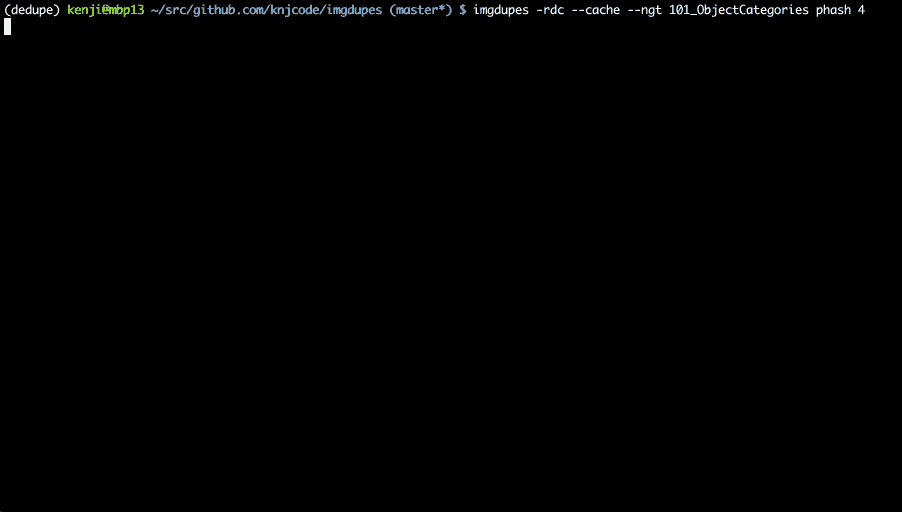

# 对图像数据集进行重复数据删除的绝佳方式

> 原文：<https://towardsdatascience.com/a-great-tool-for-image-datasets-cb249663ca45?source=collection_archive---------18----------------------->

## 生产中的命令行工具。

就手工劳动的时间而言，为 ML 管道准备数据通常要花费大部分时间。此外，构建或扩展数据库通常要花费天文数字的时间、子任务和对细节的关注。后者让我找到了一个很棒的命令行工具，用于清除重复和近似重复的内容，尤其是在与 [iTerm2](https://iterm2.com/) (或 [iTerm](http://iterm.sourceforge.net/) )一起使用时——即 [imgdupes](https://github.com/knjcode/imgdupes) 。

注意，这里的目的是介绍 imgdupes。有关规范、算法、选项等的技术细节，请参阅参考资料(或者继续关注有关细节的未来文章)。

# 问题陈述:消除映像集的重复

我在构建面部图像数据库时的情况如下:一个包含多个目录的目录，每个子目录包含相应类的图像。这是 ML 任务中的一个常见场景，因为许多著名的数据集都遵循这样的约定:为了方便和作为显式标签，通过目录将类样本分开。因此，我在清理人脸数据，并在命名的子目录中识别人脸。

知道有几个副本和近似副本(例如，相邻的视频帧)，并且这对我要解决的问题没有好处，我需要一种算法或工具来找到副本。准确地说，我需要一个工具来发现、显示并提示删除所有重复的图像。我很幸运地发现了一个非常棒的基于 python 的命令行工具 imgdupes。

# 先决条件

在所需的 python 环境中安装 [imgdupes](https://github.com/knjcode/imgdupes) (即，参见 [Github](https://github.com/knjcode/imgdupes) 获取说明)(例如，参见 [Gergely Szerovay](https://medium.com/u/345a0f19db9c?source=post_page-----cb249663ca45--------------------------------) 的[博客](https://medium.com/free-code-camp/why-you-need-python-environments-and-how-to-manage-them-with-conda-85f155f4353c)了解 [conda](https://anaconda.org/) 环境)。

如果 iTerm2 是您的 shell 提示符的选择，我会建议大多数开发人员使用它，因为它提供了许多简洁的特性、可调的设置和需要时的附加组件。iTerm 本身可以组成一系列博客，如果特定的博客还不存在的话(例如，[克洛维斯](https://medium.com/u/792c2e6bc791?source=post_page-----cb249663ca45--------------------------------)的([@阿尔贝](https://github.com/Aarbel) l) [博客](https://medium.com/@Clovis_app/configuration-of-a-beautiful-efficient-terminal-and-prompt-on-osx-in-7-minutes-827c29391961))。

# IMGDUPES:简单来说

直接借用作者的 Github 页面，这里有一张 gif 演示 imgdupes 的用法。

[https://github.com/knjcode/imgdupes/blob/master/video_capture.gif](https://github.com/knjcode/imgdupes/blob/master/video_capture.gif)

该工具出色地允许用户找到重复项，然后甚至直接在 iTerm 中并排显示这一对。此外，可选参数允许每个实例提示用户保留一个、多个重复图像，或者不保留任何重复图像。

# 一个小问题(根据我的用例)

首先，与在子目录中搜索相比，从根文件夹中搜索时需要更多的比较。换句话说，如果我确信在任何子目录中都不存在重叠，则不希望从根目录使用，原因如下:

1.  许多(数百万和数百万)不必要的比较。
2.  很多误报源于不同的身份。这占了大多数。如下面的截图所示，这四组重复项都是假的，但都来自不同的目录(参见下图中图像下方的路径)。

最初使用的代码片段:

Screenshot running imgdupes from root directories.

这有两个问题:(1)如果手动筛选，会浪费太多时间；(2)删除了太多不应该删除的面(标志 *-dN* ，其中 *-d* 提示保留或删除， *-N* 首先选择并删除其余部分，无需用户输入)。

# 简单修复

让我们从命令行直接切换到每个单独的目录，运行 imgdupes，切换回根目录，然后重复。从命令行运行以下命令:

Notice the progress bar appearing when imgdupes is run from a different subdirectory.

只需添加 *-N* if，以仅保留每组的第一幅图像，从而无需额外输入即可运行——如果从根递归运行，这种方法将删除许多许多独特的人脸。

默认情况下，列表的顺序由文件大小设置(降序)。对于我的情况，大约 95%的第一张图片是首选。然而，这里有几个例子；事实并非如此。

The second image might be the preferred image to keep.

为此，您可以通过每次提示手动选择一组重复项。然而，这可能很耗时，我就遇到过这种情况。所以我首先运行显示，然后滚动以确保所有看起来都很好(即，手动处理首选人脸不是第一个的实例)，然后再次运行删除。尽管如此，这完全取决于开发人员和项目/数据的需求。最后，我先查看了一下(即带有 *-d* 标志)……只是为了确定一下。然后，我运行以下程序对映像集进行重复数据消除:

# 最后

imgdupes 是一个很棒的命令行工具，它提供了一个实用的界面来查找、查看和清理重复的图像。技术细节在他们的 Github 上(也许还有未来的博客:)。

总而言之，与 iTerm 的集成令人振奋。这是我最喜欢的部分——事实上，基于 python 的控制台工具还可以从这里完成的 iTerm 集成中受益。

请分享任何可以借用这个想法或想到的任何其他想法的额外工具的想法或想法。

# 接触

[网](https://www.jrobsvision.com/)

[领英](https://www.linkedin.com/in/jrobby/)