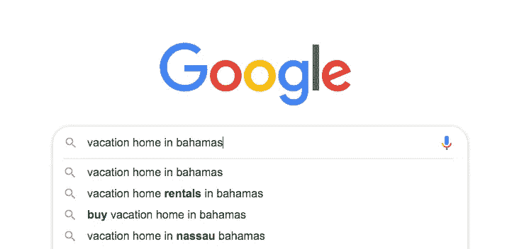
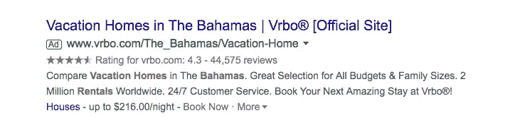
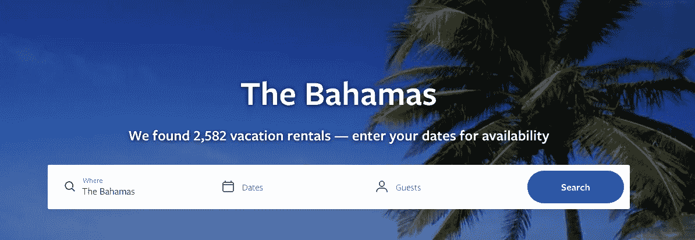
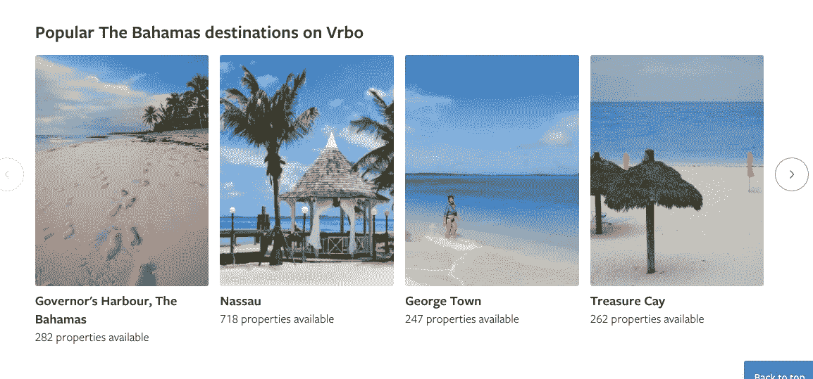
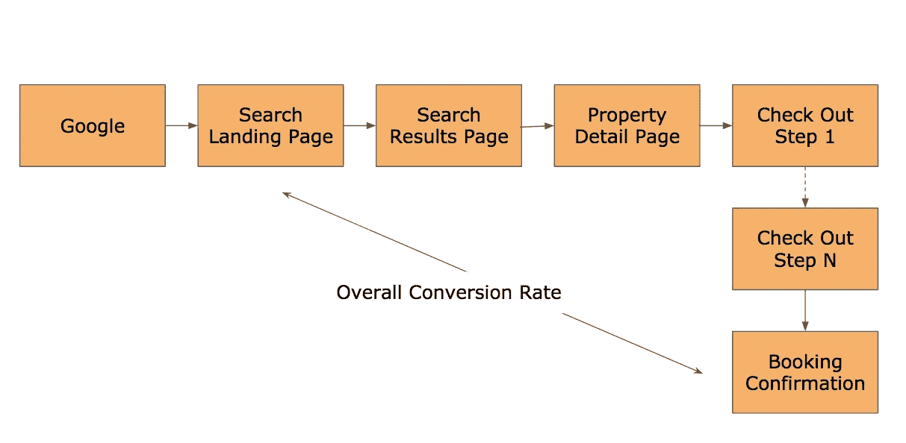
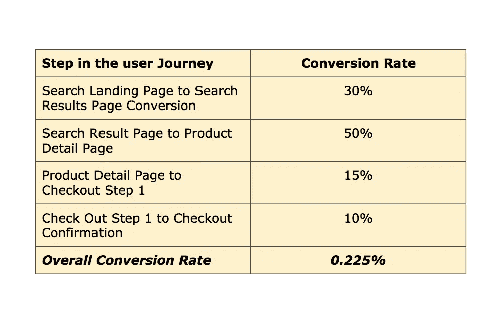
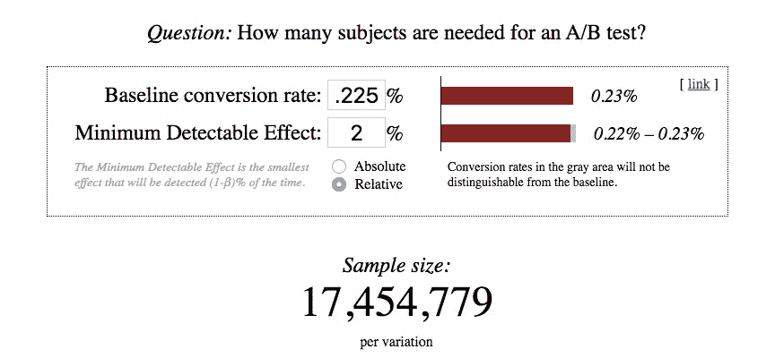
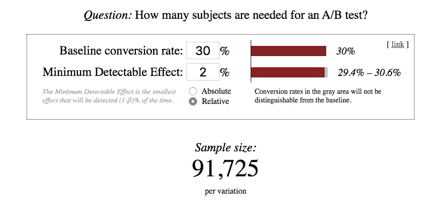

# 选择 A/B 测试指标—入门

> 原文：<https://towardsdatascience.com/a-guide-for-selecting-an-appropriate-metric-for-your-a-b-test-9068cccb7fb?source=collection_archive---------10----------------------->

## 并且避免了大多数测试工作中常见的错误。

Photo by [Luke Chesser](https://unsplash.com/@lukechesser?utm_source=medium&utm_medium=referral) on [Unsplash](https://unsplash.com?utm_source=medium&utm_medium=referral)

这篇文章是我关于 A/B 测试系列文章的第三篇。

在第一篇文章中，我向[展示了 A/B 测试](/the-intuition-behind-a-b-testing-a-primer-for-new-product-managers-6f21dee98533)背后的直觉，以及确定您希望观察的效果大小和相应样本大小的重要性。

在第二篇文章中，我谈到了产品经理如何[以加速测试的方式设计 A/B 测试。](/smart-a-b-test-design-understanding-test-exposure-85ee44c897ba)

在第三篇文章中，我将讨论 A/B 测试的另一个方面:**在确定 A/B 测试的指标时，你应该考虑哪些因素？**

## 案例研究:VRBO 搜索登录页面

当我们设计一个 A/B 测试时，我们选择一个我们希望改进的主要度量标准(和几个次要度量标准),并测量变体和控制组。如果我们不仔细选择这个指标，我们就是在浪费时间。

我们将使用一个我熟悉的例子:在 VRBO 上搜索登陆页面。VRBO 是一个双边市场，房主可以列出他们的房屋出租，潜在的旅行者可以为下次旅行找到合适的住宿。搜索登录页面的目的是从谷歌获得流量，并将该流量转化为执行更高意向查询的人。

让我们看一些截图，从旅行者开始计划过程的最常见方式(在谷歌上搜索)开始

***第一步*** *:想着去巴哈马旅游？让我们搜索一下。*

Searching for Vacation Homes in the Bahamas

***第二步*** *:啊哈！看起来 VRBO 有很好的选择。让我们看看那里。*

Google Search Result on VRBO

让我们看看我在巴哈马有哪些选择。

[Search Landing Page for the Bahamas — Above the Fold](https://www.vrbo.com/vacation-rentals/caribbean/bahamas)

[Search Landing Page for the Bahamas — Below the Fold](https://www.vrbo.com/vacation-rentals/caribbean/bahamas)

我们建立这个页面是为了:

1.  **高预订意向用户**。用户可能已经预订了机票，或者至少知道他们想什么时候旅行。我们假设，对于这些用户来说，该页面要做的工作是找到适合他们旅行日期的房屋。
2.  **低预订意向用户**。处于计划阶段的早期用户，他们可能对何时旅行没有任何概念。我们假设，对于这些用户来说，该页面要做的工作是帮助他们探索各种可用的房屋，并影响用户访问巴哈马。
3.  **谷歌机器人**。我们希望谷歌为最相关的用户查询建立页面索引。

整个用户旅程(从谷歌登陆 VRBO 到预订看起来是这样的。)

Typical user journey for booking travel.

有两点需要特别注意:

1.  在初始步骤和最终步骤之间，有用户必须采取的多个步骤，并且在每个级别，一些用户将退出。
2.  由于旅行被认为是购买(相对于冲动购买)，最初和最后一步之间的时间可能是几周。

现在让我们看看这个转换漏斗的数学，对从一个步骤到另一个步骤的转换做一些假设，并估计总的转换率。( ***免责声明:这些数字仅用于说明目的*** )

An estimate of the conversion rate of each step and overall conversion rate.

最后，你必须得到一个粗略的流量数量级。让我们在这里做一些假设( ***)免责声明:这些数字仅用于说明目的。)***

1.  每月独立访客总数:1000 万
2.  到达搜索登录页面的独特新访问者:30%(300 万用户)

现在，假设您是搜索登录页面的产品经理。根据这些基本比率，让我们来看一个假设的 A/B 测试，并为您的实验看两个可能的指标。

> 测试假设:通过在搜索登录页面上添加一个背景“英雄”图像来指示目的地，用户会感到舒适，因为他们正在查看正确的目的地，从而导致更高的搜索和 2%的整体转化率

您有两个指标选择，总转化率和进行过时搜索的用户百分比。

## 实验设计当我们选择总转化率作为衡量标准时

用整体转化率作为产品经理的衡量标准是很有诱惑力的。毕竟，你可以告诉你的管理层，你增加了$$$的收入。

如果您决定选择这个作为您的度量，让我们看看测试参数:测试样本大小和总测试持续时间。让我们将 0.225%的基本比率和 2%的最小可检测效应(MDE)代入 Evan Miller 的样本量计算器。

The sample size for an A/B test with 0.225% base rate and 2% MDE. Courtesy: Sample Size Calculator by Evan Miller

总的来说，您将需要 34，909，558 个样本用于您的变体组和对照组。

**每月有 300 万独立用户，如果测试正确，您的测试将需要 11-12 个月才能完成。很多人会犯这样的错误，过早地看到一些积极的结果，变得不耐烦，过早地停止实验。如果你这样做，你很可能会看到一个假阳性。**

## 实验设计当我们选择%的用户进行日期搜索作为主要指标时

如果您决定选择这个作为您的度量，让我们看看测试参数:测试样本大小和总测试持续时间。让我们将 30%的基本比率和 2%的最小可检测效应(MDE)代入 Evan Miller 的样本量计算器。

The sample size for an A/B test with 30% base rate and 2% MDE. Courtesy: Sample Size Calculator by Evan Miller

总的来说，你将需要 183，450 个样本用于你的变异体和对照组。**每月有 300 万独立用户，这将需要几天时间来完成您的测试。[** 你可能想考虑运行测试整整一周，以消除任何一周内偏差的可能性。]

用这种方法，你可以在同样的时间内进行 10 次实验。

## 经验教训

如果上面的情况听起来是假设的，让我向你保证，很多产品经理(包括我)已经采取了使用总转化率作为主要指标的方法。这里是我学到的一些经验，我想更广泛地分享。

1.  当你设计你的测试时，充分注意你选择的度量标准。如果你正在测试的功能在漏斗中处于较高位置，并且你的整体转化率低于 1%，你的测试结果将需要几个月才能完成。(除非你是脸书、谷歌、亚马逊，或者一个顶级的互联网网站。)
2.  当您的测试需要几个月的时间才能完成时，由于意外的和不相关的更改而导致错误蔓延并破坏您的测试结果的可能性将会非常高。您可能需要重新开始测试。
3.  你的特征离整体转化率越远，你的变化**对指标产生因果影响**的可能性就越低。
4.  最好的选择是使用直接受您的更改影响的指标，比如页面上的指标，来衡量微转化。
5.  如果你选择了像点击率这样的页面指标，通过查看一个平衡的指标来注意意想不到的结果。如果我们选择日期搜索作为我们的衡量标准，我们还将查看该页面以及后续页面的跳出率。这种技术确保产品变更不会向下游发送不合格的流量。(在以后的文章中会有更多关于这个主题的内容。

*如果你觉得这篇文章有用，请告诉我。如果你对 A/B 测试有任何疑问，请在评论中给我留言，我会考虑把它作为未来帖子的主题。*

这是我的 A/B 测试系列文章的第三篇。该系列的其他文章是:

1.  [A/B 测试背后的直觉——新产品经理入门](/the-intuition-behind-a-b-testing-a-primer-for-new-product-managers-6f21dee98533?source=your_stories_page---------------------------)
2.  [如何在 A/B 测试中分割流量](/smart-a-b-test-design-understanding-test-exposure-85ee44c897ba)

# 学分:

我要感谢 Evan Miller 出色的样本量计算器和他在 A/B 测试方面的思想领导力。

**关于我** : [Aditya Rustgi](https://www.linkedin.com/in/adityarustgi/) 是一名产品管理领导者，在电子商务和旅游行业的多边市场和 B2B Saas 业务模式方面拥有超过 15 年的产品和技术领导经验。最近，他是 Expedia 公司 VRBO 的产品管理总监。