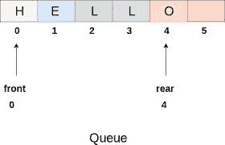

# 数组和操作指南(数据结构)

> 原文：<https://towardsdatascience.com/a-guide-to-arrays-and-operations-data-structures-f0671028ed71?source=collection_archive---------23----------------------->

一开始，学习数据结构和算法可能会非常困难。这就像学习任何新的课程，这些课程有你以前没有接触过的话题，有自己的语言(有点像学习有机化学或新的游戏类型)。我原本打算把这一整篇文章都放在数据结构和算法上，但是它太长了。所以，我在这里把它分开了，我将从数据结构开始，以后会发布更多。不用担心找到所有的东西。一旦文章完成，我将像一个双向链表一样在每篇文章中插入链接(你将在另一篇文章中得到参考)。

# 为什么要学习数据结构？

计算机软件就是处理数据。数据涵盖所有类型的信息，更基本的形式是数字和字符串。数据结构解释了数据是如何组织的。这种结构决定了代码运行的速度和效率。一旦你深刻理解了数据结构是如何工作的，你的代码就会运行得更好，更漂亮。从数据科学家的角度来说，我们都写代码，但是写好代码也会给你带来软件工程的机会。当然，学习一些能让你在自己的领域做得更好的东西，同时扩展到其他有利可图的领域也没那么糟糕。

# 数组数据结构& 4 种基本操作

数组是一种基本的数据结构。数组基本上是一个数据列表。下面是一个表示 Hello 的数组示例:

*Image taken from Javapoint.com*

我喜欢通过我已经知道的事物的例子来学习。那么，我们来说说上面的数组图像。我们有实际的数据 Hello，下面有一个空格和数字。你好下面的数字被称为索引。把一个数组的索引想象成一个家的地址。在 Hello 数组中，H 位于地址 0，e 位于地址 1。我们从 0 开始索引的原因是因为大多数编程语言从 0 开始索引——比如 Python。为了了解像数组这样的数据结构如何影响你的代码，我们必须看看操作。大多数数据结构适用于这四种操作:

*   阅读:在特定的地方检查数据。例如，在上面的数组中读取“o ”,计算机知道在索引 4 中查找。
*   搜索:在数据结构中查找一种类型的值。例如，在 Hello 数组中查找数字将会一无所获。
*   插入:在数据中放置另一个值。例如，在上面的数组中放置 Hellow 将在索引 5 中添加“w”。
*   删除:删除数据结构中的一个值。例如，从 hello 中删除“H”将会是 ello(旁注:删除值 H 实际上会涉及到将所有字符向左移动的另一个步骤)。

当计算机科学家或软件工程师提到算法的速度时，他们指的是该过程中有多少步，而不是时间。这意味着时间有点仓促，因为不同的硬件在不同的时间执行。根据过程中的步骤来测量速度允许一致的标准化测量，这也反映了算法的复杂性。有趣的是，时间复杂度、效率和性能在数据结构和算法讨论中经常是指同一个东西。

# 阅读

读取是检查数组中特定索引的值。看书的速度真的很快，快一步而已。原因是由于计算机知道数组中的索引并偷看里面。当计算机读取数组时，它会转到正确的索引，原因是:

1.  计算机知道每个值的索引。
2.  存储在内存中的数组是以“块”的形式读取的把它想象成寻找地址的街道上的房子。
3.  数组从 0 开始，所以计算机知道它只能从那里开始。

从上面的原因来看，从一个数组中读取需要计算机一步，这使它成为一个真正快速的操作。

# 搜索

在数组中搜索是寻找特定类型的数据，并找到它在索引中的位置。搜索是以一种非常有条理的方式进行的。计算机从索引 0 开始向前查找，直到找到它要寻找的值。在最坏的情况下，如果计算机想在一个 10 的数组中搜索，而所需的值在第 10 个点上，那么它会一直搜索到第 10 个值。换句话说，一个 300 大小的数组，我们想要的值位于第 300 个索引中，计算机需要 300 步来搜索该值。

我希望你现在能明白这个模式。从更抽象的角度来看，对于数组中的任意 N 个单元，线性搜索最多需要 N 步。因此，如果您将此公式应用于前面的两个搜索示例，我们可以看到，由于我们要查找的数据的索引位置在末尾，最差的情况总是取最高值。与阅读相比，搜索更慢，因为它需要 N 个步骤，而阅读只需 1 个步骤。

# 插入

插入的速度取决于插入值的位置。在数组中插入的最快方法是插入到末尾。在开头或中间的某个地方插入会稍微复杂一点。但是不要担心，我们会经历发生的事情。让我们来看看最糟糕的情况，因为其他事情都差不多，只是步骤少了一些。在最坏的情况下，在数组中插入，在开始时，需要最多的步骤。原因是一旦值被插入到开头，计算机必须将所有其他值向右移动。由于左边的值没有移动，所以插入中间的任何其他值占用的时间更少。

从抽象的角度来看，我们可以看到，对于 N 大小的数组，插入需要 N + 1 个步骤。将值向左向右移动是 N 步，而实际的插入需要 1 步。因此，最坏的情况需要 N+1 步，但是最后的插入只需要 1 步。

# 删除

删就是你想的那样。删除会移除数组中的值。删除有点像以相反的方式插入。删除操作不是放置一个值，而是移除该值并移动这些值以弥补删除操作留下的空白。就像插入一样，删除的最佳速度是在最后——1 步。它删除结束值，而不必移动任何其他值。删除的最坏情况是在开始。一旦它删除了第一个值，右边的所有其他值都必须左移一个，以覆盖数组中的空白空间。

对于 N 大小的数组，插入的总体模式是 N + 1。删除需要 1 步，而值的移动需要 N 步。像插入一样，最坏的情况是在数组的开始，而最好的情况是在数组的末尾。

# 结论

了解步骤的数量和操作步骤的长度是理解数据结构如何工作的基础之一。在理解操作的基础上选择正确的数据结构，可以让你以更少的步骤编写代码，这意味着更高的效率。我在这里非正式地介绍了大 O 符号，但是我们稍后会正式讨论它。这篇文章已经太长了。我希望这篇文章能帮助你更好地理解数据结构，因为我个人第一次发现它非常令人困惑。继续努力，你会成功的！

在此找到的第 2 部分:

 [## 阵列的线性搜索和二分搜索法指南(数据结构和算法)

### 在上一篇文章中，我们讨论了数组和操作(链接)。现在，我们将了解算法选择如何影响…

towardsdatascience.com](/a-guide-to-linear-search-and-binary-search-on-arrays-data-structures-algorithms-2c23a74af28a) 

对于那些现在想了解更多的人来说，下面是我用来撰写本文的关于这些主题的好资源:

*   [http://elementsofprogramming.com/](http://elementsofprogramming.com/)
*   [https://www . Amazon . com/Cracking-Coding-Interview-Programming-Questions/DP/0984782850](https://www.amazon.com/Cracking-Coding-Interview-Programming-Questions/dp/0984782850)
*   [https://learning . oreilly . com/library/view/a-common-sense-guide/9781680502794/](https://learning.oreilly.com/library/view/a-common-sense-guide/9781680502794/)

*免责声明:本文陈述的所有内容均为我个人观点，不代表任何雇主。*