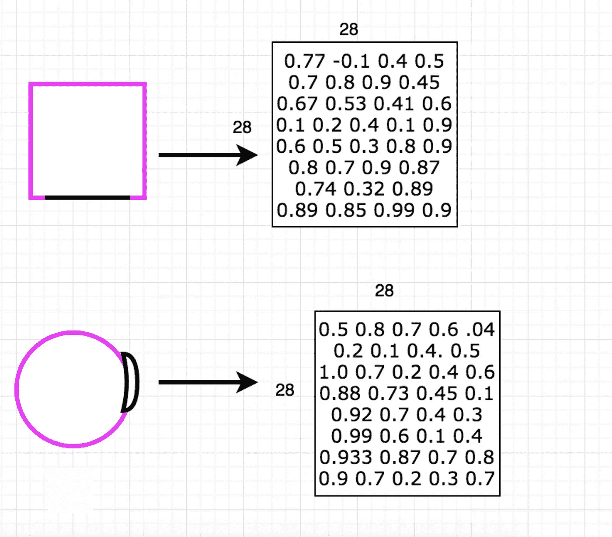
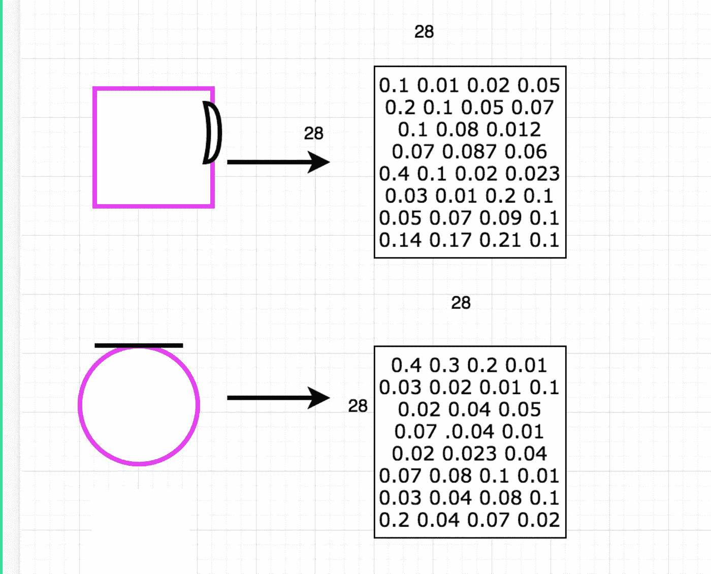
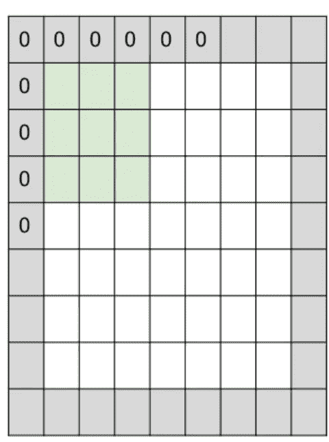
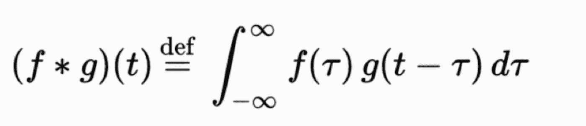
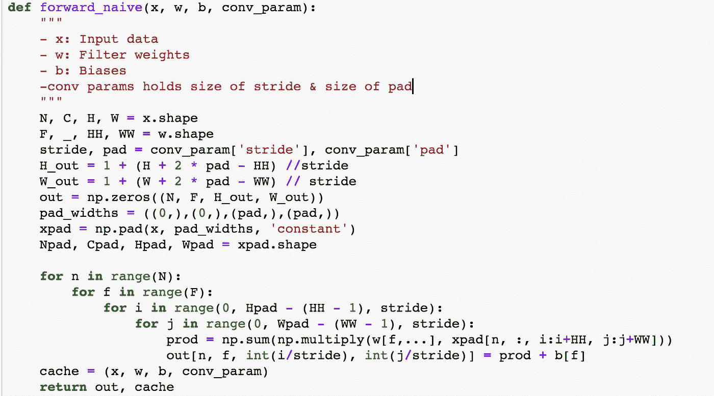
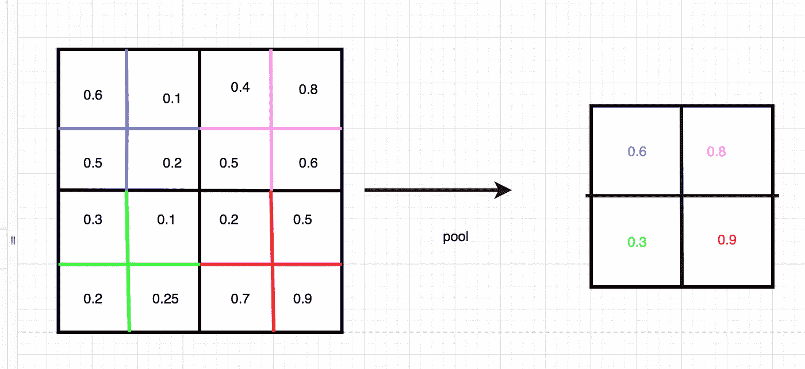
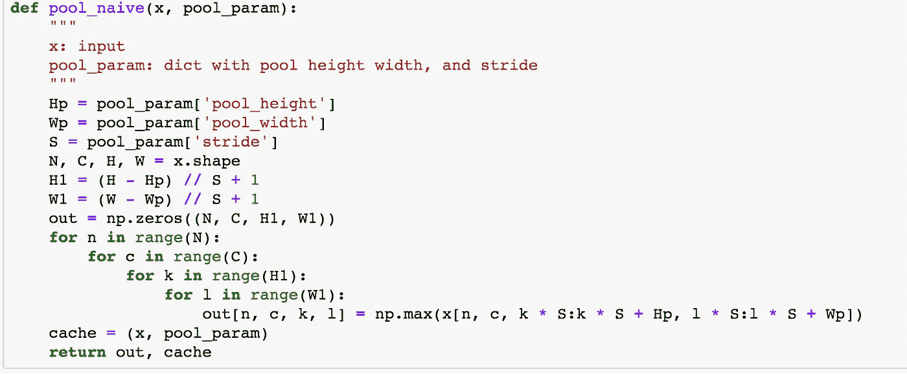
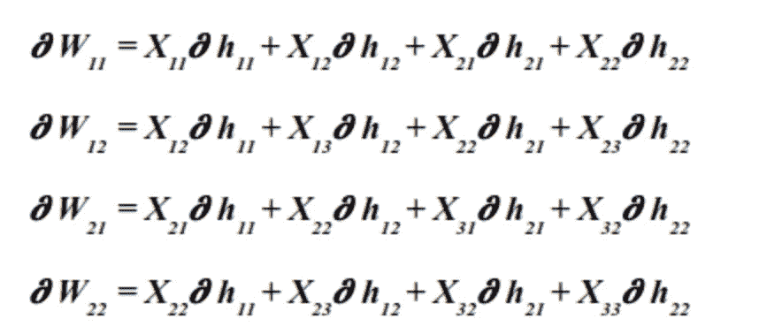
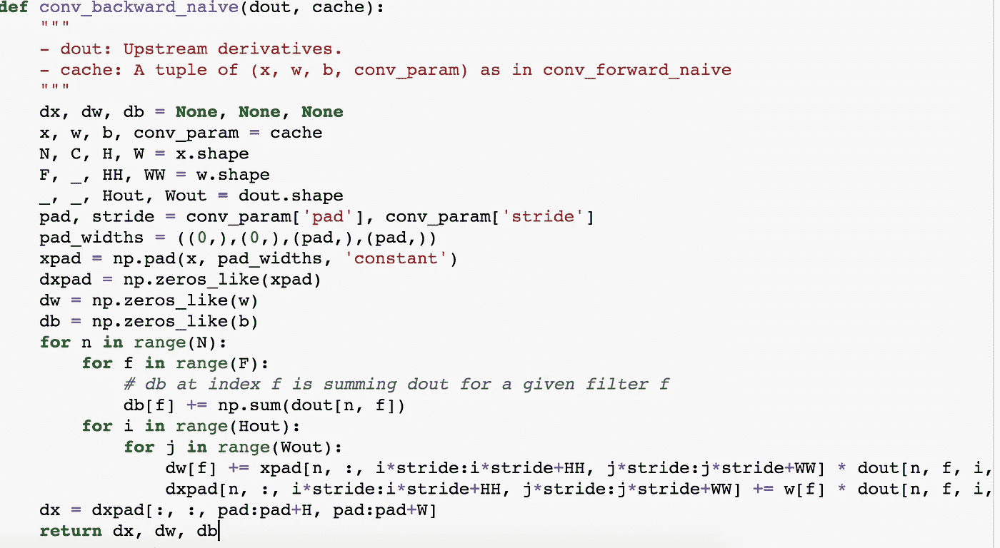
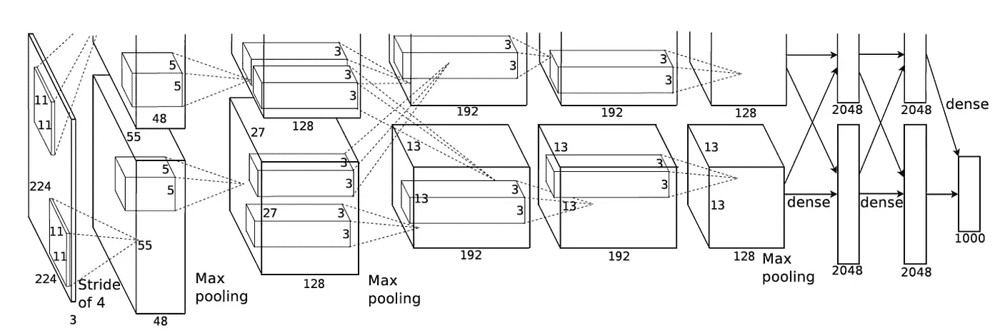

# 从头开始构建卷积神经网络指南

> 原文：<https://towardsdatascience.com/a-guide-to-convolutional-neural-networks-from-scratch-f1e3bfc3e2de?source=collection_archive---------8----------------------->

卷积神经网络是 2010 年深度学习取得许多进展背后的主力。这些网络彻底改变了图像分类和对象检测等任务，但它们在文本分类、语音识别或任何可以使用过滤器来检测输入数据区域相似性的领域等其他环境中也非常有效。

在这篇文章中，我将介绍如何使用 numpy 从头开始构建一个基本的 CNN。这个练习深入到这些网络实际上是如何工作的具体细节。在实践中，使用深度学习框架如 Tensorflow 或 Pytorch 是很常见的。这些框架很棒，但当你所要做的只是键入几行代码来创建 CNN 时，不可能理解卷积神经网络在每一步实际上在做什么。

## 概念:

前馈神经网络是强大的工具，但它们在图像上效果不佳。前馈神经网络获取 32×32×3 的图像(32 像素高，32 像素宽，3 像素深，红色、绿色和蓝色的图像)并对其进行分类。为了通过前馈神经网络运行图像，该图像被拉伸为 3072×1(32 * 32 * 3 = 3072)numpy 阵列。然后乘以权重，优化损失，并根据指定的分数对图像进行分类。这个过程是可行的，但是它不能产生现有技术的结果，因为将图像拉伸成一维向量不能保持图像的空间结构。这意味着，如果图像的空间结构在所有三个维度上都得到保留，那么分类任务中使用的特征就不会像它们可能达到的那样精确。深度学习任务的结果取决于提供给它们的数据的质量。产生最新的结果需要一种能够从图像中提取最新特征的解决方案。

卷积神经网络就是解决方案。美国有线电视新闻网的生产状态的艺术效果，因为他们不断保持图像的空间结构。这意味着在分类任务的最后将提取更好的特征。CNN 拍摄 32×32×3 的图像，在图像上滑动相同深度的过滤器以产生 2D 激活图，该激活图包含测量过滤器和图像之间的相似性的分数。激活映射的堆栈用于网络中的下一层，根据体系结构，下一层可以是卷积层或池层。在最后一步中，使用前馈神经网络对图像进行分类。要看 CNN 的报道，请点击这里的迪普维斯、这里的 T2 和这里的 T4

## 卷积层:

卷积可能看起来像一个可怕的词，但它不是。在纯数学中，它是一种度量一个函数的形状如何被另一个函数的形状修改的方法。这个定义可以很容易地扩展到计算机视觉。如果您试图查看图像是圆形还是方形，您可以在两幅图像上滑动一条直线和一条曲线，以查看特定的滤镜是否会影响图像的形状。量化每个过滤器的影响的方法是计算每个图像和每个过滤器的分数。分数越接近 1，特征对输入的影响就越大。对于这个例子，分数显示直线影响正方形，曲线影响圆形；这是激活地图上的最高分数所显示的。

Applying a 5x5x3 filter (semi circle and line) to a 32x32x3 image (circle and square) produces an 28x28 activation map that shows where the image is the most like the filter. This image shows that where the filter is like the image the score is high.

Applying a 5x5x3 filter (semi circle and line) to a 32x32x3 image (circle and square) produces an 28x28 activation map that shows where the image is the most like the filter. This image shows that the filters are not like the image so the scores are low.

计算卷积的一个问题是滤波器的大小、步幅的大小和图像的大小可能是不对称的。这是一个问题，因为这些尺寸应该是对称的，以保持图像的空间结构。例如，如果您有一个 32x32x3 的图像，一个 7x7x3 的滤镜，并且跨距为 1，则该滤镜将无法查看图像中的所有像素。零填充通过在图像周围添加零来解决这个问题。这意味着过滤器将能够滑过整个图像并为整个图像产生分数。零填充也是一种很好的做法，因为它允许您控制输出音量的大小。这可确保边缘不会消失得太快，并保留输入体积的空间大小和结构。因此，您可以设计更大、更深的网络。零填充是确保从图像中提取最佳数据的另一种方式，以便网络可以获得最佳结果。

The zeros around the perimeter now allow for the filter to see the entire input.

## 如何计算卷积:

就像这个定义一样，卷积背后的数学并不难理解。

卷积的正式定义是这样的:

Not as scary as it looks. Calculus is simply a way to measure how quantities change.

这个公式并没有看起来那么恐怖。一旦过滤器和图像对齐，公式可以分解为三个简单的步骤:

1.  将每个图像像素乘以权重，然后乘以过滤器像素(点积)
2.  把它们加起来
3.  除以过滤器中的像素总数

实现不会偏离这些步骤太远。一旦设置了步幅大小、零填充和输出的值，就可以计算卷积并将计算出的值存储在缓存中，以便可以再次访问它们进行反向传播。

现在你可以明白为什么 CNN 有计算猪的名声了。这种类型的实现通常不会大规模使用，但这个项目的重点是深入了解 CNN 实际在做什么。

## 联营

池化过程接受输入并减少其大小，同时保留输入中最重要的信息。池化减少了计算过程中的噪声参数，从而控制过度拟合。该过程采用 2×2 滤波器，在输入上的跨距为 2，并选择具有最大值的输入像素，并将该像素放入尺寸减小的输出中。池化将输入的大小从 W1xH1xD1 减小到新的输出，大小为 W2=(W1 大小)/步幅+1，(H1 大小)/步幅+1，D2=D1。这处理了先前输入的 75%。剩余的 25%是与特定滤波器中的像素最相似的输入。同样，该过程进一步隔离最相关的数据，以便全连接层进行分类。

This shows pooling in action. If we had a 8x8 image the pooling operation would pick the max value from each 2x2 region. The activation map is now 25% of its original size.

对于实现，您设置旧图像和新图像的宽度、高度和步幅的值。下一步是使用过滤器迭代图像，提取具有最大值的特征，然后返回新的缩减大小的输入。

## 背面投影:

从头开始创建 CNN 的最重要的原因之一是获得计算 backprop 的第一手经验，因为它是一个有漏洞的抽象。这意味着随着系统变得越来越复杂，开发人员依赖于更多的抽象。抽象隐藏了复杂性，允许开发人员编写处理抽象的软件，而不是解决复杂的问题，如消失或爆炸的渐变。然而，这条定律也指出，可靠软件的开发者无论如何都必须了解抽象的底层细节。所以，让我们来学习吧！

在深入了解反向传播如何在 CNN 架构中工作之前，我*高度*推荐[这个](https://www.youtube.com/watch?v=i94OvYb6noo&t=3199s)讲座深入了解反向传播如何工作。

反向传播测量给定输入时输出如何变化。反向传播的目的是找到最小化损失函数结果的权重值。激活图是卷积层的输出，是过滤器和权重应用于输入的线性变换的结果。因此，我们需要计算相对于重量和相对于输入的梯度，即一个量的变化量。对输出中的每个像素都执行此过程，因为过滤器中的每个权重都有助于创建输出中的每个像素。这表明权重的变化将改变输出像素。因此，所有这些变化加起来就是最终的损失。

为了图形的简单性和理解直观性，我将使用这些尺寸，一个 3x3 输入，一个 2x2 过滤器和一个 2x2 输出。反向投影的偏导数如下所示，其中 W 是重量，H 是输出:

为了实现当前图层的反向投影代码以及上述等式的工作原理，有必要了解我们正在获取作为输入的输出的梯度，并且我们需要计算权重和输入的梯度。因此，相对于输入的梯度，(或相对于前一层的输出的梯度)将是前一层的反向传递的输入。这种联系是反向传播强大的原因。

最后，由于协变层的反向传播也是一个卷积，但具有空间翻转层，所以它又回到了原点。

## 全连接层

最后，一旦所有的卷积和池化完成，网络的最后一部分就是一个完全连接的层。这部分网络采用 CNN 提取的特征，并通过前馈神经网络进行分类。当在卷积和池化之后使用时，完全连接的图层更有效，因为它对在整个特征提取过程中在空间上保留的一组特征进行分类。这意味着网络将产生更准确的结果，因为它有更准确的数据。

the feedforward network is the final step

就是这样！如果你想了解更多关于 CNN 及其应用的信息，我建议你查看以下链接:

 [## 用于视觉识别的 CS231n 卷积神经网络

### 斯坦福 CS231n 课程材料和笔记:视觉识别的卷积神经网络。

cs231n.github.io](http://cs231n.github.io)  [## 博客

### 欢迎光临！给自己倒一杯热饮，四处看看。机器学习的应用驱动课程…

布罗尔.吉图布.艾欧](https://brohrer.github.io/blog.html)  [## 11-785 深度学习

### 以深度神经网络为代表的“深度学习”系统正越来越多地接管所有人工智能任务，从…

deeplearning.cs.cmu.edu](http://deeplearning.cs.cmu.edu)