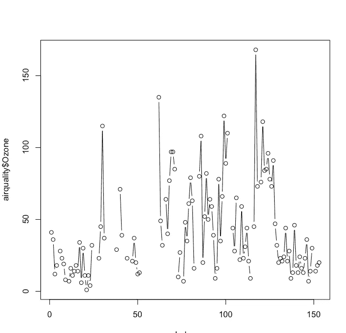
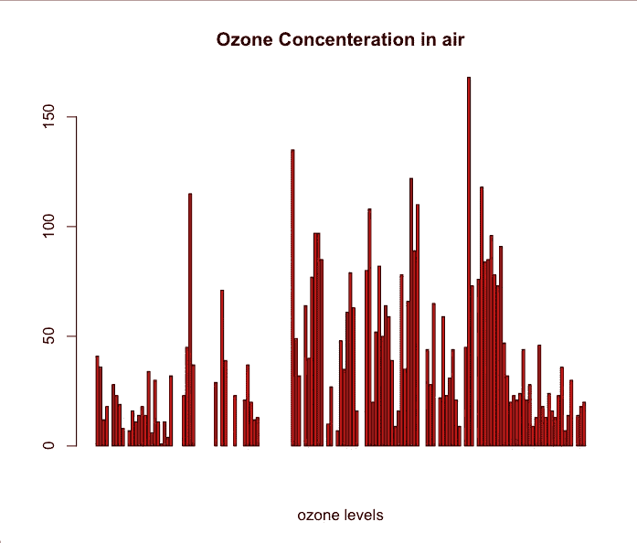
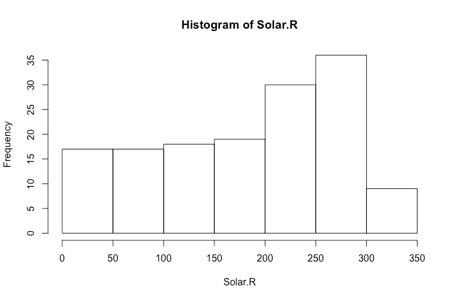

# 面向初学者的 R 语言数据可视化综合指南

> 原文：<https://towardsdatascience.com/a-guide-to-data-visualisation-in-r-for-beginners-ef6d41a34174?source=collection_archive---------1----------------------->

## R 可视化功能概述。


Photo by [William Iven](https://unsplash.com/@firmbee?utm_source=medium&utm_medium=referral) on [Unsplash](https://unsplash.com?utm_source=medium&utm_medium=referral)

> 注意:文章是旧的，许多没有反映 R 包的最新变化

当今世界充满了数据，我们必须正确地分析数据，以获得有意义的见解。数据可视化是一个重要的工具，可以从数据中挖掘出可能的关键见解。如果分析的结果没有被恰当地可视化，它们将不会被有效地传达给期望的受众。

在本教程中，我们将学习如何使用 R 统计语言来分析和显示数据。我们将从基本的情节开始，然后在文章的后面继续讨论更高级的情节。

# 目录

*   [R 简介](https://medium.com/p/ef6d41a34174/#65f4)
*   [基础剧情入门](https://medium.com/p/ef6d41a34174/#c517)
*   [R 中的可视化库](https://medium.com/p/ef6d41a34174/#0689)
*   [可视化 R 中的地理数据](https://medium.com/p/ef6d41a34174/#e672)
*   [结论](https://medium.com/p/ef6d41a34174/#8b3f)

# 先决条件

对 R 及其语法的基本熟悉将使您很容易入门。

# R 简介

## 概观

[**R**](https://www.r-project.org/about.html) 是一个统计计算和图形的语言和环境。当涉及到创建可视化时，r 也非常灵活和易于使用。它的功能之一是用最少的代码生成高质量的地块。

## 装置

我们将简要回顾一下安装 R:

1.  进入 [R 主页](https://www.r-project.org/)选择**曲柄**。
    **CRAN** 是—综合 R 档案网的缩写。它是包含 R 发行版、软件包和文档的站点的集合。
2.  选择离你最近的地点。
3.  根据您的操作系统下载并安装 R。

*或者，您可以在 base R GUI 上使用*[*R studio*](http://www.rstudio.com/)*。*

## 启动

下载并安装 R 后，您可以从应用程序文件夹(MacOS)或桌面图标(Windows)启动它。只需输入以下命令来检查 R 是否已经正确安装并正在运行。

```
> 1
1
> ‘hello World’
hello world
```

## 载入数据

数据集既可以是内置的，也可以从 r。

*   **内置数据集**指的是 r 中已经提供的数据集。我们将使用一个这样的数据集，称为**空气质量**数据集，它与 1973 年 5 月至 9 月纽约的每日空气质量测量值有关。该数据集由 6 个变量的 100 多个观测数据组成，即**、臭氧**(十亿分之几)、太阳**。R** (太阳辐射)**风**(平均风速)**温度**(日最高气温华氏温度)**月**(观测月)日**日**(一个月中的某一天)

要将内置数据集加载到 R 中，请在控制台中键入以下命令:

```
data(airquality)
```

*   在**外部数据源**的情况下(CSV、Excel、文本、HTML 文件等。)，只需用 **setwd()** 命令将包含数据的文件夹设置为**工作目录**。

```
setwd(path of the folder where the file is located)
```

现在，在**读取**命令的帮助下加载文件。在这种情况下，数据是一个名为 **airquality.csv** 的 CSV 文件，可以从[这里](https://github.com/parulnith/Data-Visualisation-with-R/blob/master/airquality.csv)下载

```
airquality = read.csv('airquality.csv',header=TRUE, sep=",")
```

以上代码将文件 **airquality.csv** 读入数据帧 **airquality** 。 **Header=TRUE** 指定数据包含标题， **sep= "，"**指定数据中的值用逗号分隔。

## 数据探索

一旦数据被加载到工作空间中，就应该研究它以了解它的结构。

*   **str(airquality)**
    它显示 R 对象的内部结构，并给出数据集的行和列的快速概览。

```
'data.frame': 111 obs. of  6 variables:    
$ Ozone  : int  41 36 12 18 23 19 8 16 11 14 ...    
$ Solar.R: int  190 118 149 313 299 99 19 256 290 274 ...    
$ Wind   : num  7.4 8 12.6 11.5 8.6 13.8 20.1 9.7 9.2 10.9 ...    
$ Temp   : int  67 72 74 62 65 59 61 69 66 68 ...    
$ Month  : int  5 5 5 5 5 5 5 5 5 5 ...    
$ Day    : int  1 2 3 4 7 8 9 12 13 14 ... `
```

*   **head(data，n)** 和 **tail(data，n)**
    head 输出数据集中顶部的 **n 个**元素，而 tail 方法输出底部的 **n 个**。

```
head(airquality, n=3)
Ozone Solar.R Wind Temp Month Day
1    41     190  7.4   67     5   1
2    36     118  8.0   72     5   2
3    12     149 12.6   74     5   3tail(airquality, n=3)
   Ozone Solar.R Wind Temp Month Day
109    14     191 14.3   75     9  28
110    18     131  8.0   76     9  29
111    20     223 11.5   68     9  30
```

*   **summary(**air quality**)**
    summary 方法根据变量的类型显示数据集中每个变量的描述性统计数据。

```
**summary(data)**

    Ozone          Solar.R           Wind            Temp           Month            Day       
 Min.   :  1.0   Min.   :  7.0   Min.   : 2.30   Min.   :57.00   Min.   :5.000   Min.   : 1.00  
 1st Qu.: 18.0   1st Qu.:113.5   1st Qu.: 7.40   1st Qu.:71.00   1st Qu.:6.000   1st Qu.: 9.00  
 Median : 31.0   Median :207.0   Median : 9.70   Median :79.00   Median :7.000   Median :16.00  
 Mean   : 42.1   Mean   :184.8   Mean   : 9.94   Mean   :77.79   Mean   :7.216   Mean   :15.95  
 3rd Qu.: 62.0   3rd Qu.:255.5   3rd Qu.:11.50   3rd Qu.:84.50   3rd Qu.:9.000   3rd Qu.:22.50  
 Max.   :168.0   Max.   :334.0   Max.   :20.70   Max.   :97.00   Max.   :9.000   Max.   :31.00
```

我们可以一目了然地看到变量的**均值**、**中位数**、**最大值**和**四分位值**。

# 基本情节入门

[**图形**](https://stat.ethz.ch/R-manual/R-devel/library/graphics/html/graphics-package.html) 包用于绘制**基**图形，如散点图、箱线图等。通过输入:`library(help = "graphics")`可以获得带有帮助页面的完整功能列表。

## plot()函数

*   `plot()`函数是一种用于绘制 **R** 对象的通用函数。

```
plot(airquality$Ozone)
```


Scatter Plot

我们在这里得到一个**散点图/点图**，其中每个点代表**臭氧**在**平均十亿分之**中的值。

*   现在让我们绘制一张臭氧和风值之间的图表，来研究两者之间的关系。

```
plot(airquality$Ozone, airquality$Wind)
```


图表显示风和臭氧值有某种程度的负相关性。

*   当我们对整个数据集使用 plot 命令而不选择任何特定列时，会发生什么情况？

```
plot(airquality)
```


我们得到一个散点图矩阵，它是所有列的相关矩阵。上面的图立即显示:

*   臭氧水平和温度正相关。
*   风速与温度和臭氧水平都呈负相关。

只要看看变量之间的关系图，我们就能很快发现它们之间的关系。

## 在 plot()函数中使用参数

我们可以通过使用`plot()`函数的参数来轻松设计图表。

## 类型参数

绘图函数有一个名为`type`的参数，它可以接受像 **p:点**、 **l:线**、 **b:两者**等值。这决定了输出图形的形状。

```
# points and lines 
 plot(airquality$Ozone, type= "b")
```



```
# high density vertical lines.
 plot(airquality$Ozone, type= "h")
```


*在控制台中键入* `*?plot()*` *可以阅读更多关于* `*plot()*` *命令的内容。*

**标签和标题**

我们还可以标记 X 轴和 Y 轴，并给我们的图加一个标题。此外，我们还可以选择给图着色。

```
plot(airquality$Ozone, xlab = 'ozone Concentration', ylab = 'No of Instances', main = 'Ozone levels in NY city', col = 'green')
```


## 2.条形图

在条形图中，数据以矩形条的形式表示，条的长度与数据集中变量或列的值成比例。通过调整 **horiz** 参数，可以生成水平和垂直条形图。

```
# Horizontal bar plot
 barplot(airquality$Ozone, main = 'Ozone Concenteration in air',xlab = 'ozone levels', col= 'green',horiz = TRUE)
```


```
# Vertical bar plot
barplot(airquality$Ozone, main = 'Ozone Concenteration in air',xlab = 'ozone levels', col='red',horiz = FALSE)
```



## 3.柱状图

直方图与条形图非常相似，只是它将值分组到连续的范围内。直方图表示被划分为不同范围的变量值的频率。

```
hist(airquality$Solar.R)
```



我们得到了**太阳的直方图。R** 值。通过给**颜色**参数一个合适的值，我们也可以得到一个彩色直方图。

```
hist(airquality$Solar.R, main = 'Solar Radiation values in air',xlab = 'Solar rad.', col='red')
```


## 4.箱线图

我们已经看到 R 中的`summary()`命令如何显示数据集中每个变量的描述性统计数据。Boxplot 做了同样的事情，尽管是以四分位数的形式。在 r 中绘制箱线图也非常简单。

```
#Single box plot
boxplot(airquality$Solar.R)
```


```
# Multiple box plots
boxplot(airquality[,0:4], main='Multiple Box plots')
```


## 5.图表网格

R 中有一个非常有趣的特性，可以让我们一次绘制多个图表。这在 EDA 过程中非常方便，因为不再需要一个接一个地绘制多个图形。
绘制网格时，第一个参数应指定某些属性，如网格的边距(`mar)`、行数和列数(`mfrow`)、是否包含边框(`bty`)以及标签的位置(`las` : 1 表示水平，`las` : 0 表示垂直)。

```
par(mfrow=c(3,3), mar=c(2,5,2,1), las=1, bty="n")
plot(airquality$Ozone)
plot(airquality$Ozone, airquality$Wind)
plot(airquality$Ozone, type= "c")
plot(airquality$Ozone, type= "s")
plot(airquality$Ozone, type= "h")
barplot(airquality$Ozone, main = 'Ozone Concenteration in air',xlab = 'ozone levels', col='green',horiz = TRUE)
hist(airquality$Solar.R)
boxplot(airquality$Solar.R)
boxplot(airquality[,0:4], main='Multiple Box plots')
```


> 注意:通过键入`?plot name`，您可以使用函数文档来了解关于给定函数的更多信息。另外，`example(plot)`直接在控制台中运行绘图演示。

# R 中的可视化库

r 配备了功能强大的复杂可视化库。让我们仔细看看一些常用的。

在本节中，我们将使用内置的 [mtcars 数据集](https://stat.ethz.ch/R-manual/R-devel/library/datasets/html/mtcars.html)来展示各种库的用法。该数据集摘自 1974 年的《汽车趋势》美国杂志。

## 点阵图形

[Lattice](https://stat.ethz.ch/R-manual/R-devel/library/lattice/html/Lattice.html) 包本质上是对 R Graphics 包的改进，用于可视化多元数据。晶格使得能够使用 *t* ***rellis 图形*** 。格子图展示了依赖于一个或多个变量的变量之间的关系。让我们从安装和加载软件包开始。

```
# Installing & Loading the package
install.packages("lattice")
library(lattice) #Loading the dataset
attach(mtcars)
```

**attach** 函数将数据库附加到 **R** 搜索路径，这样数据库中的对象只需给出它们的名称就可以被访问。(详见`?attach()`)

```
# Exploring the datasethead(mtcars)
                       mpg cyl disp  hp drat    wt  qsec vs am gear carb
Mazda RX4         21.0   6  160 110 3.90 2.620 16.46  0  1    4    4
Mazda RX4 Wag     21.0   6  160 110 3.90 2.875 17.02  0  1    4    4
Datsun 710        22.8   4  108  93 3.85 2.320 18.61  1  1    4    1
Hornet 4 Drive    21.4   6  258 110 3.08 3.215 19.44  1  0    3    1
Hornet Sportabout 18.7   8  360 175 3.15 3.440 17.02  0  0    3    2
Valiant           18.1   6  225 105 2.76 3.460 20.22  1  0    3    1
```

在继续使用 lattice 包之前，让我们对数据做一些预处理。在我们的 mtcars 数据集中有两列，即**齿轮**和**气缸**，它们本质上是分类的。我们需要分解它们，使它们更有意义。

```
gear_factor<-factor(gear,levels=c(3,4,5),
labels=c("3gears","4gears","5gears")) 

cyl_factor <-factor(cyl,levels=c(4,6,8),
labels=c("4cyl","6cyl","8cyl"))
```

*注意:由于我们已经附加了数据集 mtcars，我们不需要指定* `*mtcars$gear*` *或* `*mtcars$cyl*` *。*

现在让我们看看如何使用 **lattice** 包在 r 中创建一些基本的情节。

*   **内核密度图**

```
densityplot(~mpg, main="Density Plot",  xlab="Miles per Gallon")
```


使用点阵库非常简单。人们只需要插入想要绘图的列。

*   **散点图矩阵**

```
splom(mtcars[c(1,3,4,5,6)], main="MTCARS Data")
```


*   **描绘两个因素组合的散点图**

```
xyplot(mpg~wt|cyl_factor*gear_factor,  
main="Scatterplots : Cylinders and Gears",  
ylab="Miles/Gallon", xlab="Weight of Car")
```


## 2.ggplot2

ggplot2 包是 r 中使用最广泛的可视化包之一。它使用户能够使用图形的**语法用很少的代码创建复杂的可视化。图形的[语法](https://en.wikipedia.org/wiki/Ggplot2)是一个数据可视化的通用方案，它将图形分解成语义成分，如比例和层。**

近年来，ggplot2 的受欢迎程度大大增加，因为它可以以非常简单的方式创建包含单变量和多变量数据的图表。

```
#Installing & Loading the package 

install.packages(“ggplot2”) 
library(ggplot2)

#Loading the dataset
attach(mtcars) # create factors with value labels 

mtcars$gear <- factor(mtcars$gear,levels=c(3,4,5),  
labels=c("3gears", "4gears", "5gears"))  
mtcars$am <- factor(mtcars$am,levels=c(0,1),  
labels=c("Automatic","Manual"))  
mtcars$cyl <- factor(mtcars$cyl,levels=c(4,6,8),  
labels=c("4cyl","6cyl","8cyl"))
```

***让我们创造几个情节来了解 ggplot2*** 的能力

*   **散点图**

```
ggplot(data = mtcars, mapping = aes(x = wt, y = mpg)) + geom_point()
```


`geom_point()`用于创建散点图，geom 可以有多种变化，如`geom_jitter()`、`geom_count()`等

*   **根据因子设计散点图的样式**

我们知道数据集 mtcars 由某些以因子形式存在的变量组成。我们可以利用这个属性来分割数据集

```
ggplot(data = mtcars, mapping = aes(x = wt, y = mpg, color = as.factor(cyl))) + geom_point()
```


颜色参数用于区分 cyl 变量的不同因子级别。

*   **根据大小设定散点图样式**

ggplot2 的另一个有用的特性是，它可以根据属性的大小来设置样式。

```
ggplot(data = mtcars, mapping = aes(x = wt, y = mpg, size = qsec)) + geom_point()
```


在上面的例子中，`qsec`的值表示决定点大小的加速度。

*   **不同尺寸的不同符号**

使用 ggplot2，还可以通过将不同大小的多个点分层来创建独特而有趣的形状

```
p  <-  ggplot(mtcars,aes(mpg, wt, shape  =  factor(cyl)))
  p + geom_point(aes(colour  =  factor(cyl)), size  =  4) + geom_point(colour  =  "grey90", size  =  1.5)
```


## 3.Plotly

[Plotly](https://github.com/ropensci/plotly#readme) 是一个 R 包，通过开源的 JavaScript 图形库 [plotly.js](http://plot.ly/javascript) 创建交互式的基于 web 的图形。它还可以轻松地将“ggplot2”图翻译成基于网络的版本。

```
#Installing & Loading the package 

 install.packages(“plotly”)  
 library(plotly)
```

现在让我们看看我们如何利用情节来创造互动的视觉化。我们将使用点阵图形演示中使用的相同 mtcars 数据集。

*   **基本散点图**

```
p <- plot_ly(data = mtcars, x = ~hp, y = ~wt)
p
```


上面的图也可以以网页的形式导出，以保持其交互性。

*   **样式散点图**

散点图可以通过给定适当的颜色代码来设计。

```
p <- plot_ly(data = mtcars, x = ~hp, y = ~wt, marker = list(size = 10, color = 'rgba(255, 182, 193, .9)', line = list(color = 'rgba(152, 0, 0, .8)', width = 2)))p
```


*   **标记和线条**

也可以用 plotly 在同一个图形中绘制标记和线条。在这里，我们将创建一个任意数据框来展示此功能。

```
data1 <- rnorm(100, mean = 10)   
data2 <- rnorm(100, mean = 0)   
data3 <- rnorm(100, mean = -10)   
x <- c(1:100)data <- data.frame(x, data1, data2, data3)p <- plot_ly(data, x = ~x)%>%   

add_trace(y = ~data1, name = 'data1',mode = 'lines')%>%             
add_trace(y = ~data2, name = 'data2', mode = 'lines+markers')%>% 
add_trace(y = ~data3, name = 'data3', mode = 'markers')p
```


**添加颜色和大小映射**

```
p <- plot_ly(data = mtcars, x =~hp, y = ~wt,color = ~hp, size = ~hp )
p
```


*虽然这不是 R 中用于可视化的包的完整列表，但是这些应该足够让你开始了。*

# 在 R 中可视化地理数据

地理数据(**地理数据**)与基于位置的数据相关。它主要描述物体在空间中的关系。数据通常以坐标的形式存储。以地图的形式看到一个州或一个国家更有意义，因为它提供了更真实的概览。在下一节中，我们将简要概述 R 在地理数据可视化方面的能力。

## 地理地图

我们将使用 ABC 公司[](https://github.com/parulnith/Data-Visualisation-with-R/blob/master/Visualisation%20geographical%20data/ABC_locations.csv)**的超市数据集样本。该数据集由他们在美国的商店位置组成。让我们加载数据并检查它的列。**

```
data <- read.csv('ABC_locations.csv', sep=",")head(data)
                    Address       City   State   Zip.Code Latitude  Longitude
1  1205 N. Memorial Parkway Huntsville Alabama 35801-5930 34.74309  -86.60096
2      3650 Galleria Circle     Hoover Alabama 35244-2346 33.37765  -86.81242
3    8251 Eastchase Parkway Montgomery Alabama      36117 32.36389  -86.15088
4 5225 Commercial Boulevard     Juneau  Alaska 99801-7210 58.35920 -134.48300
5      330 West Dimond Blvd  Anchorage  Alaska 99515-1950 61.14327 -149.88422
6          4125 DeBarr Road  Anchorage  Alaska 99508-3115 61.21081 -149.80434
```

## **plot()函数**

**我们将简单地通过纬度和经度列创建一个粗略的地图。**

```
plot(data$Longitude,data$Latitude)
```

****

**输出不是精确的地图，但它给出了美国边界的模糊轮廓。**

## **map()函数**

**地图包在绘制地理数据时非常有用而且非常简单。**

```
# Install package 
install.packages("maps", dependencies=TRUE)# Loading the installed maps package
library(maps)
```

****使用 map()函数绘制美国底图****

```
map(database="state")
```

****

****使用 symbols()函数在基础地图上构建一个点地图****

```
symbols(data$Longitude, data$Latitude, squares =rep(1, length(data$Longitude)), inches=0.03, add=TRUE)
```

****

## ****赋予符号颜色****

```
symbols(data$Longitude, data$Latitude,bg = 'red', fg = 'red', squares =rep(1, length(data$Longitude)), inches=0.03, add=TRUE)
```

****

**与 map 函数一起使用的命令是不言自明的。然而，你可以在他们的文档页面上了解更多。**

**当数据由位置组成时，地理数据可视化非常重要。人们可以很容易地想象出确切的地点和区域，并传达出更好的画面。**

# **5.结论**

**我们已经看到使用 r 开始可视化是多么的简单和容易。你可以选择从头开始创建可视化或者使用预先构建的包。无论你选择什么，很明显 R 的可视化能力是无穷无尽的。**