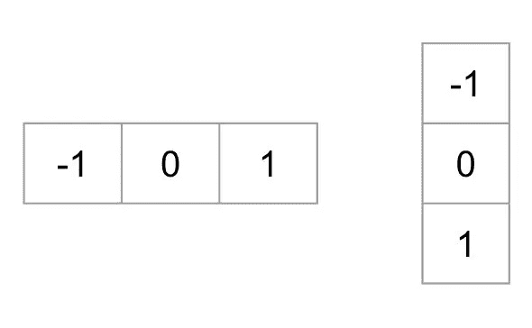

# Python 人脸检测指南(附代码)

> 原文：<https://towardsdatascience.com/a-guide-to-face-detection-in-python-3eab0f6b9fc1?source=collection_archive---------1----------------------->


Greenland

在本教程中，我们将看到如何使用 OpenCV 和 Dlib 在 Python 中创建和启动人脸检测算法。我们还将添加一些功能来同时检测多张脸上的眼睛和嘴巴。本文将介绍人脸检测的最基本实现，包括级联分类器、HOG 窗口和深度学习 CNN。

我们将使用以下内容来介绍人脸检测:

*   基于 OpenCV 的 Haar 级联分类器
*   使用 Dlib 的方向梯度直方图
*   使用 Dlib 的卷积神经网络

本文原载于我的个人博客:[https://maelfabien.github.io/tutorials/face-detection/#](https://maelfabien.github.io/tutorials/face-detection/#)

本文的 Github 库(以及我博客中的所有其他内容)可以在这里找到:

[](https://github.com/maelfabien/Machine_Learning_Tutorials) [## mael fabien/机器学习教程

### 本报告包含练习、代码、教程和我的个人博客文章

github.com](https://github.com/maelfabien/Machine_Learning_Tutorials) 

# 介绍

我们将使用 OpenCV，这是一个用于计算机视觉的开源库，用 C/C++编写，有 C++、Python 和 Java 的接口。它支持 Windows、Linux、MacOS、iOS 和 Android。我们的一些工作还需要使用 Dlib，这是一个现代 C++工具包，包含机器学习算法和用于创建复杂软件的工具。

# 要求

第一步是安装 OpenCV，和 Dlib。运行以下命令:

```
pip install opencv-pythonpip install dlib
```

根据您的版本，文件将安装在以下位置:

```
/usr/local/lib/python3.7/site-packages/cv2
```

如果你遇到 Dlib 的一些问题，请查看[这篇文章](https://www.pyimagesearch.com/2018/01/22/install-dlib-easy-complete-guide/)。

# 导入和模型路径

我们将创建一个新的 Jupyter 笔记本/ python 文件，并从以下内容开始:

```
import cv2
import matplotlib.pyplot as plt
import dlib
from imutils import face_utilsfont = cv2.FONT_HERSHEY_SIMPLEX
```

# 一.级联分类器

我们将首先探索级联分类器。

# 一. 1 .理论

级联分类器，即使用 haar-like 特征的级联提升分类器，是集成学习的一个特例，称为 boosting。它通常依赖于 [Adaboost](https://maelfabien.github.io/machinelearning/adaboost) 分类器(以及其他模型，如 Real Adaboost、Gentle Adaboost 或 Logitboost)。

级联分类器在包含我们想要检测的对象的图像的几百个样本图像上以及不包含那些图像的其他图像上被训练。

我们如何检测一张脸是否存在？有一种算法，称为 Viola–Jones 对象检测框架，它包括实时人脸检测所需的所有步骤:

*   哈尔特征选择，从哈尔小波导出的特征
*   创建整体图像
*   Adaboost 训练
*   级联分类器

最初的[论文](https://www.cs.cmu.edu/~efros/courses/LBMV07/Papers/viola-cvpr-01.pdf)发表于 2001 年。

# I.1.a .哈尔特征选择

我们在大多数普通人的脸上发现了一些共同的特征:

*   与脸颊上部相比，眼部区域较暗
*   与眼睛相比明亮的鼻梁区域
*   眼睛、嘴巴、鼻子的一些特定位置…

这些特征称为哈尔特征。特征提取过程将如下所示:


Haar Features

在这个例子中，第一特征测量眼睛区域和上脸颊区域之间的亮度差异。特征值简单地通过将黑色区域中的像素相加并减去白色区域中的像素来计算。


然后，我们应用这个矩形作为卷积核，覆盖整个图像。为了做到面面俱到，我们应该应用每个内核所有可能的维度和位置。简单的 24*24 图像通常会产生超过 160，000 个特征，每个特征由像素值的和/减组成。对于活体面部检测来说，在计算上是不可能的。那么，我们如何加快这个过程呢？

*   一旦好的区域被矩形识别，在图像的完全不同的区域上运行窗口是没有用的。这可以通过 Adaboost 来实现。
*   使用积分图像原理计算矩形特征，这样更快。我们将在下一节讨论这个问题。


有几种类型的矩形可以应用于 Haar 特征提取。根据原始论文:

*   双矩形特征是两个矩形区域内的像素之和的差，主要用于检测边缘(a，b)
*   三矩形功能计算两个外部矩形的总和，从中心矩形的总和中减去，主要用于检测线(c，d)
*   四矩形特征计算矩形(e)的对角线对之间的差


Haar Rectangles

既然已经选择了特征，我们使用 Adaboost 分类将它们应用于训练图像集，Adaboost 分类结合一组弱分类器来创建准确的集成模型。有了 200 个特征(而不是最初的 160，000 个)，准确率达到了 95%。论文作者选择了 6000 个特征。

# I.1.b .整体形象

在卷积核样式中计算矩形特征可能会很长，非常长。出于这个原因，作者 Viola 和 Jones 提出了图像的中间表示:积分图像。积分图像的作用是允许仅使用四个值简单地计算任何矩形和。我们来看看效果如何！

假设我们想要确定坐标为(x，y)的给定像素处的矩形特征。然后，在给定像素的上面和左边的像素的总和中的像素的积分图像。


其中 ii(x，y)是积分图像，i(x，y)是原始图像。

当你计算整个积分图像时，有一种形式的递归，只需要在原始图像上遍历一次。事实上，我们可以定义以下一对递归:


其中 s(x，y)为累计行和，s(x1)= 0，ii(1，y)=0。

这有什么用？好吧，考虑一个区域 D，我们想估计它的像素总数。我们已经定义了 3 个其他区域:A、B 和 c。

*   点 1 处的积分图像的值是矩形 a 中像素的总和。
*   点 2 的值是 A + B
*   点 3 的值是 A + C
*   点 4 的值是 A + B + C + D。

因此，区域 D 的像素之和可以简单地计算为:4+1(2+3)。

在一次传递中，我们仅使用 4 个数组引用计算了矩形内部的值。


人们应该简单地意识到矩形在实践中是非常简单的特征，但是对于人脸检测来说已经足够了。当涉及复杂问题时，方向可调滤波器往往更加灵活。


Steerable Filters

# I.1c .用 Adaboost 学习分类函数

给定一组标记的训练图像(正的或负的)，Adaboost 用于:

*   选择一小组特征
*   并训练分类器

由于 160，000 个特征中的大多数特征被认为是完全不相关的，因此我们围绕其构建增强模型的弱学习算法被设计成选择分割最佳负样本和正样本的单个矩形特征。

# 级联分类器

尽管上述过程非常有效，但仍存在一个主要问题。在一幅图像中，图像的大部分是非人脸区域。赋予图像的每个区域同等的重要性是没有意义的，因为我们应该主要关注最有可能包含图片的区域。Viola 和 Jones 使用级联分类器提高了检测率，同时减少了计算时间。

关键思想是拒绝不包含人脸的子窗口，同时识别包含人脸的区域。由于任务是正确地识别人脸，我们希望最小化假阴性率，即包含人脸并且没有被识别为人脸的子窗口。

一系列分类器被应用于每个子窗口。这些分类器是简单的决策树:

*   如果第一个分类器是肯定的，我们继续第二个
*   如果第二个分类器是肯定的，我们继续第三个
*   …

在某一点上的任何否定结果都导致拒绝该子窗口，因为该子窗口可能包含人脸。初始分类器以较低的计算成本消除了大多数负样本，随后的分类器消除了额外的负样本，但需要更多的计算工作。


使用 Adaboost 训练分类器，并调整阈值以最小化错误率。当训练这样的模型时，变量如下:

*   分类器级数
*   每个阶段的特征数量
*   每个阶段的门槛

幸运的是，在 OpenCV 中，整个模型已经为人脸检测进行了预训练。

如果你想了解更多关于增强技术的知识，我邀请你查看我关于 Adaboost 的文章。

# 一. 2 .进口

下一步就是找到预先训练好的权重。我们将使用默认的预训练模型来检测面部，眼睛和嘴巴。根据您的 Python 版本，这些文件应该位于以下位置:

```
/usr/local/lib/python3.7/site-packages/cv2/data
```

一旦确定，我们将这样声明级联分类器:

```
cascPath = "/usr/local/lib/python3.7/site-packages/cv2/data/haarcascade_frontalface_default.xml"
eyePath = "/usr/local/lib/python3.7/site-packages/cv2/data/haarcascade_eye.xml"
smilePath = "/usr/local/lib/python3.7/site-packages/cv2/data/haarcascade_smile.xml"faceCascade = cv2.CascadeClassifier(cascPath)
eyeCascade = cv2.CascadeClassifier(eyePath)
smileCascade = cv2.CascadeClassifier(smilePath)
```

# I.3 .检测图像上的人脸

在实现实时人脸检测算法之前，让我们在一幅图像上尝试一个简单的版本。我们可以从加载测试图像开始:

```
# Load the image
gray = cv2.imread('face_detect_test.jpeg', 0)plt.figure(figsize=(12,8))
plt.imshow(gray, cmap='gray')
plt.show()
```


Test image

然后，我们检测面部，并在其周围添加一个矩形:

```
# Detect faces
faces = faceCascade.detectMultiScale(
gray,
scaleFactor=1.1,
minNeighbors=5,
flags=cv2.CASCADE_SCALE_IMAGE
)# For each face
for (x, y, w, h) in faces: 
    # Draw rectangle around the face
    cv2.rectangle(gray, (x, y), (x+w, y+h), (255, 255, 255), 3)
```

以下是`detectMultiScale`功能最常见的参数列表:

*   scaleFactor:指定图像在每个图像比例下缩小多少的参数。
*   minNeighbors:指定每个候选矩形应该有多少个邻居来保留它的参数。
*   最小尺寸:可能的最小物体尺寸。小于该值的对象将被忽略。
*   maxSize:可能的最大对象大小。大于该值的对象将被忽略。

最后，显示结果:

```
plt.figure(figsize=(12,8))
plt.imshow(gray, cmap='gray')
plt.show()
```


人脸检测在我们的测试图像上运行良好。现在让我们进入实时时间！

# I.4 .实时人脸检测

让我们继续讨论实时面部检测的 Python 实现。第一步是启动相机，捕捉视频。然后，我们将图像转换成灰度图像。这用于减少输入图像的尺寸。事实上，我们应用简单的线性变换，而不是每像素 3 个点来描述红、绿、蓝:


这在 OpenCV 中是默认实现的。

```
video_capture = cv2.VideoCapture(0)while True:
    # Capture frame-by-frame
    ret, frame = video_capture.read()
    gray = cv2.cvtColor(frame, cv2.COLOR_BGR2GRAY)
```

现在，我们将使用上面定义的`faceCascade`变量，它包含一个预先训练的算法，并将其应用于灰度图像。

```
faces = faceCascade.detectMultiScale(
        gray,
        scaleFactor=1.1,
        minNeighbors=5,
        minSize=(30, 30),
        flags=cv2.CASCADE_SCALE_IMAGE
        )
```

对于每个检测到的人脸，我们将在人脸周围画一个矩形:

```
for (x, y, w, h) in faces:
        if w > 250 :
            cv2.rectangle(frame, (x, y), (x+w, y+h), (255, 0, 0), 3)
            roi_gray = gray[y:y+h, x:x+w]
            roi_color = frame[y:y+h, x:x+w]
```

对于检测到的每个嘴部，在其周围画一个矩形:

```
smile = smileCascade.detectMultiScale(
        roi_gray,
        scaleFactor= 1.16,
        minNeighbors=35,
        minSize=(25, 25),
        flags=cv2.CASCADE_SCALE_IMAGE
    )
    for (sx, sy, sw, sh) in smile:
        cv2.rectangle(roi_color, (sh, sy), (sx+sw, sy+sh), (255, 0, 0), 2)
        cv2.putText(frame,'Smile',(x + sx,y + sy), 1, 1, (0, 255, 0), 1)
```

对于检测到的每只眼睛，在其周围画一个矩形:

```
eyes = eyeCascade.detectMultiScale(roi_gray)
    for (ex,ey,ew,eh) in eyes:
        cv2.rectangle(roi_color,(ex,ey),(ex+ew,ey+eh),(0,255,0),2)
        cv2.putText(frame,'Eye',(x + ex,y + ey), 1, 1, (0, 255, 0), 1)
```

然后，计算面部总数，并显示整体图像:

```
cv2.putText(frame,'Number of Faces : ' + str(len(faces)),(40, 40), font, 1,(255,0,0),2)      
    # Display the resulting frame
    cv2.imshow('Video', frame)
```

当我们想要按下`q`停止拍摄时，执行退出选项:

```
if cv2.waitKey(1) & 0xFF == ord('q'):
        break
```

最后，当一切完成后，释放捕获并销毁所有窗口。在 Mac 上杀死 windows 有一些问题，这可能需要稍后从活动管理器中杀死 Python。

```
video_capture.release()
cv2.destroyAllWindows()
```

# I.5 .包装

# 一. 6 .结果

我在 YouTube 上做了一个脸部检测算法的快速演示。

# 二。Dlib 中的方向梯度直方图(HOG)

第二个最流行的人脸检测工具是由 Dlib 提供的，它使用了一个叫做梯度方向直方图(HOG)的概念。这是 Dalal 和 Triggs 最初[论文的实现。](https://lear.inrialpes.fr/people/triggs/pubs/Dalal-cvpr05.pdf)

# 二. 1 .理论

HOG 背后的想法是将特征提取到一个向量中，并将其输入到一个分类算法中，例如支持向量机，该算法将评估一张脸(或任何你训练它实际识别的对象)是否存在于一个区域中。

提取的特征是图像梯度方向(定向梯度)的分布(直方图)。边缘和角落周围的梯度通常较大，这使我们能够检测到这些区域。

在原始论文中，该过程被实现用于人体检测，并且检测链如下:


# 二. 1.a .预处理

首先，输入图像必须大小相同(裁剪和重缩放图像)。我们将应用的补丁需要 1:2 的纵横比，因此输入图像的尺寸可能是`64x128`或`100x200`。

# 计算梯度图像

第一步是通过应用以下内核来计算图像的水平和垂直梯度:



Kernels to compute the gradients

图像的梯度通常会移除不重要的信息。

我们上面考虑的图像的渐变可以在 Python 中以这种方式找到:

```
gray = cv2.imread('images/face_detect_test.jpeg', 0)im = np.float32(gray) / 255.0# Calculate gradient 
gx = cv2.Sobel(im, cv2.CV_32F, 1, 0, ksize=1)
gy = cv2.Sobel(im, cv2.CV_32F, 0, 1, ksize=1)
mag, angle = cv2.cartToPolar(gx, gy, angleInDegrees=True)
```

画出这幅图:

```
plt.figure(figsize=(12,8))
plt.imshow(mag)
plt.show()
```


但是我们之前没有对图像进行预处理。

# II.1.c 计算猪

然后，图像被分成 8×8 的单元，以提供紧凑的表示，并使我们的 HOG 对噪声更加鲁棒。然后，我们计算每个单元格的 HOG。

为了估计区域内的梯度方向，我们简单地在每个区域内的梯度方向的 64 个值(8×8)和它们的量值(另外 64 个值)之间建立直方图。直方图的类别对应于渐变的角度，从 0°到 180°。总共有 9 类:0，20，40 … 160。

上面的代码给了我们两个信息:

*   渐变的方向
*   和梯度的大小

当我们制造 HOG 时，有 3 种情况:

*   角度小于 160°且不在两个类别的中间。在这种情况下，角度将被添加到猪的正确类别中
*   角度小于 160°，正好在 2 级之间。在这种情况下，我们考虑对两个最近的类的相等贡献，并且将大小分成两部分


*   角度大于 160°。在这种情况下，我们认为像素成比例地贡献给 160 和 0。


对于每个 8×8 单元，猪看起来像这样:


HoG

# II.1.d .块标准化

最后，可以应用 16×16 的块，以便归一化图像并使其对于例如光照不变。这可以简单地通过将大小为 8×8 的 HOG 的每个值除以包含它的 16×16 块的 HOG 的 L2 范数来实现，这实际上是长度为`9*4 = 36`的简单向量。

# II.1.e .块标准化

最后，所有的 36×1 向量被连接成一个大向量。我们完了。我们有我们的特征向量，在其上我们可以训练一个软 SVM 分类器(C=0.01)。

# II.2 .检测图像上的人脸

实现非常简单:

```
face_detect = dlib.get_frontal_face_detector()rects = face_detect(gray, 1)for (i, rect) in enumerate(rects):
(x, y, w, h) = face_utils.rect_to_bb(rect)
    cv2.rectangle(gray, (x, y), (x + w, y + h), (255, 255, 255), 3)

plt.figure(figsize=(12,8))
plt.imshow(gray, cmap='gray')
plt.show()
```


# II.3 .实时人脸检测

如前所述，该算法很容易实现。我们还通过只检测面部来实现一个更轻的版本。Dlib 也使得检测面部关键点变得非常容易，但这是另一个话题了。

# 三。Dlib 中的卷积神经网络

最后一种方法基于卷积神经网络(CNN)。它还实现了一个关于最大边际对象检测(MMOD)的[文件](https://arxiv.org/pdf/1502.00046.pdf)，以增强结果。

# III.1 .一点理论

卷积神经网络(CNN)是主要用于计算机视觉前馈神经网络。它们提供了自动化的图像预处理以及密集的神经网络部分。CNN 是一种特殊类型的神经网络，用于处理具有网格状拓扑结构的数据。CNN 的建筑灵感来自动物的视觉皮层。

在以前的方法中，很大一部分工作是选择滤波器以创建特征，从而从图像中提取尽可能多的信息。随着深度学习和更大计算能力的兴起，这项工作现在可以自动化。CNN 的名字来源于我们用一组滤波器卷积初始图像输入的事实。要选择的参数仍然是要应用的过滤器数量和过滤器的尺寸。过滤器的尺寸被称为内核尺寸。步长是我们移动该过滤器的像素数。步幅的典型值介于 2 和 5 之间。


在这种特定情况下，CNN 的输出是二进制分类，如果有人脸，则取值 1，否则取值 0。

# III.2 .检测图像上的人脸

某些元素在实现中会发生变化。

第一步是在这里下载预先训练好的模型[。将权重移动到您的文件夹，并定义`dnnDaceDetector`:](https://github.com/davisking/dlib-models/blob/master/mmod_human_face_detector.dat.bz2)

```
dnnFaceDetector = dlib.cnn_face_detection_model_v1("mmod_human_face_detector.dat")
```

然后，非常类似于我们到目前为止所做的:

```
rects = dnnFaceDetector(gray, 1)for (i, rect) in enumerate(rects): x1 = rect.rect.left()
    y1 = rect.rect.top()
    x2 = rect.rect.right()
    y2 = rect.rect.bottom() # Rectangle around the face
    cv2.rectangle(gray, (x1, y1), (x2, y2), (255, 255, 255), 3)plt.figure(figsize=(12,8))
plt.imshow(gray, cmap='gray')
plt.show()
```


# III.3 .实时人脸检测

最后，我们将实现 CNN 人脸检测的实时版本:

# 四。选哪个？

这是一个棘手的问题，但我们将只讨论两个重要的指标:

*   计算时间
*   准确性

在速度上，HoG 似乎是最快的算法，其次是 Haar 级联分类器和 CNN。

然而，Dlib 中的 CNN 往往是最精确的算法。HoG 表现很好，但是在识别小脸方面有一些问题。总体而言，HaarCascade 分类器的性能与 HoG 差不多。

我个人在我的个人项目中主要使用 HoG，因为它在实时人脸检测方面速度很快。

***结论*** *:希望你喜欢这个关于 OpenCV 和 Dlib 人脸检测的快速教程。如果您有任何问题/评论，请不要犹豫，发表评论。*

# 动词 （verb 的缩写）来源:

*   [猪](https://www.learnopencv.com/histogram-of-oriented-gradients/)
*   [DLIB](https://www.pyimagesearch.com/2018/01/22/install-dlib-easy-complete-guide/)
*   [维奥拉-琼斯论文](https://www.cs.cmu.edu/~efros/courses/LBMV07/Papers/viola-cvpr-01.pdf)
*   [人脸检测 1](https://www.pyimagesearch.com/2018/02/26/face-detection-with-opencv-and-deep-learning/)
*   [人脸检测 2](https://www.learnopencv.com/face-detection-opencv-dlib-and-deep-learning-c-python/)
*   [人脸检测 3](https://docs.opencv.org/3.4.3/d7/d8b/tutorial_py_face_detection.html)
*   [探测多尺度](https://docs.opencv.org/2.4/modules/objdetect/doc/cascade_classification.html)
*   维奥拉-琼斯