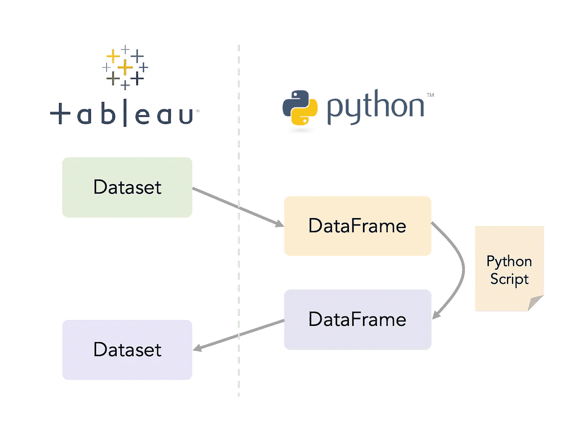
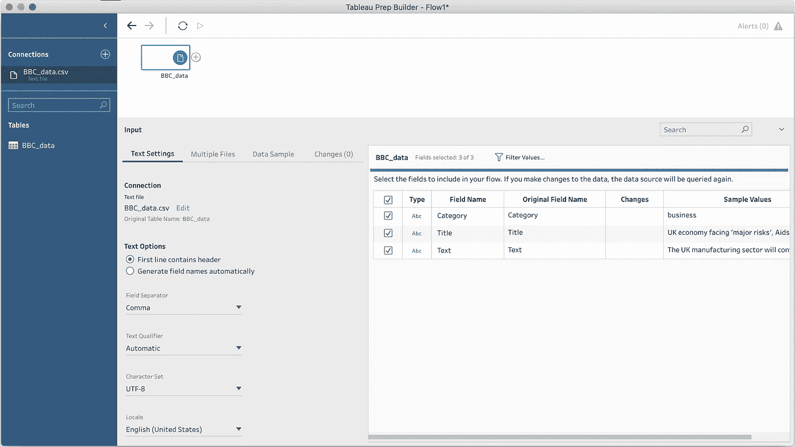
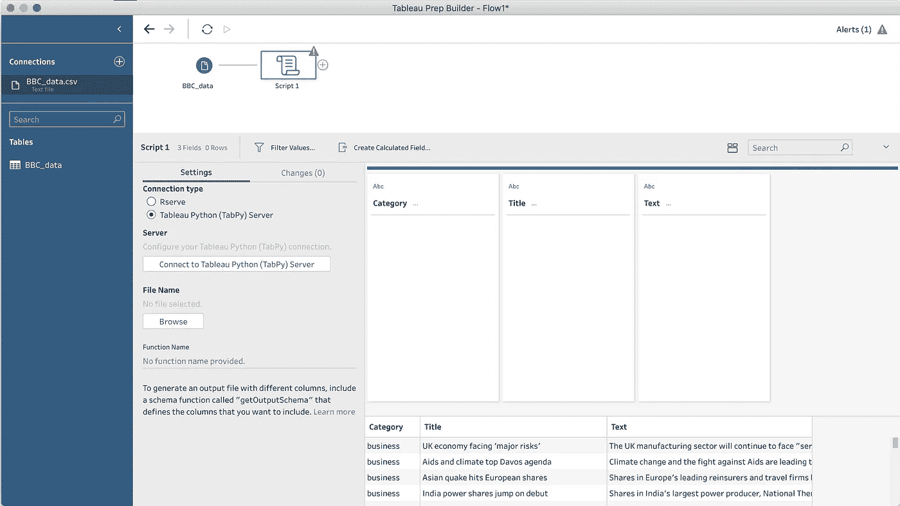
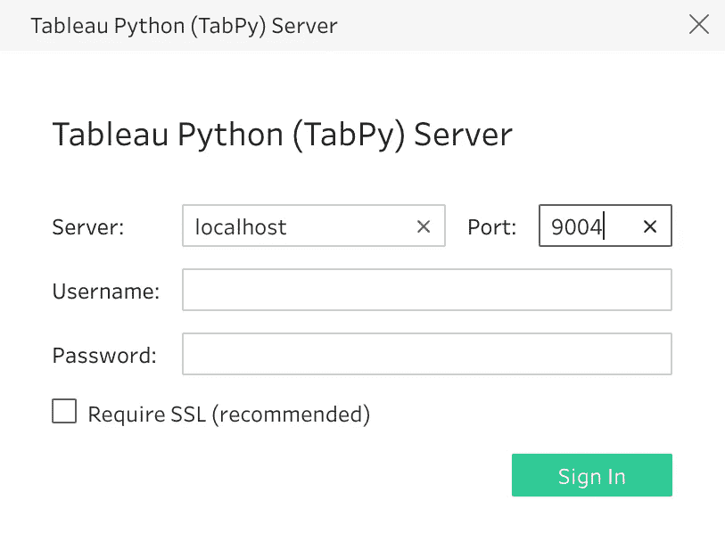
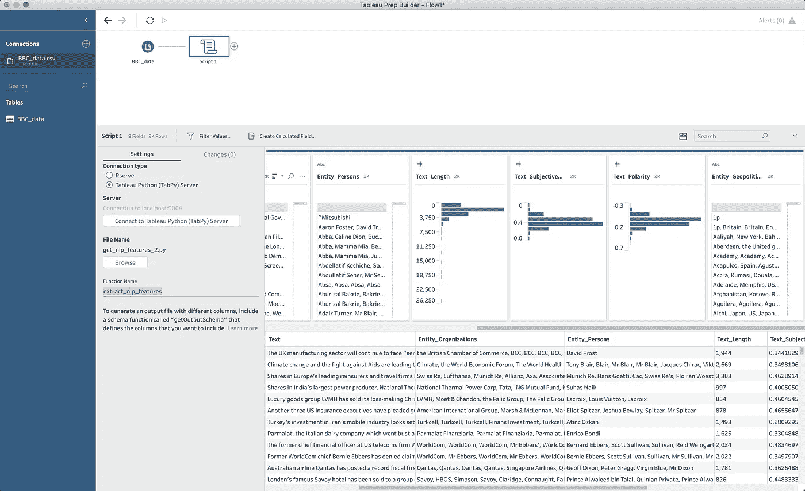

# 将文本分析集成到 Tableau 的指南

> 原文：<https://towardsdatascience.com/a-guide-to-integrating-text-analytics-into-tableau-94d1a1331117?source=collection_archive---------11----------------------->

Credit: [Freddie Marriage](https://unsplash.com/@fredmarriage)

数据往往又脏又乱。有时，它甚至没有以正确的形式进行快速分析和可视化。虽然 Tableau(和 Prep)有几个工具来处理数字、分类甚至空间数据，但一直缺少的一个部分是处理非结构化文本数据。

不再是了。

在几周前发布的最新版 Tableau Prep (2019.3)中，Prep 现在原生支持自定义 R 或 Python 脚本。通过使用 [TabPy](https://github.com/tableau/TabPy) ，人们可以在任何数据集上使用整套 R 和 Python 库，而不必离开 Tableau 宇宙。从[运行机器学习模型](https://www.tableau.com/about/blog/2019/10/using-tableau-preps-new-python-integration-predict-titanic-survivors)到[调用地理空间 API](https://thedataism.wordpress.com/2019/10/09/isochrones-in-tableau-prep-with-python/)，可能性几乎是无穷无尽的。

在本文中，我们尝试了一些令人兴奋的新事物:**使用 Tableau Prep 和 Python 将自然语言处理技术应用于非结构化文本数据**。在深入研究之前，我们先从如何设置一切的深入指导开始。

# 第 1 部分:为 Tableau 准备设置 Python

第一个大问题是:如何让 Python 与 Tableau Prep 一起工作？安装非常简单明了——只需遵循网站上的说明[这里](https://github.com/tableau/TabPy/blob/master/docs/server-install.md)。我们的建议是使用 Anaconda 安装包，而不是 pip，以避免潜在的依赖错误。

*(我们在 MacBook 上运行我们的代码，所以这是我们在指南中使用的参考，抱歉，Windows 用户！)*

有两件真正有用的事情需要注意，希望能让你免受我们所经历的挫折:

1.  用`conda`安装了 TabPy 之后，你得把你的`tornado`版本降级到 5.1.1，否则在尝试运行 TabPy 的时候会遇到异步错误。这也列在(非常短)[常见问题部分](https://github.com/tableau/TabPy/blob/master/docs/FAQ.md)中。
2.  在终端中运行命令`tabpy`对我不起作用。相反，我使用`cd`将目录更改为 TabPy 文件夹(尝试在类似`anaconda3/envs/[my_env]/lib/python3.7/site-packages/tabpy_server`的地方找到它)。然后，我通过键入`sh startup.sh`运行启动文件。

就是这样！但第二个大问题是:Tableau Prep 到底是如何使用 Python 脚本的？

A simple diagram to explain what is going on behind the scenes

本质上，Tableau Prep 将数据导出为 Pandas 数据帧，将自定义 Python 脚本中的指定函数应用于数据帧，并返回一个新的数据帧，该数据帧将被传递回 Tableau Prep。

记住整个流程很有帮助，尤其是在 Python 脚本中编写定制函数时。特别要注意的是，您的函数必须接收一个 Pandas 数据帧并返回另一个 Pandas 数据帧。

现在进入有趣的部分:**编写 Python 脚本！**

您的 Python 脚本至少需要两个函数，一个用于您尝试在 Python 中执行的操作，另一个用于定义输出模式。先说后者。

`get_output_schema()`帮助 Tableau Prep 理解从 Python 返回给它的数据的结构。如果要返回到 Tableau Prep 的数据帧与原始数据有不同的列，则需要此函数。它采取以下形式:

有六种数据类型，都是不言自明的，如上面的函数所示。注意，它们必须正确地映射到数据帧中每一列的实际数据类型，这样才能工作。

至于您自己的自定义函数，这里有一个非常简单的函数，它执行一些基本的数据处理:

如前面的图表所示，该函数接收原始数据作为 Pandas 数据帧，并返回清理后的数据作为 Pandas 数据帧。您可以在这里编写任何函数，只要您在脚本本身中导入所需的库。

您也可以在脚本中包含多个函数，但是 Tableau Prep 中的每个脚本工具一次只能调用一个函数。如果您计划对不同的数据集使用多个函数，您可以简单地将它们全部放入同一个 Python 脚本中，但只在需要时调用相关的函数。这省去了创建多个脚本的麻烦。

将这两个函数放在一个脚本中，就大功告成了。现在，我们终于可以在 Tableau Prep 上运行它了！

首先，我们通过引入一个 CSV 文件打开一个新的 Tableau 准备工作流。

这个 CSV 文件只有三列— `Category`、`Title`和`Text`。然后，我们将“脚本”工具添加到工作流中，这将我们带到以下页面:

现在，我们得到一个错误，因为 TabPy 服务器还没有设置好。打开终端，导航到文件夹`tabpy_server`，运行命令`sh startup.sh`。应该会出现以下内容:

记住这里的端口号，然后返回 Tableau Prep，单击“连接到 Tableau Python(tabby)服务器”按钮，并键入以下内容:

Key in the port number that was specified in Terminal! It’s not always 9004.

点击“登录”,它会带你回到主 Tableau 准备窗口。选择 Python 脚本文件，然后在按钮正下方的框中输入函数的名称。只要您的脚本运行正常，工作流就会自动运行。

从现在开始一切都是标准的舞台准备。当然，数据清理是 Python 中最不令人兴奋的事情，尤其是 Tableau Prep 已经做得很好了。既然我们已经学会了如何做基本的事情，我们就可以放下训练，开始将更高级的功能集成到工作流中。

# 第 2 部分:Tableau 中的自然语言处理

Most text data is unstructured, and NLP can help us to analyze all this data.

什么是自然语言处理(NLP)？**简而言之，NLP 寻求解析和分析我们交流的内容和方式。**虽然代码总是被精确而清晰地定义，但我们如何书写或说话只受语法规则的约束。语境和意义塑造了我们的写作和言语，这种模糊性使得计算机很难准确理解我们的意思。

不出所料，NLP 已经成为日常生活中相当常见的一部分。垃圾邮件过滤器、翻译和虚拟助手是 NLP 在现实世界中应用的许多例子中的一些。这一领域有如此大的潜力，因为它弥合了我们凭直觉发现的东西和计算机能够理解的东西之间的差距。

这就是为什么将文本分析引入 Tableau 是一个游戏改变者。**面对如此多的非结构化文本数据，能够有效地可视化这些数据将有助于我们更好地感知总体趋势和调查重要的异常值。**

Credits: [AbsolutVision](https://unsplash.com/@freegraphictoday)

对于本文，我们使用一个包含 2225 篇 BBC 新闻文章的[公开数据集](http://mlg.ucd.ie/datasets/bbc.html)(非常感谢 Greene 和 Cunningham 免费提供这个数据集！).每一篇文章都被分配到五个类别中的一个，并单独放在一个`.txt`文件中。

我们使用 Python 处理这个脚本，以便为 Tableau Prep 生成一个 CSV 文件。下面是我们使用的代码:

现在我们已经有了正确格式的数据，让我们看看如何分析非结构化文本。让我们看两篇新闻文章来了解一下底层数据是什么样的。

这里有一个来自“商业”类别:

> **标致交易助推三菱**
> 
> 陷入困境的日本汽车制造商三菱汽车(Mitsubishi Motors)已达成一项协议，向法国汽车制造商标致(Peugeot)供应 3 万辆运动型多功能车(SUV)。
> 
> 两家公司签署了一份谅解备忘录，并表示他们希望在 2005 年春天之前达成最终协议。在几次利润预警和销售不佳之后，这一联盟对亏损的三菱来说是一个急需的提振。这款 SUV 将在日本生产，使用标致的柴油发动机，主要在欧洲市场销售。销量下降让三菱汽车的产能未得到充分利用，而与标致的生产协议给了它一个利用部分产能的机会。
> 
> 今年 1 月，三菱汽车发布了 9 个月来的第三次利润预警，并下调了截至 2005 年 3 月的年度销售预期。在过去的一年里，该公司的销量下滑了 41%，这是由该公司系统地隐藏故障记录，然后秘密修理车辆的消息所推动的。因此，这家日本汽车制造商寻求了一系列金融救助。上月，该行表示，正寻求进一步 5400 亿日元(52 亿美元；27.7 亿英镑)的新资金支持，其中一半来自三菱集团的其他公司。拥有三菱汽车 30%股份的美-德汽车制造商戴姆勒-克莱斯勒在 2004 年 4 月决定不再注资。三菱新任命的首席执行官西冈隆(Takashi Nishioka)庆祝了与标致的交易，他是在上个月三位高管辞职承担公司困境的责任后接任的。三菱汽车(Mitsubishi Motors)预计，在截至 2005 年 3 月的本财年，该公司将出现 4720 亿日元的净亏损。上个月，该公司与日本竞争对手日产汽车(Nissan Motor)签署了一份生产协议，向其供应 3.6 万辆小型汽车，在日本销售。自 2003 年以来，该公司一直为日产生产汽车。

这里有一个来自“技术”类别:

> **年份搜索变成了个人**
> 
> 很可能当你打开浏览器时，你会直接进入你最喜欢的搜索引擎，而不是输入网址。
> 
> 有些人可能认为这是极度的懒惰，但是在一个信息超载的时代，搜索已经成为导航网络的重要工具。这表明了我们使用互联网的方式正在发生变化。正如谷歌所展示的，提供一项人们离不开的服务是有利可图的。很多公司都在争夺网络搜索者的忠诚度，提供大量不同的服务和工具来帮助你找到你想要的东西。在过去的 12 个月里，微软和雅虎等科技巨头都试图在搜索领域分一杯羹。雅虎的扬卡·布鲁尼尼说:“用户体验促使人们进行更多的搜索。她说，随着人们对互联网越来越熟悉，他们倾向于花更多的时间在网上，并提出更多的问题。“第二件事是宽带，”布鲁尼尼女士告诉 BBC 新闻网站。"这对互联网的影响就像色彩对电视的影响一样."
> 
> 但是搜索并不是一个新现象。自从网络出现以来，它就一直存在。
> 
> 经验丰富的冲浪者会记得 Hotbot 和 Altavista 这样的老前辈。“搜索一直都很重要，”谷歌运营副总裁乌尔斯·霍尔兹尔(Urs Holzle)表示。“我们在 1999 年就宣扬了这一点。随着用户越来越多，信息越来越多，现在更是如此。”“人们没有意识到搜索是未来。财务状况与此有关。”谷歌已经表明，网络商务可以通过其有针对性的小广告来运作，这些小广告出现在页面右侧的顶部和底部，并与原始搜索相关。这些小广告帮助谷歌在截至 9 月的三个月里实现了 8.059 亿美元的收入。其他人已经意识到你可以从网络查询中赚钱。“一旦你看到有一个市场，微软一定会抓住它。如果微软认为搜索很重要，那就没人会质疑它，”霍尔兹尔先生说。
> 
> 微软只是进军搜索领域的网络巨头之一。雅虎、Ask Jeeves、亚马逊和一些较小的公司都在寻求吸引眼球。
> 
> 随着每家公司都试图通过推出桌面搜索等新的搜索产品来击败谷歌，网络用户面临着过多的选择。它反映了战场是如何从网络转移到你的个人电脑上的。搜索不仅仅是在网上找路。现在，它是关于解锁隐藏在硬盘上数十亿字节的文档、图像和音乐中的信息。尽管有这些进步，搜索仍然是一个笨拙的工具，经常不能准确地找到你想要的东西。为了做得更好，搜索引擎试图更好地了解你，更好地记忆、分类和管理你遇到的所有信息。“个性化将是未来的一个大领域，”雅虎的扬卡·布鲁尼尼说。“谁破解了它，并给你你想要的信息，谁就是赢家。我们必须理解你，才能给你量身定制的更好的结果。”这也许是搜索的圣杯，理解你在寻找什么，并迅速提供给你。问题是还没有人知道如何到达那里。

我们想从这些新闻文章中提取什么样的数据？一些事情浮现在脑海中:

1.  文章中提到了谁或什么？
2.  这篇文章是用肯定语气还是否定语气写的？
3.  讨论的一般话题是什么？

巧合的是，这三个问题中的每一个都对应 NLP 中的一个特定子领域。第一是实体识别，第二是情感分析，第三是话题建模。在本文中，我们将只研究前两者。

为此，我们依赖 Python 中两个著名的 NLP 库: [Spacy](https://spacy.io/) 和 [TextBlob](https://textblob.readthedocs.io/en/dev/) 。请确保在继续之前安装这两个软件包！

现在，我们只需使用这些库编写我们的脚本！

本文并不打算成为 Python 上 NLP 的指南(有许多文章和网站已经这样做了)，所以我们将跳过解释这两个包是如何工作的。我们在代码中留下了注释，以便对我们在每个部分所做的事情有一个好的了解。

在上一节中，我们深入了解了如何将 Python 脚本集成到 Tableau Prep 工作流中，因此使用上面的脚本应该很容易！我们导入 BBC 数据 CSV 文件，输入端口号，选择 Python 脚本，输入函数名。

两分钟内，我们看到…

Python 脚本完美运行！

Tableau Prep 最棒的地方之一是能够查看汇总数据。我们可以立即看到，大多数文章少于 3750 个字符，通常极性得分约为 0 (-1 为负，1 为正)，这与我们对 BBC 新闻作为简洁和中立的新闻来源的印象相当吻合。

我们还有每篇文章中提到的人、国家和组织的数据。虽然有一些错误(“气候”不是一个组织)，但 Spacy 库在识别这些命名实体方面大体上是准确的。

让我们更深入地研究一下我们前面看到的两篇文章到底返回了什么。关于标致的文章:

关于个性化搜索的文章:

在这两种情况下，斯帕西都正确地指出了文章中提到的组织、个人和国家。还要注意个性化搜索文章在`Text_Subjectiveness`和`Text_Polarity`中的得分如何更高。这与我们读到的一致:它更侧重于构建一个关于个性化搜索如何变得更加普遍的叙事，并且相当支持这一趋势。相比之下，标致的文章只是描述了行业动向。

**通过将文本分析集成到 Tableau Prep 中，我们能够从新闻文章中包含的非结构化文本数据中提取有用的信息。**我们还可以做更多的事情——主题建模、文档相似性、情感检测等等。

# 最后的想法

Credits: [Clem Onojeghuo](https://unsplash.com/@clemono2)

我们希望本指南有助于解释如何将定制 Python 脚本集成到 Tableau Prep 中，尤其是在自然语言处理领域。一旦掌握了窍门，为 API 调用、地理空间分析甚至机器学习编写定制脚本就变得非常简单了。

当这一切发生时，天空才是极限。

*—* [*萧恩*](https://www.linkedin.com/in/shaunkhoo)