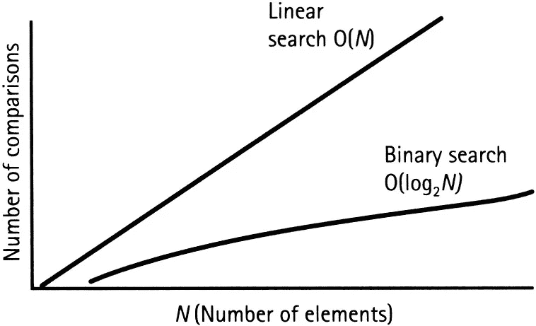

# 阵列的线性搜索和二分搜索法指南(数据结构和算法)

> 原文：<https://towardsdatascience.com/a-guide-to-linear-search-and-binary-search-on-arrays-data-structures-algorithms-2c23a74af28a?source=collection_archive---------17----------------------->


在上一篇文章中，我们讨论了数组和操作( [LINK](/a-guide-to-arrays-and-operations-data-structures-f0671028ed71) )。现在，我们将回顾算法选择如何影响代码的性能。特别是，我们将通过无序和有序数组来研究线性搜索和二分搜索法。

# 什么是算法？

我的一个经理是个数学专家，他总是喜欢明确地陈述定义，这样每个人都在同一页上。在我们的例子中，算法是解决问题的一种方式。例如，这里有一个关于如何执行谷歌搜索的粗略算法:

1.打开 web 浏览器。
2。在地址栏
3 中输入[www.google.com](http://www.google.com)。按回车键
4。在谷歌搜索栏中，输入想要的搜索
5。按回车键

现在有更多的步骤来更加明确和改进算法，但你得到的想法。换句话说，算法是做某事的过程。

# **有序数组**

在上一篇文章([链接](/a-guide-to-arrays-and-operations-data-structures-f0671028ed71))中，我们讨论了无序数组。有序数组是数据以定向方式组织的数组(通常被视为升序)。因此，每次添加或删除一个数字时，数组都会按照需要的顺序进行重组。让我们看一个 Python 中数组的例子:

```
ordered_array = [1, 6, 7, 22, 100]# Let's insert the value 19
ordered_array.insert(0, 19)
ordered_array
```

[19, 1, 6, 7, 22, 100]

我们可以看到，增加值并没有按照正确的升序排列。为了保持数组有序，值 19 必须放在正确的位置。在 Python 中，我们可以这样对数组进行排序:

```
ordered_array.sort()
ordered_array
```

[1, 6, 7, 19, 22, 100]

这很容易，但是，在幕后，Python 做了更多的事情。如果我们从插入 19 和排列开始，第一步是检查 19 是否大于 1。如果是，则移动到下一个值。如果没有，则将值放在索引处，并将所有值向右移动。

在我们的例子中，它将逐个搜索每个值，直到达到 22。在 22 处，它会将 22 和 100 向右移动一个索引值。之后，它会将 19 放在 22 的前一个索引值上。

# 线性搜索

好吧，那么显示有序和无序数组的全部意义是什么？对于线性搜索这样的算法来说，性能变化很大。线性搜索逐个检查数组中的值，直到找到为止。在无序数组中，线性搜索必须检查整个数组，直到找到所需的值。但是有序数组就不同了。原因是，一旦线性搜索发现一个值大于它的期望值，那么它可以停止，并说它找到了值或没有。基本上，有序数组需要更少的步骤，无序数组使用线性搜索。Python 示例编码如下:

```
#Linear Search Function (modified from: [https://www.geeksforgeeks.org/linear-search/](https://www.geeksforgeeks.org/linear-search/))
def linsearch(arr, n, x): 
    for i in range (0, n): 
        if (arr[i] == x): 
            return i; 
    return -1;#Ordered Array
arr = [1, 6, 7, 19, 22, 100]; 
#Desired value
x = 19;n = len(arr); 
result = linsearch(arr, n, x)if(result == -1): 
    print("Element is not present in array") 
else: 
    print("Element is present at index", result);
```

元素出现在索引 3 处

# 二进位检索

由于我们的数据被结构化为有序数组，因此实际上有一种比线性搜索更好的方法来搜索值。你已经猜到了。更好的算法是二分搜索法！那么，它是如何工作的呢？

二分搜索法基本上是取你要找的值，然后到有序数组的中间。它现在会考虑期望值是大于还是小于中间值。如果更高，二分搜索法会到达中间点，再次询问更高或更低的价格，直到找到理想的价格。这同样适用于较低的值。

重要的是要记住，二分搜索法只能发生在有序的数组中。如果它是无序的，二分搜索法不能要求更高或更低的值来加速搜索。这个例子强调了数据结构的重要性以及正确的算法选择如何影响性能。二分搜索法的 Python 示例如下:

```
#Binary Search Function (modified from: [https://www.geeksforgeeks.org/binary-search/](https://www.geeksforgeeks.org/binary-search/))
def binarySearch(arr, l, r, x): 
    while l <= r: 
        mid = l + (r - l)//2; 
        if arr[mid] == x: 
            return mid 
        elif arr[mid] < x: 
            l = mid + 1
        else: 
            r = mid - 1
    return -1#Ordered Array
arr = [1, 6, 7, 19, 22, 100]; 
#Desired value
x = 19; 

result = binarySearch(arr, 0, len(arr)-1, x) 

if(result != -1): 
    print("Element is present at index % d" % result)
else: 
    print("Element is not present in array")
```

元素出现在索引 3 处

# 结论

因此，我们了解了线性搜索和二分搜索法对有序数组的性能影响。由于逐个检查数组中每个数据点的期望值，线性搜索速度较慢。相比之下，二分搜索法通过获取中间值并根据期望值升高或降低来减少搜索时间。我认为以图形方式观察这种变化会有所帮助，所以请看下图:



Graph performance of Linear Search v. Binary Search. Image taken from Techtud: [https://www.techtud.com/sites/default/files/public/user_files/tud39880/linearSearch%20vs%20binary%20search%20diagram_0.jpg](https://www.techtud.com/sites/default/files/public/user_files/tud39880/linearSearch%20vs%20binary%20search%20diagram_0.jpg)

基本上，在最坏的情况下，线性搜索性能会随着每个新元素的增加而提高。例如，期望值为 49，000 的 50，000 个有序数组将以从 0 一直到 49，000 为步长进行线性搜索。另一方面，二分搜索法将在大约 15 步内穿过一个又一个中间值。不要担心图中的 O 符号。这是一个很大的 O 符号，我们将在下一篇文章中讨论它！

本系列文章的第一部分可以在这里找到:

[https://towards data science . com/a-guide-to-arrays-and-operations-data-structures-f 0671028 ed 71](/a-guide-to-arrays-and-operations-data-structures-f0671028ed71)

对于那些现在想了解更多的人来说，下面是我用来撰写本文的关于这些主题的好资源:

*   http://elementsofprogramming.com/
*   [https://www . Amazon . com/Cracking-Coding-Interview-Programming-Questions/DP/0984782850](https://www.amazon.com/Cracking-Coding-Interview-Programming-Questions/dp/0984782850)
*   [https://learning . oreilly . com/library/view/a-common-sense-guide/9781680502794/](https://learning.oreilly.com/library/view/a-common-sense-guide/9781680502794/)

*免责声明:本文陈述的所有内容均为我个人观点，不代表任何雇主。*