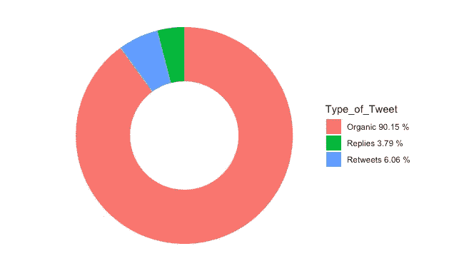
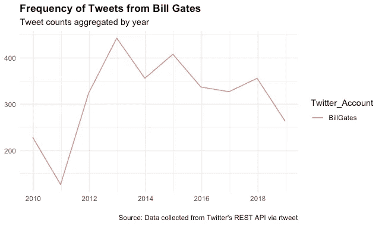
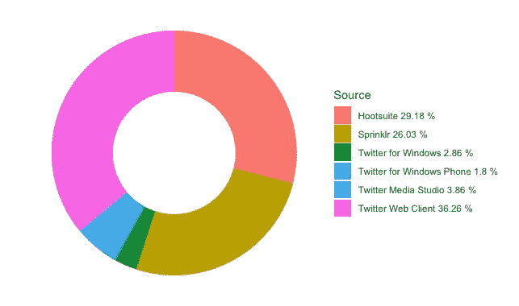
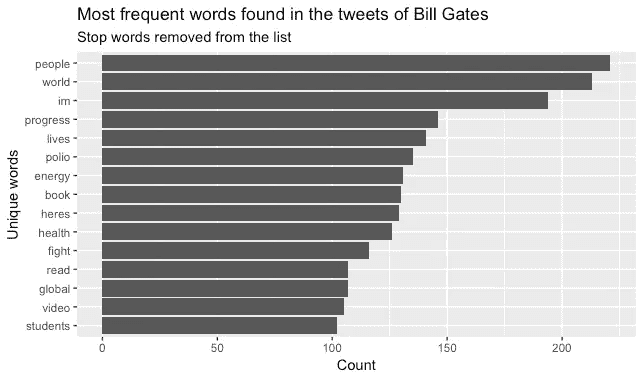
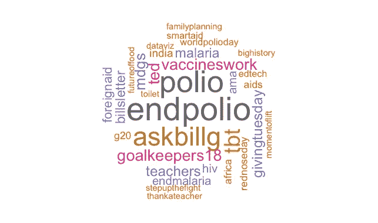
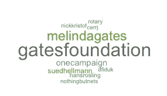
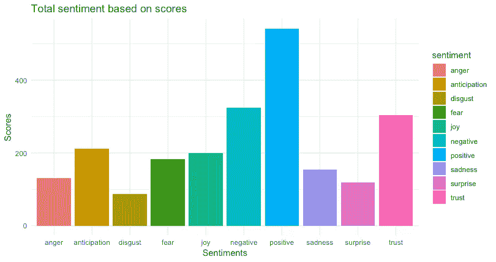

# 使用 R 挖掘和分析 Tweets 的指南

> 原文：<https://towardsdatascience.com/a-guide-to-mining-and-analysing-tweets-with-r-2f56818fdd16?source=collection_archive---------2----------------------->

## 撰写深刻的 Twitter 分析报告的简单步骤


Photo by [Carlos Muza](https://unsplash.com/@kmuza?utm_source=unsplash&utm_medium=referral&utm_content=creditCopyText) on [Unsplash](https://unsplash.com/search/photos/analytics-report?utm_source=unsplash&utm_medium=referral&utm_content=creditCopyText)

Twitter 为我们提供了大量用户生成的语言数据——这是任何想要进行文本分析的人的梦想。更重要的是，推特让我们能够洞察在线公共行为。因此，分析 Twitter 已经成为品牌和代理商的重要信息来源。

几个因素让 Twitter 在分析方面比其他社交媒体平台有相当大的优势。首先，推特有限的字符大小为我们提供了一个相对同质的语料库。其次，每天发布的数百万条推文允许访问大量数据样本。第三，tweets 是公开的，容易访问，也可以通过 API 检索。

尽管如此，提取这些见解仍然需要一些编码和编程知识。这就是为什么大多数情况下，品牌和机构依赖于易于使用的分析工具，如 SproutSocial 和 Talkwalker，这些工具只需点击一下即可提供这些见解。

在这篇文章中，我帮助你打破这些障碍，并为你提供一个简单的指南，告诉你如何用编程软件 r 提取和分析推文。

以下是你可能选择这样做的 3 个原因:

*   **使用 R 是免费的**，也就是说，你将能够免费制作一份 Twitter 分析报告，同时学习如何编码！
*   **R 给你无限的分析机会**。因此，用它来分析 Twitter，可以让你根据你想要分析的内容进行量身定制的分析，而不是依赖一份一刀切的报告
*   **R 允许你分析任何你想要的 Twitter 账户，即使你没有登录信息**。与许多分析工具相比，这是一个巨大的优势，许多分析工具要求您首先拥有登录详细信息以便分析信息。

深信不疑？那我们开始吧！

# 步骤 1:获取 Twitter API 访问权限

为了开始，您首先需要获得一个 Twitter API。这将允许你检索推文——没有它，你不能做任何事情。获得一个 Twitter API 很容易。首先确保你有一个 Twitter 账户，否则就创建一个。然后，通过以下网站申请开发者帐号:[https://developer.twitter.com/en/apply-for-access.html](https://developer.twitter.com/en/apply-for-access.html)。你需要填写一份申请表，包括对你希望分析的内容做更多的解释。

一旦你的申请被 Twitter 接受(这不会花太长时间)，你将收到以下凭证，你需要保持安全:

*   **消费者密钥**
*   **消费者秘密**
*   **访问令牌**
*   **访问密码**

# 第二步:挖掘推文

一旦有了上面的信息，启动 R 并下载“rtweet”包，我将用它来提取 tweets。

```
install.packages("rtweet")
library (rtweet)
```

然后，设置连接 Twitter 的身份验证。你可以通过输入你的应用名称、消费者密钥和消费者秘密来做到这一点——所有这些都是你在申请 Twitter API 时收到的信息。您将被重定向到一个 Twitter 页面，并被要求接受认证。一旦完成，你就可以返回 R，开始分析你的推文了！

```
twitter_token <- create_token(
  app = ****,
  consumer_key = ****,
  consumer_secret = ****,
  set_renv = TRUE)
```

## **搜索推文**

根据您希望执行的分析，您可能希望搜索包含特定单词或标签的推文。请注意，您只能提取过去 6 到 9 天的推文，因此在分析时请记住这一点。

要做到这一点，只需使用 **search_tweets** 函数，后跟一些规范:要提取的 tweets 的数量(n)，是否包括转发和 tweets 的语言。作为示例，请参见下面的代码行。

```
climate <- search_tweets(“climate”, n=1000, include_rts=FALSE, lang=”en”)
```

## 搜索特定的用户帐户

或者，您可能希望分析特定的用户帐户。在这种情况下，使用 **get_timeline** 函数，后跟 twitter 句柄和您希望提取的 tweets 数量。注意，这里只能提取最后 3200 条推文。

在这个例子中，我选择了提取比尔·盖茨的推文。这里的优势是比尔·盖茨的账户总共有 3169 条推文，低于 3200 条的门槛。

```
Gates <- get_timeline("@BillGates", n= 3200)
```

# 第三步:分析推文

在这一部分，我向你展示了你应该包含在每一份 Twitter 分析报告中的 8 个关键观点。为此，让我们更深入地研究一下比尔·盖茨的 Twitter 账户吧！

## 1.显示什么效果最好，什么效果不好

任何报告的第一部分都应该提供清晰的信息，说明什么效果最好，什么效果不好。找出表现最好和最差的推文可以快速清晰地了解账户的整体情况。

为了做到这一点，你首先需要区分有机推文、转发和回复。下面一行代码向您展示了如何从您的样本中删除转发和回复，只保留有机的推文——就内容而言，这些是您想要分析的推文！

```
# Remove retweets
Gates_tweets_organic <- Gates_tweets[Gates_tweets$is_retweet==FALSE, ] # Remove replies
Gates_tweets_organic <- subset(Gates_tweets_organic, is.na(Gates_tweets_organic$reply_to_status_id)) 
```

然后，你需要通过查看变量来分析参与度: **favorite_count** (即喜欢的数量)或 **retweet_count** (即转发的数量)。只需将它们按降序排列(变量前有一个减号“-”)即可找到点赞或转发数量最多的一个，或按升序排列(没有减号)即可找到参与次数最少的一个。

```
Gates_tweets_organic <- Gates_tweets_organic %>% arrange(-favorite_count)
Gates_tweets_organic[1,5]Gates_tweets_organic <- Gates_tweets_organic %>% arrange(-retweet_count)
Gates_tweets_organic[1,5]
```

## 2.显示回复/转发/有机推文的比率

分析回复、转发和有机推文的比例可以告诉你很多你正在分析的账户类型。例如，没有人喜欢一个专门转发的 Twitter 账户，没有任何个人内容。因此，如果一个人希望提高他或她的账户的性能，找到回复、转发和有机推文的良好比例是一个关键的监控指标。

作为第一步，确保创建三个不同的数据集。由于您已经在前面的步骤中创建了一个仅包含有机推文的数据集，现在只需创建一个仅包含转发的数据集和一个仅包含回复的数据集。

```
# Keeping only the retweets
Gates_retweets <- Gates_tweets[Gates_tweets$is_retweet==TRUE,]# Keeping only the replies
Gates_replies <- subset(Gates_tweets, !is.na(Gates_tweets$reply_to_status_id))
```

然后，创建一个单独的数据框，包含有机推文、转发和回复的数量。这些数字很容易找到:它们是你的三个数据集的观测值。

```
# Creating a data frame
data <- data.frame(
  category=c("Organic", "Retweets", "Replies"),
  count=c(2856, 192, 120)
)
```

完成后，您可以开始为圆环图准备数据框，如下所示。这包括添加计算比率和百分比的列，以及一些可视化调整，如指定图例和舍入数据。

```
# Adding columns 
data$fraction = data$count / sum(data$count)
data$percentage = data$count / sum(data$count) * 100
data$ymax = cumsum(data$fraction)
data$ymin = c(0, head(data$ymax, n=-1))# Rounding the data to two decimal points
data <- round_df(data, 2)# Specify what the legend should say
Type_of_Tweet <- paste(data$category, data$percentage, "%")ggplot(data, aes(ymax=ymax, ymin=ymin, xmax=4, xmin=3, fill=Type_of_Tweet)) +
  geom_rect() +
  coord_polar(theta="y") + 
  xlim(c(2, 4)) +
  theme_void() +
  theme(legend.position = "right")
```



## 3.显示推文发布的时间

多亏了从每条推文中提取的日期和时间，了解比尔·盖茨最常发推文的时间非常容易分析。这可以让我们对账户的活动有一个总体的了解，也是一个有用的指标，可以用来分析表现最好和最差的推文。

在这个例子中，我按年份分析了推文的频率。请注意，您也可以通过简单地将下面一行代码中的“year”改为“month”来按月执行此操作。或者，您也可以使用 R 包 hms 和 scales 按小时分析发布行为。

```
colnames(Gates_tweets)[colnames(Gates_tweets)=="screen_name"] <- "Twitter_Account"ts_plot(dplyr::group_by(Gates_tweets, Twitter_Account), "year") +
  ggplot2::theme_minimal() +
  ggplot2::theme(plot.title = ggplot2::element_text(face = "bold")) +
  ggplot2::labs(
    x = NULL, y = NULL,
    title = "Frequency of Tweets from Bill Gates",
    subtitle = "Tweet counts aggregated by year",
    caption = "\nSource: Data collected from Twitter's REST API via rtweet"
  )
```



## 4.显示推文发布的位置

分析发布推文的平台的来源是另一个很酷的洞察。其中一个原因是，我们可以在一定程度上推断出比尔·盖茨是不是发微博的人。因此，这有助于我们定义推文的个性。

在这一步中，您对 rtweet 包收集的源变量感兴趣。下面一行代码向您展示了如何按来源类型聚合这些数据，并分别统计每种类型的 tweets 的频率。请注意，为了简化可视化过程，我只保留了发表了超过 11 条推文的来源。

```
Gates_app <- Gates_tweets %>% 
  select(source) %>% 
  group_by(source) %>%
  summarize(count=n())Gates_app <- subset(Gates_app, count > 11)
```

一旦完成，这个过程类似于之前已经创建的圆环图！

```
data <- data.frame(
  category=Gates_app$source,
  count=Gates_app$count
)data$fraction = data$count / sum(data$count)
data$percentage = data$count / sum(data$count) * 100
data$ymax = cumsum(data$fraction)
data$ymin = c(0, head(data$ymax, n=-1))data <- round_df(data, 2)Source <- paste(data$category, data$percentage, "%")ggplot(data, aes(ymax=ymax, ymin=ymin, xmax=4, xmin=3, fill=Source)) +
  geom_rect() +
  coord_polar(theta="y") + # Try to remove that to understand how the chart is built initially
  xlim(c(2, 4)) +
  theme_void() +
  theme(legend.position = "right")
```



请注意，比尔·盖茨的大多数推文来自 Twitter 网络客户端 Sprinklr 和 Hootsuite——这表明比尔·盖茨很可能不是自己发推文的人！

## 5.显示在推文中找到的最常用的词

Twitter 分析报告当然应该包括对推文内容的分析，这包括找出哪些词用得最多。

因为您正在分析文本数据，所以请确保首先清理它，并从您不想在分析中显示的任何字符(如超链接、@提及或标点符号)中删除它。下面几行代码为你提供了清理 tweets 的基本步骤。

```
Gates_tweets_organic$text <-  gsub("https\\S*", "", Gates_tweets_organic$text)Gates_tweets_organic$text <-  gsub("@\\S*", "", Gates_tweets_organic$text) Gates_tweets_organic$text  <-  gsub("amp", "", Gates_tweets_organic$text) Gates_tweets_organic$text  <-  gsub("[\r\n]", "", Gates_tweets_organic$text)Gates_tweets_organic$text  <-  gsub("[[:punct:]]", "", Gates_tweets_organic$text)
```

第二步，确保从文本中删除停用词。这对于您分析最常用的单词非常重要，因为您不希望出现最常用的单词，如“to”或“and ”,因为这些单词对您的分析没有太大意义。

```
tweets <- Gates_tweets_organic %>%
  select(text) %>%
  unnest_tokens(word, text)tweets <- tweets %>%
  anti_join(stop_words)
```

然后，您可以按照下面的简单步骤，标出推文中出现频率最高的单词。

```
tweets %>% # gives you a bar chart of the most frequent words found in the tweets
  count(word, sort = TRUE) %>%
  top_n(15) %>%
  mutate(word = reorder(word, n)) %>%
  ggplot(aes(x = word, y = n)) +
  geom_col() +
  xlab(NULL) +
  coord_flip() +
  labs(y = "Count",
       x = "Unique words",
       title = "Most frequent words found in the tweets of Bill Gates",
       subtitle = "Stop words removed from the list")
```



## 6.显示最常用的标签

你可以对标签做同样的分析。在这种情况下，您需要使用 rtweet 包中的 **hashtags** 变量。形象化这些的一个好方法是使用如下所示的单词云。

```
Gates_tweets_organic$hashtags <- as.character(Gates_tweets_organic$hashtags)
Gates_tweets_organic$hashtags <- gsub("c\\(", "", Gates_tweets_organic$hashtags)set.seed(1234)
wordcloud(Gates_tweets_organic$hashtags, min.freq=5, scale=c(3.5, .5), random.order=FALSE, rot.per=0.35, 
          colors=brewer.pal(8, "Dark2"))
```



## 7.显示转发次数最多的账户

从一个账户大量转发通常不是人们在 Twitter 账户中寻找的。因此，一个有用的见解是监控和了解大多数转发来自哪个账户。这里您要分析的变量是 **retweet_screen_name** ，可视化的过程类似于之前使用单词云描述的过程。

```
set.seed(1234)
wordcloud(Gates_retweets$retweet_screen_name, min.freq=3, scale=c(2, .5), random.order=FALSE, rot.per=0.25, 
          colors=brewer.pal(8, "Dark2"))
```



## 8.对推文进行情感分析

最后，你可能想在 Twitter 分析报告的末尾添加一个情感分析。使用“syuzhet”软件包很容易做到这一点，并允许您通过把握推文的语气来进一步深化您的分析。没有人喜欢一个只会传播愤怒或悲伤推文的推特账号。捕捉你的推文的语气以及它们是如何平衡的，是你的账户表现的一个很好的指标。

```
library(syuzhet)# Converting tweets to ASCII to trackle strange characters
tweets <- iconv(tweets, from="UTF-8", to="ASCII", sub="")# removing retweets, in case needed 
tweets <-gsub("(RT|via)((?:\\b\\w*@\\w+)+)","",tweets)# removing mentions, in case needed
tweets <-gsub("@\\w+","",tweets)ew_sentiment<-get_nrc_sentiment((tweets))
sentimentscores<-data.frame(colSums(ew_sentiment[,]))names(sentimentscores) <- "Score"sentimentscores <- cbind("sentiment"=rownames(sentimentscores),sentimentscores)rownames(sentimentscores) <- NULLggplot(data=sentimentscores,aes(x=sentiment,y=Score))+
  geom_bar(aes(fill=sentiment),stat = "identity")+
  theme(legend.position="none")+
  xlab("Sentiments")+ylab("Scores")+
  ggtitle("Total sentiment based on scores")+
  theme_minimal()
```



# **总结**

在这篇文章中，我旨在展示如何使用免费的编程软件 r 提取和分析推文。我希望这个指南有助于您构建自己的 Twitter 分析报告，其中包括:

*   显示哪些推文效果最好，哪些效果不好
*   有机推文/回复/转发的比率，推文发布的时间和发布推文的平台。**这些都是关于推特行为的见解。**
*   推文中使用最频繁的词，标签，转发最多的账户，以及捕捉推文语气的情感分析。**这些都是对推文内容的见解。**

[](https://medium.com/data-social/mining-tweets-of-us-candidates-on-mass-shootings-before-and-after-the-2018-midterms-90cc18ff652a) [## 挖掘 2018 年中期选举前后美国候选人关于大规模枪击事件的推文

### 与卡洛斯·阿胡马达合作撰写的文章

medium.com](https://medium.com/data-social/mining-tweets-of-us-candidates-on-mass-shootings-before-and-after-the-2018-midterms-90cc18ff652a) 

我定期撰写关于数据科学和自然语言处理的文章。关注我的 [*Twitter*](https://twitter.com/celine_vdr) *或*[*Medium*](https://medium.com/@celine.vdr)*查看更多类似的文章或简单地更新下一篇文章！*