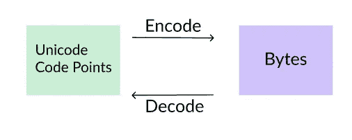
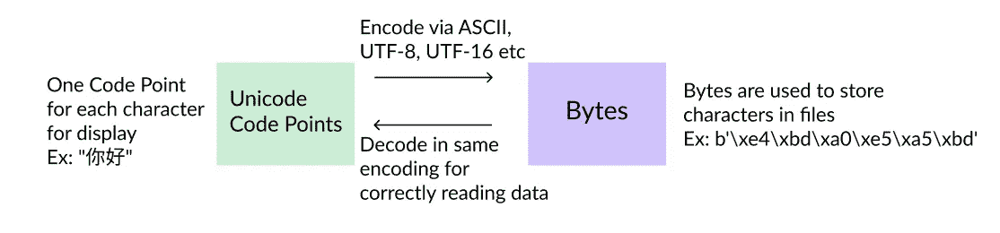

# Unicode、UTF-8 和 Python 中的字符串指南

> 原文：<https://towardsdatascience.com/a-guide-to-unicode-utf-8-and-strings-in-python-757a232db95c?source=collection_archive---------3----------------------->

## 让我们来看看弦乐的基本概念，这将使你的理解更上一层楼。

字符串是 Python 中最常见的数据类型之一。它们用于处理任何类型的文本数据。自然语言处理领域是建立在某种文本和字符串处理之上的。了解 Python 中字符串的工作方式很重要。当字符串由英语 ASCII 字符组成时，通常很容易处理，但是当我们输入非 ASCII 字符时，就会出现“问题”——这在当今世界越来越普遍。随着表情符号等的出现。


Let’s decipher what is hidden in the strings

许多程序员将`encode`和`decode`与字符串一起使用，希望消除令人恐惧的`UnicodeDecodeError`——希望这篇博客能帮助你克服对处理字符串的恐惧。下面我会用一个 Q 和一个格式来真正得到你可能会有的问题的答案，在我开始学习字符串之前我也有。

## 1.绳子是由什么制成的？

在 Python (2 或 3)中，字符串既可以用**字节**表示，也可以用 **unicode 码位**表示。
字节是由 8 位构成的信息单位，字节用于存储硬盘中的所有文件。所以你计算机上所有的 CSV 和 JSON 文件都是由字节组成的。我们都同意我们需要字节，但那么 *unicode 码位呢？我们将在下一个问题中讨论它们。*

## 2.什么是 unicode 和 Unicode 码位？

当从文件中读取字节时，读者需要知道这些字节意味着什么。因此，如果你写一个 JSON 文件并发送给你的朋友，你的朋友需要知道如何处理你的 JSON 文件中的字节。对于最初 20 年左右的计算，大写和小写的英文字符，一些标点符号和数字就足够了。这些都被编码成一个名为 [ASCII](https://en.wikipedia.org/wiki/ASCII) 的 127 符号列表。7 位信息或 1 字节足以对每个英文字符进行编码。你可以告诉你的朋友用 ASCII 编码解码你的 JSON 文件，瞧——她就能读懂你发给她的东西了。

这在最初的几十年里很酷，但是慢慢地我们意识到有更多的字符而不仅仅是英文字符。我们尝试将 127 个字符扩展到 256 个字符(通过 Latin-1 或[ISO-8859–1](https://en.wikipedia.org/wiki/ISO/IEC_8859-1))以充分利用 8 位空间——但这还不够。我们需要一个大家都同意的国际标准来处理成百上千的非英语字符。

Unicode 出现了！

Unicode 是国际标准，其中维护了单个字符和唯一数字的映射。截至 2019 年 5 月，Unicode 的最新版本是 12.1，包含超过 137k 个字符，包括英语、印地语、中文和日语等不同的脚本，以及表情符号。这 137k 个字符每个都由一个 **unicode 码位**表示。所以 unicode 码位指的是显示的实际字符。
这些码点被编码成字节，再从字节解码回码点。例如:字母表`a`的 Unicode 码位是 U+0061，表情符号🖐是 U+1F590，ω是 U+03A9。

3 Unicode 定义的最流行的编码标准是 UTF-8、UTF-16 和 UTF-32。

## 3.什么是 Unicode 编码 UTF-8、UTF-16 和 UTF-32？

我们现在知道 Unicode 是一种国际标准，它将每个已知的字符编码成一个唯一的数字。那么下一个问题是，我们如何在互联网上移动这些唯一的号码？你已经知道答案了！使用字节的信息。

**UTF-8:** 使用 **1、2、3 或 4 字节**对每个码点进行编码。它向后兼容 ASCII。所有的英文字符只需要 1 个字节——效率相当高。如果我们发送非英语字符，我们只需要更多的字节。
这是最流行的编码形式，也是 Python 3 中默认的编码方式。在 Python 2 中，默认编码是 ASCII(不幸的是)。

**UTF-16** 是变量**的 2 或 4 个**字节。这种编码方式非常适合亚洲文字，因为大多数亚洲文字都可以用 2 个字节进行编码。这对英语不好，因为所有的英语字符在这里也需要 2 个字节。

**UTF-32** 是固定的 **4** 字节。所有的字符都用 4 个字节编码，所以需要很大的内存。它不经常使用。
【你可以在[这篇](https://stackoverflow.com/questions/496321/utf-8-utf-16-and-utf-32) StackOverflow 帖子里读到更多。]

我们需要`encode`方法将 unicode 码位转换成字节。例如，这通常发生在将字符串数据写入 CSV 或 JSON 文件的过程中。
我们需要`decode`方法将字节转换成 unicode 码位。这通常发生在将数据从文件读入字符串的过程中。



Why are encode and decode methods needed?

## 4.Python 中有哪些数据类型处理 Unicode 码位和字节？

正如我们前面讨论的，在 Python 中，字符串可以用字节或 unicode 码位表示。
Python 中主要的外卖有:
1。Python 2 使用`**str**`类型存储字节，使用`**unicode**`类型存储 unicode 码位。默认情况下，所有字符串都是`str`类型——字节~默认编码是 ASCII。因此，如果传入的文件是西里尔字符，Python 2 可能会失败，因为 ASCII 将无法处理这些西里尔字符。在这种情况下，我们需要记住在读取文件时使用`decode("utf-8")`。这不方便。
2。Python 3 来了，解决了这个问题。默认情况下，字符串仍然是`**str**`类型，但是它们现在意味着 unicode 码位——我们携带我们看到的东西。如果我们想在文件中存储这些`str`类型的字符串，我们使用`**bytes**`类型。默认编码是 UTF-8，而不是 ASCII。完美！

## 5.有没有比较不同数据类型的代码示例？

Yes, let’s look at “你好” which is Chinese for hello. It takes 6 bytes to store this string made of 2 unicode code points. Let’s take the example of popular`len` function to see how things might differ in Python 2 and 3 — and things you need to keep note of.

```
>>> print(len(“你好”))   # Python 2 - str is bytes
6>>> print(len(u“你好”))  # Python 2 - Add 'u' for unicode code points
2>>> print(len(“你好”))   # Python 3 - str is unicode code points
2
```

因此，在 Python 2 中添加前缀`u`会对代码是否正常运行产生完全不同的影响——这可能会令人困惑！Python 3 通过默认使用 unicode 码位解决了这个问题——所以在上面的例子中，如果长度为 2，那么`len`将会像您所期望的那样工作。

让我们看看 Python 3 中处理字符串的更多例子:

```
# strings is by default made of unicode code points
>>> print(len(“你好”)) 
2# Manually encode a string into bytes
>>> print(len(("你好").encode("utf-8")))  
6# You don't need to pass an argument as default encoding is "utf-8"
>>> print(len(("你好").encode()))  
6# Print actual unicode code points instead of characters [[Source](https://stackoverflow.com/questions/7291120/get-unicode-code-point-of-a-character-using-python)]
>>> print(("你好").encode("unicode_escape"))
b'\\u4f60\\u597d'# Print bytes encoded in UTF-8 for this string
>>> print(("你好").encode()) 
b'\xe4\xbd\xa0\xe5\xa5\xbd'
```

## 6.信息量很大啊！你能总结一下吗？

当然可以！让我们直观地看看我们到目前为止所学的内容。
在 Python 3 中，默认情况下，我们位于字符串 Unicode 码位世界的左侧。我们只需要在写入或读取数据时来回移动字节。此转换过程中的默认编码是 UTF-8，但也可以使用其他编码。我们需要知道在解码过程中使用了什么编码器，否则我们可能会得到错误或得到乱码！



Visual diagram of how encoding and decoding works for strings

这个图对 Python 2 和 Python 3 都适用！我们可能会得到`UnicodeDecodeErrors`,因为:
1)我们试图使用 ASCII 编码非 ASCII 字符。这种情况会发生。在 Python 2 中，默认编码器是 ASCII。因此，您应该使用 UTF-8 显式编码和解码字节。我们可能完全用错了解码器。如果 unicode 码位是用 UTF-16 而不是 UTF-8 编码的，你可能会遇到在 UTF-8 土地上乱码的字节。所以 UTF-8 解码器可能完全无法理解这些字节。

一个好的做法是，一旦从文件中加载了字节，就用 UTF-8(或用于创建这些字节的编码器)对它们进行解码。通过 Python 代码对 unicode 码位进行处理，然后使用 UTF-8 编码器将字节写回到文件中。这叫做 Unicode 三明治。阅读/观看内德·巴奇尔德(@ [内德巴特](https://twitter.com/nedbat))关于这个问题的精彩演讲。

如果你想在 Python 中添加更多关于字符串的信息，请在下面的评论中提及，因为这将有助于他人。我关于 Unicode、UTF-8 和字符串指南的博客到此结束。祝你在自己的文本探索中好运！

**PS，看看我的新播客！**它叫做“[数据生活播客](https://link.chtbl.com/d8Cg-H7N)”，我在这里谈论类似的话题。在最近的一集里，我谈到了为什么熊猫是新的 Excel。你可以在这里或任何你听播客的地方听播客。


[My podcast: The Data Life Podcast](https://link.chtbl.com/d8Cg-H7N)

如果您有任何问题，请在我的 [LinkedIn 个人资料](https://www.linkedin.com/in/sanketgupta107/)中给我留言。感谢阅读！