# 从高中的角度介绍深度学习

> 原文：<https://towardsdatascience.com/a-hands-on-introduction-to-deep-learning-from-a-high-school-perspective-41be62ef00a7?source=collection_archive---------9----------------------->

Image Courtesy of Xkcd ( [https://xkcd.com/1838/](https://xkcd.com/1838/))

他的一系列博客文章致力于为寻求学习深度学习的高中生提供直接而简单的深度学习解释。

主要的 DL 概念将在本系列中以一种互动的、实际操作的方式进行解释，引导读者完成构建一个简单的 DL 模型并对其进行训练和评估的过程。

我在互联网上获取数字图书馆资料的经验是，它仍然主要面向那些寻求转向数字图书馆的人，或者关注那些寻求从事数字图书馆的大学生。当我开始学习 DL 的时候，大部分信息都需要对数学和微积分概念有一个很好的、直观的理解。虽然获得这些知识是我从学习 DL 的旅程中获得的许多好处之一，但该过程的最初步骤导致对梯度下降和激活函数的目的等概念的理解非常肤浅。总的来说，我缺乏对概念的数学直觉，这导致了混乱和误解。这种数学直觉在网上的大部分资料中通常被忽略，因为类似领域的大学生和大学毕业生都有广泛的数学背景。

本系列旨在以一种典型的对数学和数字逻辑感兴趣的高中生能够理解的方式提供数字逻辑概念的直观联系。

本系列将遵循构建、训练和评估亚马逊评论情感分析模型的过程。情感分析是根据语句含义中的情感对语句进行分类。例如，有人说“天气晴朗”背后的一般情绪是积极的，而如果有人说“天气多云，正在下雨”，他们可能感到消极。这是情感分析的基础，这个概念将被应用于对 polar IMDB 电影评论进行正面或负面分类。

这第一篇文章将使读者了解深度学习的最新基础知识，并将教给读者完全理解该主题所需的核心概念。

# 背景

M 机器学习(ML)是一种算法，利用数据来学习模式，得出有意义的结果，并从多个应用中进行预测。深度学习(DL)和神经网络是更有效地实现 ML 目标的专门技术。

在过去的几年中，ML 领域，尤其是 DL 领域发展迅速。多年来，传统的企业数据量已经从大约 10，000–100，000 增长到 1，000，000–1，000，000，000。

这引发了一个研究人员从未遇到过的独特问题；计算能力对训练模型的限制。为了创建更深层次的神经网络，他们需要一种当时无法提供的计算能力。这就是 ML 领域停滞多年的原因。

然后，计算能力的提高允许研究人员实现更深、更高维的神经网络。新的技术进步带来了图形处理单元(GPU)，这是深度学习所需的高维矩阵乘法的最有效的硬件之一。同样，唯一的限制是模型的算法和架构，而我们可以不断地收集更多的数据来提高准确性。

现在，DL 领域已经分裂成多个主要组:计算机视觉(CV)、音频理解和自然语言处理(NLP)等等。本教程将集中在一个“Hello World”类型的 NLP 介绍性问题，但也将包括一些计算机视觉技术。

有几个主要行业 NLP 可以完全重新设计。这些是客户服务，虚拟助理，信息检索。

*   在客户协助方面，聊天机器人可以简化客户服务，处理简单的任务和问题，并将复杂的查询留给人类。在未来，DL 模型可以分析电话，并通过情感分析对客户满意度进行评级。
*   虚拟助手使用自然语言理解技术从你的语音中提取命令。正是这些技术让 Alexa、Siri 和 Google Assistant 等虚拟助手能够交流并理解我们的语言。
*   信息检索通过使用情感分析和抽象概括从非结构化文本中提取有价值信息。

计算机视觉可以重新设计的一些领域是自动驾驶和安全。

*   CV 是自动驾驶背后的主要力量之一，它存在于越来越受欢迎的特斯拉汽车中。它允许计算机识别街道地标，如车道线、交通信号和街道上的其他物体，如汽车和行人
*   安全性也会受到 CV 的严重影响。公司可以使用 CV 代替员工监控摄像头的威胁，这既增加了发现威胁的可能性，又降低了误报的几率。

# 基础知识

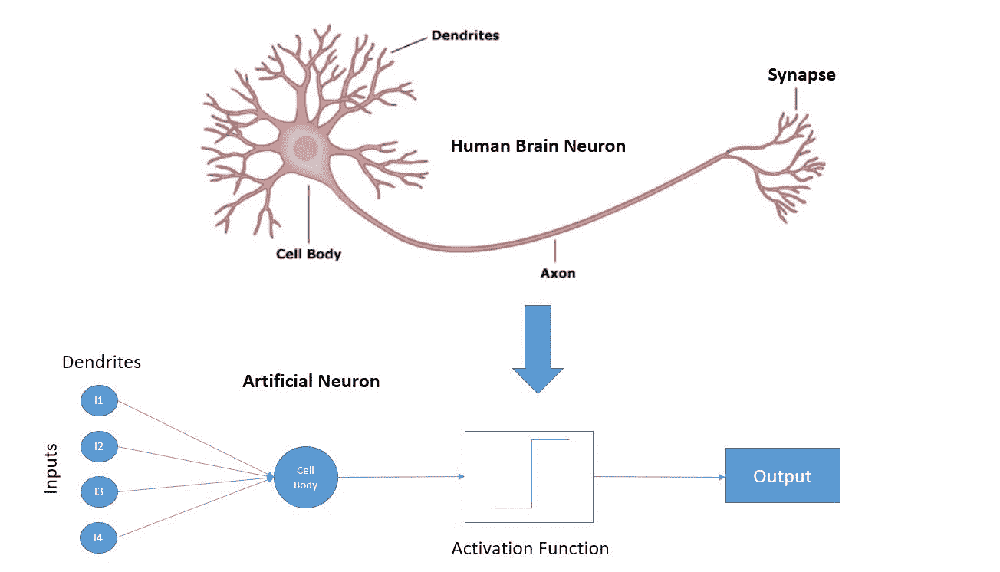

*Image Courtesy of MPLS VPN (*[*http://www.mplsvpn.info/2017/11/what-is-neuron-and-artificial-neuron-in.html*](http://www.mplsvpn.info/2017/11/what-is-neuron-and-artificial-neuron-in.html)*)*

深度学习以人类神经元为模型，其中神经元具有从其他神经元获取信息的树突，进行计算的轴突，以及向其他神经元发送信号的轴突终端。在人工神经元中，输入与树突同义，激活功能与轴突同义，输出类似于轴突终末。

深度学习的一个简单应用就是从数据中画出边界和洞察。

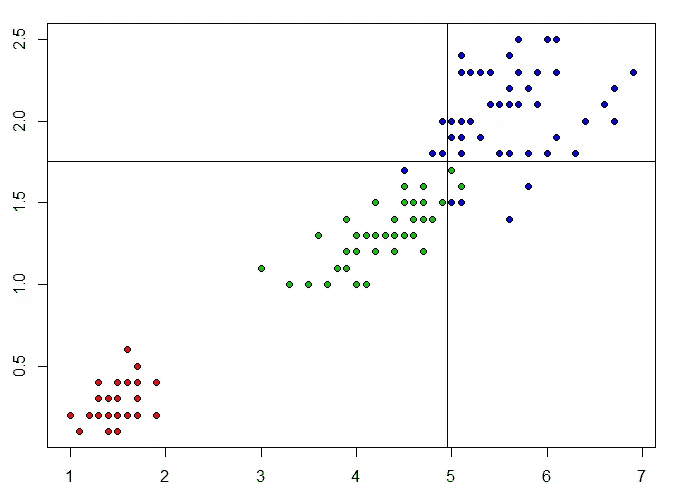

Courtesy of [StackoverFlow](https://stackoverflow.com/questions/12546583/how-do-i-draw-split-conditions-of-classification-tree-in-a-scatter-plot-of-r)

在上面的例子中，假设 x 轴是房子里卧室的数量，y 轴是房子里浴室的数量。红点代表公寓，绿点代表单户住宅，蓝点代表豪宅。DL 中的一个常见任务是根据卧室和浴室的数量将房子分类为公寓、单户住宅或豪宅。这是通过学习一个函数来完成的，该函数在 3 个不同的类周围画出一个大致的边界。

对于一个人来说，仅仅通过查看图就可以相对容易地用手画出这些边界。可以绘制的边界示例如下:

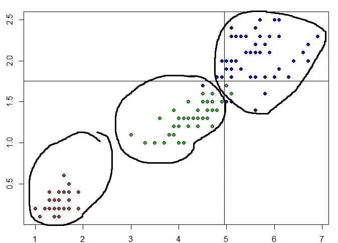

虽然当只有两个参数时，我们人类很容易做出这些界限，但随着参数数量的增加，这变得越来越具有挑战性。例如，如果给定房子的四个或五个不同的方面，在我们的头脑中想象这些数据几乎是不可能的。这是深度学习的主要应用。对于一台计算机来说，学习边界对于具有 10 个甚至 100 个不同特征的问题来说是非常初级的。

如果一个房子突然出现 1.5 个卫生间和 3 个卧室，我们可以根据上面的数据来概括我们的边界并预测它很可能是一个单独的家庭住宅。就像这样，深度学习模型可以很容易地针对许多数据点进行归纳，这意味着它不需要针对每个数据点和案例场景进行专门编程，并且可以使用之前从数据中获得的洞察力来决定做出什么决定。

让我们看看这到底是怎么做到的:

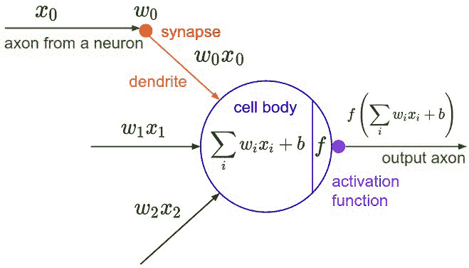

*Image Courtesy of Jeffries (*[*https://hackernoon.com/@dan.jeffries*](https://hackernoon.com/@dan.jeffries)*)*

上面的图像是一个人造物体内部到底发生了什么的图像。一个人工神经元基本上是线性模型，形式是 y = Wx + B，或者 y = mx + b，应该看起来比较熟悉。w 和 B 是神经元的参数，可以改变以适应数据。最后，其中一个激活函数将被应用于 y，产生单个神经元的输出。

*Image Courtesy of Sbongo (*[*https://www.kaggle.com/sbongo/*](https://www.kaggle.com/sbongo/tensorflow-nn-drop-out-batch-norm-lb-0-515)*)*

就像大脑是由数万亿个这样的神经元组成一样，神经网络(NNs)也是由许多相互连接的神经元组成的。

全连接层是最基本的架构，由数百个相互连接的人工神经元组成。这种架构有两个属性:深度和隐藏层大小。深度是模型中的总层数，而隐藏层大小是每层中神经元的数量。

这种架构的缺点是，随着输入图层的维度变得越来越大，例如当输入高分辨率图像的数百万个像素值时，完全连接的图层或密集图层不再起作用。

这就引出了下一个基础架构，称为卷积。

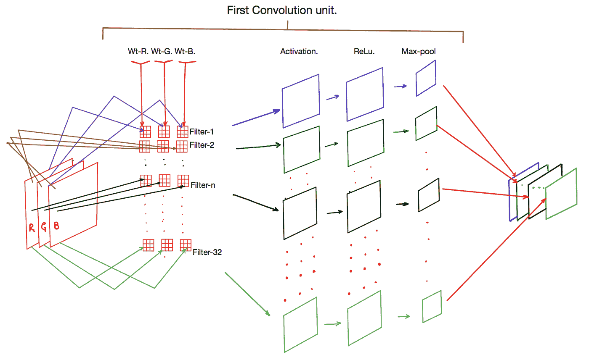

*Image Courtesy of Tamang (*[*https://medium.com/@apiltamang*](https://medium.com/@apiltamang)*)*

卷积神经网络是基于位置的架构，最初设计用于读取和解释图像像素。他们的工作原理是使用滑动滤波器，将滤波器中的所有值乘以一个权重并添加一个偏差，然后对总和应用一个激活函数。然后将从该操作中获得的所有值相加。当过滤器以一定的步幅穿过图像时，这继续进行。

ConvNet 的好处是它可以学习识别图像中的特征，从垂直和水平边缘一直到大型物体和动物。这使得 ConvNets 在 DL 的计算机视觉领域取得了巨大成功，并用于特斯拉的自动驾驶系统，以检测汽车、行人和道路特征，如车道线、标志和交通信号。

*Image Courtesy of Computer Science Wiki (*[*https://computersciencewiki.org/index.php/Max-pooling_/_Pooling*](https://computersciencewiki.org/index.php/Max-pooling_/_Pooling)*)*

一种重要的卷积类型是最大池，它只是从一个区域中获取最大像素值，并丢弃所有其他像素。提取并移动过滤器尺寸中的最大值，同时移除所有其他值。通常，最大池的过滤器大小为 2x2，跨距为 2，但也可以使用其他大小和跨距。max pooling 背后的直觉是，它减少了查看的像素数量，同时保留了图像最重要的特征。

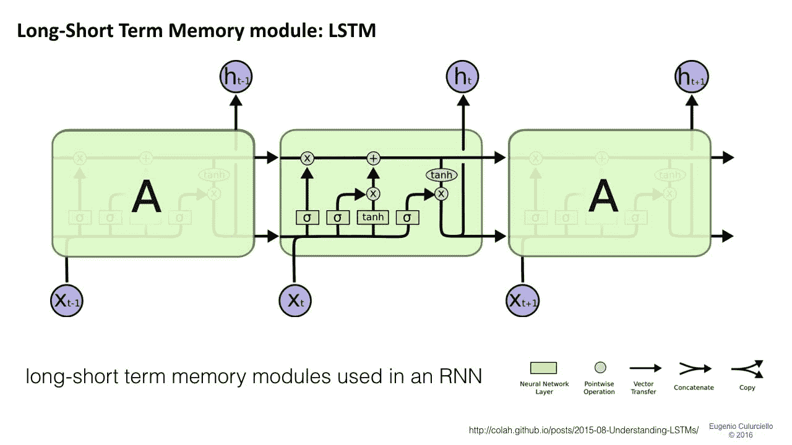

*Image Courtesy of Colah (*[*https://colah.github.io*](https://colah.github.io/posts/2015-08-Understanding-LSTMs/)*)*

递归神经网络(RNNs)主要用于语言或任何对其序列有长期依赖性的东西，如语音记录或音频文件。这些网络将输入分割成时间步长，每个时间步长的计算结果都被输入到下一个时间步长，从而赋予模型记忆输入的能力。这种网络是专门为语言设计的，因为当时的主要架构是无效的。时间步长的计算也不同于传统的人工神经元。RNN 建筑师实现了忘记和保留门，这为模型提供了一种以加权的方式记忆信息的方法，类似于人类记住他们生活中的重要部分并丢弃平凡的事情。这些系统被称为长短期记忆单元或 LSTMs。

这些是 DL 模型最常见的架构，可以相互结合使用，为复杂的任务创建更复杂的网络。

接下来我要解释的是一些最流行的激活函数以及为什么使用它们。您应该记得，DL 模型中的每个神经元计算输入和偏置的加权和，然后对输出应用激活函数以增加非线性。

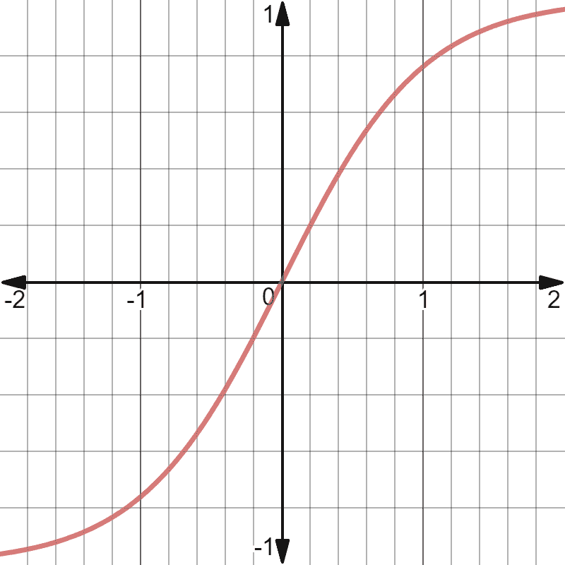

双曲正切函数非常类似于 sigmoid 函数，而 sigmoid 函数的范围是 0 到 1，双曲正切函数的范围是-1 到 1。tanh 和 sigmoid 都可以表示门，这就是为什么这两个函数在 LSTMs 中非常流行的原因(见下图)。LSTMs 通常在其遗忘和保留门中使用 tanh 函数，因为它压缩-1 和 1 之间的值，这些值直观地对应于关闭和打开门。

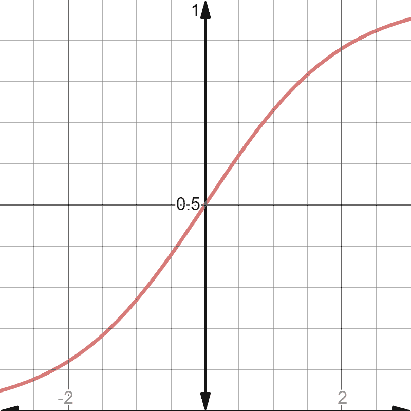

sigmoid 函数是一个历史上非常流行的函数，当时模型和数据集都很小。在现代，它已经失去了一些流行，由于问题出现时，这个功能是复合在自己身上。最大的问题是由于这样一个事实，即随着数量的增加，这个函数的斜率变得无限小，停止了模型的优化。称为消失梯度问题，它导致了这个函数的轻微下降。

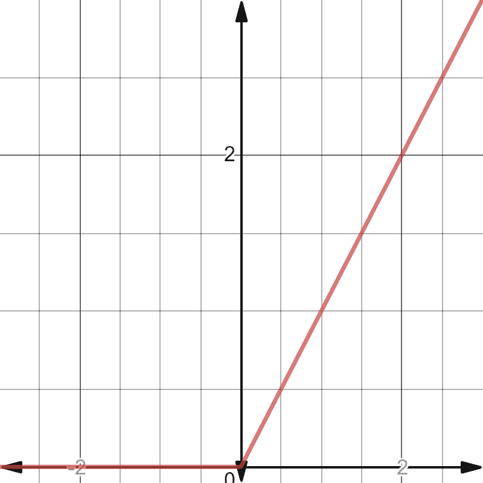

ReLU，或整流线性单元，是深度学习社区中使用的非常流行的激活函数(类似于大脑神经元思维)。它的流行是因为线性模型非常擅长概括数据。由于 ReLU 函数非常类似于线性函数，因此它保留了泛化的优点，同时仍将非线性引入模型。ReLU 函数简单来说就是 y=max(0，x)。

现在，您已经了解了创建自己的 DL 模型所需的所有基础知识。学习 DL 的下一步是理解它是如何从数据集学习的。

# 训练和损失函数

机器通过损失函数来学习。这是一种评估特定算法对给定数据建模程度的方法。如果预测与实际结果相差太多，损失函数就会产生一个非常大的数字。逐渐地，在一些优化函数的帮助下，损失函数学习减少预测中的误差。

DL 中使用的损失函数有很多种，每种都有自己的优缺点。DL 中最常见的两个损失函数是回归的损失函数(均方误差(MSE ))和分类问题的损失函数(交叉熵)。

MSE 损失是预测值和实际观测值的平方差的平均值。这种损失的一些优点是，高度不正确的预测受到很大的惩罚，并且更容易计算用于优化的损失函数的斜率。

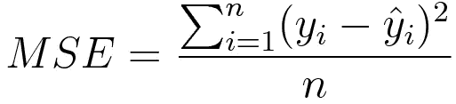

使用的另一个损失是交叉熵:

交叉熵损失是分类问题中最常用的损失，因为它简单而有效。当实际标签为 1 时，函数的后半部分消失，而在实际标签为 0 的情况下，前半部分消失。为什么这种损失会起作用，一种直觉是注意到当预测和实际数据点都是 1 或 0 时，损失中的一项抵消，输出为 0。如果预测和数据点分别为 1 和 0，则损失最大。一个重要的方面是交叉熵损失会严重惩罚那些有把握但却是错误的预测。

训练深度学习模型的过程类似于调整模型中的每个参数，以便它们尽可能准确地拟合数据。一个简单的例子是改变公式 y=Wx + b 中的参数 W 和 b，以找到散点图上数据的最佳拟合线。

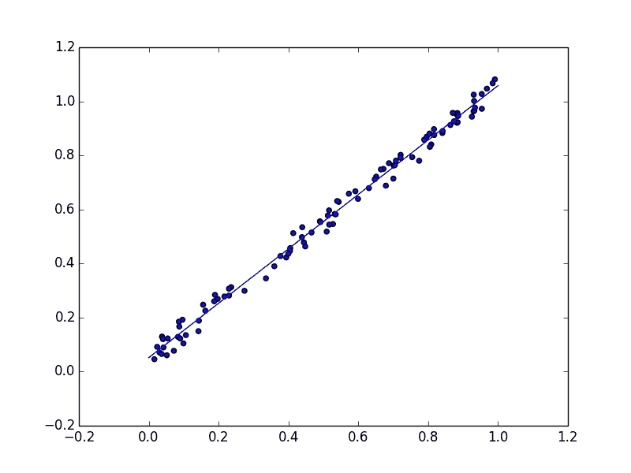

Image Courtesy of Stackoverflow ( [https://stackoverflow.com/questions/19068862/how-to-overplot-a-line-on-a-scatter-plot-in-python](https://stackoverflow.com/questions/19068862/how-to-overplot-a-line-on-a-scatter-plot-in-python))

实际上，有数学方法可以求解最符合数据的最佳参数 W 和 b，但在 DL 中这是不可能的，因为参数数量巨大。这可以通过查看关于上述数据的参数 W 和 b 的损失函数的曲线图以及 DL 模型的损失函数的曲线图来可视化。

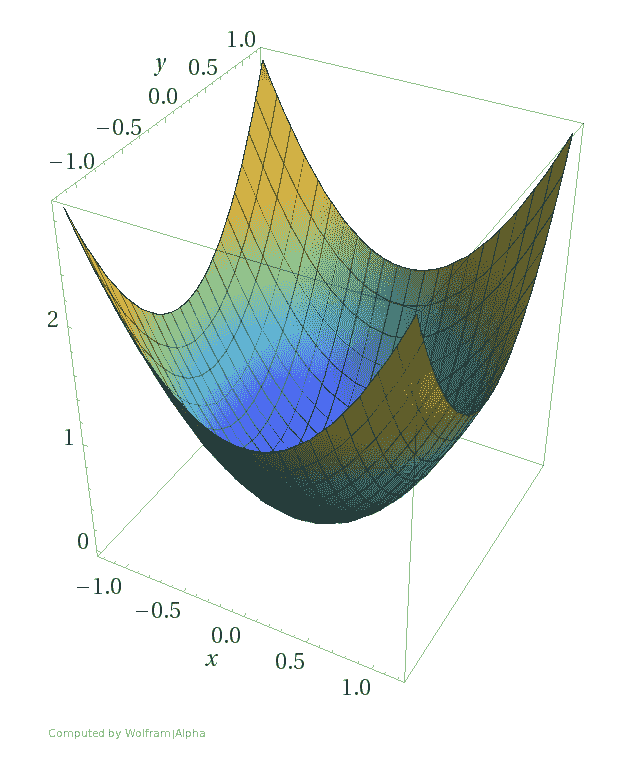

Graph for the Linear Function’s Loss

Graph for the loss of a DL model

当损耗最小时，可以很容易地求解上图中的参数 W 和 b，但是对于 DL 模型，这是不可能的。因此，采用迭代方法来训练 DL 模型。

优化算法通过获取斜率或函数在给定点的梯度来实现这一点，然后从参数中减去斜率，以将该点向下移动到希望的最小值。

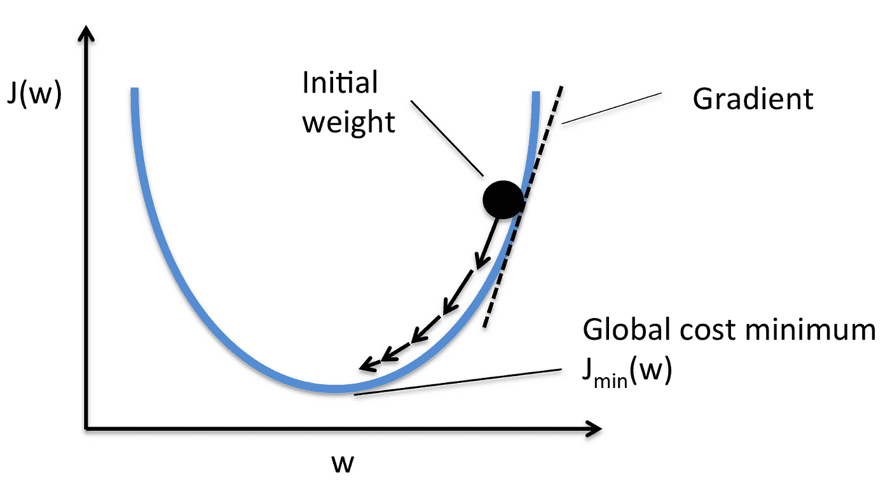

简单地说，调整 DL 模型的参数，直到它们输出正确的预测，之后这些参数被锁定在适当的位置以供使用。

该步骤的数学表示如下:

这里，θ是参数，表达式中的第二项可以看作损失函数相对于参数θ的斜率。alpha 符号表示该步骤的学习速率，并控制算法进行的步长。这一点很重要，因为如果步长太小，算法将运行非常慢，但如果步长太大，算法将快速波动。

# 估价

一旦训练了 DL 模型，就需要对它进行评估，以查看它在数据上的表现如何。衡量一个 DL 模型做得有多好的方法叫做度量，有许多不同的类型。

要使用的最简单的度量标准就是模型正确分类的示例占示例总数的百分比。这是模型的准确性，用于对模型的表现有一个浅显的、全面的了解。更复杂的指标将在本系列的第 2 部分中解释，我将一步一步地创建一个情感分析模型。

> 感谢您阅读这篇博文！在本系列的下一部分，我将一步一步地使用 Tensorflow 2.0 创建一个情感分析模型。我希望这篇文章已经成功地教会了你深度学习的基础。