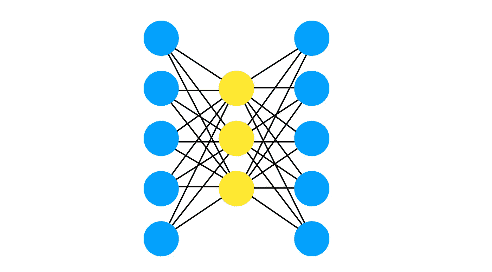
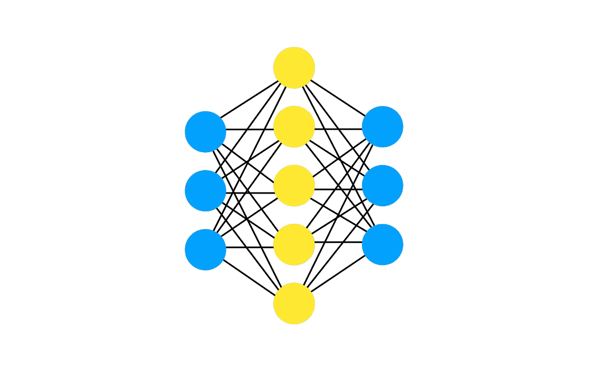
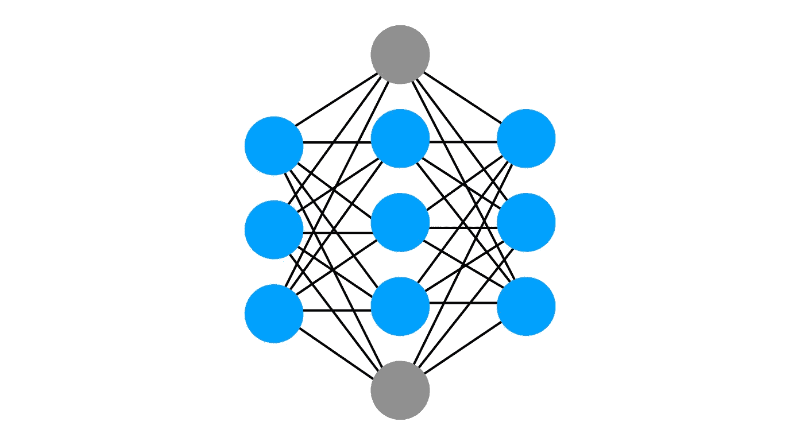
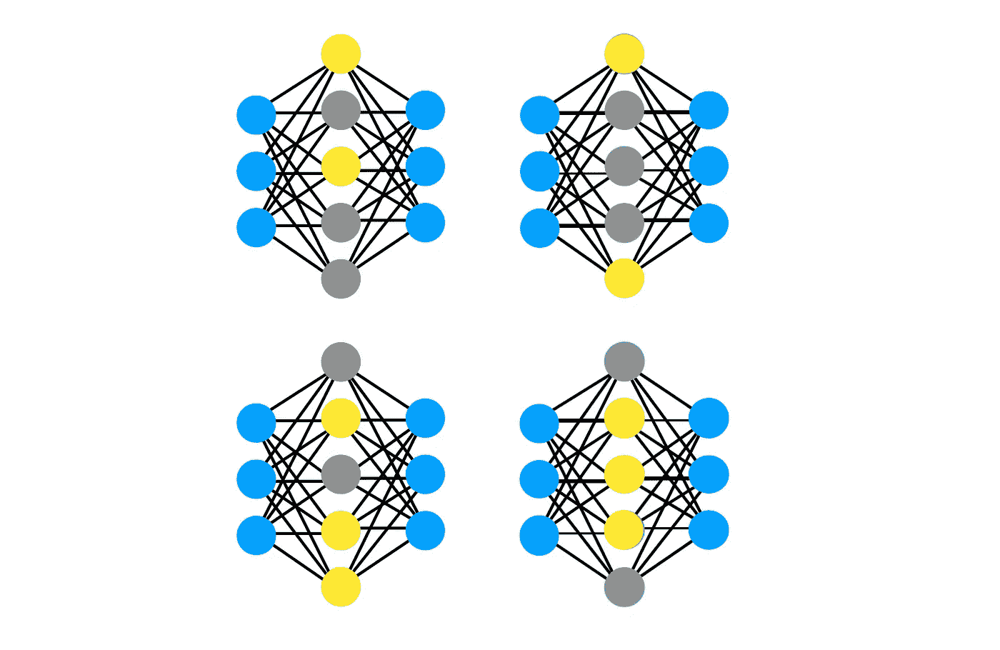
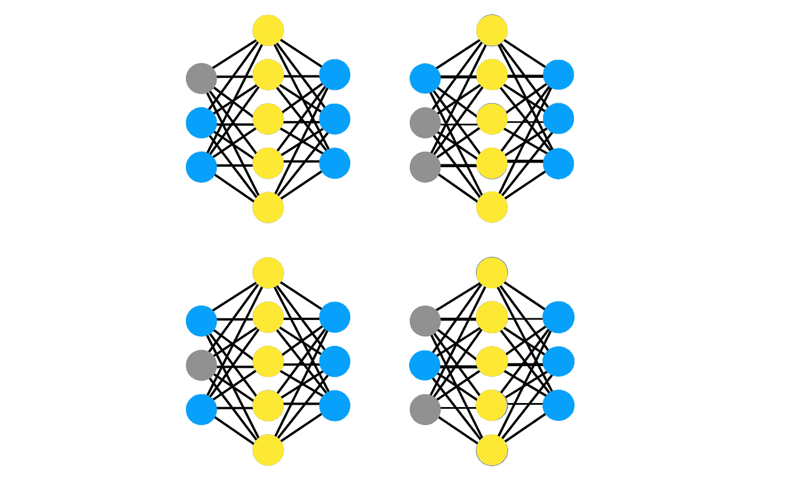
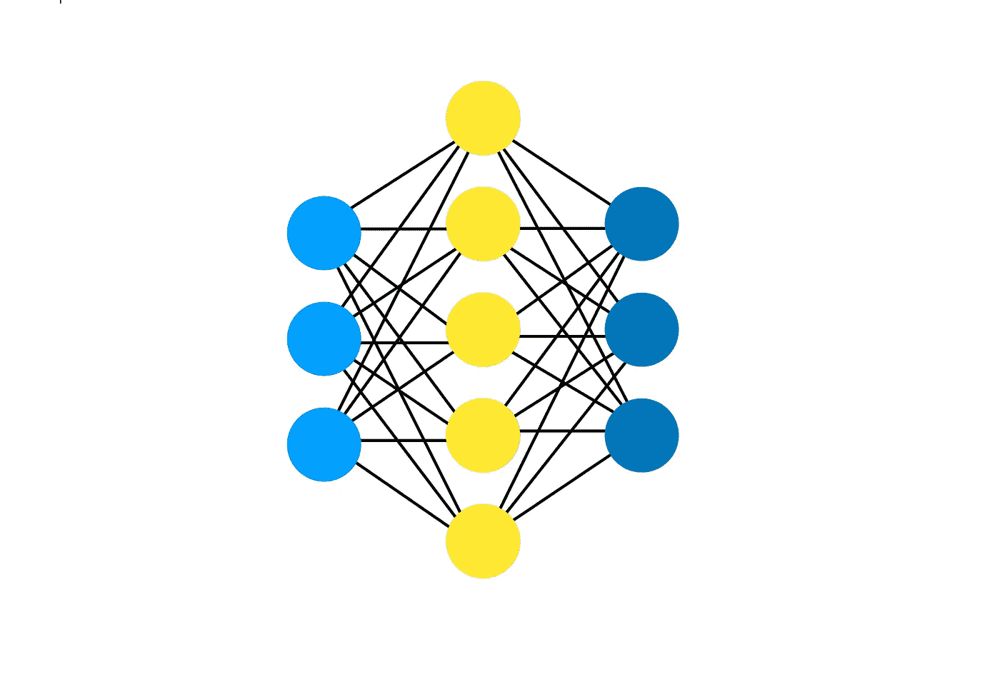
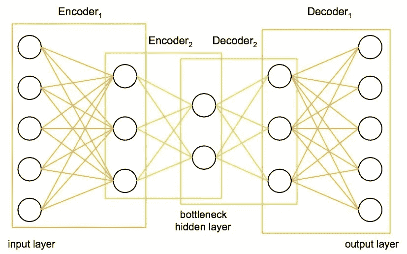
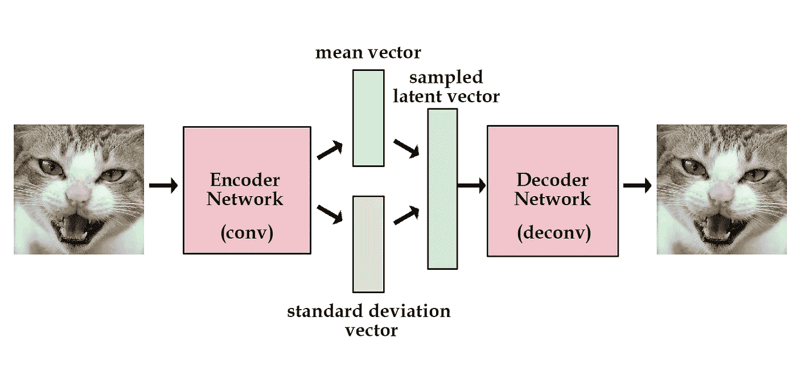
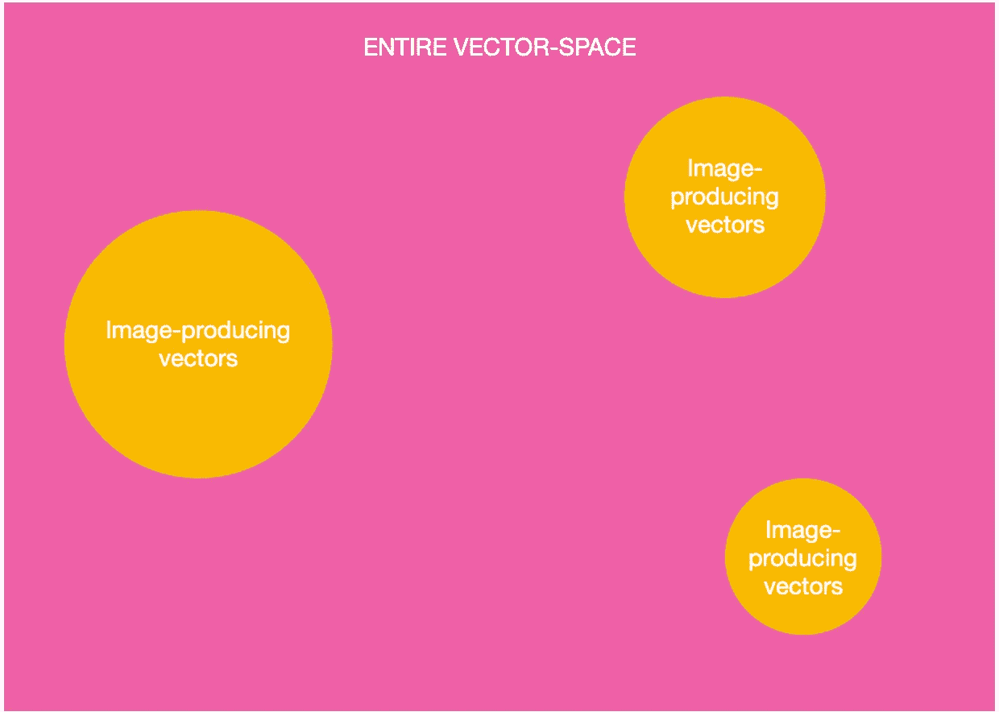
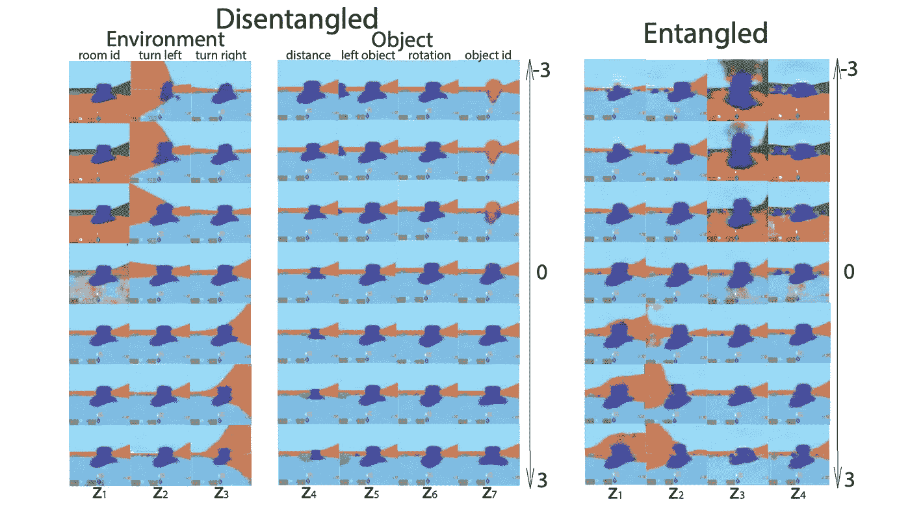

# 自动编码器高级指南

> 原文：<https://towardsdatascience.com/a-high-level-guide-to-autoencoders-b103ccd45924?source=collection_archive---------10----------------------->

## 一个自动编码器工具箱，从最基本的到最花哨的。

在机器学习和人工智能的奇妙世界中，存在一种称为自动编码器的结构。自动编码器是一种神经网络，它是无监督学习(或者对某些人来说，半无监督学习)的一部分。有许多不同类型的自动编码器用于许多目的，有些是生成式的，有些是预测式的，等等。本文将为您提供一个工具箱和不同类型的自动编码器指南。

# 传统自动编码器(AE)

The basic autoencoder

自动编码器的基本类型如上图所示。它由输入层(第一层)、隐藏层(黄色层)和输出层(最后一层)组成。网络的目标是输出层与输入层完全相同。隐藏图层用于特征提取或识别决定结果的特征。从第一层到隐藏层的过程称为编码。从隐藏层到输出层的过程称为解码。编码和解码的过程是自动编码器的特别之处。黄色层有时被称为瓶颈隐藏层。

从这里，有一堆不同类型的自动编码器。

# 问题:隐藏图层过多

我们首先要看的是解决过度完整的隐藏层问题。

Overcomplete Hidden Layers

需要注意的重要部分是，隐藏层比输入/输出层多。如果他们的数据中有比平常更多的特征，他们将需要这个。这样做的主要问题是输入可以不加任何改变地通过；就不会有任何真正的*特征的提取*。看看下面的例子:

Grey nodes are not used; the blue nodes are not at all altered.

输入层和输出层之间没有发生真正的变化；他们只是保持不变。此外，两个隐藏层节点根本没有被使用。为了避免这种情况，至少有三种方法:

## 解决方案 A:稀疏自动编码器

Sparse Autoencoders

简而言之，稀疏自动编码器能够“淘汰”隐藏层中的一些神经元，迫使自动编码器使用它们所有的神经元。它不再仅仅通过某些节点来记忆输入，因为在每次运行中，这些节点可能不是活动的。

## 解决方案 B:降噪自动编码器(DAE)

Some of the inputs are turned into 0.

我们改变了稀疏自动编码器中的隐藏层。另一种选择是改变输入。在去噪自动编码器中，一些输入被(随机地)归零。一旦它被馈通，输出就与原始(非零)输入进行比较。这与稀疏自动编码器的目的相似，但是这一次，清零的编码器位于不同的位置。

## 解决方案 C:收缩式自动编码器(CAE)

The darkened circles represent a slightly modified output.

我们改变了输入层，隐藏层，现在我们将改变输出层。自动编码器通过一种叫做反向传播的方法进行训练；在收缩式自动编码器中执行这种算法时，输出会略有改变，但不会完全归零(就像过去的算法一样)。反向传播时对输出层的这种改变阻止了纯粹的记忆。

## 为什么要解决这个问题？

这些网络的一些实际应用包括标记用于分割的图像数据、对图像去噪(对此的明显选择是 DAE)、检测异常值以及填充图像中的间隙。这些应用程序中的许多还与 SAE 一起工作，这将在下面解释。

别再提那个问题了。现在我们要提到其他更强大的自动编码器的变体。

# 堆叠式自动编码器(SAE)

Source: [https://www.researchgate.net/figure/Stacked-autoencoders-architecture_fig21_319524552](https://www.researchgate.net/figure/Stacked-autoencoders-architecture_fig21_319524552)

堆叠自动编码器开始看起来很像神经网络。本质上，SAE 是许多自动编码器与多层编码和解码放在一起。这允许算法有更多的层、更多的权重，并且很可能最终变得更健壮。

不仅要了解 SAE，还要了解其他形式的 AEs，这些层也可以是卷积层和解卷积层；这样更便于图像处理。

SAE 和 AEs 的一些用途通常包括分类和调整图像大小。这是自动编码器已知的特征提取工具的两个实际应用；特征提取的任何其他用途对于自动编码器都是有用的。

# 可变自动编码器(VAE)

Source: [http://kvfrans.com/variational-autoencoders-explained/](http://kvfrans.com/variational-autoencoders-explained/)

这可能是自动编码器最常用的变体:生成式。它也比其他的要复杂得多。

简而言之，VAEs 类似于 SAE，但是它们能够分离解码器。在中间，有两个向量，然后结合成一个潜在向量。这是什么意思？嗯，如果理论上从 SAE 中提取瓶颈隐藏层，并要求它生成给定随机向量的图像，很可能会产生噪声。有很多随机性，只有某些区域是提供真实图像的矢量。

The yellow sectors are good vectors. All of the pink region will just give noise.

由于获得图像生成向量的机会很小，均值和标准差有助于将这些黄色区域压缩成一个称为潜在空间的区域。然后，对其进行采样，以产生最终图像。潜在空间内的一切都应该产生图像。

从这里，我们可以取出编码部分，结果应该是一个生成器。

# 解开变分自动编码器

这是 VAEs 的决胜，略有变化。这将基本上允许每个向量控制图像的一个(且仅一个)特征。

看看下面的例子:

The two to the left use disentangled VAEs, and the one to the left is a normal VAE. (Source: [https://arxiv.org/pdf/1707.08475.pdf](https://arxiv.org/pdf/1707.08475.pdf))

请注意，在“解开”选项中，只有一个特征被更改(例如，左转、右转、距离等。).然而，在纠缠中，似乎有许多特征同时发生变化。单个变化改变单个特征的能力是解开 VAEs 的要点。

做到这一点的方法是向原始值添加另一个参数，该参数将考虑模型随着输入向量的每次变化而变化的程度。从那里开始，权重将相应地调整。

而且…现在就这样了。我希望你喜欢这个工具箱。我用了大量的文章和视频，都是很好的读物。如果有任何我可以改进的地方，或者如果你有任何意见或建议，我很乐意听到你的反馈。谢谢大家！

## 使用的来源

*注:除非另有说明，所有图片均由本人设计。*

 [## 神经网络——深度自动编码器和堆叠式自动编码器的区别

### 该领域的术语没有固定的、清晰的和明确的定义，不同的研究可能意味着不同的…

stackoverflow.com](https://stackoverflow.com/questions/49296951/neural-networks-difference-between-deep-autoencoder-and-stacked-autoencoder#targetText=As%20I%20understand%20it%2C%20the,greedy%2C%20layer%2Dwise%20approach.)  [## 基于堆叠式自动编码器的深度神经网络实现齿轮箱故障诊断

### 机械故障诊断在现代制造业中至关重要，因为早期检测可以避免一些故障的发生

www.hindawi.com](https://www.hindawi.com/journals/mpe/2018/5105709/)  [## 教程-什么是变分自动编码器？-贾恩·阿尔托萨尔

### 为什么深度学习研究人员和概率机器学习人员在讨论变分时会感到困惑…

jaan.io](https://jaan.io/what-is-variational-autoencoder-vae-tutorial/)  [## 解释了各种自动编码器

### 在我上一篇关于生成对立网络的文章中，我介绍了一个简单的方法来训练一个可以…

kvfrans.com](http://kvfrans.com/variational-autoencoders-explained/) 

https://www.youtube.com/watch?v=9zKuYvjFFS8

【https://www.youtube.com/watch?v=fcvYpzHmhvA 

[http://www . jmlr . org/papers/volume 11/Vincent 10a/Vincent 10a . pdf](http://www.jmlr.org/papers/volume11/vincent10a/vincent10a.pdf)

[https://arxiv.org/pdf/1707.08475.pdf](https://arxiv.org/pdf/1707.08475.pdf)