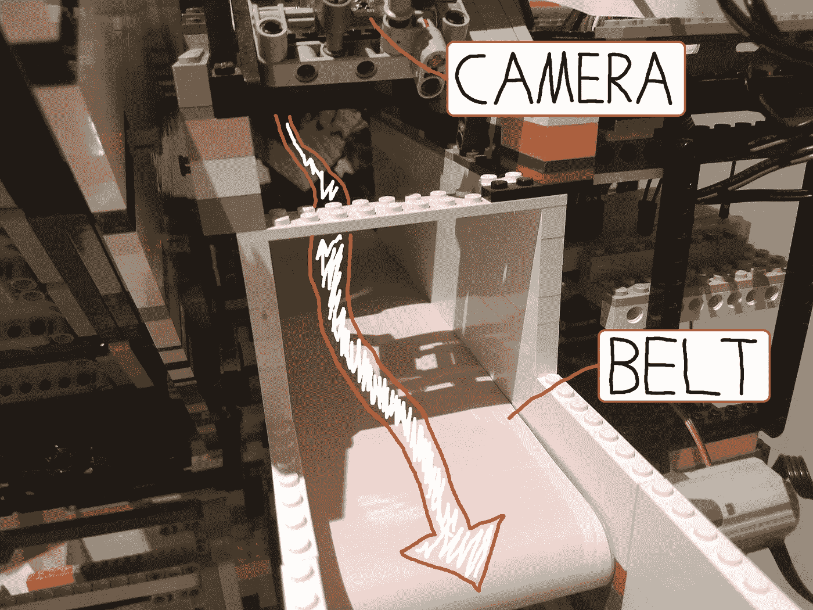
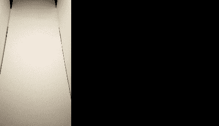
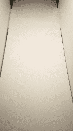
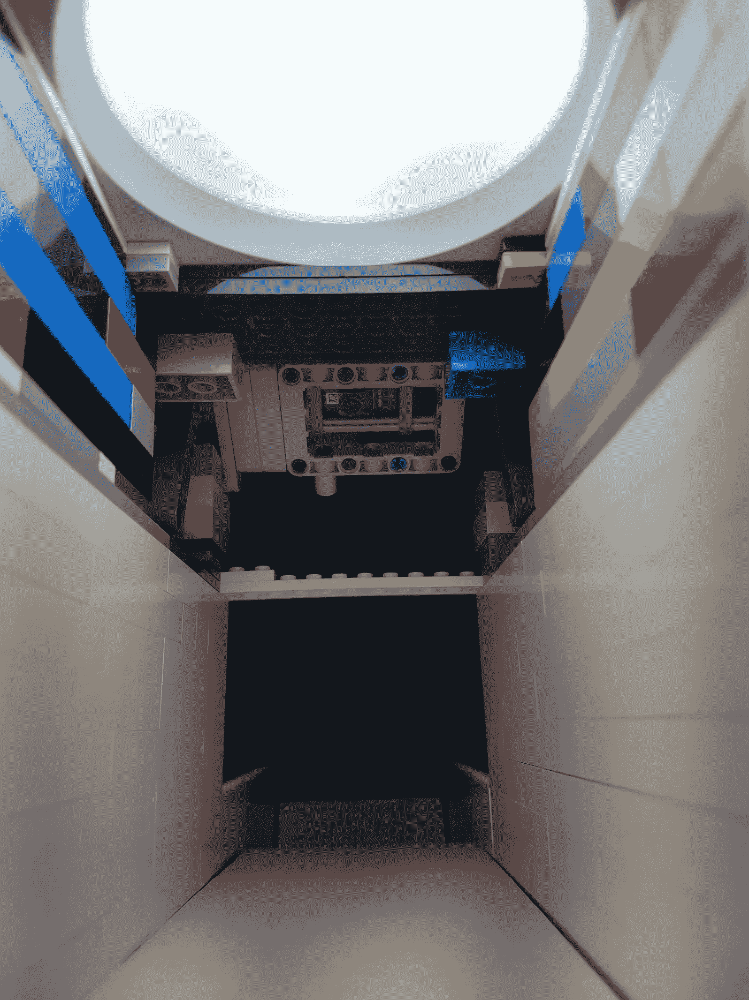
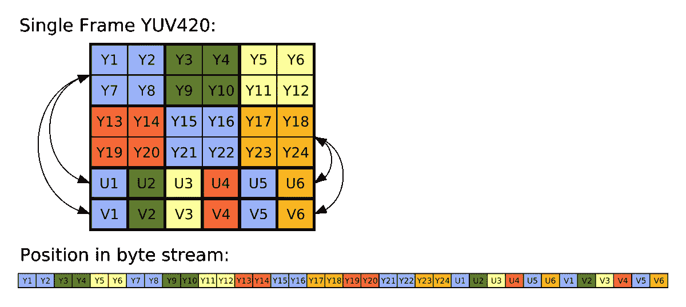
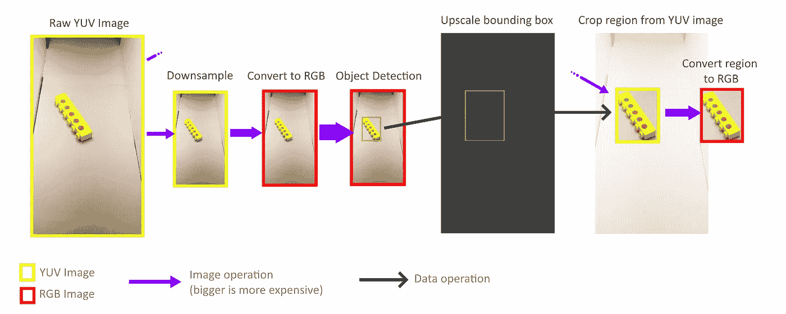

# 用于通用乐高分拣机的高速计算机视觉流水线

> 原文：<https://towardsdatascience.com/a-high-speed-computer-vision-pipeline-for-the-universal-lego-sorting-machine-253f5a690ef4?source=collection_archive---------6----------------------->

在过去的几年里，我一直在设计和制造一台可以识别和分类乐高积木的机器。该机器的一个关键部分是**捕获单元**——这是一个小型的大部分封闭的腔室，具有一条皮带、一盏灯和一台相机。

You’ll see the light a bit later.

相机拍摄沿着传送带移动的乐高零件的照片，然后将零件的图像无线发送到服务器，服务器运行人工智能算法，从数千个可能的乐高元素中识别出零件。我将在未来的文章中提供更多关于人工智能算法本身的细节，但本文将致力于相机的原始视频输出和神经网络输入之间的处理。

我需要解决的核心问题是将皮带的实时视频流转换为神经网络可以使用的各个部分的图像。

The final goal: Go from raw video (left) to a bunch of uniformly sized images (right) to send to the neural network. (Gif is slowed down to about 50% speed vs realtime)

这是一个很好的例子，这个问题表面上看起来很简单，但实际上存在许多独特而有趣的障碍，其中许多是计算机视觉平台所特有的。

以这种方式提取图像的相关部分通常被称为“对象检测”。这正是我需要做的:检测对象的存在，它们的位置和大小，这样我就可以为每一帧的每一部分生成**边界框**。

The key is to find good bounding boxes (shown in green)

我将讨论解决方案的三个方面:

*   通过消除无关的变量来为自己的成功做准备
*   从简单的 CV 操作中构建管道
*   在有限的 Raspberry Pi 平台上保持良好的性能

## 消除无关变量

对于类似这样的问题，在尝试应用计算机视觉技术之前，最好尽可能多地消除变量。例如，我不想关心环境条件、不同的相机位置或由于遮挡造成的信息丢失。如果有必要，在软件中解决所有这些变量是可能的(如果非常困难),但幸运的是，我正在从头开始设计这台机器——我可以在编写任何代码之前通过删除这些变量来为自己的成功做准备。

第一步是强制固定相机位置、角度和焦点。很简单，装备把摄像机锁定在腰带上方。我也不需要担心遮挡；不想要的物体不太可能开始进入捕获单元。稍微难一点，但非常重要的是，强制**一致的照明条件**。我不希望我的物体探测器错误地将路人的影子解读为物理物体。对于许多计算机视觉应用来说，加强照明是非常困难或不可能的。谢天谢地，捕捉单元超级小(相机的整个视野比一条面包还小！)所以我对环境有了超乎寻常的掌控力。

View from inside the capture unit. The camera is in the top third of the frame.

一种选择是将盒子完全封闭，这样外部环境的光线就无法进入。我试过这个，用 LED 灯带做光源。不幸的是，它非常棘手——外壳上的一个小洞和光线可以涌入，干扰任何物体检测。
最后，最好的解决方案是通过彻底爆破充满光线的小房间来“战胜”其他光源。事实证明，这种可以照亮整个房间的灯非常便宜，使用起来也很简单。

Take that, shadows!

当光线射进这个小房间时，它远远压倒了任何潜在的干扰。作为一个令人高兴的副作用，这种丰富的光线意味着相机可以使用非常快的快门速度，拍摄零件的完美清晰的图像，即使它们沿着传送带跑。

## 物体检测器

那么，我如何把这个漂亮的、持续发光的视频变成有用的边框呢？如果你是一名人工智能从业者，你可能会建议实现一个对象检测神经网络，像 [YOLO](https://www.cv-foundation.org/openaccess/content_cvpr_2016/papers/Redmon_You_Only_Look_CVPR_2016_paper.pdf) 或[更快的 R-CNN](https://arxiv.org/abs/1506.01497) 。这些神经网络可以轻松实现这个目标。不幸的是，我在一个 [Raspberry pi](https://www.raspberrypi.org/) 上运行对象检测代码。即使是高端计算机也很难以我需要的大约 90FPS 的帧率运行这些卷积神经网络。没有任何方式，一个树莓派，缺乏任何人工智能兼容的 GPU 硬件，将能够运行这些人工智能算法之一的超级精简版本。我可以将视频从 Pi 流式传输到另一台计算机，但实时视频流非常麻烦，延迟和带宽限制都会导致严重的问题，尤其是在需要高数据速率的情况下。

YOLO is really cool! But I don’t need all this functionality.

幸运的是，我可以通过寻找“老派”计算机视觉技术来避免复杂的人工智能解决方案。第一个是**背景减除**，它试图突出显示图像中正在变化的任何部分。在我的例子中，摄像机看到的唯一移动的东西是乐高零件。(皮带当然在移动，但是因为它有统一的颜色，所以看起来不会向摄像机移动)。把那些乐高零件从背景中分离出来，我就成功了一半。

为了使背景减法起作用，前景物体必须与背景有很大不同才能被提取出来。乐高零件有各种各样的颜色，所以我需要非常明确地选择背景颜色，尽可能不像乐高。这就是为什么相机下面的带子是由纸制成的——不仅需要非常均匀，而且不能由乐高制成，否则它会与它需要识别的一些砖块颜色相同！我选择了淡粉色，但任何其他不同于普通乐高颜色的柔和颜色都可以。

精彩的 OpenCV 库内置了许多背景减除算法。MOG2 背景减法器是最复杂的，运行速度惊人，甚至在树莓 pi 上也是如此。然而，将视频帧直接馈送到 MOG2 并不十分有效。浅灰色和白色的作品在亮度上与苍白的背景过于相似，会丢失。我需要一种方法，通过告诉背景减法器更仔细地查看*颜色*而不是*亮度*来更清楚地区分皮带和皮带上的东西。我所需要做的就是在将图像传递给背景减法器之前增加图像的饱和度。结果大大改善了。

在背景减除之后，我需要使用形态学操作来消除尽可能多的噪声。OpenCV 的 findContours()功能可用于查找白色区域的轮廓。在应用了一些基于轮廓面积的启发式方法来丢弃包含噪声的轮廓之后，将这些轮廓转换成最终的边界框是一个简单的过程。

## 表演

神经网络是一头饥饿的野兽。为了获得尽可能好的分类结果，需要尽可能多的高分辨率图像。这意味着我需要以很高的帧速率拍摄，同时还要保证图像质量和高分辨率。我将把相机和树莓图形处理器推到绝对的极限。极其详尽的 picamera 文档显示，V2 相机芯片可以以每秒 90 帧的最高速度输出 1280x720 像素的图像。这是一个令人难以置信的数据量，即使相机可以生成它，也不意味着计算机可以处理它。如果我处理的是原始的 24 位 RGB 图像，那就需要大约 237 MB/s 的带宽，对于可怜的 Pi 的 GPU 或 SDRAM 来说太多了。即使使用 GPU 加速的 JPEG 压缩，90fps 也是不可能实现的。
raspberry pi 摄像机能够输出未经过滤的原始“YUV”图像。尽管 YUV 比 RGB 更难处理，但它实际上有很多很好的属性。最重要的是，它每像素只有 12 位(相对于 RGB 的 24 位)。

Every 4 ‘Y’ bytes has one ‘U’ and one ‘V’ byte — that comes out to 1.5 bytes per pixel.

这意味着我可以处理两倍于 RGB 帧的 YUV 帧，甚至不考虑 GPU 否则将不得不花费编码 RGB 图像的额外时间。
上面对实际的处理管道设置了一些非常独特的限制。对全尺寸视频帧的大多数操作都将是内存和 CPU 密集型的。在我严格的时间限制内，即使解码一个全尺寸的 YUV 帧也是不可能的。

幸运的是，我实际上不需要处理整个帧！对象检测不需要精确的边界框，只需要相当接近即可，因此整个对象检测流水线可以在小得多的调整大小的帧上完成。缩小操作不需要考虑全尺寸帧中的所有像素，因此，只要小心，可以非常快速且廉价地调整帧的大小。然后，生成的边界框被按比例放大，并用于从全尺寸 YUV 帧中取出裁剪部分。这样，我永远不需要解码或处理整个高分辨率帧。

幸运的是，由于这种 YUV 格式的存储方式(见上文)，实现直接在 YUV 格式上工作的快速裁剪和缩小操作实际上非常容易。最后，整个管道可以在 Pi 的 4 个内核上多线程化，而不会有太多麻烦(您确实需要在后台减法步骤周围设置一个锁)。然而，我发现并非所有内核都得到充分利用，这表明瓶颈仍然是内存带宽。即便如此，我在实践中也能达到 70-80 fps。更深入的内存使用分析可能会进一步加快速度。

如果你有兴趣了解更多关于这个项目的信息，可以看看我以前的文章，[我是如何创造了超过 100，000 个标记的乐高训练图像](/how-i-created-over-100-000-labeled-lego-training-images-ec74191bb4ef)。

你可以在推特上关注我: [@JustASquid](http://twitter.com/JustASquid)