# 混合密度网络搭便车指南

> 原文：<https://towardsdatascience.com/a-hitchhikers-guide-to-mixture-density-networks-76b435826cca?source=collection_archive---------5----------------------->

## 评估预测的不确定性是商业决策的基础。混合密度网络帮助你更好地理解你在现实世界中面临的不确定性。

Photo by [Adi Goldstein](https://unsplash.com/@adigold1?utm_source=medium&utm_medium=referral) on [Unsplash](https://unsplash.com?utm_source=medium&utm_medium=referral)

# 介绍

不确定性是我们做出每个决定的关键因素。然而，在商业中，经理们经常会面临各种各样不可预见的后果。经理可能会处理以下问题:

*   "我们如何根据产品属性为 XYZ 定价？"
*   "这个广告会带来多少网站访问量？"
*   "顾客 Z-A137 的预期顾客终身价值是多少？"
*   "考虑到市场形势，我们应该在广告上花多少钱？"

这些问题中的每一个都意味着一个决策，这个决策最好是充分知情的，并且考虑(或者至少承认)潜在的不确定性。例如:错误的定价会导致收入减少，这反过来可能会导致节约成本的必要性。

Photo by [rawpixel](https://unsplash.com/@rawpixel?utm_source=medium&utm_medium=referral) on [Unsplash](https://unsplash.com?utm_source=medium&utm_medium=referral)

这篇文章面向*面向业务的数据科学受众*。我们将探讨一些关于预测连续值的技术问题，以及众所周知的线性模型在某些情况下的局限性。然后，我们展示了一种称为混合密度网络(MDN)的神经网络变体，以规避这些限制。因此，管理者可以更好地理解预测的潜在不确定性。

前面提出的问题需要预测，并且有三个共同的基本特征。**第一个**是，我们希望预测一个连续的数量(价格、网站访问量、销售额，你能想到的)。**第二个**，预测是在不确定性下做出的。因此，我们很想了解一下我们对预测的不确定性。**第三**，预测取决于一些输入观察(产品属性、客户、广告设计)。理想情况下，我们不希望得到问题的单一答案，而是希望得到一系列答案来评估每个答案的概率。简而言之:我们正在寻找一个**概率分布**在给定输入的答案范围内。因此，我们增强了对预测的理解，甚至可以作为经理或客户做出更明智的决策。

# **高斯混合的直觉**

举个例子:让我们假设，我们将要预测一个产品的价格，比如说耳机。看一下市场价格的柱状图，我们推断出存在低价位(～30 美元)、中位(～60 美元)和高价(～120 美元)的耳机。回归到简单的高斯分布来模拟数据注定会失败，从经验高斯分布的曲线可以很容易地看出这一点。请记住，高斯正态分布(𝒩)由两个值参数化:均值(μ)和标准差(σ)。根据样本平均值(μ=47.95)和标准差，将𝒩拟合到数据中。偏差(σ=27.76)将概率分配给价格区域，这是我们在虚拟市场中观察不到的(即价格在$90 到$110 之间)。此外，根据曲线的左侧，**负的**价格是“合理的”。

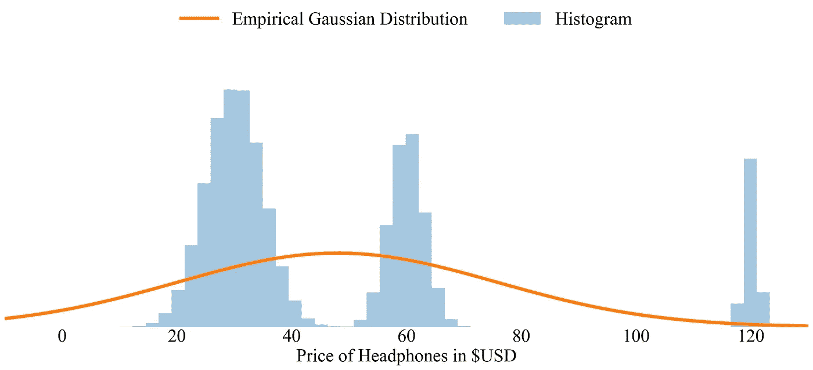

Source: Author

产生价格分布的基础数据是高斯混合的。混合物是多峰的；因此，它表现出多个“峰值”。为了适应我们虚构的定价数据的分布，我们可以使用不是一个，不是两个，而是三个充分混合的高斯分量。我们“只”需要选择参数(μ，σ)，通过加权(⍺)归一化分布，并对它们求和(稍后将详细介绍)。如下图所示，巧妙地混合这些组件反映了真实的数据。

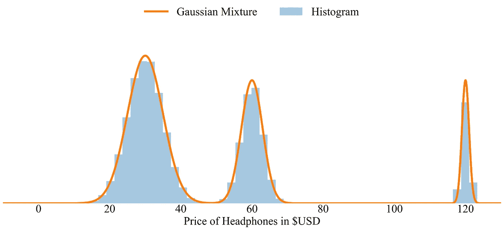

Source: Author

我们将在后续章节中使用 tensor flow(【www.tensorflow.org】)及其扩展 tensor flow-Probability([【www.tensorflow.org/probability】](http://www.tensorflow.org/probability))。该示例是在 Tensorflow Probability 中使用下面代码片段中显示的值生成的。我们基本上定义了同一个族的混合分布。

# **线性回归的假设**

本文开头提出的问题的第一个解决方案确实是执行一个简单的线性回归。我们几乎可以听到你在打哈欠。

但是等等，我们会给它一个简短的技术镜头！给定一个输入向量 **x** (产品属性、客户……等等)**，**我们希望预测 *y* (价格、网站访问量……等等)。更准确地说:我们的目标是在给定**x**:*p(y |***x***)的情况下获得 *y* 的概率。*如果我们假设实值目标数据的高斯分布(正如我们通常所做的，当我们最小化平方误差时)，那么*p(y |***x***)*采用众所周知的形式:

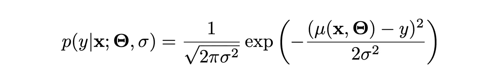

在实际应用中，对于某数据集𝔻.中的所有( **x** 、**t15】*y*)对，给定 **x** 、其参数**θ**和目标值 *y* ，我们最小化线性函数μ的输出的平方误差项(μ( **x** 、**θ**-*y*)在给定数据和参数的情况下，学习函数实质上“吐出”了高斯分布μ( **x** ，**θ**)的条件均值。它扔掉了性病。偏差和归一化常数，不依赖于**θ**。通过这样做，该模型强加了多个重要的假设，这些假设在实践中可能非常有限:**

1.  数据分布是高斯分布。引用[1]:
    *“实际的机器学习问题往往可以有显著的非高斯分布”*(第 272 页)。
2.  产出分布是单峰的。因此，我们无法解释 **x** 可以产生多个有效答案的情况，而多模态分布可以捕获这些答案(如上面的耳机示例)。
3.  性病。假设噪声分布的偏差σ为常数，因此一定不依赖于 **x** (同质性，各向同性协方差矩阵)。同样，在现实世界中情况并不总是如此。
4.  函数μ( **x** ，**θ**)是线性的，即μ( **x** ，**θ**)=**x**×**w**+*b***，**其中**θ**= {**w**，*b* 线性模型被广泛认为更容易解释。另一方面，神经网络提供了极好的预测能力，因为它们理论上能够模拟任何函数。

让我们考虑两种情况，这两种情况形象地激发了先前概述的技术问题:

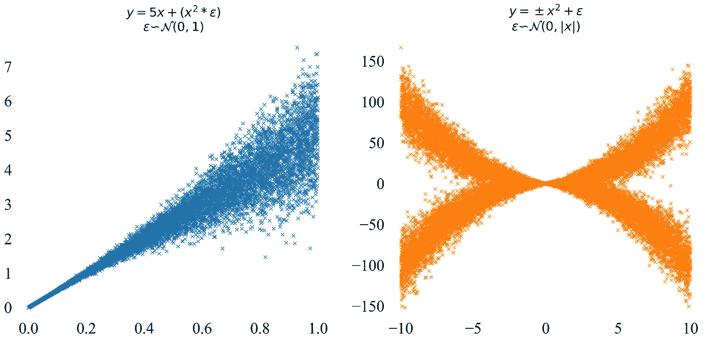

Source: Author

(LHS):基本函数是线性的。然而，我们观察到两个违反:**首先是**，std。(噪声)分布的偏差不是常数。**其次**，噪声确实取决于输入。

(RHS):不仅是性病。噪声分布的偏差取决于 **x** ，但是输出额外为**非线性**。此外，输出分配是**多模态**。对于某些数据区域(大约 8)，简单平均值不是一个合理的解决方案。当我们要预测遵循如此复杂模式的结果时，强加先前概述的假设可能容易误导。

# MDN 的背景

考虑到上述限制，[2]建议通过 DNN 对混合分布进行参数化。MDN 最初构想于 1994 年[1] [2]，最近发现了一系列不同的应用。比如:苹果 iOS 11 中的 Siri 使用 MDN 进行语音生成[3]。Alex Graves 使用 MDN 结合 rnn 来生成人工笔迹[4]。此外，还有多个博客帖子专门讨论这个主题[5] [6] [7] [8]。Amazon Forecast 为其客户提供 MDN 作为算法[9]，而[10]写了一篇关于这个主题的硕士论文。

然而，我们希望为**更广泛的受众**建立方法。原因很简单，许多现代神经网络架构可以扩展为 MDN(Transformer、LSTMs、CovNets 等)。MDNs 本质上可以被视为一个扩展模块，适用于各种各样的业务相关任务。

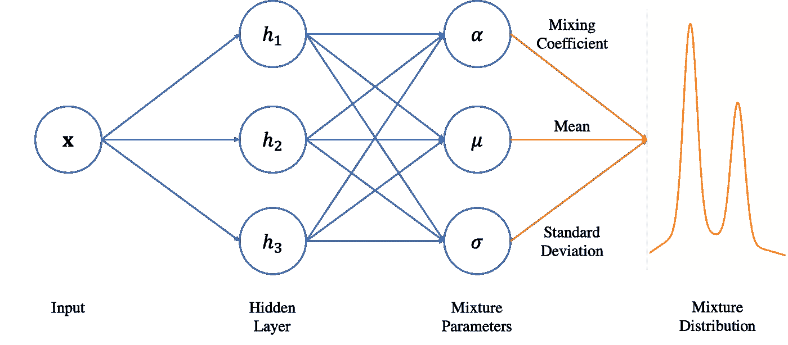

Source: Author

在其核心，MDN 的概念是简单的，直截了当的，有吸引力的:**结合了深度神经网络(DNN)和混合分布。**DNN 为多个分布提供参数，然后通过一些权重进行混合。这些砝码也由 DNN 提供。由此产生的(多模态)条件概率分布有助于我们对现实世界数据中的复杂模式进行建模。因此，我们能够更好地评估，我们预测的某些值有多大的可能性。

# **混合模型的形式化**

理论上，高斯混合能够模拟任意概率密度[2]，如果它被充分参数化(例如，给定足够的分量)。形式上，混合物的条件概率定义为

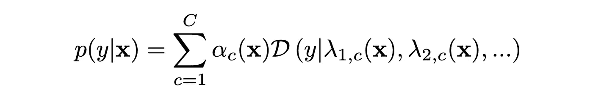

让我们分别阐述每个参数:

*   *c* 表示相应混合物成分的指数。每个输出最多有 *C* 个混合成分(即:分布)，这是一个用户可定义的超参数。
*   ⍺表示混合参数。将混音参数想象成滑块，以不同的强度将不同的音频信号混合在一起，产生更丰富的输出。混合参数取决于输入 **x** 。
*   𝒟是要混合的相应分布(音频信号)。可以根据任务或应用来选择分布。
*   λ表示分布𝒟.的参数如果我们将𝒟表示为高斯分布，λ1 对应于条件均值μ( **x** )，λ2 对应于条件标准差。偏差σ( **x** )。分布可以有多个参数(例如:Bernoulli 和 Chi2 有一个参数，Gaussian 和 Beta 有两个参数，截断的 Gaussian 最多有四个参数)。**这些是神经网络输出的参数。**

将条件概率公式化为分布的混合已经解决了与概述的假设相关的多个问题。**首先**，分布可以是任意的，因为我们理论上能够将每个分布建模为高斯分布的混合物[2]。**其次**，使用多种分布有助于我们对多模态信号进行建模。考虑我们的耳机价格例子，这显然是多模态的。**第三，**性病。偏差现在以输入为条件，允许我们考虑变量 std。偏差。即使我们只使用单一的高斯分布，这个优势也适用。**第四个**，函数的线性问题可以通过选择一个非线性模型来解决，该模型决定了输入的分布参数。

为了获得混合物的参数，DNN 被修改以输出**多个参数向量**。我们从单层 DNN 和 ReLU 激活开始。使用隐藏层 h1( **x** )，我们继续计算混合物的参数如下:

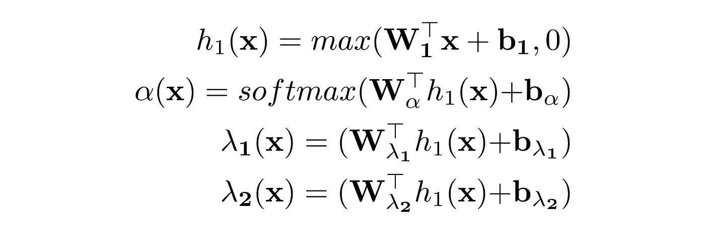

混合系数必须**总和为 1**:∑⍺(**x**)= 1。因此，我们使用 softmax 函数来约束输出。这一步很重要，因为概率的混合必须整合为一。λ1 和λ2 的约束本身取决于我们为模型选择的分布。我们必须对高斯函数施加的唯一约束是。偏差为
σ( **x** ) > 0。这种效果可以通过多种方式实现。例如，我们可以使用最初由 Bishop [1] [2]提出的指数激活。然而，指数会导致数值不稳定。或者，我们可以使用简单的 softplus 激活，类似于[11]中使用的 oneplus 激活。或者我们采用一种有偏移的 ELU 激活的变体。由于最近 ELU 的突出，我们选择了后者。因此，我们最终完成了以下转换:

约束条件的选择取决于分布和数据。一如既往:不同的约束可能在不同的数据集上表现得更好。有人甚至会说，从商业角度来看，将μ( **x** )限制为正值也是明智的。因此，我们可以认为负价格是不可能的。

既然我们现在指定了参数和条件概率，我们就有了使用某种形式的梯度下降(SGD、Adagrad、Adadelta、Adam、RMSProp 等)直接最小化平均负对数似然(NLL)所需的一切。).

# 千年发展目标的实施

> **代码在**[**Github**](https://github.com/oborchers/Medium_Repo)**/**[**Colab**](https://colab.research.google.com/drive/1at5lIq0jYvA58AmJ0aVgn2aUVpzIbwS3)**上有。**

建立了 MDN 的基本理论后，我们现在展示如何在 Tensorflow/Keras 中实现该模型。我们基本上需要两个组件:计算参数的自定义层和最小化的损失函数。出于数值稳定性和方便性的原因，我们将在张量流函数中进行大部分计算。正如我们之前强调的 MDN 框架的灵活性一样，我们并没有讨论所有的内容，而是讨论了与您构建自己版本的 MDN 框架相关的部分。定义 DNN 很简单:

根据数据和应用，对 sigmas 进行额外的活动调整以防止 std 也可能是有意义的。偏离炸毁。简单的 L2 正则化将是一个明智的选择。

代码示例需要一个“非负指数线性单位”激活函数，确保 sigmas 严格大于零。Tensorflow 提供了一种非常友好的方式来定义所需的激活函数。我们只是让 nnelu 成为一个可调用的函数，并在 Keras 中将其注册为自定义激活函数。

剩下的构建模块是损失函数的实现。Tensorflow-Probability 的应用很方便，因为我们只是稍微重新定义了本文开头的例子。MixtureSameFamily 需要混合分布和组件分布。前者是一个简单的分类分布，它得到混合权重⍺( **x** 。后者是正态分布，由平均值和标准差参数化。偏差。随后，我们只需计算 *y* 及其负平均值的对数似然。通过回归到张量流概率，我们避免了数值上溢/下溢(手动实现这一点实际上相当棘手)。

在定义了 MDN 最重要的组件之后，只剩下模型的编译了。

# 模拟数据的应用

是时候回到我们之前的例子了。我们训练具有两层的简单 MDN，每层 200 个神经元，并且在线性数据集上有一个**高斯分量。MDN 显示了它的实力:由于调节性病。输入上分布的偏差，MDN 可以适应底层数据分布的变化。它巧妙地捕捉到了线性趋势(如预期的那样)，但调整了标准差。根据数据中存在的不确定性的增加而产生的偏差(我喜欢这个图表。看起来像流星)。**

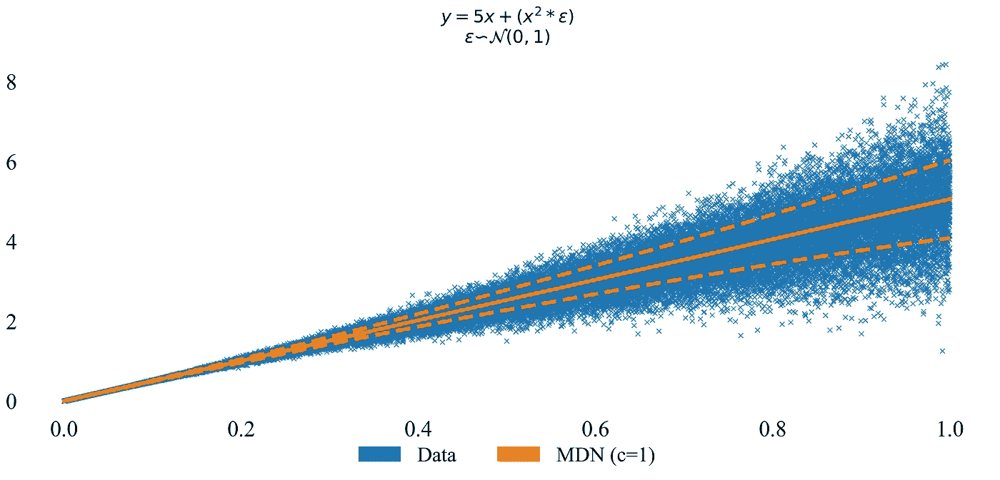

Source: Author

为了更好地掌握结果，我们还对几个模型的平均负对数似然进行了比较。也就是说，让我们看看零模型(样本均值和样本标准差。偏差)、线性模型(线性条件均值和样本标准差。偏差)、DNN(非线性条件均值和样本标准差。偏差)和 MDN(非线性条件均值和非线性条件标准差)。偏差)。DNN 和 MDN 使用相同的参数和训练程序。幸运的是，我们可以使用 Tensorboard 监控 MDN 的训练进度。所要做的就是回调 fit 例程。因此，我们不需要费心单独存储训练损失。我们正在汇合！

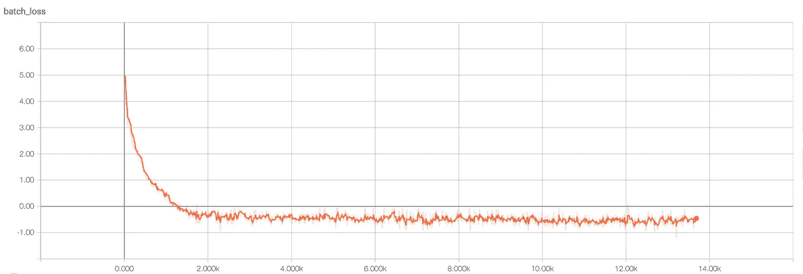

MDN nll-loss during optimization. Source: Author

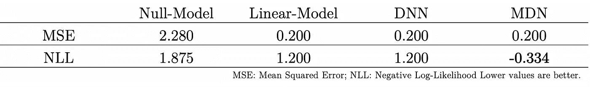

Source: Author

所有模型都能够击败零模型。其余模型在 MSE 方面表现相同，因为 MSE 假设 std。基础分布的偏差是常数。我们无法充分捕捉数据的行为！NLL 包含了 std。偏差，确实反映了一个更微妙的画面。由于基础函数是线性的，因此 DNN 和线性模型的性能相当。然而，MDN**能够更好地适应数据分布**，从而产生最低的 NLL 值。

为了从单个数据点的 MDN 的概率密度中导出条件均值，可以计算:

看一下这个公式就可以解释这个结果:平均值没有包含标准差。偏差σ( **x** )。仅仅查看 MDN 的含义就丢弃了有价值的信息，而这些信息在现实世界的应用程序中可能是需要的。有了这种分布，我们就可以计算更精细的数量。例如，香农熵可以作为我们有多确定的指标。或者我们可以计算 f-散度来评估，预测有多相似。

现在让我们转向第二个非线性的例子。我们首先使用最小-最大缩放器将 *y* 转换为 DNN / MDN 的合理范围，以加速学习。

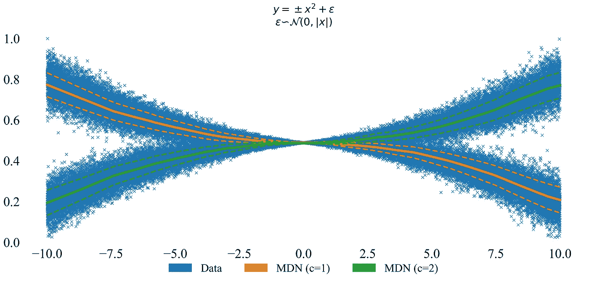

Source: Author

MDN 不仅能捕捉潜在的非线性，还能捕捉输出的多模态和标准差的变化。偏差。数据生成分布被充分捕获。查看 **x** = 8 的条件密度，我们看到 MDN 产生两个不相交的峰值:

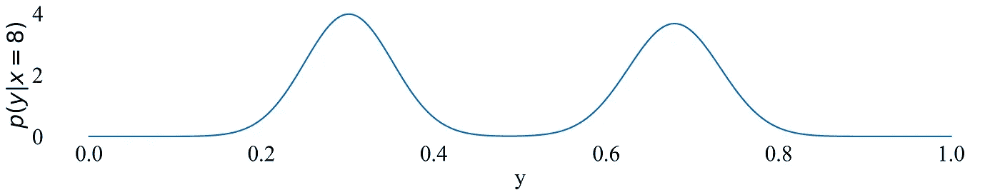

Source: Author

对这些复杂分布建模的能力反映在 NLL 中，MDN 在 NLL 中取得了最好的效果。

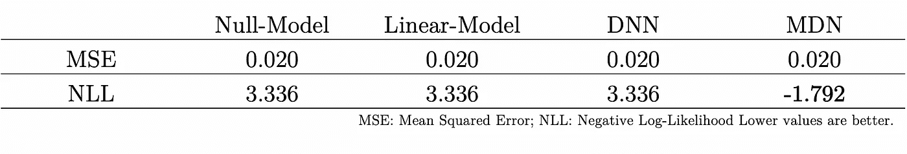

Source: Author

# 真实世界数据的应用

我们以预测价格的例子开始这篇文章。在冗长的技术阐述之后，让我们回到最初的例子:预测价格。

为了便于分析，我们使用数据集的果蝇:波士顿住房。给定大约 13 个独立变量，目标是预测以 1000 美元为单位的自有住房的中值(MDEV)。这个例子可能没有充分利用 MDNs 的能力来建模多模态分布。尽管如此，它显示了 MDN 如何能够模拟价格的不确定性。自变量使用最小-最大缩放器进行转换，而价格则进行对数转换。

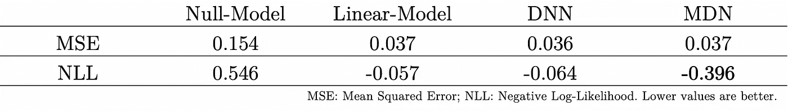

Source: Author

在 NLL 中，我们观察到与前面的例子类似的行为。MDN 能够更好地处理数据。因此，虽然我们在例子中可能没有多模态，但我们肯定受益于**对完整条件概率**的建模，而不仅仅是点估计。

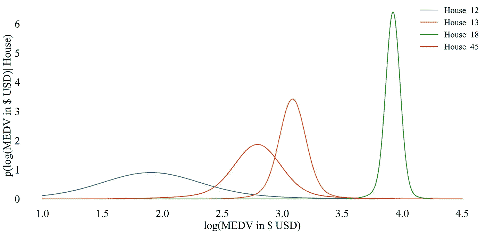

Source: Author

分析不同房屋的条件密度有助于我们更好地做出决定。我们对 18 号房的高价相当有信心，因此，作为管理者，我们可以相应地设定价格。

对 12 号房的预测很不确定。可能需要人类专家直接评估案例来设定价格。

房子 13 和 45 在价格上确实重叠。直接分析它们的属性是有意义的，以查看它们是否可以作为相同价格范围内的买家感兴趣的对象。虽然我们没有在这个简单的数据集中挖掘模型的全部潜力，但我们仍然从附加功能中受益。

# 摘要

评估不确定性是现代企业的一个重要方面。这篇博文重点介绍了理论推理、实现细节以及使用 MDN 时的一些技巧和诀窍。我们展示了 MDN 在模拟和实际应用中的能力。由于它的简单性和模块化，我们期待广泛的应用。

如有疑问，欢迎联系 [me](mailto:borchers@bwl.uni-mannheim.de) 。

## 附加说明

> **代码在**[**Github**](https://github.com/oborchers/Medium_Repo)**/**[**Colab**](https://colab.research.google.com/drive/1at5lIq0jYvA58AmJ0aVgn2aUVpzIbwS3)**上有。**本指南是为 Tensorflow 1.12.0 和 Tensorflow-Probability 0.5.0 编写的。

## 文学

[1] Christopher M. Bishop，[模式识别与机器学习](http://users.isr.ist.utl.pt/~wurmd/Livros/school/Bishop%20-%20Pattern%20Recognition%20And%20Machine%20Learning%20-%20Springer%20%202006.pdf) (2006)

[2]克里斯托弗·m·毕晓普，[混合密度网络](https://publications.aston.ac.uk/373/1/NCRG_94_004.pdf) (1994)

[3] Siri 团队，[Siri 语音的深度学习:用于混合单元选择合成的设备上深度混合密度网络](https://machinelearning.apple.com/2017/08/06/siri-voices.html) (2017)

[4] Alex Graves，[用递归神经网络生成序列](https://arxiv.org/pdf/1308.0850.pdf) (2014)

[5] Christopher Bonnett，[Edward，Keras 和 TensorFlow 的混合密度网络](http://cbonnett.github.io/MDN_EDWARD_KERAS_TF.html) (2016)

[6]吴炳浩，[混合密度网络:基础知识](https://ngbinghao.gitlab.io/posts/mixture-density-networks-basics/) (2017)

[7] Otoro，[tensor flow 混合密度网络](http://blog.otoro.net/2015/11/24/mixture-density-networks-with-tensorflow/) (2016)

[8] Mike Dusenberry，[混合密度网络](https://mikedusenberry.com/mixture-density-networks) (2017)

[9]亚马逊，[混合密度网络配方](https://docs.aws.amazon.com/forecast/latest/dg/aws-forecast-recipe-mdn.html) (2019)

[10] Axel Brando，[分布和不确定性估计的混合密度网络实施](https://github.com/axelbrando/Mixture-Density-Networks-for-distribution-and-uncertainty-estimation) (2017)

[11] Alex Graves 等人，[使用具有动态外部存储器的神经网络的混合计算](https://www.nature.com/articles/nature20101.pdf) (2016)

## 放弃

表达的观点仅代表我个人，并不代表我的雇主的观点或意见。作者对本网站内容的任何错误或遗漏不承担任何责任或义务。本网站包含的信息按“原样”提供，不保证完整性、准确性、有用性或及时性。