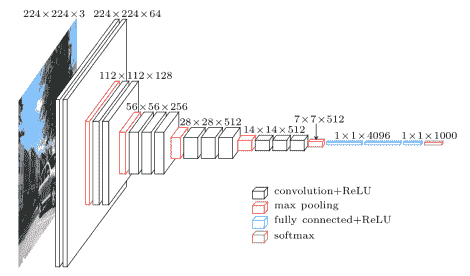

# 为数据科学家揭秘对象检测和实例分割

> 原文：<https://towardsdatascience.com/a-hitchhikers-guide-to-object-detection-and-instance-segmentation-ac0146fe8e11?source=collection_archive---------4----------------------->

The stage we are at and how we reached it.

## 目标检测

## 简单解释！！！我试过了

我非常喜欢深度学习，但对象检测对我来说并不容易。

并且目标检测是重要的并且确实有它的用途。其中最常见的是自动驾驶汽车、医学成像和人脸检测。

这绝对是一个很难解决的问题。在这个问题的漫长历史中引入了如此多的活动部件和新概念，它变得更加难以理解。

这篇文章是关于 ***将那段历史提炼成一个简单的解释*** 并解释对象检测和实例分割的血淋淋的细节。

# 介绍

我们都知道图像分类问题。给定一幅图像，你能找出它属于哪一类吗？

我们可以使用预训练的网络，通过 ConvNets 和[转移学习](https://medium.com/@14prakash/transfer-learning-using-keras-d804b2e04ef8)解决任何新的图像分类问题。

> **作为固定特征提取器的 conv net**。获取一个在 ImageNet 上预训练的 ConvNet，移除最后一个完全连接的层(该层的输出是 ImageNet 等不同任务的 1000 个类分数)，然后将 ConvNet 的其余部分视为新数据集的固定特征提取器。在 AlexNet 中，这将为每个包含分类器之前隐藏层激活的图像计算 4096-D 向量。我们称这些特征为 **CNN 代码**。如果这些代码在 ImageNet 上训练 ConvNet 期间也达到了阈值(通常情况下)，则这些代码被重新赋值(即阈值为零)对性能非常重要。为所有图像提取 4096-D 代码后，为新数据集训练一个线性分类器(如线性 SVM 或 Softmax 分类器)。

但是在图像领域还有很多其他有趣的问题。

[Source](http://cs231n.github.io/transfer-learning/#tf)

这些问题可以分为 4 大类。在接下来的几行中，我将尝试在我们深入探讨之前简要解释这些问题:

1.  **语义分割:** *给定一幅图像，我们能否将每一个像素归类为属于特定的一类？*
2.  **分类+定位:**我们能够将图像分类为一只猫。太好了。*我们是否也可以通过在猫的周围画一个边界框来获得该猫在图像中的位置？*这里我们假设图像中有固定数量的物体(一般为 1 个)。
3.  **物体检测:**一个更一般情况下的分类+定位问题。在真实世界的设置中，我们事先不知道图像中有多少对象。那么我们是否可以检测图像中的所有对象，并在它们周围绘制边界框？
4.  **实例分割:** *我们可以为图像中的每个单独的对象创建遮罩吗？*不同于语义切分。怎么会？如果你看顶部的第四张图片，我们将无法使用语义分割程序区分两只狗，因为它会将两只狗合并在一起。

正如你所看到的，所有的问题都有相似的味道，但彼此又有些许不同。在这篇文章中，我将主要关注**对象检测和实例分割**，因为它们是最有趣的**。我将介绍 4 种最著名的物体探测技术，以及它们是如何随着时间和新想法而改进的。**

# 分类+本地化

因此，让我们首先尝试理解，当图像中只有一个物体时，我们如何解决这个问题。**分类+本地化**案例。

> *💡*把本地化当成回归问题！

[Source](http://cs231n.stanford.edu/slides/2017/cs231n_2017_lecture11.pdf)

## **输入数据**

让我们首先讨论这种模型期望什么样的数据。通常在图像分类设置中，我们使用(X，y)形式的数据，其中 X 是图像，y 是分类标签。

在分类+本地化设置中，我们通常会有(X，y)形式的数据，其中 X 仍然是图像，y 是包含(class_label，X，y，w，h)的数组，其中，

x =边界框左上角的 x 坐标

y =边界框左上角的 y 坐标

w =边界框的宽度，以像素为单位

h =边界框的高度，以像素为单位

## **型号**

所以在这个设置中，我们创建了一个*多输出模型*，它以一个图像作为输入，有(n_labels + 4)个输出节点。n_labels 每个输出类的节点和给出(x，y，w，h)预测的 4 个节点。

## **损失**

通常，损失是 Softmax 损失(来自分类问题)和回归 L2 损失(来自边界框坐标)的加权和。

> 损失=阿尔法*软最大损失+(1-阿尔法)*L2 损失

由于这两个损失将在不同的规模，阿尔法超参数是需要调整的东西。

这里有一件事我想注意一下。我们正在尝试进行对象定位任务，但我们仍然有我们的 convnets 在这里。我们只是增加了一个输出层来预测边界框的坐标，并调整了我们的损失函数。

*而这正是整个深度学习框架的精髓所在——***层层叠加，重用组件来创建更好的模型，创建架构来解决自己的问题** *。这就是我们将会看到的未来。*

# 目标检测

那么这种使用回归的定位思想是如何映射到物体检测的呢？没有。

我们没有固定数量的物体。所以我们不能有 4 个输出来表示边界框坐标。

一个天真的想法可能是将 CNN 应用于图像的许多不同部分。CNN 将每种作物分类为对象类或背景类。这很棘手。你可以创造很多这样的作物。

## 区域提议:

因此，如果有一种方法(通常称为区域建议网络)可以自动为我们找到一些数量较少的裁剪区域，我们就可以在这些区域上运行 convnet 并完成对象检测。这就是 RCNN 背后的基本思想——物体探测的首次重大成功。

这就是选择性搜索(Uijlings 等人，“目标识别的选择性搜索”IJCV，2013)所提供的。

***那么什么是地区提案呢？***

*   找到可能包含物体的*图像区域*
*   *跑起来比较快；例如，选择性搜索在几秒钟内在 CPU 上给出 2000 个区域建议*

*那么，地区提案究竟是如何提出的呢？*

## *[目标识别的选择性搜索](http://www.huppelen.nl/publications/selectiveSearchDraft.pdf):*

*本文分两步寻找区域。*

*首先，我们使用[13] (P. F. Felzenszwalb 和 D. P. Huttenlocher)从一组初始区域开始。[高效的基于图形的图像分割](http://people.cs.uchicago.edu/~pff/papers/seg-ijcv.pdf)。IJCV，59:167–181，2004 年。1, 3, 4, 5, 7)*

> *基于图的图像分割技术通常用图 G = (V，E)来表示该问题，其中每个节点 v ∈ V 对应于图像中的一个像素，E 中的边连接某些相邻像素对。*

*在本文中，他们采用了一种方法:*

> *每个边(vi，vj )∈ E 具有相应的权重 w((vi，vj))，其是相邻元素 vi 和 vj 之间的相似性的非负**度量。在基于图的方法中，分段 S 是将 V 划分成多个分量，使得每个分量(或区域)C ∈ S 对应于图中的一个连通分量。***

**

*[Efficient graph-based Image Segmentation](http://people.cs.uchicago.edu/~pff/papers/seg-ijcv.pdf) Example*

****简而言之，他们使用基于图形的方法来寻找图像中的连通成分，并根据像素之间的某种相似性度量来制作边缘。****

*正如你所看到的，如果我们在这些遮罩周围创建边界框，我们将会丢失很多区域。我们希望将整个棒球运动员放在一个边框中。我们需要以某种方式将这些初始区域分组。这是第二步。*

*为此，[对象识别的选择性搜索](http://www.huppelen.nl/publications/selectiveSearchDraft.pdf)的作者将分层分组算法应用于这些初始区域。在这种算法中，他们根据不同的相似性概念(基于颜色、纹理、大小和填充)将最相似的区域合并在一起，为我们提供更好的区域建议。*

****

*The Algorithm for region Proposal used in RCNN*

# *1.R-CNN*

*所以现在我们有了我们的区域提案。在 R-CNN 中我们到底该如何使用它们？*

**

> *物体检测系统概述。我们的系统*
> 
> *(1)获取输入图像，(2)提取大约 2000 个自下而上的区域提议，(3)使用大型卷积神经网络(CNN)计算每个提议的特征，然后(4)使用特定类别的线性 SVM 对每个区域进行分类。*

*除此之外，作者还使用了特定于类的边界框回归器，它采用:*

*输入:(Px，Py，Ph，Pw)-建议区域的位置。*

*目标:(Gx，Gy，Gh，Gw)-该区域的地面实况标签。*

*我们的目标是学习一种将建议区域(P)映射到地面真实框(G)的变换*

## *培训 R-CNN*

*RCNN 的输入是什么？*

*因此，我们从 RPN 战略和标签的基本事实(标签、基本事实框)中获得了一个图像、区域建议*

*接下来，我们将所有 IoU(交集/并集)与基础事实框重叠≥ 0.5 的区域提议视为该框类的正面训练示例，其余视为负面训练示例。我们训练班级特定的 SVM 氏症*

*因此，每个地区的提案都成为一个培训范例。并且 convnet 给出该区域提议的特征向量。然后，我们可以使用特定于类的数据来训练我们的 n-SVM。*

## *测试时间 R-CNN*

*在测试时，我们使用特定于类的支持向量机来预测检测盒。在测试的时候，我们会得到很多重叠的检测框。因此，非最大抑制是对象检测流水线的组成部分。*

*首先，它根据分数对所有检测框进行分类。选择具有最大分数的检测框 M，并且抑制与 M 有显著重叠(使用预定阈值)的所有其他检测框。*

*这个过程递归地应用于所有剩余的框，直到我们只剩下好的边界框。*

**

*[https://www.pyimagesearch.com/wp-content/uploads/2014/10/hog_object_detection_nms.jpg](https://www.pyimagesearch.com/wp-content/uploads/2014/10/hog_object_detection_nms.jpg)*

## *RCNN 的问题:*

*   *训练很慢。*
*   *推断(检测)慢。使用 VGG16 时每幅图像 47s——因为需要多次运行 Convnet。*

*对速度的需求。这么快 R-CNN。*

# *2.快速 R-CNN*

> **💡*所以来自同一作者的下一个[想法](https://www.cv-foundation.org/openaccess/content_iccv_2015/papers/Girshick_Fast_R-CNN_ICCV_2015_paper.pdf):为什么不创建输入图像的卷积图，然后从卷积图中选择区域？我们真的需要运行这么多网络吗？我们可以只运行一个 convnet，然后对 convnet 计算的特征应用区域建议裁剪，并使用简单的 SVM/分类器对这些裁剪进行分类。*

*类似于:*

**

> *来自[论文](https://www.cv-foundation.org/openaccess/content_iccv_2015/papers/Girshick_Fast_R-CNN_ICCV_2015_paper.pdf):图为快速 R-CNN 架构示意图。快速 R-CNN 网络将整个图像和一组对象提议作为输入。网络首先用几个卷积(conv)和最大汇集层处理整个图像，以产生 conv 特征地图。然后，对于每个对象提议，感兴趣区域(RoI)池层从特征图中提取固定长度的特征向量。每个特征向量被馈入一系列全连接(fc)层，这些层最终分支成两个兄弟输出层:一个层产生 K 个对象类加上一个包罗万象的“背景”类的 softmax 概率估计，另一个层为 K 个对象类中的每一个输出四个实数值。每组 4 个值对 K 个类之一的精确边界框位置进行编码。*

## *💡想法*

*所以 ***的基本思想是在图像中只需运行一次卷积，而不是 R-CNN 中的那么多卷积网络。*** *然后，我们可以使用某种方法映射 ROI 提议，过滤最后一个卷积层，并在其上运行最终分类器。**

*这个想法在一定程度上依赖于所用模型的架构。*

*所以作者提出的架构是:*

> **我们对三个预训练的 ImageNet [4]网络进行了实验，每个网络有五个最大池层和五到十三个 conv 层(有关网络详情，请参见第 4.1 节)。*预训练网络初始化快速 R-CNN 网络时，要经历三次变换。首先，最后一个最大池层由 RoI 池层替换，RoI 池层通过设置 H 和 W 与网络的第一个完全连接层兼容来配置(例如，对于 VGG16，H = W = 7)。第二，网络的最后一个全连接层和 softmax(其被训练用于 1000 路 ImageNet 分类)被替换为之前描述的两个兄弟层(K + 1 个类别上的全连接层和 softmax 以及类别特定的边界框回归器)。第三，网络被修改以接受两个数据输入:图像列表和那些图像中的 ROI 列表。*

*如果你不了解以上内容，也不要担心。这显然有点令人困惑，所以让我们来分析一下。但为此，我们需要先了解 VGG16 架构。*

**

*VGG 16 Architecture*

*最后一个池层是 7x7x512。这是网络作者打算用 ROI 池层来代替的层。该池层获得了作为输入的区域提议的位置(xmin_roi，ymin_roi，h_roi，w_roi)和先前的特征地图(14x14x512)。*

**

*We need fixed-sized feature maps for the final classifier*

*现在 ROI 坐标的位置以输入图像为单位，即 224×224 像素。但是我们必须应用 ROI 合并操作的层是 14x14x512。*

*当我们使用 VGG 时，我们将图像(224 x 224 x 3)转换为(14 x 14 x 512)，即高度和宽度除以 16。我们可以将 ROI 坐标除以 16，映射到特征图上。*

> *在深度上，卷积特征图已经编码了图像的所有信息，同时保持了它相对于原始图像编码的“事物”的位置。例如，如果图像的左上角有一个红色方块，并且卷积层为其激活，则该红色方块的信息仍将位于卷积特征图的左上角。*

*什么是投资回报率池？*

**请记住，最终的分类器会针对每种作物运行。所以每种作物都需要一样大。这就是投资回报池的作用。**

**

*[Source](https://deepsense.ai/region-of-interest-pooling-explained/)*

*在上图中，我们的区域建议是 x，y，w，h 格式的(0，3，5，7)。*

*我们将该区域划分为 4 个区域，因为我们希望有一个 2x2 的 ROI 池层。我们通过舍入 5/2 和 7/2 将整个区域分成桶，然后只做一个最大池。*

*[你如何在小于目标规模的区域进行投资回报池？](https://stackoverflow.com/questions/48163961/how-do-you-do-roi-pooling-on-areas-smaller-than-the-target-size)如果区域提案大小为 5x5，投资回报池层大小为 7x7。如果发生这种情况，[我们只需将每个单元格复制 7 次，然后最大合并回 7x7，就可以将大小调整到 35x35。](https://stackoverflow.com/questions/48163961/how-do-you-do-roi-pooling-on-areas-smaller-than-the-target-size)*

*在替换了汇集层之后，作者还将 1000 层的 imagenet 分类层替换为全连接层和 K + 1 个类别上的 softmax(对于背景+ 1)和类别特定的边界框回归器。*

## *训练快速神经网络*

*快速 RCNN 的输入是什么？*

*非常类似于 R-CNN:所以我们有一个图像，来自 RPN 策略的区域提议和标签的基本事实(标签，基本事实框)*

*接下来，我们将所有 IoU(交集/并集)与基础事实框重叠≥ 0.5 的区域提议视为该框类的正面训练示例，其余视为负面训练示例。这一次我们在上面有一个密集层，我们使用多任务损失。*

*所以每一个 ROI 都成了训练样本。主要区别在于多任务丢失有一个概念:*

*快速 R-CNN 网络具有两个兄弟输出层。*

*首先输出一个 ***离散概率分布*** (每 RoI)，p = (p0，。。。，pK)，超过 K + 1 个类别。通常，p 由 softmax 通过全连接层的 K+1 个输出来计算。*

*对于 K 个对象类中的每一个，第二兄弟层输出 ***包围盒回归偏移*** ，t= (tx，ty，tw，th)。每个训练 RoI 被标记有基本事实类 u 和基本事实包围盒回归目标 v。我们在每个标记的 RoI 上使用多任务损失 L 来联合训练分类和包围盒回归*

**

*Classification Loss + regression Loss*

*其中，Lcls 是 softmax 分类损失，Lloc 是回归损失。u=0 表示 BG 类，因此，只有当我们有任何其他类的边界框时，我们才会增加损耗。*

## *问题:*

*区域提案仍然占据了大部分时间。我们能否缩短区域提案的时间？*

**

*Runtime dominated by region proposals!*

# *3.快速 RCNN*

*下一个被问到的问题是:网络本身能做区域提议吗？*

> *直觉是:使用 FastRCNN，我们已经在 CNN 中计算了一个激活图，为什么不通过几个层来运行激活图以找到感兴趣的区域，然后通过预测类+ bbox 坐标来完成向前传递呢？*

**

## *区域提案网络如何运作？*

*论文中的一个主要观点是锚的概念。**锚点**是固定的边界框，以不同的大小和比例放置在整个图像中，在首次预测对象位置时将用作参考。*

*所以，首先，我们在图像上定义锚定中心。*

**

*Anchor centers throughout the original image*

*在 VGG16 网络的情况下，锚中心相隔 16 px，因为(14×14×512)的最终卷积层以因子 16(224/14)对图像进行子采样。*

*这是主播的样子:*

**

*Left: Anchors, Center: Anchor for a single point, Right: All anchors*

1.  *所以我们从一些预定义的区域开始，我们认为我们的对象可能带有锚点。*
2.  *我们的区域提议网络(RPN)对哪些区域具有对象和对象边界框的偏移进行分类。使用相同的逻辑完成训练。如果边界框> 0.5 的锚点的 IOU 为 1，否则为 0。*
3.  *减少区域建议的非最大抑制*
4.  *基于建议的快速 RCNN 检测网络*

## *快速 RCNN 损耗*

*然后用 4 个损失联合训练整个网络:*

1.  *RPN 分类对象/非对象*
2.  *RPN 回归框坐标偏移*
3.  *最终分类分数(对象类别)*
4.  *最终框坐标偏移*

## *表演*

**

*Results on VOC Dataset for the three different approaches*

# *实例分割*

*现在是最有趣的部分——实例分割。*我们能为图像中的每个物体创建* **蒙版** *吗？具体来说大概是:**

**

*Some images with masks from the paper*

# *掩模-RCNN*

*同样的作者再次前来救援。基本思想是添加另一个预测遮罩的输出层。并使用 ROIAlign 代替 ROIPooling。*

**

*[Source:](https://medium.com/@jonathan_hui/image-segmentation-with-mask-r-cnn-ebe6d793272) Everything remains the same. Just one more output layer to predict masks and ROI pooling replaced by ROIAlign*

*Mask R-CNN 采用相同的两阶段程序，第一阶段(RPN)相同。*

*在第二阶段，与预测类别和盒子偏移并行，掩模 R-CNN 还为每个 RoI 输出二进制掩模。*

## *ROIAlign 与 ROIPooling*

*在 ROI 合并中，我们会丢失基于位置的准确信息。看看我们是如何将我们的区域任意分成 4 个不同大小的盒子的。对于分类任务来说，它工作得很好。*

*但是对于在像素级别上提供遮罩，我们不想丢失这些信息。因此，我们不会量化池图层，而是使用双线性插值法来找出将提取的要素与输入正确对齐的值。看看 0.8 和 0.88 有什么不同*

**

*[Source](https://medium.com/@jonathan_hui/image-segmentation-with-mask-r-cnn-ebe6d793272)*

## *培养*

*在训练期间，我们将每个采样 RoI 的多任务损失定义为*

*L = Lcls + Lbox + Lmask*

*分类损失 Lcls 和包围盒损失 Lbox 与快速 R-CNN 中的相同。对于每个 RoI，mask 分支有一个 K × m × m 维输出，它对分辨率为 m × m 的 K 个二进制掩码进行编码，K 个类别中的每一个都有一个掩码。*

*为此，我们应用每像素 sigmoid，并将 Lmask 定义为平均二进制交叉熵损失。对于与地面实况类别 k 相关联的 RoI，Lmask 仅在第 k 个掩码上定义(其他掩码输出不会造成损失)。*

## *掩模预测*

*掩模层是 K × m × m 维的，其中 K 是类的数量。m×m 浮点数掩模输出被调整到 RoI 尺寸，并在阈值 0.5 被二值化以获得最终掩模。*

# *结论*

**

*祝贺你到达终点。这篇文章很长。*

*在这篇文章中，我谈到了对象检测和实例分割领域的一些最重要的进展，并试图尽可能简单地解释它们。*

*这是我自己对这些论文的理解，来自互联网上的许多博客和幻灯片，我真诚地感谢创作者。如果你发现我的理解有问题，请告诉我。*

*目标检测是一个广阔的领域，有许多其他方法在这个领域占主导地位。其中一些是优网，SSD 和 YOLO。*

*学习它们的资源并不缺乏，所以我鼓励你去看看它们。你现在有了坚实的后盾/理解。*

****在这个帖子里，我没有写编码和实现。因此，请继续关注我的下一篇文章，在这篇文章中，我们将为自定义数据集训练一个掩码 RCNN 模型。****

*如果你想了解更多关于各种 ***物体检测技术，运动估计，视频中的物体跟踪等*** 。，我想推荐这个关于计算机视觉[深度学习](https://coursera.pxf.io/7mKnnY)的超赞课程。*

*谢谢你的阅读。将来我也会写更多初学者友好的帖子。在**关注我或者订阅我的 [**博客**](http://eepurl.com/dbQnuX) 了解他们。一如既往，我欢迎反馈和建设性的批评，可以通过 Twitter [@mlwhiz](https://twitter.com/MLWhiz) 联系。***

***此外，一个小小的免责声明——在这篇文章中可能会有一些相关资源的附属链接，因为分享知识从来都不是一个坏主意。***