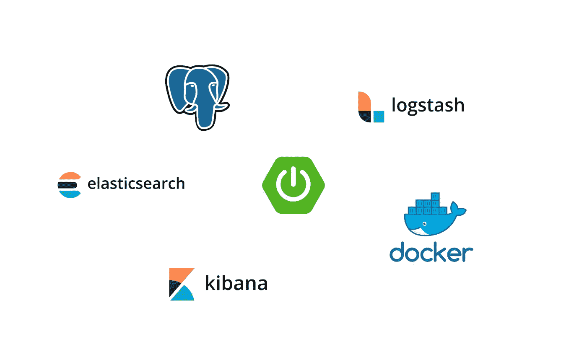
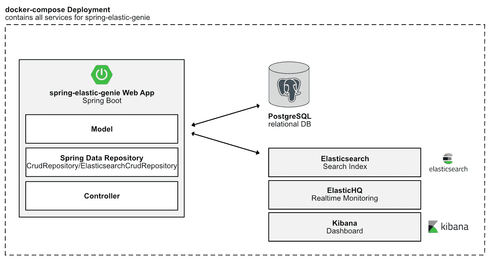
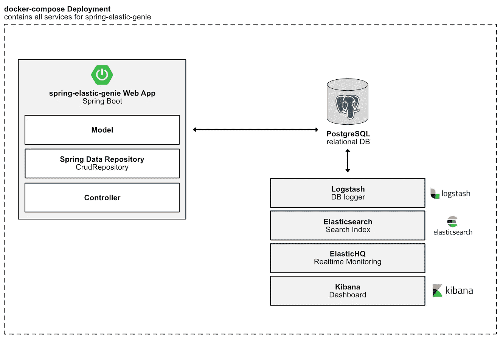

# Spring Boot、Elasticsearch、Logstash、Kibana、PostgreSQL 和 Docker 的搭便车指南

> 原文：<https://towardsdatascience.com/a-hitchhikers-guide-to-spring-boot-elasticsearch-logstash-kibana-postgresql-and-docker-5602feaa9fd3?source=collection_archive---------7----------------------->



最近，我决定开始创建一个 ELK stack 示例项目的旅程，该项目与 Spring Boot 和 PostgreSQL 一起工作——全部在 Docker 中，带有 docker-compose。没有 SaaS。尽管由于 ELK 的流行程度，任何给定的 web 框架都有许多示例项目，但在我看来，Spring Boot 并没有明确的终点线。

我的示例 Spring Boot 应用 spring-elastic-genie 有一个 REST API，它在 [OMDB](http://www.omdbapi.com) 寻找电影，并将结果保存在 PostgreSQL 中。这些结果然后被 Elasticsearch 索引，这时你可以在 Kibana 中可视化结果。你应该提前知道这是*而不是*一个如何编码的教程，而是在 Docker 中使用 Spring Boot 和本地 ELK 的高级架构概述。

如果您对进一步阅读不感兴趣，但是想要一个 GitHub 链接来查看一些代码，这里有一个指向我的示例项目的 GitHub 链接:

[](https://github.com/tech4242/spring-elastic-genie) [## tech 4242/弹簧-弹力-genie

### 🧶This 项目将展示如何使用弹性搜索和弹性靴。— tech4242/spring-elastic-genie

github.com](https://github.com/tech4242/spring-elastic-genie) 

但是我强烈建议你继续阅读，因为有许多陷阱和大量的教程不能告诉你整个故事；*尤其是*如果你来自一个非春天的背景(像我一样)。

我看到的所有教程都涵盖了如何使用 Spring 数据仓库直接写入 Elasticsearch，但它们没有涵盖如何使用生产中的 Spring Boot 应用程序，这些应用程序实际上将数据保存到诸如 PostgreSQL、MariaDB 等关系数据库中，相反，对于全文搜索等用例，需要搜索索引*在*之上。下面的部分解释了细微的差别以及它们背后的原因。

**架构选项**

选项 1:还有哪些“如何使用 Spring Boot 和 Elasticsearch”教程



好了，基本上这就是你在网上浏览关于弹性搜索和 Spring Boot 的教程时会发现的。您将拥有一个 Spring 数据存储库，允许您使用 ElasticsearchCrudRepository 接口直接向 Elasticsearch 写入数据，该接口是用于向 PostgreSQL 等普通数据库写入数据的 CrudRepository 的扩展。这一切都很棒，但只涵盖了现实世界用例的一小部分，因为很多时候你希望 Elasticsearch 索引你的主数据库，而不是像上面提到的那样。

所以，当你想直接写给 Elasticsearch 和 PostgreSQL 的时候，问题就来了。如果你想保持如上所示的架构，很遗憾只有一个选择*:每个模型有两个 Spring 数据仓库——一个用于 Elasticsearch，一个用于 PostgreSQL。这太可怕了。您只需要 2 倍的业务逻辑代码，而 Spring 不能在两个数据库之间进行事务管理，所以如果事务失败，您可能最终只能保存在 Elasticsearch 或 PostgreSQL 中(除非您想手动管理这些东西……)，这首先违背了拥有搜索索引的目的。*

*TL；如果您想同时写入两个数据库，这种方法并不好。没有什么比 Django + Haystack 方法更好的了，在这种方法中，你可以告诉 Elasticsearch 索引你的 Django 模型，然后你就完成了。*

*此外，您不能做类似以下的事情:*

```
*public interface MovieRepository extends CrudRepository<Movie, Integer>, ElasticsearchCrudRepository<Movie, Integer> { 
    //...
}*
```

*这将立即在运行时(而不是在构建时)给你一个错误，因为你正在覆盖 beans，缺省情况下是禁用的，但是启用它将没有帮助，因为你只能做两者之一(在单词中是 override)。这就是为什么你将坚持为每个 DB 拥有一个 Spring 数据存储库。除非你选择选项 2。*

*选项 2: Logstash 和更多抽象*

**

*这就是选项 2 的样子。本质上，Spring Boot 处于次要位置，我们使用标准的 CrudRepository 将数据保存到 PostgreSQL 中，然后我们开始使用 Logstash 将我们想要的所有交易从 PostgreSQL 记录到 Elasticsearch，从而从我们的 Spring Boot 应用程序中删除所有 Elasticsearch 代码，并消除代码复制的需要。选项 1 所需的代码在 GitHub 的每个文件中都被注释掉了。*

*这个项目的 docker-compose 包括 Spring Boot app、PostgreSQL、Elasticsearch、Kibana、Logstash 和 ElasticHQ (ES 监测服务)。这个设置会让你立刻与 ELK 和 Docker 一起运行。*

*如果你熟悉 Docker，这大部分都是非常基本的。一些亮点:*

*   *Spring Boot 正在等待 PostgreSQL 的健康检查。这个 Docker 容器只是运行用 gradle 构建的 jar 文件。DB 连接的配置可以在 application.properties 中找到，它是从 core.env 文件中读取的。*
*   *Logstash 在我的 GH 项目中为 JDBC 驱动程序和 logstash.conf 安装了两个本地文件夹*
*   *Elastichq 实时监控 Elasticsearch，并且几乎可以开箱即用*
*   *所有这些都不能用于生产—只能用于开发！此外，如果在 AWS 上用作 SaaS，ELK 也相当不错，但我想展示如何实现内部开源路径。GitHub 上的 README 中进一步描述了该配置。*
*   **Logstash 免责声明:目前 Logstash 仅配置为通过简单的 SQL 查询从 PostgreSQL 获取数据，但它没有针对重复等的过滤器。有许多 Logstash 教程可以用来过滤数据。**

***随机陷阱***

*   *Logstash 7.2.0 与许多 JDBC 驱动程序不兼容，你需要将 Logstash 与 Elasticsearch 连接起来。相反，我恢复到 7.0.0。在这上面浪费了这么多时间。最后在 pgjdbc GH 页面上打开一个[问题](https://github.com/pgjdbc/pgjdbc/issues/1523)，却发现这是一个 Logstash [bug](https://github.com/logstash-plugins/logstash-filter-jdbc_static/issues/47) 。*
*   *弹性搜索 7。x 与 spring-data-elasticsearch 不兼容，后者是通过使用 spring 的数据仓库将数据保存到 elasticsearch 中。支持的最新版本是 6.7.2，但 Kibana 的是 7。x 有黑暗模式，我想在这篇文章中的一些黑暗模式截图。因为黑暗模式。:)你可以在 [GitHub](https://github.com/spring-projects/spring-data-elasticsearch) 上关注他们的发布。*

***幸运饼干的故事***

*选项 2 有点违背了为 Spring Boot 和弹性设计一个专用指南的目的，对吗？也许是，但也许不是。由于选项 1 最终变得有点混乱，这应该突出了您可以用现有项目做什么，而不需要彻底检查您的整个 Spring 项目来编写 Elasticsearch。此外，问问自己是否需要 Elasticsearch。另一个直接与 PostgreSQL 一起工作的索引能完成这项工作吗？PostgreSQL 本身能很好地完成任务吗？如果对这些问题的回答是“不”，那么选项 2 应该会带来最少的麻烦。*

*我希望这篇教程能够让你开始你的 ELK stack 之旅(也许甚至可以用 Docker ),这样你就可以少担心你的 Spring 应用程序，多关心如何充分利用 Elasticsearch！*

*最重要的是:不要惊慌；)*