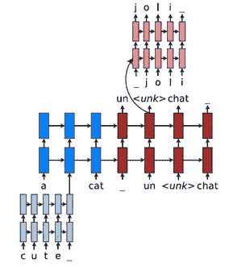
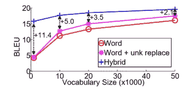
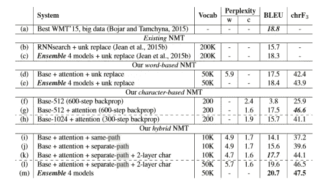

# 一种混合神经机器翻译模型(Luong & Manning)；

> 原文：<https://towardsdatascience.com/a-hybrid-neural-machine-translation-model-luong-manning-fcf419be358a?source=collection_archive---------35----------------------->

Luong & Manning 最近发表了一篇题为“用混合单词字符模型实现开放词汇神经机器翻译”的论文其内容我总结如下。

要快速总结神经机器翻译(NMT)的现状，你可以快速看一下我的另一篇文章[这里](https://medium.com/@nicholasasquith/understanding-neural-machine-translation-encoder-decoder-architecture-80f205643ba4)

目前，通用的基于单词的 NMT 为**输出**中的罕见单词生成<unk>，然后应用**后处理**步骤，通过使用来自它们的注意力机制的对齐信息，经由简单的单词字典查找来处理这些未知标记。这种方法存在 1)字母不匹配和 2)多词对齐的问题</unk>

# 添加一个字符组件。

Luong 和 Manning 通过在当前的编码器-注意力-解码器架构中使用基于核心单词的 NMT 来解决这个问题，但他们没有将所有罕见的单词都视为<*unk*，而是添加了一个字符组件，以每个字符为基础对它们进行编码:

Luong, Manning, “Achieving Open Vocabulary Neural Machine Translation with Hybrid Word-Character Models.”

在这个图表中，“可爱”是一个罕见的词。因此，它被分解成字符，并通过“c”、“u”、“t”、“e”和“_”(边界符号)输入到基于字符的深层 LSTM 中。最终的表现，隐藏状态，在顶层，然后取代了“可爱”的<unk>。</unk>

每当单词级 NMT 产生一个< *unk* >，你就可以参考这个字符级解码器来恢复未知目标单词的正确表面形式。

这在纯字 NMT 上提供了以下改进:

1)更快更容易训练(无后处理步骤)
2)从不产生未登录词

# 相对于现有技术的结果:

在 WMT 的 15 个英语-捷克语翻译任务中，与其他 NMT 模型相比，混合神经机器翻译模型获得了+2.1–11.4 BLEU，最好的系统获得了最高的 20.7 BLEU。它还获得了更高的 chrF3 分数。

基于字符的模型，用于取代纯粹的< *unk* >技术，对 BLEU 分数贡献最大，在 10k 词汇上为+2.1 BLEU。

Figure 3\. Vocabulary size effect

Table 1\. Experiment results

**结论**

本文提出的混合体系结构结合了基于单词的模型和基于字符的模型，前者速度快且易于训练，后者能很好地处理未登录词，从而产生更高质量的翻译。本文还展示了纯基于字符的模型的潜力，尽管它的训练速度非常低。因此，可能需要做更多的工作来提高基于角色的模型的速度。

*最初发表于“使用混合单词-字符模型实现开放词汇神经机器翻译”
Minh-Thang Luong 和 Christopher D. Manning，加利福尼亚州斯坦福市斯坦福大学计算机科学系，邮编:94305*