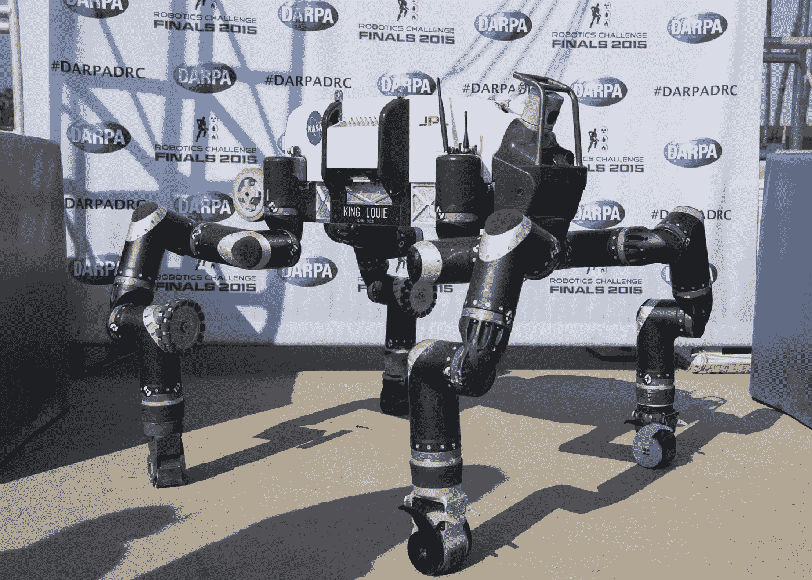
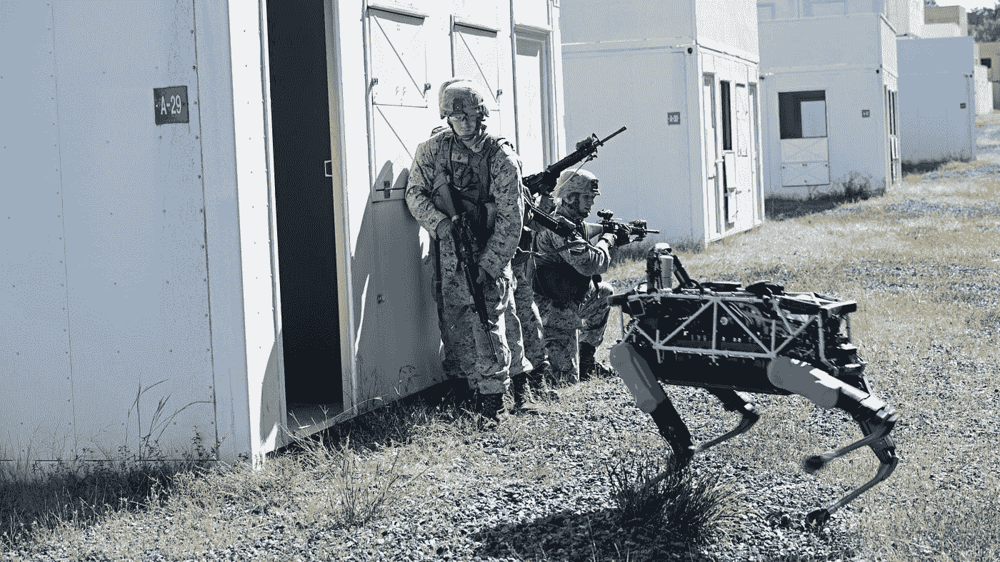

# 人工智能非军事化不会发生

> 原文：<https://towardsdatascience.com/a-i-demilitarisation-wont-happen-92bcf6d4bc7d?source=collection_archive---------23----------------------->

人工智能已经被集成到下一代防御系统中，它的非军事化是极不可能的。无论如何，限制其用于军事用途可能不是最明智的策略。

Photo by [Rostislav Kralik](http://www.photokralik.cz/) on [Public Domain Pictures](https://www.publicdomainpictures.net/en/view-image.php?image=107453&picture=terminator)

今年的世界经济论坛年会即将开幕。在浏览今年的议程时，我不禁想起了去年对谷歌首席执行官孙戴·皮查伊的采访，他非常坦率和乐观地谈到了他对人工智能如何[改变人类运作方式的根本方式的设想。](https://www.weforum.org/agenda/2018/01/google-ceo-ai-will-be-bigger-than-electricity-or-fire/)

事实上，思维过程的自动化，结合高速通信网络、即时可用的数据和强大的计算资源，有可能影响社会的所有机制。人工智能将在医疗、教育、能源供应、执法、经济和治理等领域的决策、日常运营和自动化中发挥关键作用。

像大多数其他创新一样，每一项技术进步都可能被滥用于邪恶的目的，人工智能也不例外。让大多数人害怕的是它难以捉摸的本质，它是一个如此广阔的领域，并且在如此多的科幻情节中扮演着核心角色，以至于[没有很好的结局](https://mashable.com/2018/01/12/black-mirror-ai-ethics-opinion/)。

在他的采访中，Sundai 试图通过建议各国应该解除人工智能的武装来平息这种担忧。当然，人们应该结合上下文来看待这些评论。但是期望所有国家都这样做就像期望人类完全停止战争一样。

我强调*而非*的原因是，只需要一个国家就能造成失衡。如果朝鲜决定在其洲际弹道导弹中集成人工智能以实现高精度自主制导会怎样？期望美国不做同样的事情来应对这种威胁现实吗？又是一次[同归于尽](https://en.wikipedia.org/wiki/Mutual_assured_destruction)。

在这种情况下，只有当双方都采取更具侵略性的*优势*策略并且对手进行报复时*损失更大*，你才能达到[纳什均衡。人们会期望世界上最大的人工智能公司之一的首席执行官至少知道博弈论的这样一个基本概念。](https://en.wikipedia.org/wiki/Nash_equilibrium)

Photo Credits [Wikimedia Commons](https://commons.wikimedia.org/wiki/File:Cold-war-2-investwithalex.jpg)

但是 Sundai 当然完全意识到了这一点。他对人工智能应用的和谐的国家间和平合作的乌托邦式的愿景，正符合他的雇主的议程。具有讽刺意味的是，这发生在同一年年初，当时其[“不作恶”的座右铭被删除](https://gizmodo.com/google-removes-nearly-all-mentions-of-dont-be-evil-from-1826153393)，其自己的[员工罢工抗议其参与军事项目](https://gizmodo.com/google-employees-resign-in-protest-against-pentagon-con-1825729300)，人们开始严重关注他们的私人信息的可用性和滥用，如[电子邮件](https://www.theverge.com/2018/7/3/17533108/google-gmail-privacy-read-email-messages-response)和[手机数据](https://www.cnet.com/news/google-sued-over-keeping-location-data-amid-privacy-concerns/)。

保持对立双方的力量平衡已经是不要对一方施加限制的足够好的理由，而没有任何具体的保证另一方实际上也在这样做。但是这里有更多的原因为什么人工智能非军事化不会发生，以及为什么我们可能一开始就不希望它发生。

# **资助**

国防预算推动了西方国家的大量研究和创新，在这些国家，强大的军事能力被视为至关重要。他们不仅资助导弹和隐形战斗机的建设。他们支持一些想法的发展，这些想法通常还没有任何商业模式，但在竞争国家出现之前仍然值得拥有。当然，更有可能的是，具有明确军事用途的想法会得到国防预算的资助。但是像互联网(最初是阿帕网)和全球定位系统(最初是国防项目)这样的技术最终被公之于众。

自动驾驶汽车可能因谷歌的自动驾驶汽车项目(现为 [Waymo](https://waymo.com/) )而变得更受欢迎，但实际上这是美国国防高级研究计划局(DARPA)的[大挑战](https://www.darpa.mil/about-us/timeline/-grand-challenge-for-autonomous-vehicles)的结果。然后，谷歌从赢得 2005 年挑战的团队中招募人员。DARPA 还举办了一场[机器人挑战赛](https://www.darpa.mil/program/darpa-robotics-challenge)，目标是开发能够在对人类有害的环境中执行危险任务的人形机器人。人们只需要回忆一下切尔诺贝利和福岛的灾难，以及人们在放射性环境中工作的后果，就能意识到这种技术有多么有用。

JPL’s RoboSimian at the DARPA Robotics Challenge

DARPA 非常重视人工智能，其他国防组织也是如此，比如 BAE 系统公司和泰雷兹公司。期望军方袖手旁观，与人工智能保持距离是完全不现实的。

# 人工智能可以减少(双方的)伤亡

在军事上使用人工智能的一个主要担忧是杀手机器人的发展。这是一个合理的担忧，需要通过正确的政策和条约来解决，尽管我怀疑如果技术组件可以获得，任何国家都会公开承认拥有自主武器(直到它被迫拿出并使用它们)。此外，如果一个国家有可能获得这样的技术，那么让竞争环境失衡可能是一个非常糟糕的主意。

鉴于[人工通用智能距离](https://www.theverge.com/2018/11/27/18114362/ai-artificial-general-intelligence-when-achieved-martin-ford-book)还很遥远，而且不太可能出现“终结者式”杀手机器人，也许我们应该更关注人工智能的眼前利益，比如[战场智能](https://www.afcea.org/content/ai-will-reboot-armys-battlefield)。如果一个[士兵的护目镜配备了增强现实](https://www.researchgate.net/publication/258716091_Soldier-worn_augmented_reality_system_for_tactical_icon_visualization)，使用人工智能来识别朋友和敌人，或者平民和威胁，比肾上腺素分泌过多担心自己生命安全的人类更准确，会怎么样？自主装甲车可以用于高风险的任务，比如通过敌对路线运送物资，或者从活跃的战区营救伤员。机器人可以陪伴士兵，帮助他们调查威胁或搬运重型设备。

Photo by [Sgt. Eric Keenan](https://www.marines.mil/Photos/igphoto/2001291268/)

如果导弹制导系统配备了在爆炸前验证目标的机载算法会怎么样？“外科手术式打击”只会击中预定目标，而不会造成附带伤害和无辜平民死亡。利用人工智能来跟踪和拦截空中威胁，甚至在它们实际发射之前检测它们的更智能的防空系统怎么样？

# 人工智能没有很好的定义

大多数人工智能技术涉及处理数据流，应用微积分、概率和统计等数学技术，并使用少量算法将它们放在一起以达成解决方案。[没有什么真正的认知、感知或自我意识在进行。](/https-medium-com-josef-bajada-demystifying-artificial-intelligence-6f5f7a8dd1b0)

与核武器不同，你可以清楚地确定一个国家是否有库存(假设你能找到它们)，没有明确的方法对集成在各种防御系统中的软件技术进行分类。此外，人们不能真正指望军方不使用它所拥有的数据和计算资源来获得更快、更智能和机器验证的决策支持，而普通公众对它了如指掌。人工智能非军事化不会发生。

[*约瑟夫·巴加达*](https://www.linkedin.com/in/josefbajada/) *拥有计算机科学博士学位，专门研究计划和调度的人工智能技术。他是一名技术顾问，为物流和油田技术应用开发人工智能解决方案。上述文章中表达的任何观点纯属其个人观点，不一定代表任何附属机构的观点。*