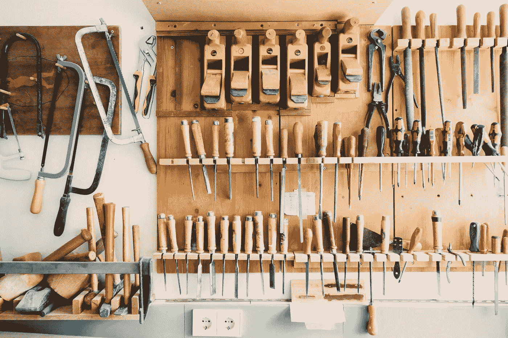
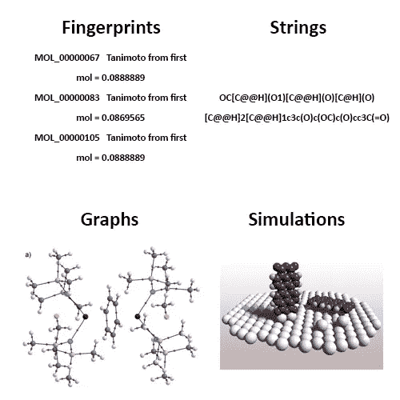
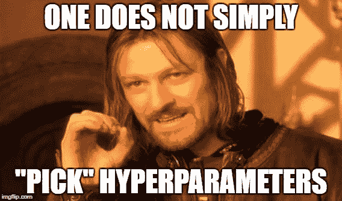
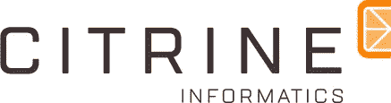

# A.一.加强分子发现和优化

> 原文：<https://towardsdatascience.com/a-i-enhanced-molecular-discovery-and-optimization-9434f3f8a593?source=collection_archive---------12----------------------->

## 召集所有科学家和开发者

我们正处于一种新的科学方法的边缘，这种方法利用人工智能的力量来加速科学发现的发展。

> “在过去几年中，实验和模拟产生的大量数据催生了**第四种科学范式**，即**数据驱动科学**，它统一了理论、实验和计算/模拟的前三种范式。”—西北大学的安基特·阿格拉瓦尔

A visual representation of science (colorized, circa. 2003)

科学常常会像一根泥棒，因此理论和实验科学的前两种范式被证明是缓慢的或两个原因:

1.  理论知识缺乏经验证据**(第一范式)**
2.  实验中人类偏见的丰富程度**(第二范式)**

然而，计算机改变了科学游戏，我们开始充分欣赏这些不可思议的设备带来的准确性和速度。计算和模拟的第三范式**是一个很有前途的范式，但是受到当时技术的限制。这将我们引向第四种范式。**

第四范式利用了计算范式的数字副产品:数据。数据科学虽然不是一门精确的科学，但可以带来如此高的性能和准确性，以至于它们经常可以识别我们尚未用科学发现的新方法、方程和想法。

这就是计算机如何以及为什么能够:

1.  击败世界上最好的国际象棋、围棋和 DOTA 玩家
2.  发现新的药物、材料和分子
3.  翻译语言，驾驶汽车，交易股票

这个名单每天都在增长。他们能比我们更好地做这些事情，**和做一些我们不能做的事情*，*，**与 ***，*，**只是数据和一个模型/架构。它需要的唯一等式、直觉或知识是通过观察数据中的**模式产生的。**

图案在化学和材料科学中非常普遍。从钻石的晶体结构到脂质的支链，这些模式定义了分子的各种性质。识别这些模式并从中学习是人工智能的责任。尽管有一些挫折，比如没有足够的数据用于训练，人工智能非常适合分子发现的问题。今天，处于科学前沿的研究人员开始转向人工智能，以获得更高效、更准确、更多样化的结果。

A.I can do it better (Photo by [Franki Chamaki](https://unsplash.com/photos/1K6IQsQbizI?utm_source=unsplash&utm_medium=referral&utm_content=creditCopyText))

# 我为什么要在乎？

仅仅几十年后，对更坚固的建筑材料、更耐久的电池和更个性化的药物的需求将会增加。我们 T2 满足这些需求的能力取决于研究人员能以多快的速度向试图解决世界上最大问题的公司提供合适的材料。如果链条的强度取决于其最弱的一环，那么:

> “创新和进步的速度与我们发现和优化材料的速度一样快”

历史被定义在那个时期主要使用的基本材料上。石器时代、青铜时代和铁器时代，也就是我们今天生活的**硅时代**的前身。明天我们可能会发现自己处于碳时代。总的来说，我们不能等待这些新的科学时代，但一个新分子到达大众仍然需要几十年的时间。答:我想知道我们将如何弥补差额。

每年，使用最新和最棒的机器学习工具的研究论文数量都在增加。**从** [**强化学习增强的递归神经网络**](https://arxiv.org/abs/1711.10907) **，到** [**生成式对抗性自动编码器**](https://www.ncbi.nlm.nih.gov/pubmed/30180591) **，还有其他的 A.I 恶作剧，这将是一个十年的狂野时代。**

如果这是你第一次接触人工智能，太棒了！希望这能给你一张 A .在不久的将来我将去哪里的照片。如果你是化学家、物理学家或生物学家，那太好了！这个领域的每个人都同意的一件事是需要意识到可能性。如果你是一名开发人员或机器学习者，那么欢呼吧！将是你塑造明天的世界。

# 厉害！但是我们如何到达那里呢？

处于各自领域前沿的研究人员一直在尝试使用我们手头现有的工具来解决这个问题。当前研究的工作方式有一个模式，同样的一般过程适用于任何基于人工智能的科学项目。

研究人员是木匠，这些是材料、工具和指令。

Crafting the perfect molecule (Photo by [Barn Images](https://unsplash.com/photos/t5YUoHW6zRo?utm_source=unsplash&utm_medium=referral&utm_content=creditCopyText))

## 首先，我们需要一些高质量的木材…

我们需要数据。更重要的是，我们需要干净的、有标签的和丰富的数据。这些数据必须用计算机能理解的格式来表示。谢天谢地，我们正好有这个东西；**简化的分子输入-行-输入系统(SMILES)字符串。**

微笑串是计算机可以解释分子的四种方式之一。按照从最低到最高(因此从最简单到最复杂)的顺序听:

1.  分子指纹(特定长度的数字序列)
2.  字符串表示(描述结构和组件的符号)
3.  分子图(与数据结构中的树和图的概念相同)
4.  模拟(下一级的东西。说够了)

Pick your poison: molecules like drugs reap the benefits of being represented by all 4 formats

90%的研究项目使用 SMILES 字符串表示，尽管有争议的是像 SMARTS 这样更适用的格式。这是因为它在准确性(就表示给定分子的细微差别而言)和复杂性(就计算机解释数据的容易程度而言)之间取得了平衡。字符串本身看起来有点像化学胡言乱语:

C/C=C/C=C/C

OC(=O)[C@@H](N)C

CCc1c[n+]2 CCC 3c 4 cccc 4[nH]C3 C2 cc 1

它们看起来有点像典型的高中科学课上教授的化学式。这是因为每个**微笑串是由给定分子的分子图的深度优先树遍历**生成的。所以在某种程度上，微笑字符串是一个分子的公式，更详细地拼写出来。

SMILES 字符串数据最好在被清理后使用。这包括**规范化、**(同一个分子可以有多个微笑字符串)、以及**去重**。你可以把它想象成从木头上移除碎片。这样工作起来更容易也更安全。

当然，计算机不会按字母顺序思考；它用数字思考。因此，我们必须将所有这些字母、符号和字符转换成整数表示、二进制指纹、一键编码或任何其他计算机可以消化的数字格式。

## 现在我们需要一把锤子和一些钉子…

我们需要工具来处理数据。在机器学习中，这些工具是各种算法，每种算法都用于预测、分类、生成、回归等。每种工具都有不同的用途，因此针对正确的问题选择正确的工具非常重要。在科学领域，机器学习在任何项目中的应用都可以分为以下两类:

***正向模型:用于属性预测***

或者

***逆模型:用于分子发现/优化***

*模型的类型不同，但输入和输出保持不变。*在正向模型中，分子是输入，属性是输出。在逆模型中，这是颠倒的；属性是输入，分子是输出。

有相对简单类型的机器学习模型，如线性回归和 K-最近邻，还有更复杂的算法，如决策树和森林。有时这些工具就足够了，但是如果有足够的数据，可以考虑更强大的模型；神经网络。

神经网络是机器学习算法的瑞士军刀。神经网络可以分类、预测、生成、降低维度等等，这要归功于矩阵乘法的魔力和一种叫做“反向传播”的超级特殊学习算法。

神经网络本身有不同的架构，每种架构都针对不同的目的进行了优化。**递归神经网络(RNNs)是操纵时间序列数据(如文本**)的完美工具，或者在分子的情况下，意味着微笑字符串表示。rnn 是多用途的，可用于预测属性(输入微笑字符串分子和输出属性)或生成分子(输入属性和输出微笑字符串分子)。

## 我们需要建造这东西的说明书…

我们现在有了建造新东西所需的材料和工具！我们只需要知道更多的细节。这些细节被称为超参数，如神经元的数量、层数、学习速率等。**超参数告诉我们如何使用我们的工具(机器学习算法)，来处理我们的木材(数据)。**很多时候，指令是由木匠和他们的直觉决定的。作为架构师，您的工作是决定一些超参数值，而其他值是在培训过程中学习到的。

But when you do, choose wisely. (courtesy of Daniel Shapiro)

这些参数对模型的结果有很大的影响，所以选择一个好的起点取决于机器学习者的直觉和经验。**成功与失败的区别往往在于单个超参数的变化。**优化就是改变这些超参数，直到模型的最终输出尽可能精确。

我们将不得不选择我们的损失函数(我们决定我们的模型做得好或坏的方式)。还有大量的激活函数可供选择(当在神经网络的每一层之间传递时，保持值不变。发展如何选择所有这些超参数的直觉需要理解**每个选择如何以及为什么**起作用，有时你只需要猜测和检查！

## 我真的需要一把锯子和一些抛光机…

木匠的工作不仅仅是建造东西；让它看起来像样也是他们的工作。**因此，最后一步是以综合的格式返回模型的输出。**

***在正向模型中，*** 这意味着用适当的测量单位最准确地呈现给定材料的属性。

***在逆模型中，*** 这意味着以正确的微笑字符串符号呈现生成的分子。

我们有办法提高产品的光洁度。特别是在寻找潜在的候选药物时，这是最危险的阶段。不进行实际测试就无法知道一个分子是否稳定，这就是为什么确定性和误差率在科学中如此重要。这是许多研究人员在他们的原始模型上使用另一个附件的地方。**找到一劳永逸的解决方案非常罕见，也没有灵丹妙药。**分子发现的良好解决方案实现了多种机器学习算法，也称为集成算法。

**发布架构**(玛利亚·波波娃等人)结合了 RNNs 和强化学习技术。RNN 由两个不同的网络组成，它们产生有效的分子。强化训练然后将这些结果偏向期望的属性。

**ECAAE 架构** ( [Daniil Polykovskiy](https://medium.com/u/8980ba62d1d0?source=post_page-----9434f3f8a593--------------------------------) 等人)首先将自动编码器的潜在分布码从属性中分离出来，然后修改潜在码以匹配先前的分布码。这是用一个对抗性的网络来训练的，直到鉴别者不再能够区分潜在的和先前的。

**有机架构**([Benjamin Sanchez-Lengeling](https://medium.com/u/a62ce439eb5f?source=post_page-----9434f3f8a593--------------------------------)等人)使用带有强化学习技术的生成式对抗网络(GANs)。与释放架构类似，GAN 会在强化学习(称为“目标强化”)将输出转向所需属性之前生成有效的分子。

## 大概就是这样

***我要真实世界的证据！！！***

这个一般化的过程不是来自直觉，而是来自两个派别慷慨提供的大量论文、项目和案例研究中开发的模式；学术界和工业界。

# 大学研究

前面提到的架构，如 ReLeaSE、ECAAE 和 ORGANIC，都是有监督的深度学习的最新例子。这些创新背后令人难以置信的机构是一些世界顶尖大学。

## 哈佛大学

像“[什么是高通量虚拟筛选…](https://www.researchgate.net/publication/276728001_What_Is_High-Throughput_Virtual_Screening_A_Perspective_from_Organic_Materials_Discovery) ”这样的论文，还有前面提到的有机架构，都是来自世界排名第一的大学。**哈佛的清洁能源项目**是将人工智能推向前沿的研究的一个例子。贡献者包括来自化学、人工智能、数据科学和许多其他领域的人。如果我们要继续发展这些领域的应用，这种合作是必要的。

**剑桥大学**

简单的“[材料科学的机器学习](https://www.repository.cam.ac.uk/handle/1810/267987)”是一篇深度论文，涵盖了该领域所有的最新创新。剑桥也是非常特殊应用的地方，比如使用神经网络的合金概率设计。随着像 **Deep Mind** 这样的公司进驻英国，剑桥继续推出优质内容也就不足为奇了。

## 西北大学

数据驱动科学的整体理念是西北大学近期工作的一个亮点。从[用于分子发现的高通量密度泛函理论](https://www.researchgate.net/publication/329409896_Machine-learning-accelerated_high-throughput_materials_screening_Discovery_of_novel_quaternary_Heusler_compounds)到[通过递归神经网络预测定向能沉积过程中的高维热历史](https://www.sciencedirect.com/science/article/pii/S2213846318300804)的研究都源于西北大学进行的研究。

# 创业公司和公司

我的导师纳维德·纳图给了我一个很好的建议；

> “当人们愿意为解决问题付费时，问题就变成了机会；必须有一个经济激励。”

如果没有钱，到目前为止的一切都是一个有趣的科学项目，听起来很酷，但从商业角度来看毫无意义。话虽如此，这里有一些公司，或大或小(它们的规模应该说明有多少经济激励)，正在寻求改变。

One of the leaders of the industry specifically in cheminformatics

## 黄水晶信息学

这家位于旧金山的不可思议的公司在分子发现和优化研究领域取得了长足的进步。我要特别强调他们的操作方法。Citrine 明白，就数据的规模、质量和一致性而言，科学界不像其他领域那样享有特权。我们可能有大量的图像、文本和音频数据集，但你很难找到一个可靠的碳分子数据集，更不用说清洁或标记了。

Citrine 通过利用尽可能多的技术来解决**的“小数据”问题**。像**数据扩充、迁移学习和堆叠架构**这样的技术从现有数据集中榨取每一盎司的价值。

## IBM 研究

对财富 500 强公司如微软、脸书、谷歌，尤其是 IBM(谁还记得 IBM 代表什么？).自从在计算领域的竞标中失利并错失移动业务后，IBM 已经将注意力从正在发生的事情转移到了将要发生的事情上。今天，IBM 仍在努力保持相关性，但不再是我们曾经认识的计算机公司，而是一家量子计算、人工智能研究和技术创新公司，希望在不久的将来东山再起。

最近，IBM 发布了一个预测化学反应的免费工具，根据大多数此类项目，SMILES strings 是选择的分子表示。有了化学反应的两百万个数据点，人工智能设法得到了相当精确的结果。

## 谷歌研究

不出所料，这家世界上最有影响力的公司碰巧也把手伸向了饼干罐。谷歌的人工智能研究有一个名为**谷歌加速科学**的特别团队，他们致力于计算化学和生物学，目标是推进科学研究和加速科学创新。他们与 Deep Mind 合作过几次，推出了令人兴奋的作品。

传言他们最近的工作涉及使用 4 种可能的分子表示中的第 3 种；分子图。这是他们研究的自然结果，因为**几何深度学习**开始普及，其好处变得更加明显。谷歌一贯发布他们的研究出版物，有时还会发布他们的相关代码。密切关注新闻，如果有人能够完成下一件大事，那就是谷歌。

# 关键要点

*   我们现在正进入科学的第四范式，一个由数据驱动而不是理论、实验或计算的范式
*   A.我是这一变化将如何影响科学以及对社会意味着什么的决定性因素
*   当前的研究遵循一个过程，并且局限于人工智能中当前可用的工具
*   目前学术界和工业界正在解决许多现实世界中的问题，而且这种问题还在不断增加

The future is bright (courtesy of the Science magazine)

# 接下来会发生什么

Chamath Palihapitiya 认为，虽然谷歌可能是搜索数据的大师，脸书可能是通信数据的大师，亚马逊可能是消费主义数据的大师，**还没有一个明确的医疗保健数据、分子数据和许多其他增长领域的大师。**

搜索、通信和消费主义数据华而不实，表面上很重要，但没有足够的人来解决世界上最棘手的问题。

人工智能可以改变这一点。

***你可以改变。***

***需要看更多这样的内容吗？***

*跟我上*[***LinkedIn***](http://www.linkedin.com/in/flawnson)***，*** [***脸书***](https://www.facebook.com/flawnson) ***，***[***insta gram***](https://www.instagram.com/flaws.non/?hl=en)*，当然还有* [***中***](https://medium.com/@flawnsontong1)

*我所有的内容都在* [***我的网站***](http://www.flawnson.com) *我所有的项目都在*[***GitHub***](https://github.com/flawnson)

*我总是希望结识新朋友、合作或学习新东西，所以请随时联系 flawnsontong1@gmail.com*