# 从火星轨道飞行器到陆地神经网络的旅程

> 原文：<https://towardsdatascience.com/a-journey-from-martian-orbiters-to-terrestrial-neural-networks-16efcb1bda9a?source=collection_archive---------20----------------------->

年份是 2019 年。如果你现在设法传送到火星，你会发现一艘多用途宇宙飞船在近圆形轨道上围绕火星运行，持续约 2 小时，高度从 250 公里到 316 公里不等。这个被恰当地命名为**火星勘测轨道飞行器(MRO)** 的航天器，自 2006 年 9 月以来一直在向地球传输由其所有最先进的仪器捕获的大量数据。收到的数据总量为 361 兆兆比特，比过去和现在所有其他星际任务的总和还要多。此外，MRO 以每秒 3.4 公里的速度运行，并绕火星运行了 6 万圈！

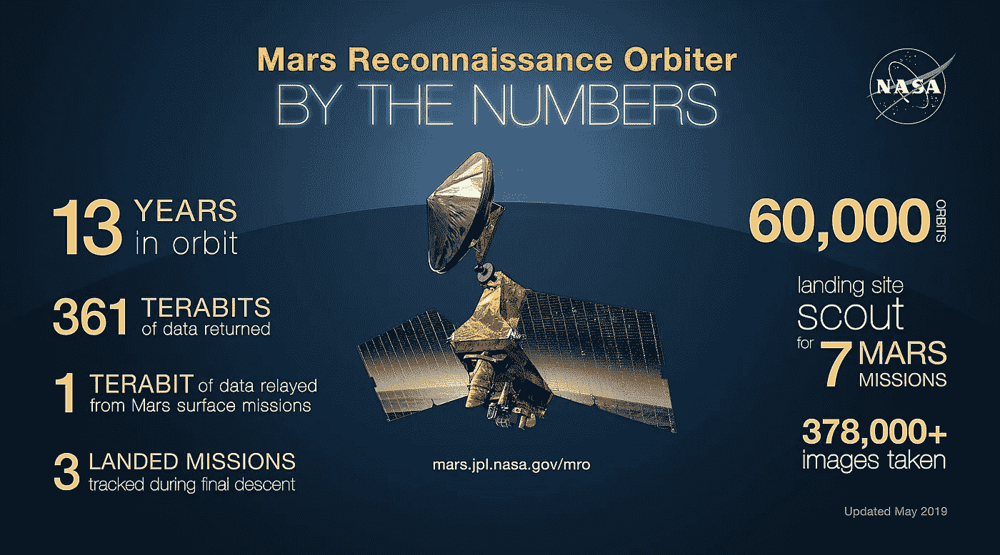

NASA Infographic (May 2019) — [Image Source](https://www.jpl.nasa.gov/images/mro/20190515/MRO-infographicMay-2019.jpg)

如果一个月前你问我这个奇妙的装置，我根本不知道你在说什么。然而，3 周前，我对火星表面的了解经历了一次彻底的变革，这是因为我被选为奥姆德纳的全球人工智能合作挑战 的一部分，与一个 50 人的团队合作，自动识别火星表面的着陆点和异常。

你可能已经猜到了，我们决定应用机器学习来解决这个问题，但在开始之前，我们意识到我们需要大量的火星表面数据(图像)。为了获取这些数据，我们需要了解在哪里可以找到这些数据，以及如何检索这些数据。因此，我们发现自己费力地阅读与复杂软件系统协同工作的精心构造的机器的规范文档和用户手册；试图更多地了解 MRO 和它所有的乐器。

如果您赶时间，并且只想知道如何使用几行代码*(Python 语言)*检索这些图像，以便您可以专注于构建和调整神经网络来分析火星表面，那么可以随意跳到“[一体化 Python 包](https://medium.com/p/16efcb1bda9a#ca5f)”部分。然而，如果你想知道更多关于火星图像如何到达地球以及下载这些图像后修复的问题，那么请继续阅读。

## 目录

*   [高分辨率成像科学实验(HiRISE)](https://medium.com/p/16efcb1bda9a#59da)
*   [深空网](https://medium.com/p/16efcb1bda9a#966d)
*   [美国宇航局行星数据系统](https://medium.com/p/16efcb1bda9a#e56e)
*   [地球科学节点的轨道数据探测器(ODE)](https://medium.com/p/16efcb1bda9a#25b9)
*   [ODE Web 界面](https://medium.com/p/16efcb1bda9a#5f24)
*   [ODE REST 接口](https://medium.com/p/16efcb1bda9a#e896)
*   [海量 JPEG2000 文件](https://medium.com/p/16efcb1bda9a#6bac)
*   [切大块](https://medium.com/p/16efcb1bda9a#43b3)
*   [寻找可扩展的解决方案](https://medium.com/p/16efcb1bda9a#84d2)
*   [黑边和计算机视觉技巧](https://medium.com/p/16efcb1bda9a#de12)
*   [Numpy 数据集文件](https://medium.com/p/16efcb1bda9a#d209)
*   [任务总结](https://medium.com/p/16efcb1bda9a#7c1a)
*   [一体化 Python 包](https://medium.com/p/16efcb1bda9a#ca5f)
*   [结论](https://medium.com/p/16efcb1bda9a#e055)
*   [参考文献](https://medium.com/p/16efcb1bda9a#a552)

## 高分辨率成像科学实验(HiRISE)

MRO 通过捕捉不同类型的火星表面图像，为漫游车和固定着陆器任务提供了至关重要的支持，以便地球上的科学家可以手动评估每张图像，以确定潜在的着陆点。在轨道器上包括的 3 个相机，2 个光谱仪和 1 个雷达中，我们决定专注于由亚利桑那州大学图森分校管理的高分辨率成像科学实验(HiRISE)相机捕获的数据。这款相机的美妙之处在于，它能够在 300 公里的高度达到 1 [微弧度](https://en.wikipedia.org/wiki/Radian)的分辨率，即 0.3 米(相当于一张餐桌的大小)。这些观测覆盖了大约 2.4%的火星表面，相当于两个阿拉斯加的面积，许多地方被重复拍摄。

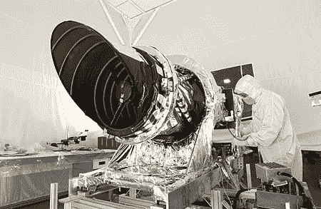

HiRISE Camera — [Image Source](http://photojournal.jpl.nasa.gov/catalog/PIA07087)

## 深空网络

MRO 通过与美国宇航局的[深空网络](https://mars.nasa.gov/mro/mission/communications/)通信将所有这些数据中继到地球，这是一个由美国航天器通信设施组成的全球网络，位于美国(加利福尼亚州)、西班牙(马德里)和澳大利亚(堪培拉)，支持美国宇航局的星际航天器任务。

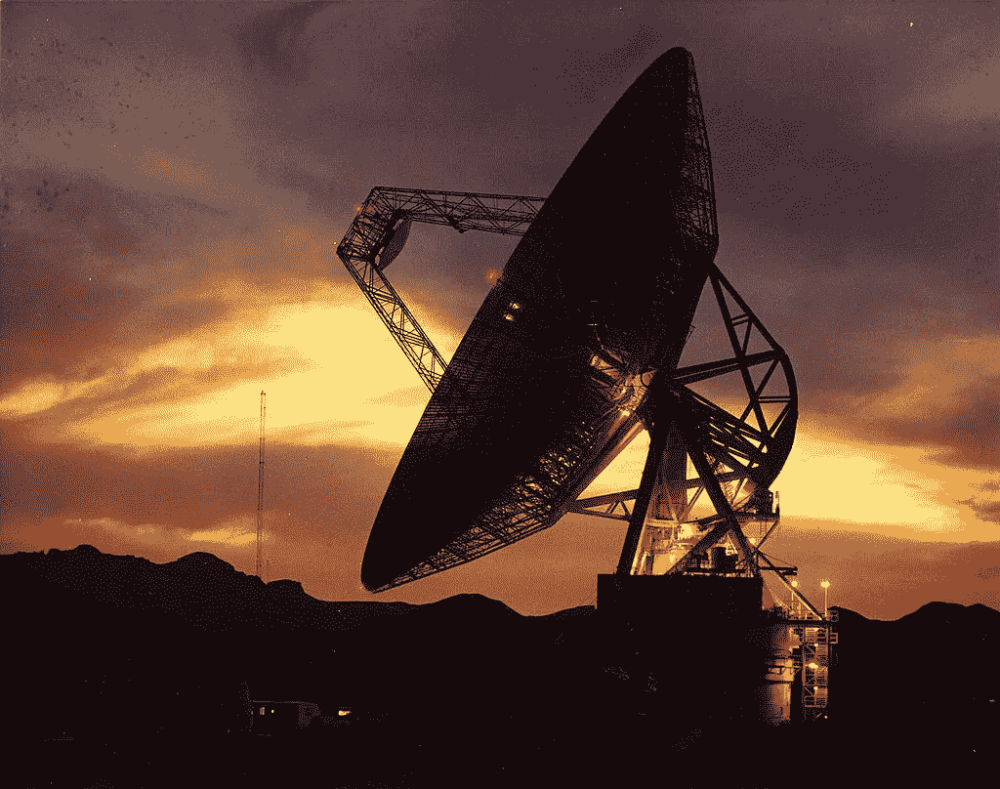

70 m antenna at Goldstone, California — [Image Source](https://en.wikipedia.org/wiki/Goldstone_Deep_Space_Communications_Complex)

## 美国宇航局行星数据系统

现在，这些数据到达地球后去了哪里？很高兴你问了。来自这些仪器中每一个的数据都存储在美国宇航局的行星数据系统(PDS)的远程节点中，这是一个分布式数据系统，美国宇航局用来存档太阳系任务收集的数据，能够经受住时间的考验，以便未来的科学家能够访问、理解和使用预先存在的行星数据。

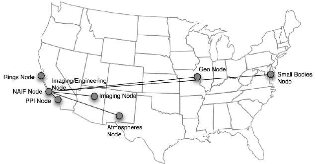

The geographic distribution of NASA’s Planetary Data System. There are nine nodes geographically distributed across the U.S., broken down by scientific expertise — [Image Source](https://www.researchgate.net/figure/The-geographic-distribution-of-NASAs-Planetary-Data-System-There-are-nine-nodes_fig5_226105026)

## 地球科学节点的轨道数据探测器

仅仅为了找到在特定纬度和经度拍摄的图像而搜索分散在多个区域的节点将是非常麻烦和低效的。因此，另一个称为地球科学节点的轨道数据探测器(ode)的系统将 PDS 档案数据从本地和远程节点加载到中央数据库，以便它可以通过以可扩展的方式提供高级搜索、检索和排序工具、集成分析和可视化工具来增强现有的 PDS 搜索和检索界面。

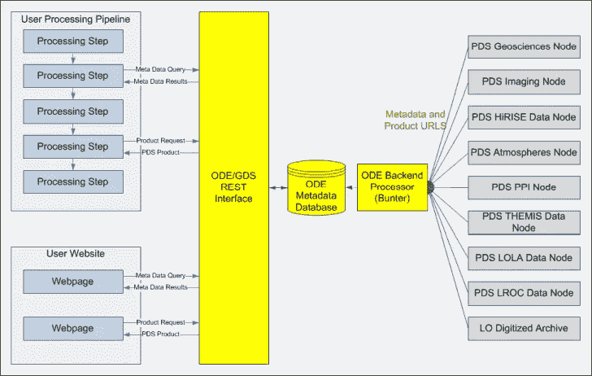

PDS and ODE systems — [Image Source](http://oderest.rsl.wustl.edu/)

## ODE 网络界面

ODE 网站为轨道数据探测器提供了一个用户友好的搜索界面，允许用户根据不同的标准搜索图像，如仪器类型、纬度、经度等。

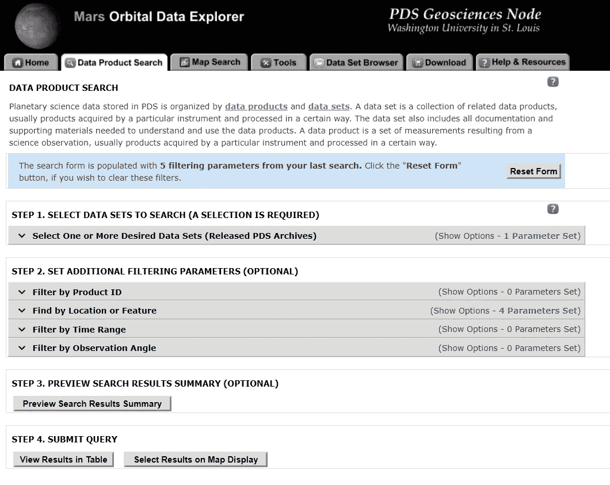

Data Product Search with Filters

它甚至支持[地图搜索](https://ode.rsl.wustl.edu/mars/indexMapSearch.aspx)，这相当于我们如何使用谷歌地图来搜索特定的地方*(我不知道火星的几个地区已经被命名了！)*

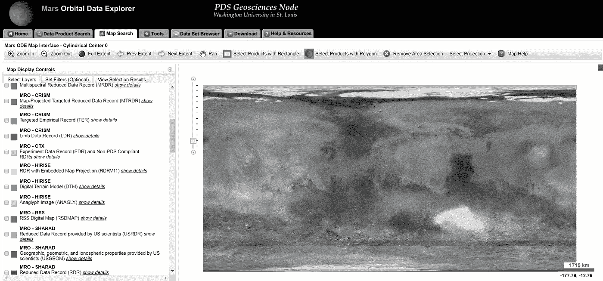

Interactive Map of the entire surface of Mars

## ODE REST 接口

然而，当我们希望搜索和下载来自火星不同地区的大量图像(超过 1000 张)时，网络界面并不是特别有用。这就是 [ODE REST 接口](http://oderest.rsl.wustl.edu/)出现的地方。它通过 HTTP 提供对 ODE 网站上的相同图像的编程访问。示例响应如下所示:

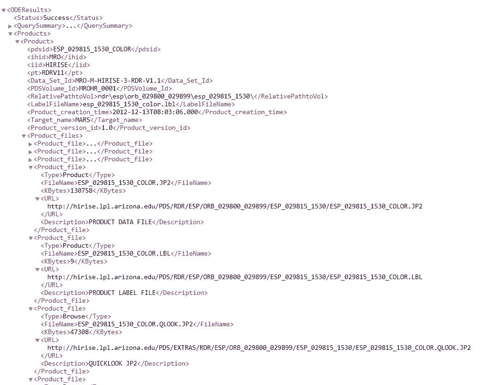

Sample Response for a query processed by the ODE REST Interface

## 庞大的 JPEG2000 文件

如果你仔细观察，你会注意到图像文件的 URL，而不是实际的图像本身。除此之外，图像文件的扩展名不是我们已经习惯的 JPG 或 PNG 格式。相反，它是一种叫做 JP2 的奇怪格式。

JPEG 2000 (JP2)是一种图像压缩标准和编码系统。它是由[联合图像专家组](https://en.wikipedia.org/wiki/Joint_Photographic_Experts_Group)委员会在 2000 年创建的，旨在取代他们最初的 [JPEG](https://en.wikipedia.org/wiki/JPEG) 标准(创建于 1992 年)，在压缩高分辨率图像方面更有效。它还提供了将图像分割成较小部分以独立编码的可能性，并提高了抗噪声能力。总的来说，JPEG 2000 是一种更灵活的文件格式。


[Image Source](https://www.google.com/url?sa=i&source=images&cd=&cad=rja&uact=8&ved=2ahUKEwjU673V6o3jAhWJPo8KHc4gAj8Qjhx6BAgBEAM&url=https%3A%2F%2Fcloudinary.com%2Fblog%2Fthe_great_jpeg_2000_debate_analyzing_the_pros_and_cons_to_widespread_adoption&psig=AOvVaw22b5GfCV6Gm_nEPGrqsGxs&ust=1561868219450321)

由于我们处理的是数千像素量级的高分辨率图像，我们不得不依赖这种高级的 JP2 格式，这种格式处理起来计算量很大，并且需要大量的内存来存储。难怪即使在 2019 年，这种格式也没有像 JPEG 格式一样在小规模设备中变得无处不在。

## 切掉大块

我如何在(̶E̶a̶r̶t̶h̶)火星上建立一个卷积神经网络来处理成千上万的这些 JP2 文件，每个图像的分辨率约为 25000 x 40000 像素，并希望它在我的有生之年完成？好吧，我们试图解决这个问题，从这个巨大的图像中分割出较小的、相同大小的块(大约 1024 x 1024 像素),并将每个块保存为 JPG 格式，这样 CNN 甚至可以考虑观看它。

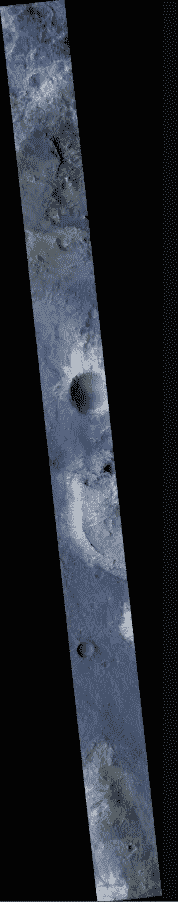

Low-Resolution JPG Thumbnail of a JP2 image before slicing (Used only for display purposes and isn’t the actual JP2 file) — [Image Source](https://hirise.lpl.arizona.edu/PDS/EXTRAS/RDR/ESP/ORB_029800_029899/ESP_029815_1530/ESP_029815_1530_COLOR.browse.jpg)

## 寻找可扩展的解决方案

我们的麻烦才刚刚开始，因为将一个 JP2 文件分割成块被证明是一个非常缓慢的过程——如果 python 程序在此之前设法不崩溃的话，处理一个图像需要大约 1 个小时。这是不可伸缩的。因此，发现了另一种切片方法，它不需要将整个 JP2 文件加载到内存中。它需要使用 rasterio 包，通过滑动窗口技术只获取 JP2 图像的一部分。

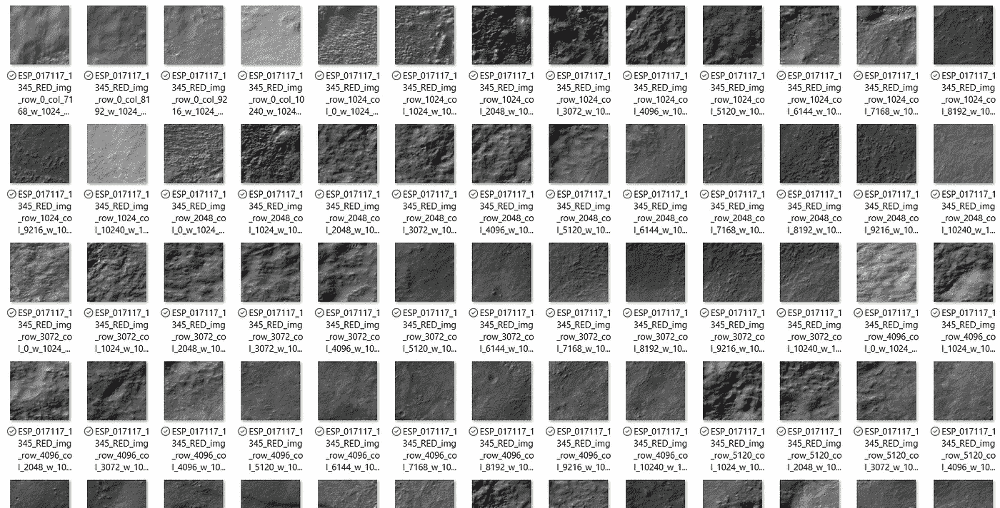

JPG Chunks from a single JP2 image

## 黑边和计算机视觉技巧

但这并不是结束。现在我们有了所有的块，我们手动浏览它们，却发现多个图像是全黑的或者有不规则的黑色边缘。事实上，大约 50%的块是黑色的。深入挖掘后，我们意识到这是因为 JP2 文件中的图像是地图投影的，这导致它沿着一个矩形区域的对角线排列，周围都是黑色的边缘。

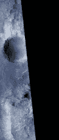

为了解决这个问题，一些计算机视觉技巧，如轮廓和阈值，被应用于识别这样的黑边；旋转并裁剪它们。除此之外，所有完全黑色的块都被丢弃。

## Numpy 数据集文件

最后，虽然块被单独保存在磁盘上，但我们也希望将这些块保存为 numpy 数组的集合，以便在训练机器学习模型之前可以轻松地将其作为数据集导入，类似于 keras 等库提供样本数据集的方式。这是通过聚集所有块并将它们保存在单个 npz 文件中实现的。

## 任务摘要

嗯，那是相当多的一口！让我总结一下到目前为止我们已经完成的步骤:

*   创建 HTTP 查询字符串以从 ODE REST 接口获取图像
*   解析查询响应 XML 并提取 JP2 URL
*   使用步骤 2 中获得的 URL 下载所有 JP2 图像
*   将每个 JP2 图像分割成较小的、大小相等的块
*   确定每个块中的黑色边距
*   通过旋转或裁剪来移除黑边，同时保留该块的原始分辨率，如果不可能，则丢弃整个块
*   (可选)聚合所有区块，并将其保存在单个 NPZ 文件中

如果所有这些步骤都是通过安装一个包并运行几个命令来完成的，那不是很好吗？

## 一体化 Python 包

嗯，我非常高兴地宣布，使用我们开发的一个名为" **mars-ode-data-access** "的小 python 包来执行所有这些步骤确实是可能的，可以在 https://github.com/samiriff/mars-ode-data-access 的[获得。](https://github.com/samiriff/mars-ode-data-access)

要安装此项目，只需运行以下命令:

```
pip install git+[https://github.com/usgs/geomag-algorithms.git](https://github.com/usgs/geomag-algorithms.git)
pip install git+[https://github.com/samiriff/mars-ode-data-access.git](https://github.com/samiriff/mars-ode-data-access.git)
```

它支持多个查询参数和块设置，并在内部利用以下包提供的一些功能:

*   [scikit-dataaccess](https://github.com/MITHaystack/scikit-dataaccess)
*   [自动复制](https://github.com/gerwin3/autocroppy)
*   [scikit-image](https://scikit-image.org)
*   [拉斯特里奥](https://rasterio.readthedocs.io/en/latest/quickstart.html)

为了在您的项目中使用 mars-ode-data-access 包，您必须导入相关的类:

确定并定义从轨道数据探测器获取所需的 JP2 图像所需的查询参数。例如，下面的片段演示了如何从凤凰号火星着陆点获取数据:

接下来，我们需要为每个下载的 JP2 图像将被分割到的每个块定义一些设置。下面是一个示例:

最后，我们需要做的就是获取结果并处理它们以创建块。这可以通过运行以下代码来完成:

瞧啊。当所有繁重的工作都在幕后为您完成时，您只需高枕无忧(处理每张 JP2 图像可能需要大约 6 分钟，具体取决于分辨率)。

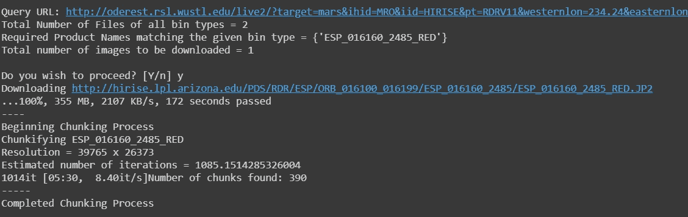

Sample Output after processing results of the Phoenix Landing Site

如果您想尝试这些 API，看看如何以 NPZ 格式保存这些块，您可以使用这个合作笔记本—[https://colab . research . Google . com/drive/1c-j-dblksxuvduhzsdqbp 87 ua 1et 2n](https://colab.research.google.com/drive/1c-j-DBLksxuvDUHZSdSDqBP87Ua1ET2N)

## 结论

如果没有**奥姆德纳人工智能挑战赛**提供的协作学习环境，以及来自拉德伯·米特拉、帕特里西奥·韦塞拉、丹尼尔·安格豪森和迈克尔·布哈特的专家建议和指导，这一壮举是不可能实现的。我还要感谢参与本项目的整个团队，特别要感谢 Conrad Wilkinson Schwarz、Sebastian Laverde、Sumbul Zehra、Murli Sivashanmugam、Marta Didych、Aman Dalmia 和 Indresh Bhattacharya，感谢他们为此项目做出的贡献。

总而言之，这对我来说是一次很好的学习和启发经历，我希望我能让你满意地一瞥我在过去 4 周内掌握的知识，亲爱的读者！所以，下一次你在夜空中发现这颗红色星球时，不要仅仅把它当成茫茫太空中的一个小点。请记住，这是一个宏伟的数据源，地球上的任何人都可以使用它来训练神经网络，并了解更多关于其表面和表面下的奥秘，从而提高人类在不久的将来踏上火星的机会…

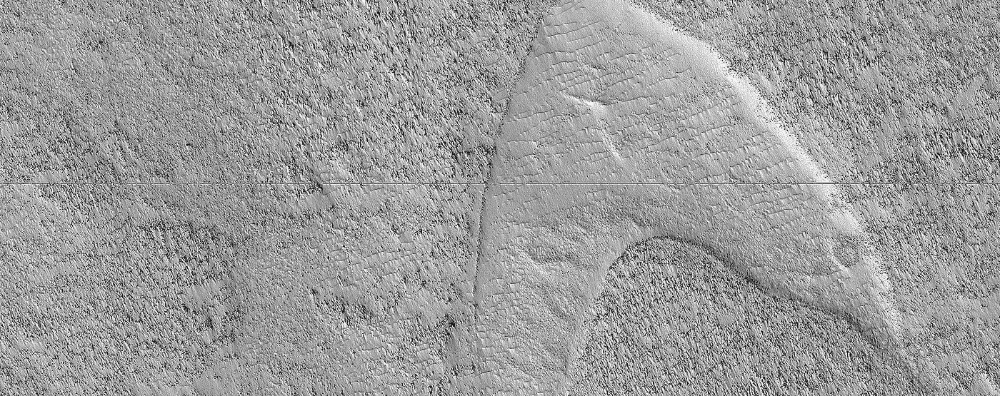

Dune shaped in the form of the Star Trek logo, discovered southeast Hellas Planitia ( [https://www.uahirise.org/ESP_059708_1305](https://www.uahirise.org/ESP_059708_1305))

## 参考

[1][https://mars . NASA . gov/news/ten-years-of-discovery-by-mars-respective-orbiter/](https://mars.nasa.gov/news/ten-years-of-discovery-by-mars-reconnaissance-orbiter/)
【2】[https://www . pops ci . com/mars-respective-orbiter-have-be-orbiter-being-on-10-years/](https://www.popsci.com/mars-reconnaissance-orbiter-has-been-orbiting-mars-for-10-years/)
【3】[https://ode.rsl.wustl.edu/mars/indexHelp.aspx](https://ode.rsl.wustl.edu/mars/indexHelp.aspx)
【4】[https://www.uahirise.org](https://www.uahirise.org/ESP_059708_1305)
【5】[http://www . Planetary](http://www.planetary.org/multimedia/space-images/charts/mars_landing_site_map_lakdawalla.html)