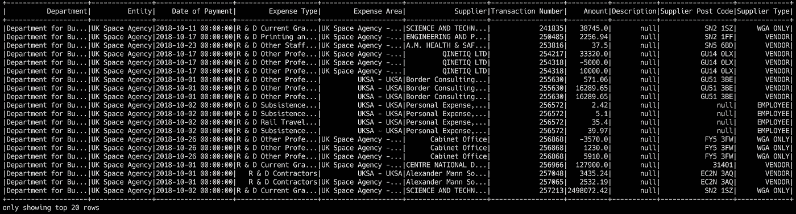

# Apache Spark 大数据之旅—第 2 部分

> 原文：<https://towardsdatascience.com/a-journey-into-big-data-with-apache-spark-part-2-4511aa19a900?source=collection_archive---------19----------------------->

## 介绍如何用 Scala 构建第一个 Apache Spark 应用程序来读取 CSV 文件。



A tabular view of a DataFrame from a CSV file in Apache Spark

欢迎回到(我希望成为的)关于了解 [Apache Spark](https://spark.apache.org) 的系列文章的第二部分。

在第一集[中，我们学习了如何使用 Docker 创建和运行 Apache Spark 集群。如果你还没有阅读，你可以在这里阅读。我将使用该集群作为运行我的 Spark 应用程序的集群，因此启动并运行它对您来说非常有用。](/a-journey-into-big-data-with-apache-spark-part-1-5dfcc2bccdd2)

我将使用 Scala 构建应用程序，因为我也想了解这一点。Scala 并不是我经常使用的东西，所以当我弄清楚一些事情的时候，请一定要忍耐一下:)。如果有更好的方法来做我做的任何事情，请让我知道——我随时欢迎反馈！

## 开始之前

本文不会深入探讨如何设置和配置 Scala 应用程序，因为我们的目标是快速启动和运行，并深入 Spark 的世界。Scala world 确实让这变得简单了，它提供了一个叫做 SBT 的工具，Scala Build Tool，有一些值得注意的东西只会让这变得更简单。

## 设置我们的环境

如果你读过我之前的帖子，我暗示我是一个 Docker 的超级粉丝，以真正的粉丝风格，我将使用已经包含 Scala 和 SBT 的 Docker 图像来帮助我的开发。我将要使用的 *Dockerfile* 可以在这里找到[。这个 *Dockerfile* 很棒，因为它在构建时接受环境参数，安装由这些参数指定的特定版本的 Scala 和 SBT(非常感谢原作者&贡献者！).我在 *Dockerfile* 中添加了我自己的小改动，主要是将`WORKDIR`设置为`/project`(因为那是我挂载项目目录的地方，就像我的代码一样)，并添加了一个`CMD`，以便在我们启动容器时启动到`sbt`控制台中。我们可以通过运行以下命令来构建映像:](https://github.com/ls12styler/scala-sbt/blob/master/Dockerfile)

```
docker build -t ls12styler/scala-sbt:latest \
    --build-arg SCALA_VERSION=2.12.8 \
    --build-arg SBT_VERSION=1.2.7 \
    github.com/ls12styler/scala-sbt
```

您可以看到我们将构建的图像标记为`ls12styler/scala-sbt:latest`，因此我们可以通过运行以下命令来简单地运行图像，让我们进入 bash shell，在我们之前配置的`WORKDIR`中:

```
docker run -it --rm ls12styler/scala-sbt:latest /bin/bash
```

我们可以通过运行`scala -version`和`sbt sbtVersion`来验证安装，得到以下输出:

```
bash-4.4# scala -version
Scala code runner version 2.12.8 -- Copyright 2002-2018, LAMP/EPFL and Lightbend, Inc.
bash-4.4# sbt sbtVersion
[warn] No sbt.version set in project/build.properties, base directory: /
[info] Set current project to root (in build file:/)
[info] 1.2.7
```

为了能够访问我们的本地文件，我们需要将一个卷从我们的工作目录挂载到正在运行的容器中的某个位置。我们可以通过简单地在我们的`run`命令中添加`-v`选项来做到这一点。我们将移除`/bin/bash`，这样我们就可以直接进入`sbt`控制台:

```
docker run -it --rm -v `pwd`:/project ls12styler/scala-sbt:latest
```

我们在这里所做的就是将`pwd`(当前工作目录)挂载到容器上的`/project`目录下。当运行上述内容时，我们将在 SBT 控制台的那个路径上结束:

```
[warn] No sbt.version set in project/build.properties, base directory: /project
[info] Set current project to project (in build file:/project/)
[info] sbt server started at local:///root/.sbt/1.0/server/07b05e14c4489ea8d2f7/sock
sbt:project>
```

## 设置我们的项目

在你的项目目录中创建一个名为`build.sbt`的新文件，用你最喜欢的编辑器打开它。用以下内容填充它，这些内容实际上是从[官方 Spark 文档](https://spark.apache.org/docs/latest/quick-start.html#self-contained-applications)中借用的，尽管略有改动:

```
name := "MyFirstScalaSpark"
version := "0.1.0"
scalaVersion := "2.11.12"
libraryDependencies += "org.apache.spark" %% "spark-sql" % "2.4.0"
```

这给了我们一个最小的项目定义来开始。*注意:我们已经将 Scala 版本指定为 2.11.12，因为 Spark 是针对 Scala 2.11 编译的，但是容器上的 Scala 版本是 2.12。*在 SBT 控制台中，运行`reload`命令，用新的构建设置刷新 SBT 项目:

```
sbt:local> reload
[info] Loading project definition from /project/project
[info] Loading settings for project project from build.sbt ...
[info] Set current project to MyFirstScalaSpark (in build file:/project/)
sbt:MyFirstScalaSpark>
```

您应该注意到控制台采用了我们项目的名称:`MyFirstScalaSpark`。现在我们有了一个构建项目的环境。我们写点代码吧！

## 我们的第一个应用

我们将进一步跟踪 Spark 文档，只是为了测试我们到目前为止的进展。

SBT 应用程序采用 Java 应用程序的标准目录结构，所以让我们在项目目录中创建一些新目录(使用`-p`标志将递归地创建目录):`mkdir -p ./src/main/scala/`

在新创建的目录中创建一个名为`MyFirstScalaSpark.scala`的新文件，并在您喜欢的编辑器中打开它。添加以下内容(同样，从原始内容略作调整):

```
package com.example
import org.apache.spark.sql.SparkSessionobject MyFirstScalaSpark {
  def main(args: Array[String]) {
    val SPARK_HOME = sys.env("SPARK_HOME")
    val logFile = s"${SPARK_HOME}/README.md"
    val spark = SparkSession.builder
      .appName("MyFirstScalaSpark")
      .getOrCreate()
    val logData = spark.read.textFile(logFile).cache()
    val numAs = logData.filter(line => line.contains("a")).count()
    val numBs = logData.filter(line => line.contains("b")).count()
    println(s"Lines with a: $numAs, Lines with b: $numBs")
    spark.stop()
  }
}
```

由于我们将在第 1 部分创建的集群上运行这个应用程序，我们知道将设置环境变量`$SPARK_HOME`并指向 Spark Workers 上的正确目录。在上面的代码中，我们简单地检索了`$SPARK_HOME`(应该是`/spark`)环境变量的内容，将其插入到我们正在使用的 Spark 发行版附带的`README.md`的文件路径中，创建我们的 Spark 会话，然后执行几个 MapReduce 过滤器来计算包含字母`a`或`b`的各种行数。然后，我们将这些计数输出到控制台。

现在我们已经有了一些需要实际编译的代码，我们可以创建一个 jar 并提交给 Spark 集群。在 SBT 控制台中，只需运行`package`来生成 jar。您应该会看到类似于以下内容的输出:

```
sbt:MyFirstScalaSpark> package
[info] Updating ...
[info] Done updating.
[warn] There may be incompatibilities among your library dependencies; run 'evicted' to see detailed eviction warnings.
[info] Compiling 1 Scala source to /project/target/scala-2.11/classes ...
[info] Done compiling.
[info] Packaging /project/target/scala-2.11/myfirstscalaspark_2.11-1.0.jar ...
[info] Done packaging.
[success] Total time: 11 s, completed Dec 27, 2018 3:22:16 PM
```

如您所见，jar 已经在容器内的`/project/target/scala-2.11/myfirstscalaspark_2.11-1.0.jar`输出，这意味着在本地，我们可以在``pwd`/target/scala-2.11/`中找到 jar。

## 提交我们的申请

现在是时候让我们在第 1 部分中创建的集群起死回生了！找到包含`docker-compose.yml`的目录并运行:

```
docker-compose up --scale spark-worker=2
```

这将产生一个 Spark Master 和两个 Spark Workers，这足以证明我们的第一个应用程序实际上是可行的。

在我们的项目目录中，我们可以使用我们在集群中创建的相同 Docker 映像作为我们的 Spark 驱动程序。Spark 驱动程序是我们向 Spark 集群提交应用程序的地方的名称，我们可以使用以下命令启动它:

```
docker run --rm -it -e SPARK_MASTER="spark://spark-master:7077" \
  -v `pwd`:/project --network docker-spark_spark-network \
  ls12styler/spark:latest /bin/bash
```

在这个命令中，我们设置了环境变量`$SPARK_MASTER`的内容，在容器上的`/project`下安装了`pwd`，将它附加到我们创建的 Docker 网络，并放入一个 bash shell 中。要提交我们的申请，只需将其提交给 spark driver:

```
bash-4.4# spark-submit --master $SPARK_MASTER \
  --class com.example.MyFirstScalaSpark \
  /project/target/scala-2.11/myfirstscalaspark_2.11-0.0.1.jar
```

当我们提交应用程序时，我们指定 Spark Master 的 URI、要运行的类名以及该类所在的 jar。当我们在项目目录中启动容器时，Spark Driver 容器可以访问我们构建的 jar，而不需要我们在底层文件系统中复制它。在提交给 Spark 的日志中，您会看到我们在代码输出中构建的行:

```
...
Lines with a: 62, Lines with b: 31
...
```

如果我们检查群集的日志，我们会看到如下所示的内容:

```
spark-master    | 2018-12-27 16:24:10 INFO  Master:54 - Registering app MyFirstScalaSpark
spark-master    | 2018-12-27 16:24:10 INFO  Master:54 - Registered app MyFirstScalaSpark with ID app-20181227162410-0005
spark-master    | 2018-12-27 16:24:10 INFO  Master:54 - Launching executor app-20181227162410-0005/0 on worker worker-20181227134310-172.21.0.4-39747
spark-master    | 2018-12-27 16:24:10 INFO  Master:54 - Launching executor app-20181227162410-0005/1 on worker worker-20181227134310-172.21.0.3-42931
spark-worker_1  | 2018-12-27 16:24:10 INFO  Worker:54 - Asked to launch executor app-20181227162410-0005/0 for MyFirstScalaSpark
spark-worker_2  | 2018-12-27 16:24:10 INFO  Worker:54 - Asked to launch executor app-20181227162410-0005/1 for MyFirstScalaSpark
```

这显示了我们的应用程序被注册到 Master 并被赋予一个 ID。然后在每个 Worker 上启动 Executors，然后在我们的应用程序运行时发生一系列其他事情。

我们已经成功构建了第一个基于 Scala 的 Spark 应用程序，并在第 1 部分构建的集群上运行。恭喜你！

## 还有一件事…

现在有一个小问题:这只在目前有效，因为我们很幸运地选择了一个文件，该文件可用于所有使用我们在第 1 部分中构建的相同映像的容器(Master、Worker & Driver)。如果我们希望能够访问没有捆绑在映像中的文件，例如主机文件系统上的某个文件，我们需要与 Spark Workers 共享该文件系统。这可以通过在我们启动集群时在`docker-compose`中挂载卷来轻松实现。在您的编辑器中打开`docker-compose.yml`,并在工作者服务声明的末尾添加以下 YAML:

```
 volumes:
      - "./:/local"
```

保存文件并重新启动集群。现在，我们的 Spark 员工之间有了一个共享目录。接下来，我们需要与驱动程序共享同一个目录(我们提交应用程序的目录)。这只是为了方便起见，所以我们可以使用 bash 自动完成来构建文件路径，并将其作为参数传递给应用程序。我们可以通过更新我们的`run`命令来包含新的卷(假设您运行`docker-compose up`的目录与您的项目目录在同一级别):

```
docker run --rm -it -e SPARK_MASTER="spark://spark-master:7077" \
  -v `pwd`:/project -v `pwd`/../docker-spark:/local \
  --network docker-spark_spark-network -w /project \
  ls12styler/spark:latest /bin/bash
```

这个容器现在有了我们的项目目录和共享数据目录，可以分别在`/project`和`/local`访问。

## 在 Spark 中读取 CSV 文件

在我们应用程序的第一次迭代中，我们使用了 Spark 中的`read.textFile`函数来加载一个 README，这个 README 已经对工作人员可用了。接下来，我们将使用`read.csv`，它将以一种我们可以执行操作的方式加载一个 CSV 文件。我将使用[英国航天局支出报告:2018 年 10 月](https://www.gov.uk/government/publications/uk-space-agency-spending-report-october-2018)数据来完成这篇文章的其余部分，我将把这些数据放入我在容器上的`/local`下安装的目录中。首先，我们将简单地使用`count`方法来查看文件中有多少行。我们还将通过传递给 jar 的命令行参数将 CSV 文件的文件路径传递给应用程序。

在编辑器中，打开`MyFirstScalaSpark.scala`文件并添加以下代码:

```
package com.example
import org.apache.spark.sql.SparkSessionobject MyFirstScalaSpark {
  def main(args: Array[String]) {
    val spark = SparkSession.builder
      .appName("MyFirstScalaSpark")
      .getOrCreate() val filePath = args(0)
    val data = spark.read
      .csv(filePath) println(data.count)
    spark.stop()
  }
}
```

我们实际上只是添加了使用参数来指定文件路径，并使用它作为用 Spark 打开的文件。Spark 会将该文件加载到一个数据帧中。然后，我们将数据帧中的行数打印到控制台。在 SBT 控制台中再次运行`package`来构建我们应用程序的新版本。提交构建的应用程序，这次传入我们使用的数据集的文件路径:

```
spark-submit --master $SPARK_MASTER \
  --class com.example.MyFirstScalaSpark \
  target/scala-2.11/myfirstscalaspark_2.11-1.0.jar \
  /local/UKSA_Oct_18_-_Transparency_Data.csv
```

在 Spark 的日志输出中，您应该看到数字`689`。命令行上的快速检查显示了相同的内容:

```
bash-4.4# wc -l /local/UKSA_Oct_18_-_Transparency_Data.csv
689 /local/UKSA_Oct_18_-_Transparency_Data.csv
```

## 获得正确的结构

然而，如果我们想要某种类似于“表格”的数据表示，行数可能不是这样。检查 CSV 文件的第一行显示该文件包含列标题，因此我们实际上只有 688 行数据。让我们来看看我们加载的数据的实际结构。在我们的代码中，我们可以添加`data.printSchema`来做到这一点:

```
 ...
    val data = spark.read
      .csv(filePath) **data.printSchema**
    ...
```

`package`并提交以查看类似下面的输出:

```
root
 |-- _c0: string (nullable = true)
 |-- _c1: string (nullable = true)
 |-- _c2: string (nullable = true)
 |-- _c3: string (nullable = true)
 |-- _c4: string (nullable = true)
 |-- _c5: string (nullable = true)
 |-- _c6: string (nullable = true)
 |-- _c7: string (nullable = true)
 |-- _c8: string (nullable = true)
 |-- _c9: string (nullable = true)
 |-- _c10: string (nullable = true)
```

这并没有告诉我们太多。共有 11 列，都是`string`类型，而且这些列都没有很好地命名。当使用 Spark 读取 CSV 文件时，我们可以指定一个选项，使用第一行作为列标题，然后使用剩余的行作为“表”的行。我们通过添加到`read`行将它添加到我们的应用程序中:

```
 val data = spark.read
      **.option("header", true)**
      .csv(filePath)
```

运行`package`构建一个新的 jar，然后再次提交给集群。我们现在应该可以在日志和下面的模式中看到数字`688`。您可以看到，我们现在有了已命名的列，而不是按位置命名的列:

```
root
 |-- Department: string (nullable = true)
 |-- Entity: string (nullable = true)
 |-- Date of Payment: string (nullable = true)
 |-- Expense Type: string (nullable = true)
 |-- Expense Area: string (nullable = true)
 |-- Supplier: string (nullable = true)
 |-- Transaction Number: string (nullable = true)
 |-- Amount: string (nullable = true)
 |-- Description: string (nullable = true)
 |-- Supplier Post Code: string (nullable = true)
 |-- Supplier Type: string (nullable = true)
```

所以我们现在已经有了正确的行数和一个已命名列的结构——太好了！仔细看看这个模式——我们所有的值都是类型`string`。同样，这不是很有帮助。我们应该和合适的类型一起工作。幸运的是，Spark 提供了另一个选项来尝试并最好地猜测文件的模式:`inferSchema`。我们可以像对待第一个选项一样，将它添加到我们的代码中:

```
 val data = spark.read
      .option("header", true)
      **.option("inferSchema", true)**
      .csv(filePath)
```

`package`然后提交，您将得到一个稍微改进的模式版本:

```
root
 |-- Department: string (nullable = true)
 |-- Entity: string (nullable = true)
 |-- Date of Payment: string (nullable = true)
 |-- Expense Type: string (nullable = true)
 |-- Expense Area: string (nullable = true)
 |-- Supplier: string (nullable = true)
 |-- Transaction Number: integer (nullable = true)
 |-- Amount: double (nullable = true)
 |-- Description: string (nullable = true)
 |-- Supplier Post Code: string (nullable = true)
 |-- Supplier Type: string (nullable = true)
```

更值得注意的是，`Transaction Number`和`Amount`字段现在分别是`integer`和`double`类型。其他的都保持为字符串，甚至是`Date of Payment`列。让我们变得迂腐些，让它成为`timestamp`类型。再次，火花来拯救！我们可以添加另一个选项来详细说明包含日期的列的格式:

```
 val data = spark.read
      .option("header", true)
      .option("inferSchema", true)
      **.option("timestampFormat", "dd/MM/yyyy")**
      .csv(filePath)
```

结果模式应该如下所示:

```
root
 |-- Department: string (nullable = true)
 |-- Entity: string (nullable = true)
 |-- Date of Payment: timestamp (nullable = true)
 |-- Expense Type: string (nullable = true)
 |-- Expense Area: string (nullable = true)
 |-- Supplier: string (nullable = true)
 |-- Transaction Number: integer (nullable = true)
 |-- Amount: double (nullable = true)
 |-- Description: string (nullable = true)
 |-- Supplier Post Code: string (nullable = true)
 |-- Supplier Type: string (nullable = true)
```

注意`Date of Payment`列现在是`timestamp`类型！我们现在有了一个类似表格的数据表示，其中包含了正确类型的列。来看看我们的数据吧！在`data.printSchema`行之后，插入以下内容:

```
 ...
    data.printSchema
    **data.show
    ...**
```

打包并提交应用程序，在输出日志中，我们将看到显示的前 20 行:

```
+--------------------+---------------+-------------------+--------------------+--------------------+--------------------+------------------+----------+-----------+------------------+-------------+
|          Department|         Entity|    Date of Payment|        Expense Type|        Expense Area|            Supplier|Transaction Number|    Amount|Description|Supplier Post Code|Supplier Type|
+--------------------+---------------+-------------------+--------------------+--------------------+--------------------+------------------+----------+-----------+------------------+-------------+
|Department for Bu...|UK Space Agency|2018-10-11 00:00:00|R & D Current Gra...|UK Space Agency -...|SCIENCE AND TECHN...|            241835|   38745.0|       null|           SN2 1SZ|     WGA ONLY|
|Department for Bu...|UK Space Agency|2018-10-17 00:00:00|R & D Printing an...|UK Space Agency -...|ENGINEERING AND P...|            250485|   2256.94|       null|           SN2 1FF|       VENDOR|
|Department for Bu...|UK Space Agency|2018-10-23 00:00:00|R & D Other Staff...|UK Space Agency -...|A.M. HEALTH & SAF...|            253816|      37.5|       null|           SN5 6BD|       VENDOR|
|Department for Bu...|UK Space Agency|2018-10-17 00:00:00|R & D Other Profe...|UK Space Agency -...|         QINETIQ LTD|            254217|   33320.0|       null|          GU14 0LX|       VENDOR|
|Department for Bu...|UK Space Agency|2018-10-17 00:00:00|R & D Other Profe...|UK Space Agency -...|         QINETIQ LTD|            254318|   -5000.0|       null|          GU14 0LX|       VENDOR|
|Department for Bu...|UK Space Agency|2018-10-17 00:00:00|R & D Other Profe...|UK Space Agency -...|         QINETIQ LTD|            254318|   10000.0|       null|          GU14 0LX|       VENDOR|
|Department for Bu...|UK Space Agency|2018-10-01 00:00:00|R & D Other Profe...|         UKSA - UKSA|Border Consulting...|            255630|    571.06|       null|          GU51 3BE|       VENDOR|
|Department for Bu...|UK Space Agency|2018-10-01 00:00:00|R & D Other Profe...|         UKSA - UKSA|Border Consulting...|            255630|  16289.65|       null|          GU51 3BE|       VENDOR|
|Department for Bu...|UK Space Agency|2018-10-01 00:00:00|R & D Other Profe...|         UKSA - UKSA|Border Consulting...|            255630|  16289.65|       null|          GU51 3BE|       VENDOR|
|Department for Bu...|UK Space Agency|2018-10-02 00:00:00|R & D Subsistence...|         UKSA - UKSA|Personal Expense,...|            256572|      2.42|       null|              null|     EMPLOYEE|
|Department for Bu...|UK Space Agency|2018-10-02 00:00:00|R & D Subsistence...|         UKSA - UKSA|Personal Expense,...|            256572|       5.1|       null|              null|     EMPLOYEE|
|Department for Bu...|UK Space Agency|2018-10-02 00:00:00|R & D Rail Travel...|         UKSA - UKSA|Personal Expense,...|            256572|      35.4|       null|              null|     EMPLOYEE|
|Department for Bu...|UK Space Agency|2018-10-02 00:00:00|R & D Subsistence...|         UKSA - UKSA|Personal Expense,...|            256572|     39.97|       null|              null|     EMPLOYEE|
|Department for Bu...|UK Space Agency|2018-10-26 00:00:00|R & D Other Profe...|UK Space Agency -...|      Cabinet Office|            256868|   -3570.0|       null|           FY5 3FW|     WGA ONLY|
|Department for Bu...|UK Space Agency|2018-10-26 00:00:00|R & D Other Profe...|UK Space Agency -...|      Cabinet Office|            256868|    1230.0|       null|           FY5 3FW|     WGA ONLY|
|Department for Bu...|UK Space Agency|2018-10-26 00:00:00|R & D Other Profe...|UK Space Agency -...|      Cabinet Office|            256868|    5910.0|       null|           FY5 3FW|     WGA ONLY|
|Department for Bu...|UK Space Agency|2018-10-01 00:00:00|R & D Current Gra...|UK Space Agency -...|CENTRE NATIONAL D...|            256966|  127900.0|       null|             31401|       VENDOR|
|Department for Bu...|UK Space Agency|2018-10-01 00:00:00|   R & D Contractors|         UKSA - UKSA|Alexander Mann So...|            257048|   3435.24|       null|          EC2N 3AQ|       VENDOR|
|Department for Bu...|UK Space Agency|2018-10-01 00:00:00|   R & D Contractors|UK Space Agency -...|Alexander Mann So...|            257065|   2532.19|       null|          EC2N 3AQ|       VENDOR|
|Department for Bu...|UK Space Agency|2018-10-02 00:00:00|R & D Current Gra...|UK Space Agency -...|SCIENCE AND TECHN...|            257213|2498072.42|       null|           SN2 1SZ|     WGA ONLY|
+--------------------+---------------+-------------------+--------------------+--------------------+--------------------+------------------+----------+-----------+------------------+-------------+
only showing top 20 rows
```

我们有一个有点宽的表(抱歉的格式！)，但你有望看到我们将要使用的一些价值观。

## 用我们的数据做些什么

现在我们已经有了一个真正的表状数据结构，我们可以开始进行分析了。首先，让我们简单地按`Date of Payment`列降序排列数据。当我们在数据帧上操作时，Spark 提供了许多函数来执行这样的操作。我们可以简单地使用`orderBy`函数来做我们想做的事情。我们还将使用`desc`函数，向它传递我们想要排序的列的名称。Spark 中对数据帧的任何操作都会返回一个新的数据帧，因此我们将把返回的数据帧分配给`orderedData`并显示它。我们还将输出的行数限制为 5，只是为了保持输出最小化。

```
 ...
    data.show

    **val orderedData = data.orderBy(desc("Date of Payment"))
    orderedData.show(5)**
    ...
```

`package`并提交，我们应该看到以下输出:

```
+--------------------+---------------+-------------------+--------------------+--------------------+--------------------+------------------+--------+-----------+------------------+-------------+
|          Department|         Entity|    Date of Payment|        Expense Type|        Expense Area|            Supplier|Transaction Number|  Amount|Description|Supplier Post Code|Supplier Type|
+--------------------+---------------+-------------------+--------------------+--------------------+--------------------+------------------+--------+-----------+------------------+-------------+
|Department for Bu...|UK Space Agency|2018-10-31 00:00:00|R & D Office Supp...|UK Space Agency -...| OFFICE DEPOT UK LTD|            261459|  145.57|       null|          SP10 4JZ|       VENDOR|
|Department for Bu...|UK Space Agency|2018-10-31 00:00:00|  R & D Other Travel|UK Space Agency -...|Personal Expense,...|            261508|    6.14|       null|              null|     EMPLOYEE|
|Department for Bu...|UK Space Agency|2018-10-31 00:00:00|R & D Other Profe...|UK Space Agency -...|Geospatial Insigh...|            261474| 13475.0|       null|           B46 3AD|        GRANT|
|Department for Bu...|UK Space Agency|2018-10-31 00:00:00|R & D Current Gra...|UK Space Agency -...|REACTION ENGINES LTD|            261327|167000.0|       null|          OX14 3DB|        GRANT|
|Department for Bu...|UK Space Agency|2018-10-31 00:00:00|R & D Hotel & Acc...|         UKSA - UKSA|Personal Expense,...|            261505|   114.0|       null|              null|     EMPLOYEE|
+--------------------+---------------+-------------------+--------------------+--------------------+--------------------+------------------+--------+-----------+------------------+-------------+
only showing top 5 rows
```

恭喜你！您已经能够使用 Apache Spark 加载 CSV 文件，并学习了如何使用带有`desc`的`orderBy`方法执行基本排序。

这一版就完成了！下次回来时，我们将研究如何使用 Spark 来回答一些基于我们已有数据的商业问题。