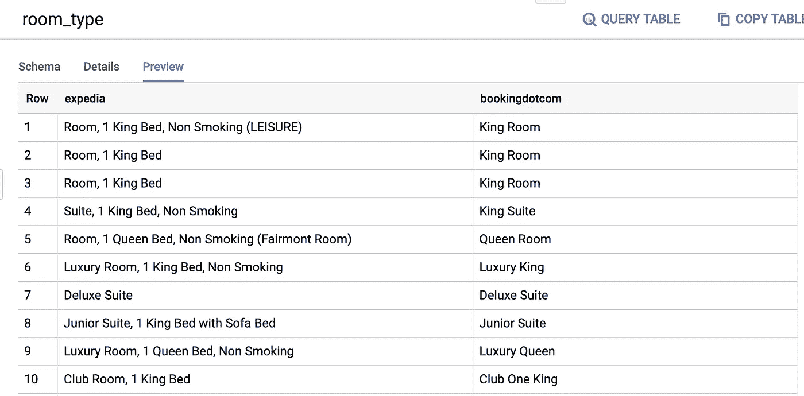
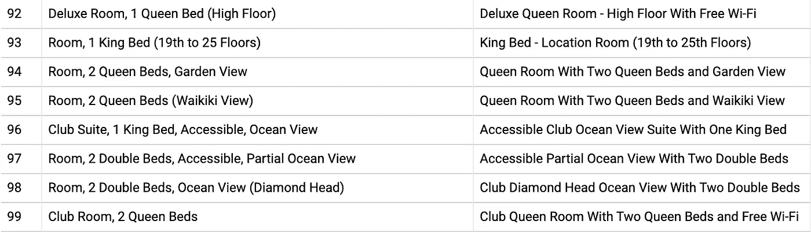
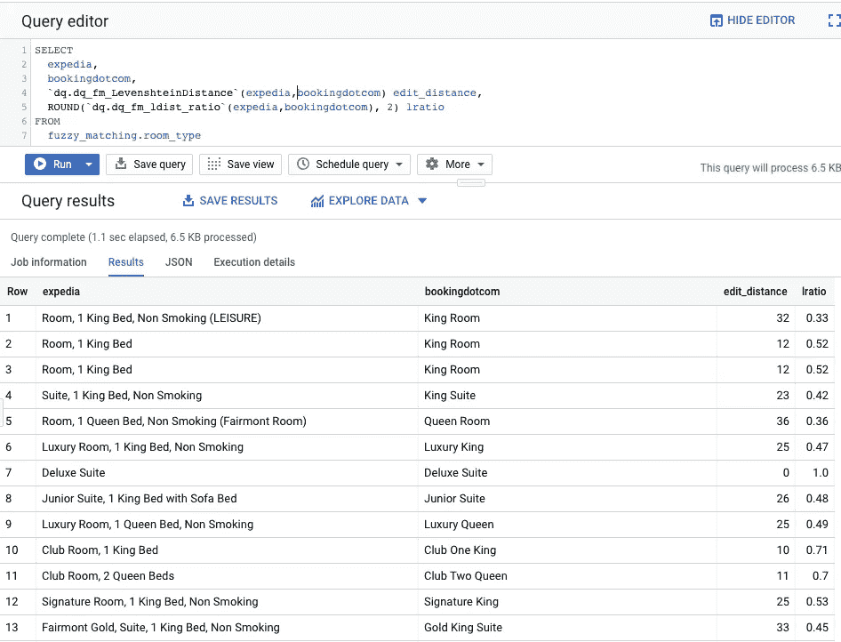
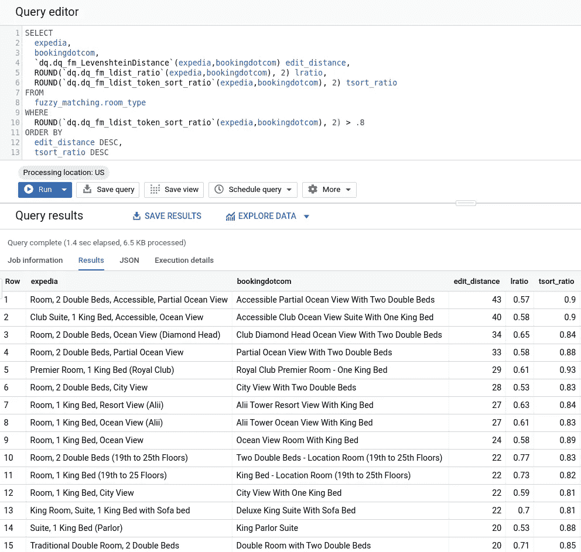
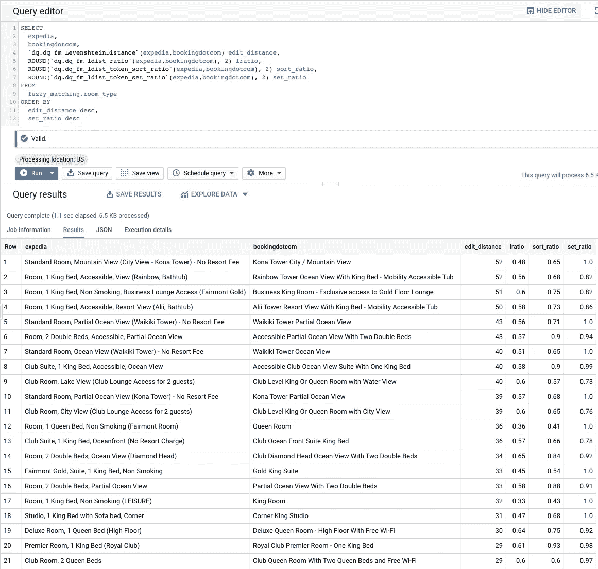
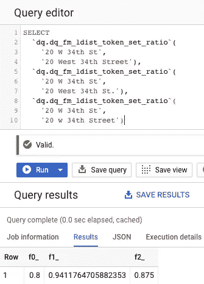

# BigQuery 模糊匹配之旅——[ 1，∞)之四——向 FuzzyWuzzy 致敬

> 原文：<https://towardsdatascience.com/a-journey-into-bigquery-fuzzy-matching-4-of-1-a-tribute-to-fuzzywuzzy-54ff73e91a1c?source=collection_archive---------16----------------------->

这是一个正在进行的系列的一部分，还有其他的好处潜伏在那里！所有模糊的善良！

*   【BigQuery 模糊匹配之旅—1/1，∞) — Soundex
*   【BigQuery 模糊匹配之旅—2/1，∞) —更多 Soundex 和 Levenshtein 距离
*   【BigQuery 模糊匹配之旅—3/1，∞) — NYSIIS

好的，我知道在上一篇文章中我说过我们将使用这个开始添加地址元素和匹配组(我保证他们还在路上)，但是我想稍微绕一下路，在我们到达那里之前添加另一组函数。

让我们重温一下 [Levenshtein 距离函数](https://medium.com/google-cloud/a-journey-into-bigquery-fuzzy-matching-2-of-1-more-soundex-and-levenshtein-distance-e64b25ea4ec7)。之前我们用它来计算两个字符串之间的编辑距离。它旨在确定一个字符串变成另一个字符串所发生的变化的数量，帮助我们确定两个字符串是否应该是相同的。我们看到了如何在单词中使用它，但是当我们开始在越来越复杂的字符串中使用它时会发生什么呢？

在我们进入一些例子之前，让我们首先建立如何计算相似比，以便更容易理解这些比较。这是普通字符与总字符的简单比率。

`((|a| + |b|) — ldist(a, b)) / (|a| + |b|)`

让我们创建一个函数来计算它，因为我们会经常用到它。

```
CREATE OR REPLACE FUNCTION
dq.dq_fm_ldist_ratio(a STRING, b STRING) AS ( 
/*
 * Data Quality Function - Fuzzy Matching
 * dq_fm_ldist_ratio
 * input: Two strings to compare.
 * returns: The Levenshtein similarity ratio.
 */
(LENGTH(a) + LENGTH(b) - `dq.dq_fm_LevenshteinDistance`(a, b)) 
  / (LENGTH(a) + LENGTH(b)) 
);
```

为了了解这些函数如何处理日益复杂的字符串，我们需要一个数据集来测试。我们将使用来自 Expedia 和 Booking.com 的房间描述数据集。我们将把它加载到一个新的数据集中(我将使用`fuzzy_matching`)并快速浏览一下。



So what are we supposed to call these, then?

这些字符串对代表同一个房间，但你可以看到它们可能被称为不同的东西。当我们深入挖掘数据时，我们会看到一些更复杂的组合。



a != b

因此，让我们尝试使用我们拥有的工具，并将它们应用到这个数据集，看看它们的表现如何(剧透:它不会是准确的)。



Well, it figured one of them out at least.

现在，在我们继续之前，重要的是要注意，Levenshtein 距离可以用两种不同的方式实现，取决于你如何权衡事物。一些实现将替换视为单个操作，替换和添加的权重相等。其他实现方式给替换权重为 2(一个减法+一个加法)。在比较任何实现时，重要的是要注意它是如何权衡的，否则你可能会以无法解释的计算差异而告终。在我们的比赛中，我们用换人作为得分的权重。

回到结果。正如所料，编辑距离非常长，因为我们将整个字符串视为单个标记。正因为如此，匹配率将会很低。我们需要做的是标记化这些字符串，并对它们进行更智能的比较。

输入 [FuzzyWuzzy](https://pypi.org/project/fuzzywuzzy/) 。字符串匹配库，而不是没有头发的熊。

FuzzyWuzzy 是一个 Python 库，它获取字符串，将其标记，然后以不同的方式匹配它们。这是一个可以利用的非常强大的包，但是 Python 不能被 BigQuery 使用。所以让我们看看我们是否能在 SQL 中复制一些这样的功能！

让我们从令牌排序比率开始。当您有非常相似但顺序不对的字符串标记时，这很方便。令牌排序比率的作用是将字符串分解成单个的令牌，按字母顺序对它们进行排序，将它们连接成一个字符串，然后基于此计算比率。为了实现这一功能，我们首先要创建两个助手函数，它们对数组进行分割、清理和排序。

```
CREATE OR REPLACE FUNCTION
dq.dq_hf_gh_clean_tokenize(a STRING) AS(
/*
 * (Helper) Data Quality Function
 * dq_hf_gh_clean_tokenize
 * This function removes all non-alphanumeric characters.
 * input: Uncleaned string
 * returns: String of tokenized and cleaned string.
 */
ARRAY(
  SELECT
    tokens
  FROM
    UNNEST(
      SPLIT(
        REGEXP_REPLACE(
          UPPER(
            TRIM(a)
          ), '[^a-zA-Z0-9 ]+', ''
        ), ' '
      )
    ) tokens
) 
);
```

添加另一个函数对其进行排序。

```
CREATE OR REPLACE FUNCTION
dq.dq_hf_gh_clean_sort_tokenize(a STRING) AS(
/*
 * (Helper) Data Quality Function
 * dq_hf_gh_clean_sort_tokenize
 * input: Uncleaned string
 * returns: String of tokenized, sorted, and cleaned string.
 */
ARRAY(
  SELECT
    x
  FROM
    UNNEST(`dq.dq_hf_gh_clean_tokenize`(a))
  AS x
  ORDER BY x)) ;
```

从这里，我们可以重新组装阵列，并进行比较。

```
CREATE OR REPLACE FUNCTION
dq.dq_fm_ldist_token_sort_ratio(a STRING, b STRING) AS( 
/*
 * Data Quality Function - Fuzzy Matching
 * dq_fm_ldist_token_sort_ratio
 * input: Two strings to compare.
 * returns: The Levenshtein similarity ratio with sorted tokens.
 */ 
`dq.dq_fm_ldist_ratio`(
  ARRAY_TO_STRING(`dq.dq_hf_gh_clean_sort_tokenize`(a),''),
  ARRAY_TO_STRING(`dq.dq_hf_gh_clean_sort_tokenize`(b), '')));
```

有了这两个，让我们继续将它添加到数据集，看看它是如何表现的。我们正在寻找具有高编辑距离(表明存在大量原始替换，因为一切都是无序的)和高排序率的条目，这意味着各个标记非常相似。



We’re starting to get some better matches!

这些结果表明，您可以使用它来匹配带有无序标记的字符串，同时允许一定程度的字符变化。

当字符串之间有一些共性，但其余字符串的令牌长度和实际内容却大相径庭时，会发生什么呢？这就是令牌集的用武之地！开发和开源 FuzzyWuzzy Python 包的 [SeatGeek](https://seatgeek.com/) 的人们在他们的[博客](https://chairnerd.seatgeek.com/fuzzywuzzy-fuzzy-string-matching-in-python/)上对它做了一个非常好的描述。我建议阅读他们的博客文章，以更好地理解这一切是如何工作的，但这里是它的要点。

> 1 —对于字符串`a`和`b`，对这两个字符串进行标记。
> 2 —创建三个字符串: `*t0 = sorted intersection of tokens from a and b
> t1 = t0 + sorted remainder of tokens from a
> t2 = t0 + sorted remainder of tokens from b*` *3 —从* `*ldist(t0,t1)*` *、* `*ldist(t0,t2)*` *和* `*ldist(t1,t2)*`返回最高比率

为什么会这样？正如 SeatGeek 的人解释的那样，“这里的直觉是，因为 SORTED_INTERSECTION 组件总是完全相同，所以当(a)它在整个字符串中占的百分比更大，并且(b)字符串的剩余部分更相似时，分数会增加。”让我们用一对房间描述来尝试一下，看看这是如何工作的。

```
a = "Deluxe Room, 1 Queen Bed (High Floor)"
b = "Deluxe Queen Room — High Floor With Free Wi-Fi"
```

对它们进行清理、排序和标记会给我们带来以下结果:

```
token_a =
  ['1','BED','DELUXE','FLOOR','HIGH','QUEEN','ROOM']
token_B = 
  ['DELUXE,'FI','FLOOR','FREE','HIGH','QUEEN','ROOM','WI','WITH']
```

相交的记号是，“豪华”、“楼层”、“高”、“女王”和“房间”。这给了我们以下三个字符串和比较:

```
t0 = 'DELUXEFLOORHIGHQUEENROOM'
t1 = 'DELUXEFLOORHIGHQUEENROOM1BED'
t2 = 'DELUXEFLOORHIGHQUEENROOMFIFREEWIWITH'`dq.dq_fm_ldist_ratio`(a, b) = 0.64
`dq.dq_fm_ldist_ratio`(t0, t1) = 0.92
`dq.dq_fm_ldist_ratio`(t0, t2) = 0.8
`dq.dq_fm_ldist_ratio`(t1, t2) = 0.83
```

所以这给了我们 0.92 的置信度，比原来的 0.64 高得多。这是可能的，因为交集由原始字符串的大部分组成，所以自然地，比较会很高。如果交集很小，但是剩余的令牌仍然相似，那么通过比较`t1`和`t2`，我们仍然可以获得高置信度得分。我们从多个角度被覆盖！

现在让我们弄清楚如何将它放入 BigQuery 函数中。我们在前面已经有了一个函数，可以清理、标记和排序字符串。我们现在需要构造一些东西来找到排序后的交集。

```
CREATE OR REPLACE FUNCTION
dq.dq_hf_gh_find_array_intersection(a ARRAY<STRING>, b ARRAY<STRING>) AS(
/*
 * (Helper) Data Quality Function
 * dq_hf_gh_find_array_intersection
 * input: Two arrays to compare
 * returns: Array with the common elements
 */
 ARRAY(
    SELECT
      *
    FROM
      UNNEST(a) AS a
    INTERSECT DISTINCT
    SELECT
      *
    FROM
      UNNEST(b) AS b )) ;
```

我们还需要一些东西来计算两组令牌之间的差异。

```
CREATE OR REPLACE FUNCTION
dq.dq_hf_gh_find_array_difference(a ARRAY<STRING>, b ARRAY<STRING>) AS(
/*
 * (Helper) Data Quality Function
 * dq_hf_gh_find_array_difference
 * input: Two arrays to compare
 * returns: Array with elements a - b.
 */
 ARRAY(
    SELECT
      *
    FROM
      UNNEST(a) AS a
    EXCEPT DISTINCT
    SELECT
      *
    FROM
      UNNEST(b) AS b )) ;
```

现在我们只需要创建字符串并找到三次比较的最大值。

```
CREATE OR REPLACE FUNCTION
dq.dq_fm_ldist_token_set_ratio(a STRING,
    b STRING) AS( 
/*
 * Data Quality Function - Fuzzy Matching
 * dq_fm_ldist_token_set_ratio
 * input: Two strings to compare.
 * returns: The Levenshtein similarity of the maximum ratio
 *   between the different token sets.
 */ 
ARRAY(
  SELECT
    MAX(x)
  FROM
    UNNEST( [
      # First ratio is sorted intersection and combined A diff B
      `dq.dq_fm_ldist_ratio`( 
        ARRAY_TO_STRING(`dq.dq_hf_gh_find_array_intersection`(
          `dq.dq_hf_gh_clean_sort_tokenize`(a),
          `dq.dq_hf_gh_clean_sort_tokenize`(b)),'')
        ,
        CONCAT(
          ARRAY_TO_STRING(`dq.dq_hf_gh_find_array_intersection`(
            `dq.dq_hf_gh_clean_sort_tokenize`(a),
            `dq.dq_hf_gh_clean_sort_tokenize`(b)),'')
        , 
          ARRAY_TO_STRING(`dq.dq_hf_gh_find_array_difference`(
            `dq.dq_hf_gh_clean_sort_tokenize`(a),
            `dq.dq_hf_gh_clean_sort_tokenize`(b)),'')))
    , 
      # Second ratio is sorted intersection and combined B diff A
      `dq.dq_fm_ldist_ratio`(     
        ARRAY_TO_STRING(`dq.dq_hf_gh_find_array_intersection`(
          `dq.dq_hf_gh_clean_sort_tokenize`(a),
          `dq.dq_hf_gh_clean_sort_tokenize`(b)),'')
        ,
        CONCAT(
          ARRAY_TO_STRING(`dq.dq_hf_gh_find_array_intersection`(
            `dq.dq_hf_gh_clean_sort_tokenize`(a),
            `dq.dq_hf_gh_clean_sort_tokenize`(b)),'')
        , 
          ARRAY_TO_STRING(`dq.dq_hf_gh_find_array_difference`(
            `dq.dq_hf_gh_clean_sort_tokenize`(b),
            `dq.dq_hf_gh_clean_sort_tokenize`(a)),'')))
    , 
      # Third ratio is A diff B and B diff A
      `dq.dq_fm_ldist_ratio`(
        CONCAT(
          ARRAY_TO_STRING(`dq.dq_hf_gh_find_array_intersection`(
            `dq.dq_hf_gh_clean_sort_tokenize`(a),
            `dq.dq_hf_gh_clean_sort_tokenize`(b)),'')
          , 
          ARRAY_TO_STRING(`dq.dq_hf_gh_find_array_difference`(
            `dq.dq_hf_gh_clean_sort_tokenize`(a),
            `dq.dq_hf_gh_clean_sort_tokenize`(b)),''))
        ,
        CONCAT(
          ARRAY_TO_STRING(`dq.dq_hf_gh_find_array_intersection`(
            `dq.dq_hf_gh_clean_sort_tokenize`(a),
            `dq.dq_hf_gh_clean_sort_tokenize`(b)),'')
          , 
          ARRAY_TO_STRING(`dq.dq_hf_gh_find_array_difference`(
            `dq.dq_hf_gh_clean_sort_tokenize`(b),
            `dq.dq_hf_gh_clean_sort_tokenize`(a)),''))) 
    ] ) AS x)[OFFSET(0)]
);
```

现在让我们在`room_data`表上运行这个程序，看看我们会得到什么。



Hooray! Matches!

通过一些函数，您现在能够执行一些更复杂的字符串比较。通过对标记集执行编辑距离比较，您可以超越单个单词匹配来查看更广泛的实体。这不仅对产品和描述有用，也适用于地址。地址匹配是实体解析的一个重要部分，像这样的匹配方法是其中的一个重要部分。让我们快速看一下它是什么样子的。

我们将使用[帝国大厦](https://www.google.com/maps/place/Empire+State+Building/@40.7484445,-73.9878531,17z/data=!3m1!4b1!4m5!3m4!1s0x89c259a9b3117469:0xd134e199a405a163!8m2!3d40.7484405!4d-73.9856644)的地址，并有目的地以几种不同的方式改变地址。列出的地址是纽约州纽约市第 34 街 20 号，邮编 10001。



These are okay.

考虑到我们只是在看纯粹的令牌字符串比较，这些匹配相当不错。在这些例子中，我们得到了很多变化，因为字符串很短，将像“St”这样小的东西改为“Street”会产生很大的影响。

如果实体的域是预先知道的，比如“我们知道这将是地址数据”，那么让一些令牌得到预处理和标准化确实很有帮助。例如，对于美国的地址，我们通常可以假设“St”和“Street”是相同的，“Ave”和“Avenue”是相同的，等等。这种特定领域的预处理可以帮助我们提高两组数据之间的匹配百分比！

至此，我们的模糊匹配工具箱又多了几个新成员。希望这是对 FuzzyWuzzy 的一个有价值的致敬。有了这些构件，我们可以开始将它们应用于复杂的数据集，并使用它们来构建一些基本的匹配组。我们将在下一轮开始查看这些，敬请关注！