# 卷积神经网络可视化之旅

> 原文：<https://towardsdatascience.com/a-journey-into-convolutional-neural-network-visualization-1abc71605209?source=collection_archive---------15----------------------->


Photo by [Ricardo Rocha](https://unsplash.com/photos/nj1bqRzClq8?utm_source=unsplash&utm_medium=referral&utm_content=creditCopyText) on [Unsplash](https://unsplash.com/search/photos/journey?utm_source=unsplash&utm_medium=referral&utm_content=creditCopyText)

关于计算机视觉有一个著名的都市传说。大约在 80 年代，美国军方希望使用神经网络来自动检测伪装的敌人坦克。他们拍了一些没有坦克的树的照片，然后拍了同样的树后面有坦克的照片。结果令人印象深刻。如此令人印象深刻，以至于军方想确定网络已经正确地概括了。他们拍摄了有坦克和没有坦克的树林的新照片，并在网络上再次展示。这一次，这个模型表现得很糟糕，它无法区分树林后面有坦克的图片和只有树的图片。原来没有坦克的照片都是阴天拍的，而有坦克的照片是晴天拍的！在现实中，网络学习识别天气，而不是敌人的坦克。

源代码可以在这里找到[。](https://github.com/FrancescoSaverioZuppichini/A-journey-into-Convolutional-Neural-Network-visualization-)

这篇文章也可以作为交互式 [jupyter 笔记本](https://github.com/FrancescoSaverioZuppichini/A-journey-into-Convolutional-Neural-Network-visualization-/blob/master/notebook.ipynb)

# 没有自己的事情

在这篇文章中，我们将看到不同的技术来*理解*卷积神经网络内部发生了什么，以避免犯同样的美国陆军错误。

我们将使用 [Pytorch](https://pytorch.org/) 。所有的代码都可以在这里找到。大部分可视化都是从零开始开发的，然而，一些灵感和部分是从[这里](https://github.com/utkuozbulak/pytorch-cnn-visualizations/tree/master/src)中获取的。

我们将首先介绍每种技术，对其进行简要解释，并在不同经典计算机视觉模型`alexnet`、`vgg16`和`resnet`之间进行一些示例和比较。然后，我们将尝试更好地理解机器人技术中使用的模型，仅使用正面摄像机的图像来预测本地距离传感器。

我们的目标不是详细解释每种技术是如何工作的，因为每篇论文都已经做得非常好了，而是使用它们来帮助读者可视化不同输入的不同模型，以更好地理解和突出不同模型对给定输入的反应。

稍后，我们将展示一个工作流程，在该流程中，我们将利用您在本次旅程中学到的一些技术来测试模型的健壮性，这对于理解和修复其局限性非常有用。

好奇的读者可以通过查看每个可视化的[源代码](https://github.com/FrancescoSaverioZuppichini/A-journey-into-Convolutional-Neural-Network-visualization-/tree/master/visualization/core)和阅读参考资料来进一步理解。

# 序言

让我们从选择一个网络开始我们的旅程。我们的第一个模型将是老学校`alexnet`。Pytorch 的 `torchvision.models`包中已经提供了它

```
AlexNet( (features): Sequential( (0): Conv2d(3, 64, kernel_size=(11, 11), stride=(4, 4), padding=(2, 2)) (1): ReLU(inplace) (2): MaxPool2d(kernel_size=3, stride=2, padding=0, dilation=1, ceil_mode=False) (3): Conv2d(64, 192, kernel_size=(5, 5), stride=(1, 1), padding=(2, 2)) (4): ReLU(inplace) (5): MaxPool2d(kernel_size=3, stride=2, padding=0, dilation=1, ceil_mode=False) (6): Conv2d(192, 384, kernel_size=(3, 3), stride=(1, 1), padding=(1, 1)) (7): ReLU(inplace) (8): Conv2d(384, 256, kernel_size=(3, 3), stride=(1, 1), padding=(1, 1)) (9): ReLU(inplace) (10): Conv2d(256, 256, kernel_size=(3, 3), stride=(1, 1), padding=(1, 1)) (11): ReLU(inplace) (12): MaxPool2d(kernel_size=3, stride=2, padding=0, dilation=1, ceil_mode=False) ) (classifier): Sequential( (0): Dropout(p=0.5) (1): Linear(in_features=9216, out_features=4096, bias=True) (2): ReLU(inplace) (3): Dropout(p=0.5) (4): Linear(in_features=4096, out_features=4096, bias=True) (5): ReLU(inplace) (6): Linear(in_features=4096, out_features=1000, bias=True) ) )
```

现在我们需要一些输入

现在我们需要一些输入图像。我们将使用三张图片，一只猫，美丽的圣彼得大教堂和一只狗和一只猫的图像。

我们装了一些包裹。在`utils`中，有几个效用函数来创建地块。

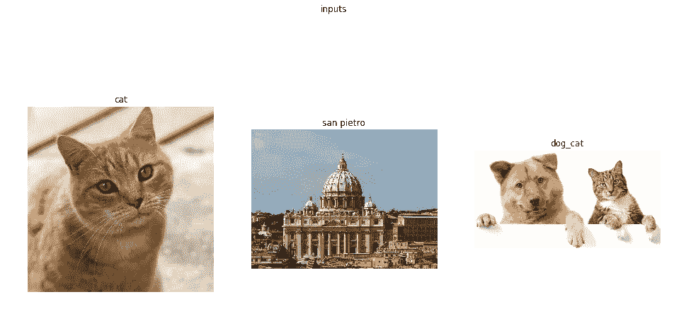

由于我们所有的模型都是在 [imagenet](http://www.image-net.org/) 上训练的，这是一个包含`1000`不同类的巨大数据集，我们需要解析并规范化它们。

在 Pytorch 中，我们必须手动将数据发送到设备。在这种情况下，设备如果第一个`gpu`如果有，否则`cpu`被选中。

请注意，jupyter 没有垃圾收集，所以我们需要手动释放 gpu 内存。

我们还定义了一个实用函数来清理 gpu 缓存

正如我们所说的，`imagenet`是一个包含`1000`类的巨大数据集，由一个不太容易被人类理解的整数表示。我们可以通过加载`imaganet2human.txt`将每个类 id 与其标签相关联，并创建一个 python 字典。

```
[(0, 'tench Tinca tinca'), (1, 'goldfish Carassius auratus')]
```

# 权重可视化

第一个直观的方法是绘制目标层的权重。显然，当通道数增加时，我们越深入，每个图像变得越小。我们将每个通道显示为灰色阵列图像。不幸的是，每个 Pytorch 模块都可以嵌套，所以为了使我们的代码尽可能通用，我们首先需要跟踪输入遍历的每个子模块，然后按顺序存储每一层。我们首先需要`trace`我们的模型来获得所有层的列表，这样我们就可以选择一个目标层，而不用遵循模型的嵌套结构。在`PyTorch`中，模型可以无限嵌套。换句话说，我们在奉承模型的层，这是在`[module2traced](https://github.com/FrancescoSaverioZuppichini/A-journey-into-Convolutional-Neural-Network-visualization-/blob/master/utils.py#)`函数中实现的。

```
[Conv2d(3, 64, kernel_size=(11, 11), stride=(4, 4), padding=(2, 2)), ReLU(inplace), MaxPool2d(kernel_size=3, stride=2, padding=0, dilation=1, ceil_mode=False), Conv2d(64, 192, kernel_size=(5, 5), stride=(1, 1), padding=(2, 2)), ReLU(inplace), MaxPool2d(kernel_size=3, stride=2, padding=0, dilation=1, ceil_mode=False), Conv2d(192, 384, kernel_size=(3, 3), stride=(1, 1), padding=(1, 1)), ReLU(inplace), Conv2d(384, 256, kernel_size=(3, 3), stride=(1, 1), padding=(1, 1)), ReLU(inplace), Conv2d(256, 256, kernel_size=(3, 3), stride=(1, 1), padding=(1, 1)), ReLU(inplace), MaxPool2d(kernel_size=3, stride=2, padding=0, dilation=1, ceil_mode=False), Dropout(p=0.5), Linear(in_features=9216, out_features=4096, bias=True), ReLU(inplace), Dropout(p=0.5), Linear(in_features=4096, out_features=4096, bias=True), ReLU(inplace), Linear(in_features=4096, out_features=1000, bias=True)]
```

让我们画出第一层的重量。我们还打印出重量的形状，以便给读者一个正确的降维概念。

```
torch.Size([1, 55, 55])
```

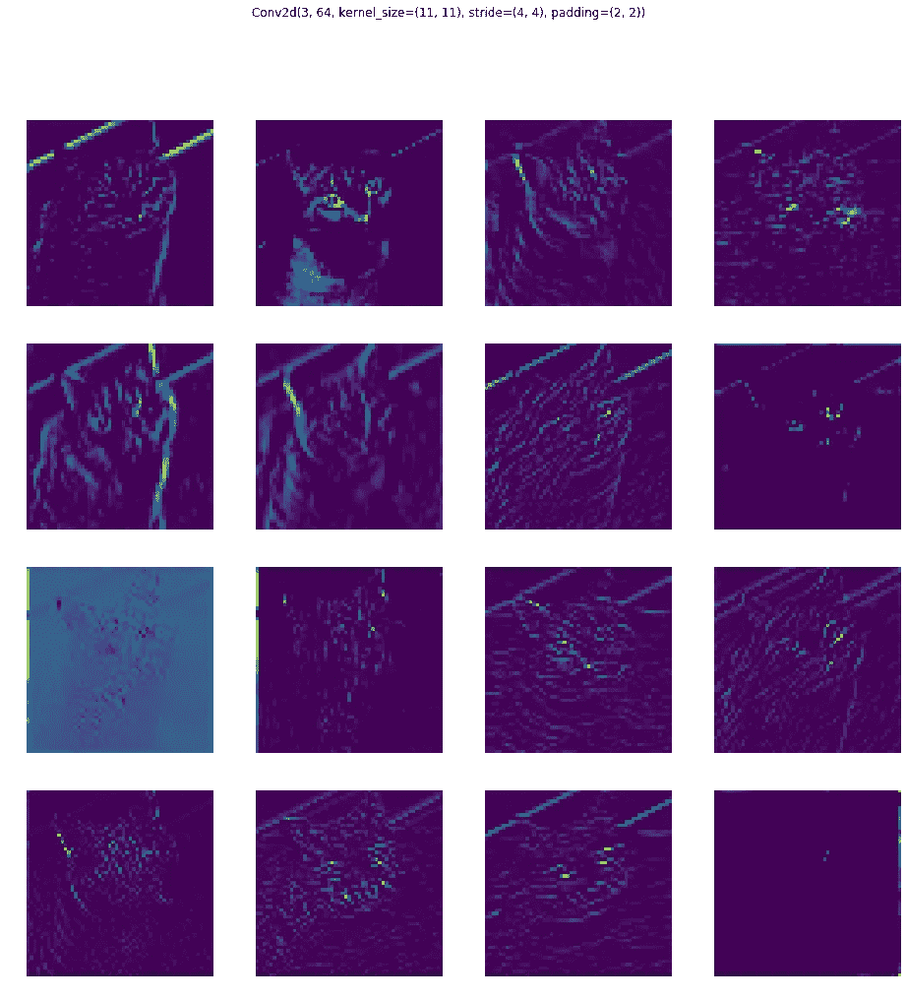

让我们停下来解释一下这些图像代表了什么。我们通过计算图追踪输入，以便找出我们模型的所有层，在本例中是`alexnet`。然后我们实例化在`visualization.core`中实现的`Weights`类，我们通过传递当前输入、**猫**图像和**目标层**来调用它。作为输出，我们将当前层的所有权重作为灰色图像。然后，我们画出其中的 16 个。我们可以注意到，它们在某种程度上是有意义的；例如，图像边缘的一些像素更亮。

让我们绘制第一个`MaxPool`层，以便更好地看到这种效果，维度减少和一些有趣区域的更高亮度像素。

如果你想知道 maxpolling 操作在做什么，看看这个棒极了的[回购](https://github.com/vdumoulin/conv_arithmetic)

```
torch.Size([1, 27, 27])
```

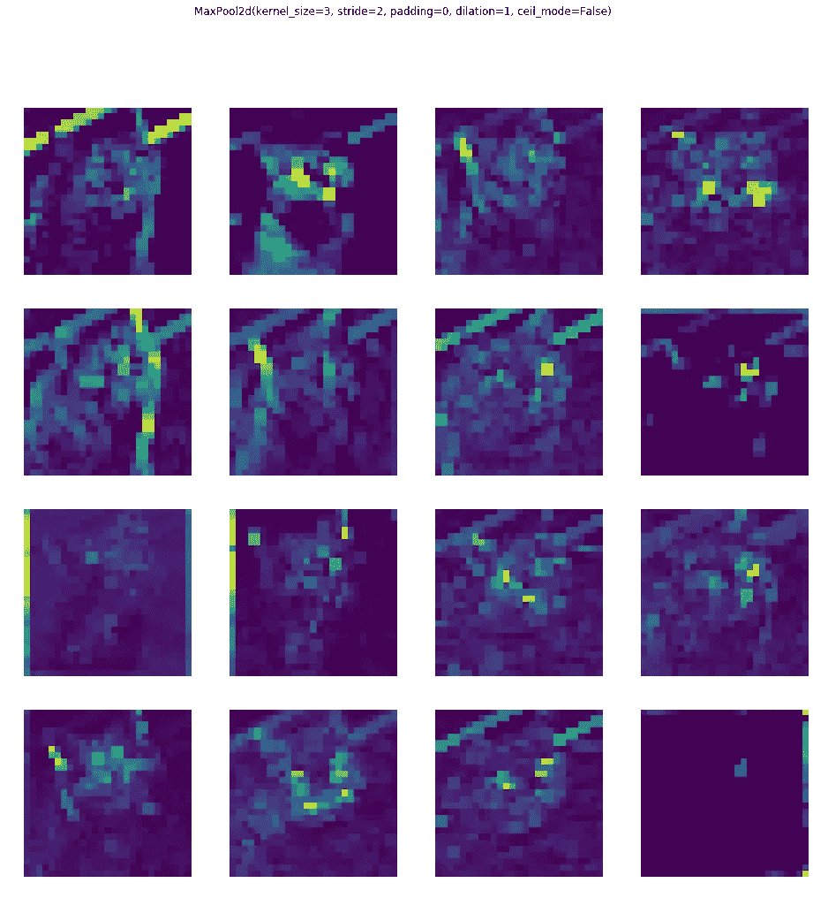

让我们试试另一个输入，圣彼得大教堂

```
torch.Size([1, 27, 27])
```

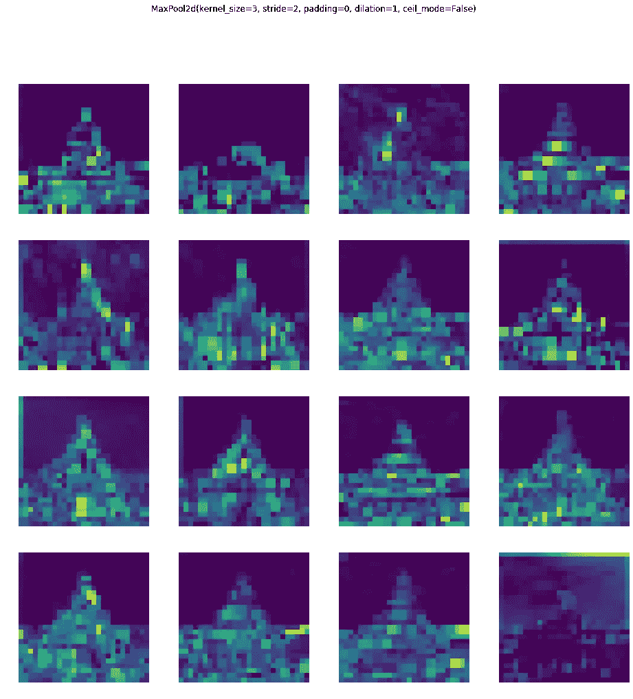

通过观察它们，这些图像在某种程度上变得有意义；他们强调了巴西利卡的布局，但是很难理解这个模型实际上在做什么。我们的想法是，正确地计算一些东西，但是我们可以问一些问题，例如:它是在看圆顶吗？巴西利卡最重要的特征是什么？

此外，我们越深入，就越难识别输入。

```
torch.Size([1, 13, 13])
```

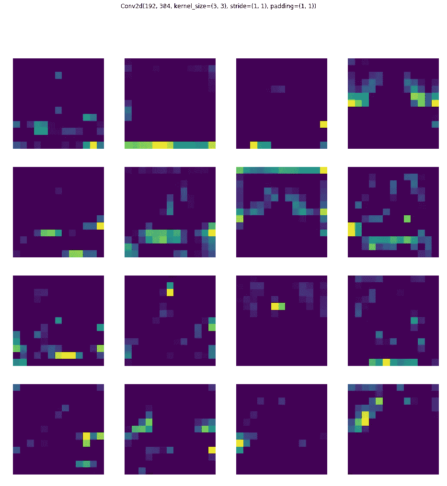

在这种情况下，我们不知道发生了什么。可以认为，权重可视化并不携带任何关于模型的有用信息，即使这几乎是真实的，也有一个绘制权重的好理由，尤其是在第一层。

当模型训练很差或根本没有训练时，第一个权重有很多噪声，因为它们只是随机初始化的，并且它们比训练的图像更类似于输入图像。这一特性有助于即时了解模型是否经过训练。然而，除此之外，重量可视化并不是了解您的黑盒在想什么的方法。下面，我们首先为未训练版本的`alexnet`和训练版本的绘制第一层的权重。

```
torch.Size([1, 55, 55]) torch.Size([1, 55, 55])
```

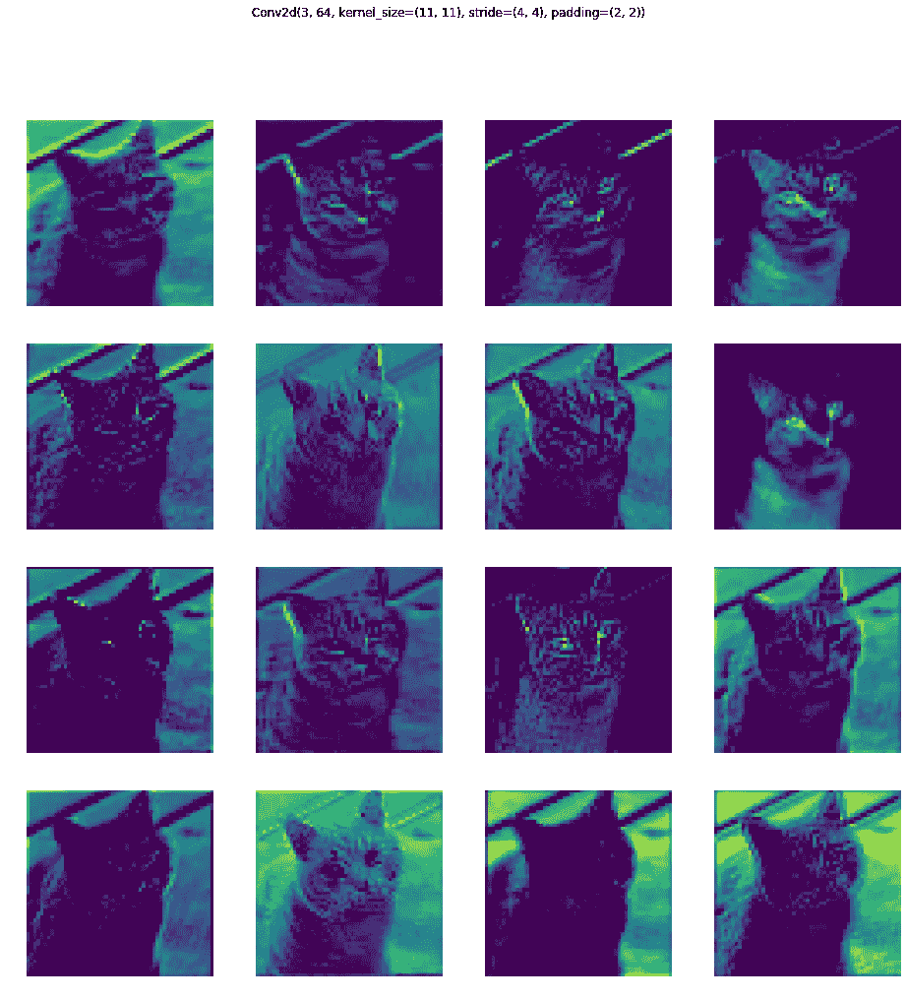

您可以注意到，在第一幅图像中可以更容易地看到输入图像。这不是一个通用的规则，但在某些情况下它会有所帮助。

# 与其他模型的相似之处

我们已经看到了`alexnet`的重量，但它们在不同型号之间相似吗？下面我们为`alexnet`、`vgg`和`resnet`绘制每个第一层的前 4 个通道的权重

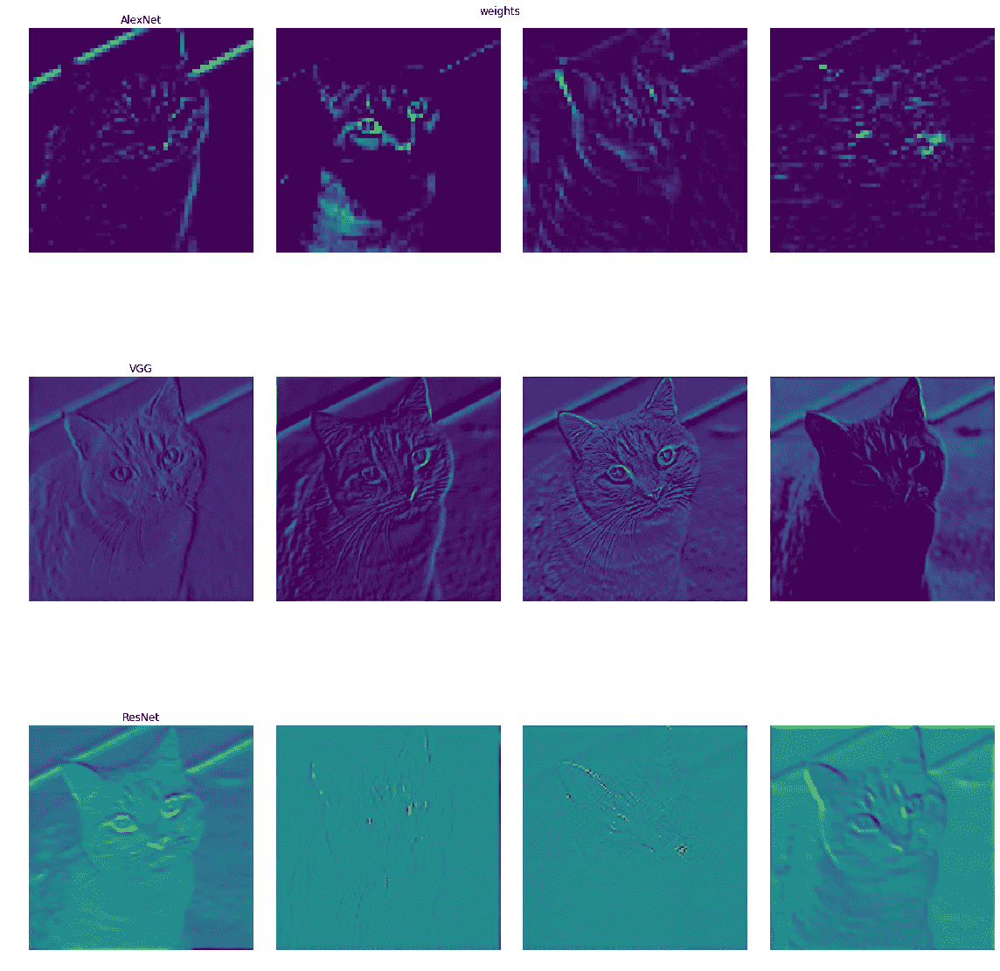

`resnet`和`vgg`权重看起来比`alexnet`更类似于输入图像。但是，这又意味着什么呢？请记住，至少 resnet 的初始化方式与其他两个模型不同。

# 显著性可视化

由 [*深度卷积网络提出的一个想法:可视化图像分类模型和显著图*](https://arxiv.org/abs/1312.6034) 是相对于目标类别反向支持网络的输出，直到输入并绘制计算的梯度。这将突出显示负责该类的图像部分。先说 alexnet。

让我们首先打印网络的预测(如果重新运行单元，这可能会改变)

```
predicted class tiger cat
```

每个可视化都在自己的类中实现。你可以在这里找到代码。它将反向传播与对应于`class tiger cat`的数字的一个热编码表示相关的输出

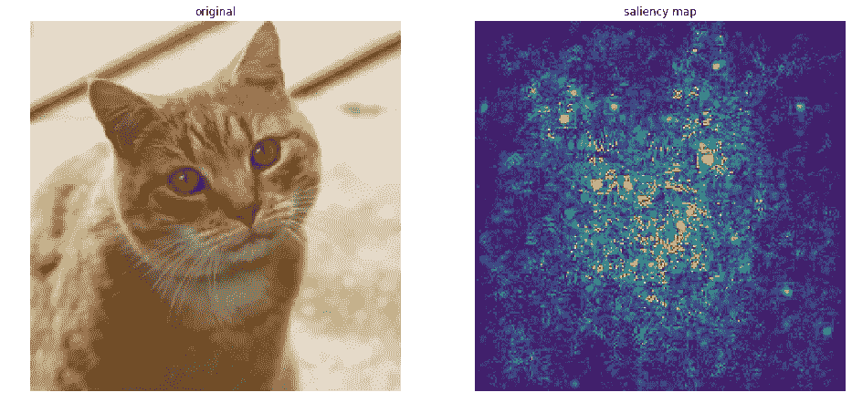

我们可以看到`alexnet`对猫感到兴奋。我们甚至可以做得更好！反向推进时，我们可以将每个**设置为`0`负** relu 梯度。这项技术被称为`guided`。

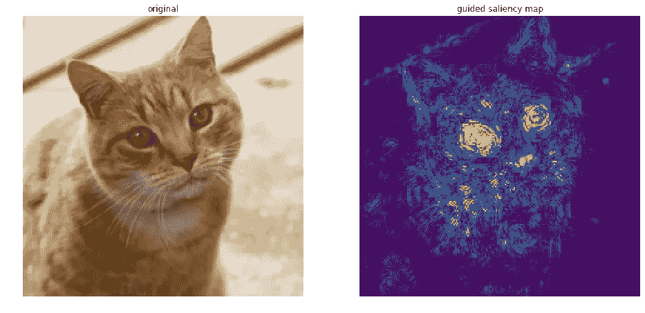

现在我们可以清楚地看到，网络在看猫的眼睛和鼻子。我们可以试着比较不同的模型

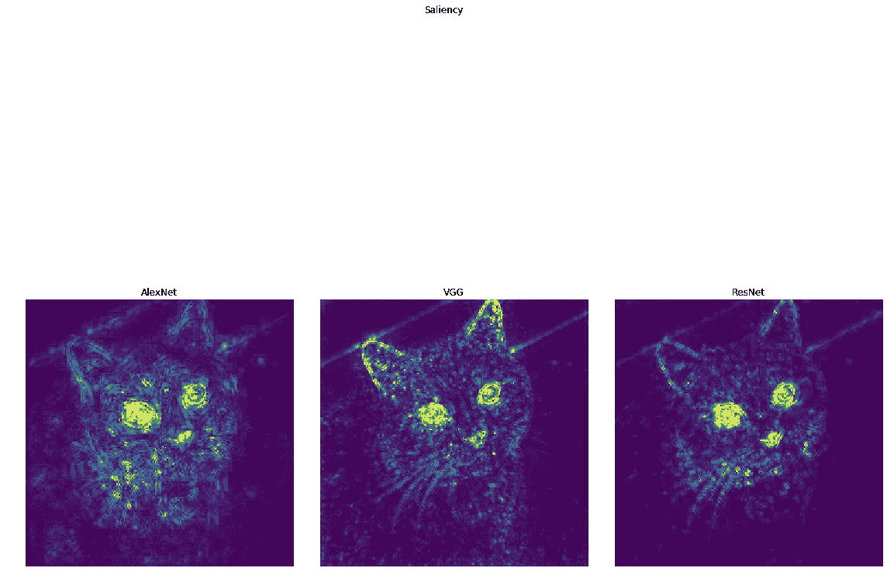

`Alextnet`似乎对眼睛更感兴趣，而`VGG`看耳朵，resnet 类似于`alexnet`。现在我们可以清楚地了解输入的哪一部分有助于网络给出预测。

虽然引导产生了更好的人可理解的图像，但是普通的实现可以用于定位感兴趣的对象。换句话说，我们可以通过从输入图像中裁剪出对应于梯度的区域来免费找到感兴趣的对象。让我们为每个模型绘制每个输入图像。

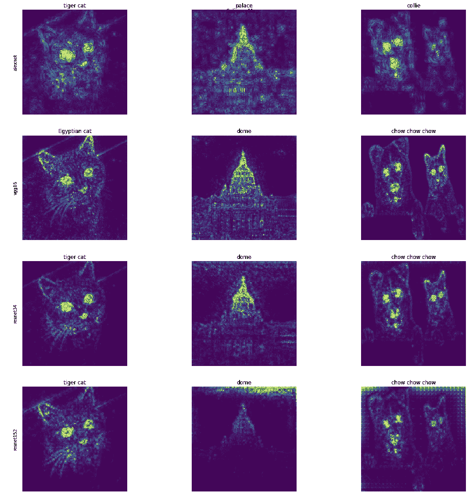

巴西利卡非常有趣，所有四个网络都正确地将其归类为`dome`，但只有`resnet152`对天空比对圆顶更感兴趣。在最后一列中，我们有一个包含两个类的图像，`dog`和`cat`。所有的网络都突出了展台，就像`vgg16`中的狗的眼睛和猫的耳朵。如果我们只想发现与特定类相关的输入区域，该怎么办？用这种技术是不可能的。

# 类激活映射

*类别激活映射*是在[学习深度特征用于鉴别定位](https://arxiv.org/pdf/1512.04150.pdf)中提出的技术。其思想是使用最后的卷积层输出和模型的线性层中负责目标类的神经元，通过取它们的点积来生成映射。然而，为了使这个工作，模型必须有一些约束。首先，卷积的输出必须首先通过**全局平均轮询**，它要求特征映射直接位于 softmax 层之前。为了让它与其他架构一起工作，比如`alexnet`和`vgg`，我们必须改变模型中的一些层并重新训练它。这是一个主要缺点，将在下一节中解决。目前，我们可以通过 resnet 免费使用它！因为它的建筑是完美的。

实现可以在[这里](https://github.com/FrancescoSaverioZuppichini/A-journey-into-Convolutional-Neural-Network-visualization-/blob/master/visualization/core/ClassActivationMapping.py)找到。我们可以向可视化传递一个`target_class`参数，以从 fc 层获得相对权重。

请注意，通过更改目标类，我们可以看到图像的不同部分被突出显示。第一个图像使用预测类，而第二个使用另一种类型的`cat`和最后一个`bookcase`，只是为了看看模型会对错误的类做什么。

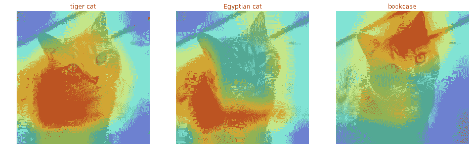

这是有意义的，唯一的事情是在最后一行我们仍然有猫的一部分为`bookcase`高亮显示

让我们在不同的`resnet`建筑的`cat`图像上绘制 CAM。对于 resnet > 34，使用`Bottleneck`模块

```
Clipping input data to the valid range for imshow with RGB data ([0..1] for floats or [0..255] for integers). Clipping input data to the valid range for imshow with RGB data ([0..1] for floats or [0..255] for integers).
```

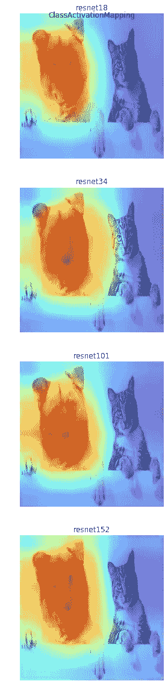

和预想的都很像。这种技术的一个很大的缺点是强迫你使用一个具有特定架构的网络，在解码器部分之前进行全局轮询。下一种技术通过利用一个特定层的梯度来推广这种方法。记住*类激活*时，我们使用特征图的权重作为最后一层通道的比例因子。要素地图必须位于 softmax 图层之前和平均池之后。下一项技术提出了一种更通用方法。

# Grad Cam

**Grad Cam** 由 [Grad-CAM 推出:通过基于梯度的定位](https://arxiv.org/abs/1610.02391)从深度网络进行视觉解释。这个想法实际上很简单，我们对目标类的输出进行反投影，同时存储给定层的梯度和输出，在我们的例子中是最后的卷积。然后，我们对保存的梯度进行全局平均，保持信道维度，以获得 1-d 张量，这将表示目标卷积层中每个信道的重要性。然后，我们将卷积层输出的每个元素乘以平均梯度，以创建梯度 cam。整个过程是快速的，并且是独立于体系结构的。有趣的是，作者表明这是先前技术的一种推广。

这里的代码是[这里的](https://github.com/FrancescoSaverioZuppichini/A-journey-into-Convolutional-Neural-Network-visualization-/blob/master/visualization/core/GradCam.py)

我们可以用它来突出不同的模型在看什么。

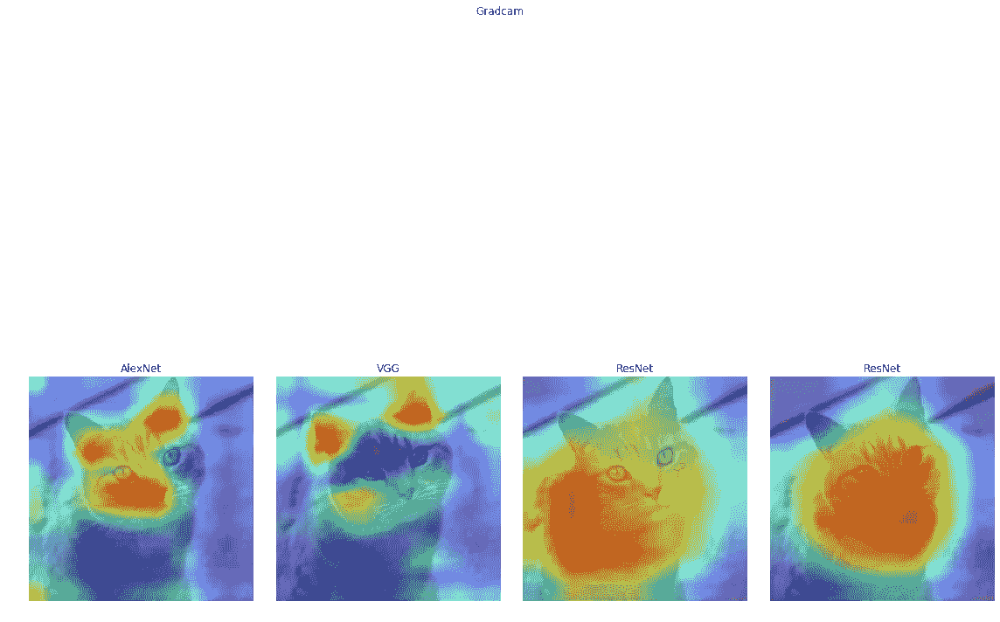

看`alexnet`看鼻子、`vgg`看耳朵、`resnet`看整只猫真的很有趣。有趣的是，这两个版本看起来像猫的不同部位。

下面我们为`resnet34`绘制了相同的输入，但是我们改变了每一列中的目标类，以向读者展示 grad cam 是如何相应改变的。

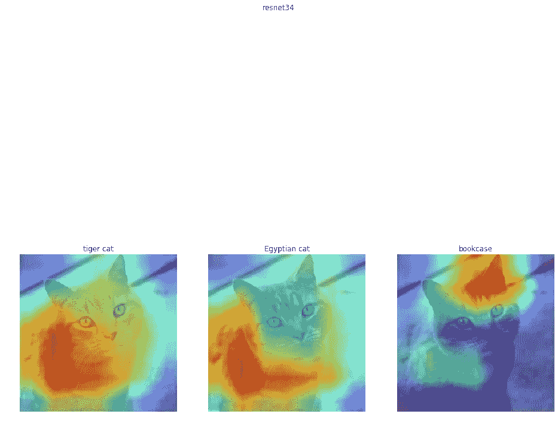

注意它们与`CAM`的输出是多么的相似。为了更好地比较我们的三个模型，下面我们为每个模型的每个输入绘制梯度凸轮

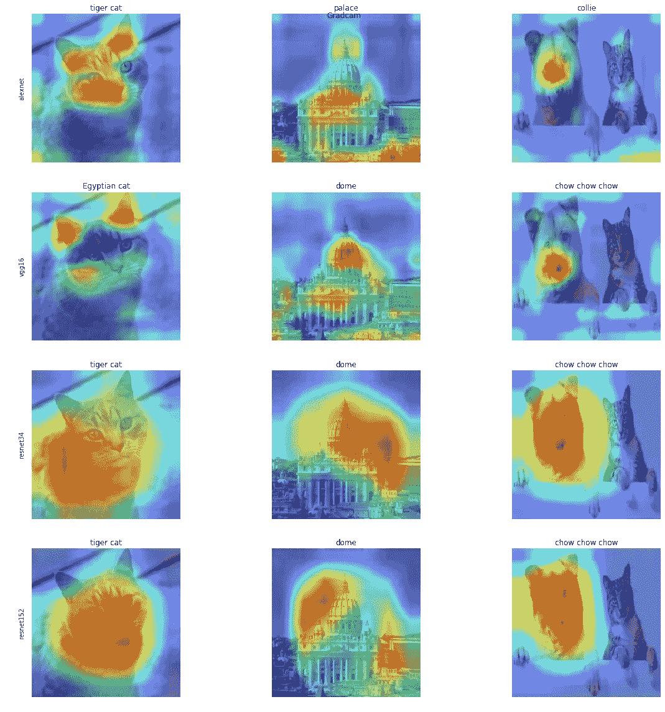

读者可以立即注意到不同型号之间的差异。

# 有趣的区域

我们之前讨论过有趣的区域本地化。Grad-cam 还可以用于从图像中提取类对象。很容易，一旦有了 grad-cam 图像，我们就可以用它作为蒙版从输入图像中裁剪出我们想要的东西。读者可以使用`TR`参数来查看不同的效果。

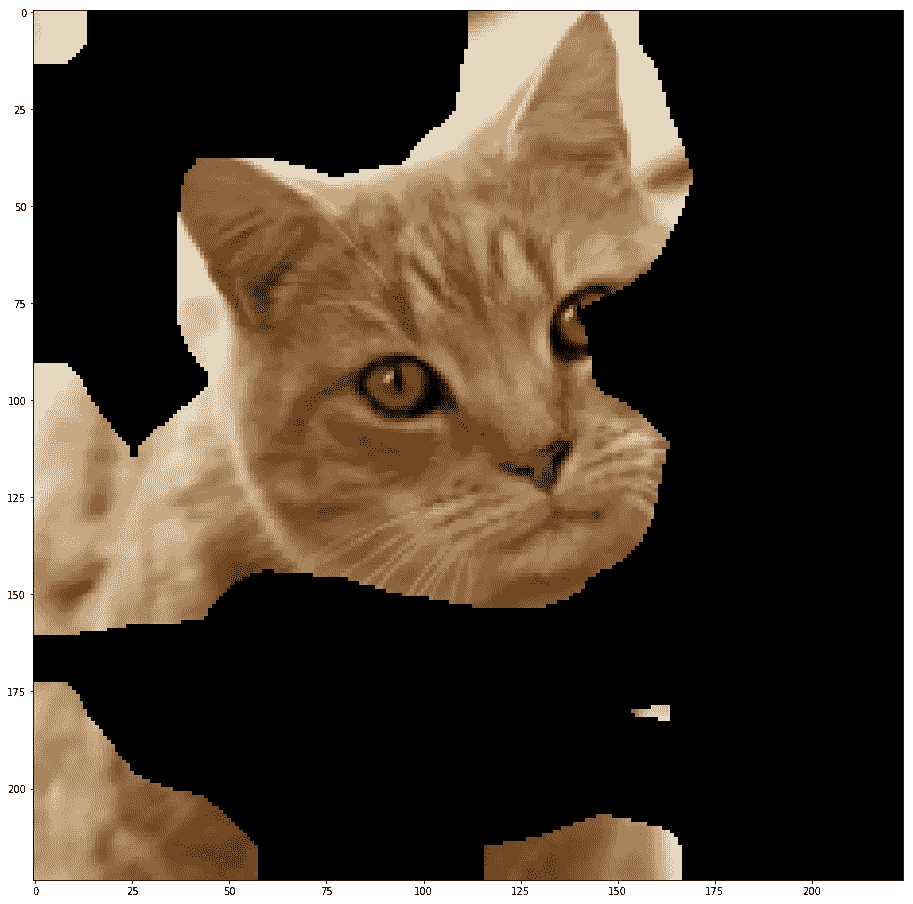

*等着瞧*！我们也可以再次改变类，并为该类裁剪感兴趣的区域。

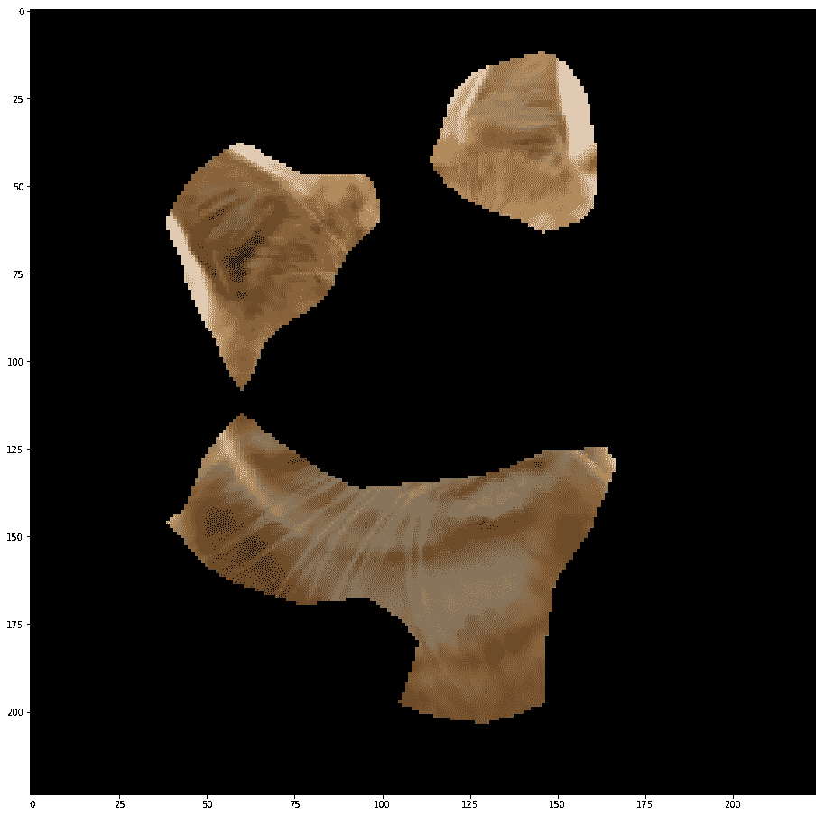

# 不同型号

我们已经看到了在`imagenet`上训练的经典分类模型使用的所有这些技术。在不同领域使用它们怎么样？我已经把这篇论文移植到 Pytorch 并重新训练了它。该模型通过学习机器人正面摄像机的图像来预测本地距离传感器，以避开障碍物。让我们看看，通过使用这些技术，我们是否能更好地理解模型内部的情况。

## 使用来自短程传感器和里程计的自我监督学习远程感知

其思想是在给定远程传感器(如摄像机)的当前输出的情况下，预测短程传感器(如近程传感器)的未来输出。他们从机器人的相机图像中训练了一个非常简单的 CNN 来预测接近传感器的值。如果你对他们的工作感兴趣，你可以在这里阅读全文

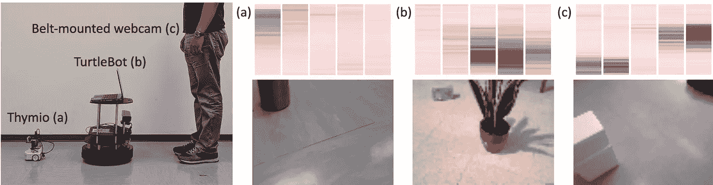

我做了一个 PyTorch 实现，并从头开始重新训练这个模型。请注意，我没有微调或尝试不同的超参数集，所以我的模型可能没有作者的模型表现得好。

让我们导入它

我们知道需要一些输入来测试模型，它们直接取自**测试集**

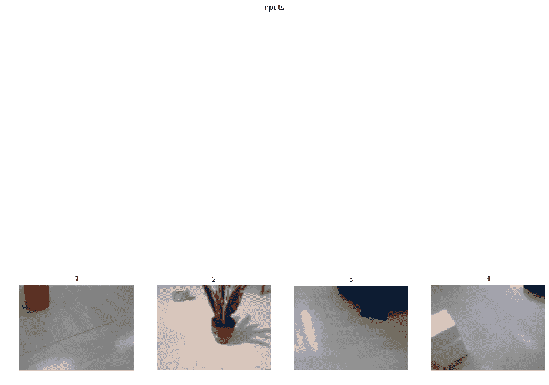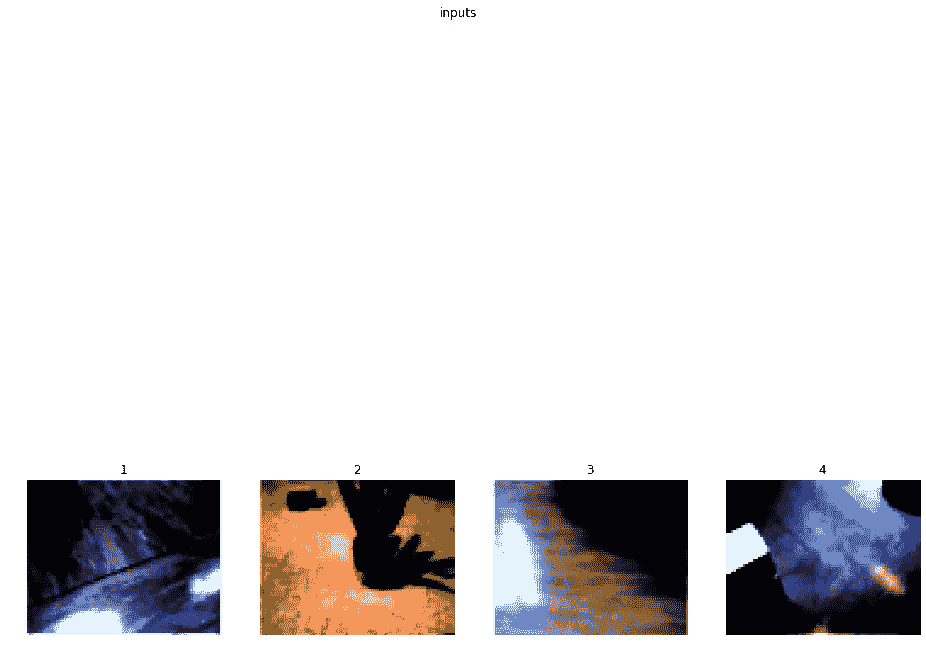

然后作者标准化每张图片，这是由 callind `pre_processing`完成的。由于某种原因，在 mac 和 ubuntu 上的输入图像是不同的，如果你在 mac 上运行笔记本，结果是不同的。这可能是由于警告消息。

我们将使用`SaliencyMap`和`GradCam`，因为它们是最好的

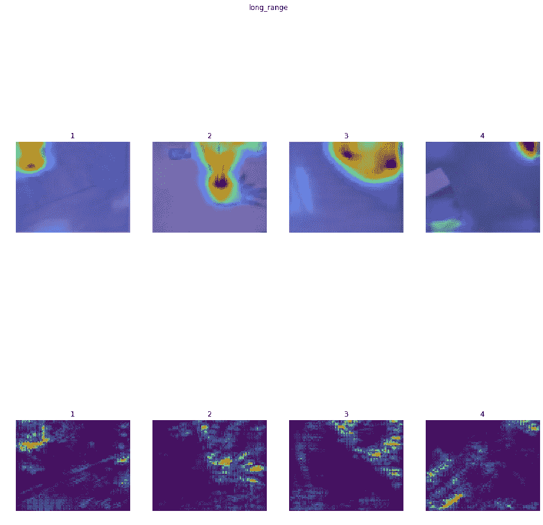

我们可以清楚地看到模型注视着物体。在第二张图片的`GradCam`行中，计划基本上由热图分割。有一个问题，如果你看第三张图，相机前面的白色方框没有被清晰地突出。这可能是因为地板的白色与盒子的颜色非常相似。我们来调查一下这个问题。

在第二行中，`SaliencyMaps`高亮显示所有对象，包括白色框。读者可以注意到，左边第一张图中的反射似乎激发了该区域的网络。我们还应该调查这个案例，但是由于时间限制，我们将把它作为一个练习留给好奇的读者。

为了完整起见，让我们也打印预测的传感器输出。该模型试图预测五个正面距离传感器给图像相机。

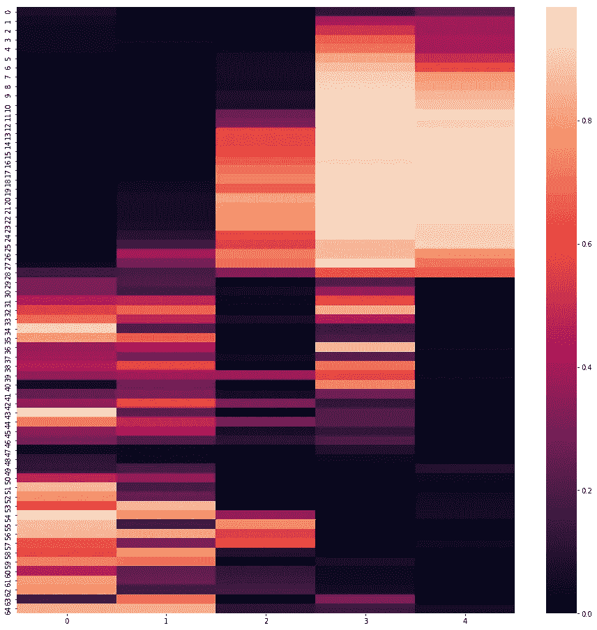

如果你和作者的照片比较，我的预测会更糟。这是因为为了加快速度，我没有使用所有的训练集，也没有进行任何超参数优化。所有的代码都可以在这里找到。现在让我们研究第一个问题，与地面颜色相似的物体。

## 相似的颜色

为了测试模型是否有一个与地面颜色相同的障碍物的问题，我们在 blender 中创建了四个不同的障碍物场景。如下图所示。

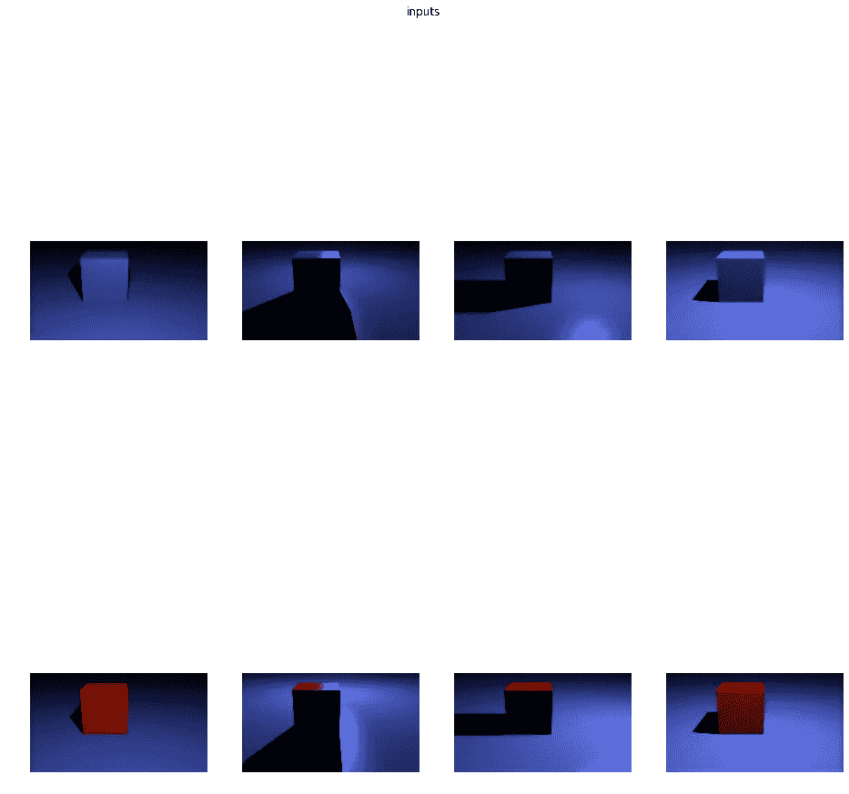

有四种不同的灯光配置和两种不同的立方体颜色，一种与地面相同，另一种不同。第一列代表真实的情况，而第二列有来自后面的非常强的光，在相机前面产生阴影。第三列左边有阴影，最后一列左边有一点阴影。

这是使用 gradcam 查看每个图像中的模型的完美场景。在下图中，我们绘制了 gradcam 结果。

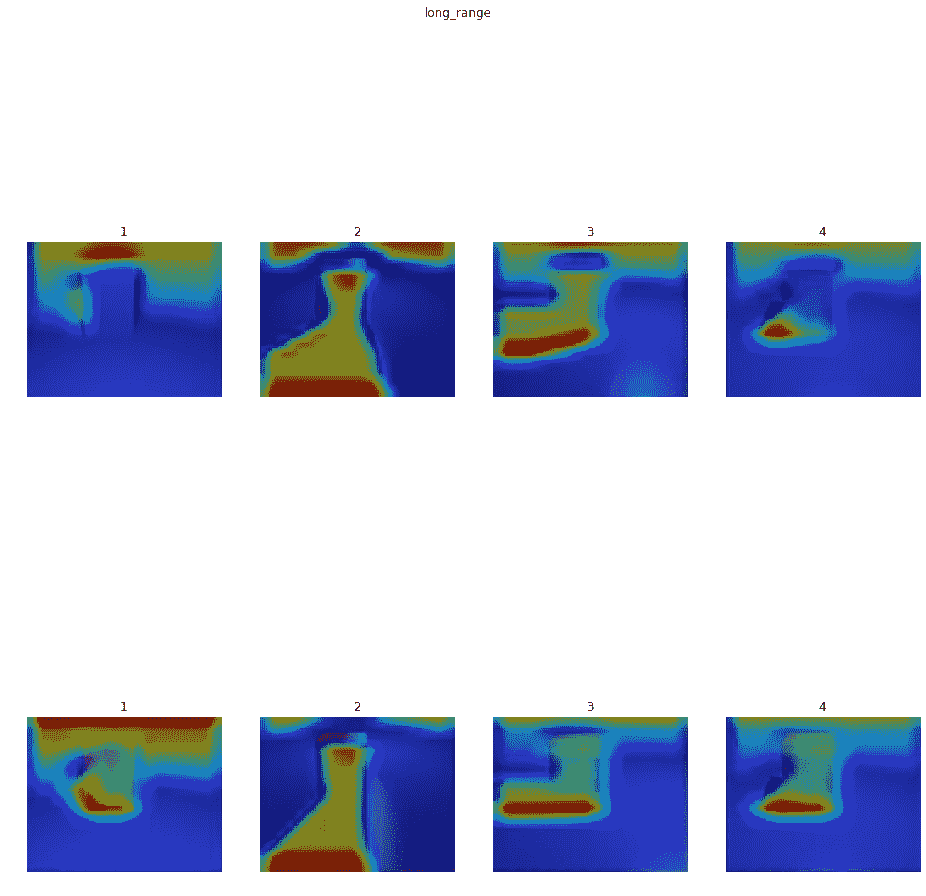

第二列中的大阴影肯定会混淆模型。在第一列和最后一列，grad cam 更好地突出了红色立方体的角，尤其是在第一张图片中。我们可以肯定地说，这个模型与地面颜色相同的物体有些困难。由于这种考虑，我们可以改进数据集中相等对象/背景的数量，执行更好的预处理，改变模型结构等，并且有希望增加网络的鲁棒性。

# 结论

在这篇文章中，我们提出了不同的卷积神经网络可视化技术。在第一部分中，我们通过应用于一组著名的分类网络来介绍每一个。我们比较了不同输入的不同网络，并强调了它们之间的相似性和差异。然后，我们将它们应用于机器人学中采用的模型，以测试其鲁棒性，我们能够成功地揭示网络中的问题。

此外，作为一个附带项目，我开发了一个名为 [mirro](https://github.com/FrancescoSaverioZuppichini/mirror) r 的交互式卷积神经网络可视化应用程序，它在短短几天内就在 GitHub 上收到了一百多颗星，反映了深度学习社区对这个主题的兴趣。

所有这些可视化都是使用一个公共接口实现的，并且可以作为 [python 模块](https://github.com/FrancescoSaverioZuppichini/A-journey-into-Convolutional-Neural-Network-visualization-/tree/master/visualization)使用，因此它们可以在任何其他模块中使用。

感谢您的阅读