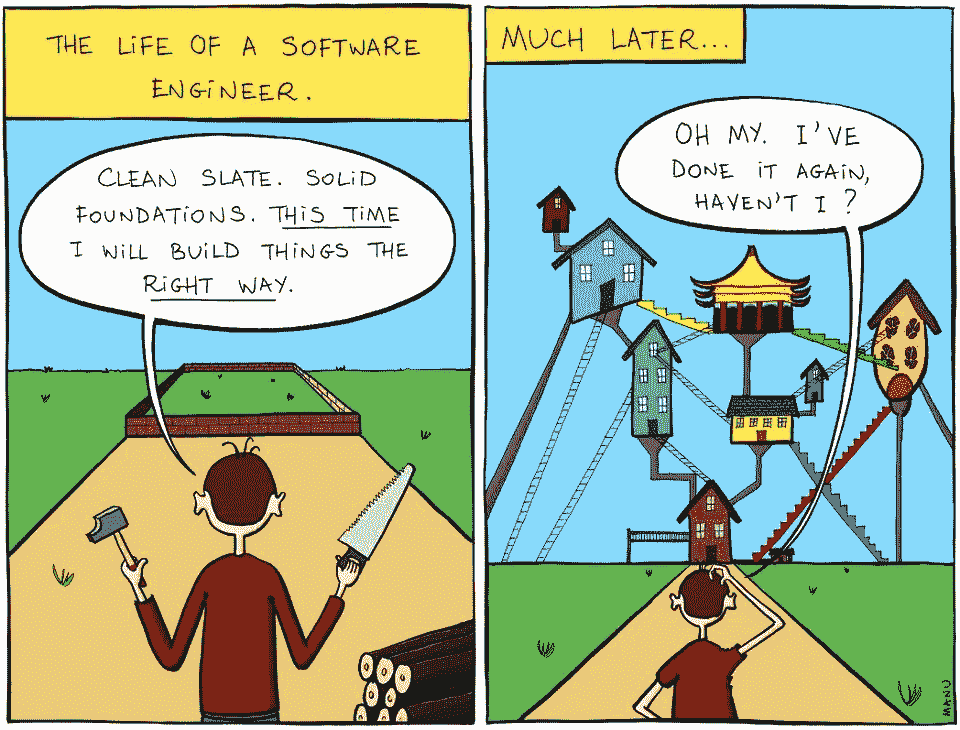

# 从喀拉斯到皮托尔彻的专家指南

> 原文：<https://towardsdatascience.com/a-laymans-guide-to-moving-from-keras-to-pytorch-37fe56b6f588?source=collection_archive---------26----------------------->

## 说真的，是时候搬家了

最近我在 Kaggle 上开始了一场关于文本分类的比赛，作为比赛的一部分，我不得不设法转移到 Pytorch 上以获得确定性的结果。现在，我过去一直与 keras 一起工作，它给了我相当好的结果，但不知何故，我知道 Keras 中的 **CuDNNGRU/CuDNNLSTM 层不是确定性的**，即使在设置种子之后。所以 Pytorch 来营救了。我很高兴我考虑过搬家。

作为**边注**:如果你想了解更多关于 **NLP** 的知识，我在此推荐 [**高级机器学习专精**](https://www.coursera.org/specializations/aml?siteID=lVarvwc5BD0-AqkGMb7JzoCMW0Np1uLfCA&utm_content=2&utm_medium=partners&utm_source=linkshare&utm_campaign=lVarvwc5BD0) 中关于 [**自然语言处理**](https://www.coursera.org/specializations/aml?siteID=lVarvwc5BD0-AqkGMb7JzoCMW0Np1uLfCA&utm_content=2&utm_medium=partners&utm_source=linkshare&utm_campaign=lVarvwc5BD0) 的这门牛逼课程。本课程涵盖了自然语言处理中从基础到高级的各种任务:情感分析、摘要、对话状态跟踪等等。

好吧，回到手头的任务。虽然 Keras 从深度学习开始很好，但随着时间的推移，你会对它的一些局限性感到不满。我考虑过搬到 Tensorflow。这似乎是一个很好的过渡，因为 TF 是 Keras 的后端。但是这很难吗？对于整个`session.run`命令和张量流会话，我有点困惑。它根本不是毕氏的。

Pytorch 在这方面有所帮助，因为它看起来像是 python 做事的方式。一切都在你的掌控之中，在性能方面没有任何损失。用安德烈·卡帕西的话说:

> 我已经使用 PyTorch 几个月了，从来没有感觉这么好过。我有更多的精力。我的皮肤更干净了。我的视力提高了。
> 
> *—安德烈·卡帕西(@卡帕西)*[*2017 年 5 月 26 日*](https://twitter.com/karpathy/status/868178954032513024?ref_src=twsrc%5Etfw)

所以事不宜迟，让我为你把 Keras 翻译成 Pytorch。

# 写你的网络的经典方式？

好，让我们首先在 keras 中创建一个示例网络，我们将尝试将它移植到 Pytorch 中。在这里，我也想给你一个建议。当你试图从 Keras 迁移到 Pytorch **时，使用你拥有的任何网络，并尝试将其移植到 Pytorch** 。这会让你更好地理解 Pytorch。在这里，我试着写一个在 Quora 虚假问题分类挑战中给我很好结果的网络。这个模型具有至少任何文本分类深度学习网络可以包含的所有功能，包括 GRU、LSTM 和嵌入层，以及元输入层。因此可以作为一个很好的例子。如果你想了解更多关于比尔斯特姆/GRU 和注意力模型是如何工作的，请访问我的帖子[这里](https://mlwhiz.com/blog/2018/12/17/text_classification/)。

因此 pytorch 中的模型被定义为一个从`nn.module`继承而来的类(因此更优雅一点)。每个类都必须包含一个`__init__`程序块和一个`forward`通道块。

*   在`__init__`部分，用户定义了网络将要拥有的所有层，但还没有定义这些层如何相互连接
*   在正向传递模块中，用户定义数据如何在网络中从一层流向另一层。

# 为什么这是经典？

显然是因为上课而显得优雅。咄！但玩笑归玩笑，我发现它是有益的，原因有几个:

1)它让你对如何构建你的网络有很大的控制权。

2)当您构建网络时，您对网络有很多了解，因为您必须指定输入和输出维度。所以**出错的几率更小**。(虽然这个真的要看技能水平了)

3) **易于调试的**网络。任何时候你发现网络有任何问题，只要在正向传递中使用类似`print("avg_pool", avg_pool.size())`的东西来检查层的大小，你就可以很容易地调试网络

4)您可以**从正向层返回多个输出**。这在编码器-解码器架构中非常有用，因为您可以返回编码器和解码器的输出。或者在 autoencoder 的情况下，您可以返回模型的输出和数据的隐藏层嵌入。

5) **Pytorch 张量的工作方式与 numpy 数组非常相似**。例如，我可以使用 Pytorch Maxpool 函数来编写 Maxpool 层，但是`max_pool, _ = torch.max(h_gru, 1)`也可以。

6)您可以用不同的初始化方案设置**不同的层。一些你在喀拉斯做不到的事。例如，在下面的网络中，我改变了我的 LSTM 层的初始化方案。LSTM 图层对于偏差、输入图层权重和隐藏图层权重具有不同的初始化。**

7)等到你看到 Pytorch 中的**训练循环时，你会对它提供的**控制**感到惊讶。**

现在 Pytorch 中的同一个模型看起来会像这样。请仔细阅读代码注释，了解更多关于如何移植的信息。

希望你还和我在一起。我想在这里强调的一点是，你需要用 Pytorch 编写一些代码来真正理解它是如何工作的。并且知道一旦你这样做了，你会很高兴你付出了努力。进入下一部分。

# 定制或现成:高度可定制的训练循环的最佳选择

在上面的部分，我写道，一旦你看到训练循环，你会感到惊讶。这是一种夸张。第一次尝试时，你会有点困惑。但是一旦你不止一次地通读这个循环，你会有很多直观的感觉。再次阅读注释和代码以获得更好的理解。

该训练循环对训练数据进行 k 重交叉验证，并输出对测试数据的运行进行平均的非折叠 train_preds 和 test_preds。如果这个流程看起来像是从 kaggle 竞赛中直接出来的，我很抱歉，但是如果你明白这一点，你就能够为自己的工作流程创建一个训练循环。这就是 Pytorch 的魅力。

所以这个循环的简要总结如下:

*   使用培训数据创建分层拆分
*   循环遍历拆分。
*   使用`X_train_fold = torch.tensor(x_train[train_idx.astype(int)], dtype=torch.long).cuda()`命令将训练和 CV 数据转换为张量并将数据加载到 GPU
*   使用`model.cuda()`命令将模型加载到 GPU 上
*   定义损失函数、调度程序和优化程序
*   创建`train_loader`和 valid_loader `来迭代批处理。
*   开始运行纪元。在每个时代
*   使用`model.train()`将模型模式设置为训练。
*   检查`train_loader`中的批次并向前运行
*   运行调度程序步骤以更改学习率
*   计算损失
*   将优化器中的现有梯度设置为零
*   通过网络反向传播损失
*   剪切渐变
*   采取优化步骤来改变整个网络中的权重
*   使用`model.eval()`将模型模式设置为评估。
*   使用`valid_loader`获得验证数据的预测，并存储在变量`valid_preds_fold`中
*   计算损失并打印
*   所有历元完成后，预测测试数据并存储预测。这些预测将在分割循环结束时进行平均，以获得最终的`test_preds`
*   使用`train_preds[valid_idx] = valid_preds_fold`获得列车组的离差(OOF)预测
*   然后，这些 OOF 预测可用于计算模型的局部 CV 分数。

## 但是为什么呢？为什么这么多代码？

好吧。我明白了。这可能是少数。在 keras 中用一个简单的`.fit`就可以完成的事情，在 Pytorch 中需要大量代码才能完成。但要明白，你也获得了很多权力。您需要了解的一些使用案例:

*   在 Keras 中，您有预先指定的调度程序，如`ReduceLROnPlateau`(编写它们是一项任务)，而在 Pytorch 中，您可以疯狂地尝试。**如果你知道如何写 Python，你会过得很好**
*   想在两个时期之间改变模型的结构。是的，你能做到。动态更改卷积网络的输入大小。
*   还有更多。只有你的想象会阻止你。

# 想自己经营吗？

You have all the tools! Do something…

这里还有一个小小的坦白。上面的代码将不会运行，因为有一些代码工件，我没有在这里显示。我这样做是为了让帖子更具可读性。就像你在上面的代码中看到的`seed_everything`、`MyDataset`和`CyclicLR`(来自杰瑞米·霍华德课程)函数和类，它们并没有真正包含在 Pytorch 中。但别担心，我的朋友。

我试过用完整的运行代码写一个 [**Kaggle 内核**](https://www.kaggle.com/mlwhiz/third-place-model-for-toxic-comments-in-pytorch) 。 [***您可以在这里看到代码，并将其包含在您的项目中。***](https://www.kaggle.com/mlwhiz/third-place-model-for-toxic-comments-in-pytorch)

如果你喜欢这个帖子，**请不要忘记也投票支持** [**内核**](https://www.kaggle.com/mlwhiz/third-place-model-for-toxic-comments-in-pytorch) **。我将不胜感激。**

# 尾注和参考文献

这篇文章是许多优秀的 Kagglers 们努力的结果，我将在这一部分尝试引用他们。如果我漏掉了某个人，请理解我不是故意的。

*   [关于毒性评论第三名获奖者模型的讨论](https://www.kaggle.com/c/jigsaw-toxic-comment-classification-challenge/discussion/52644)
*   [Larry Freeman 在 Keras 获得第三名](https://www.kaggle.com/larryfreeman/toxic-comments-code-for-alexander-s-9872-model)
*   [Pytorch 启动器胶囊型号](https://www.kaggle.com/spirosrap/bilstm-attention-kfold-clr-extra-features-capsule)
*   [如何:使用嵌入时进行预处理](https://www.kaggle.com/christofhenkel/how-to-preprocessing-when-using-embeddings)
*   [通过一些文本预处理提高你的分数](https://www.kaggle.com/theoviel/improve-your-score-with-some-text-preprocessing)
*   [Pytorch 基线](https://www.kaggle.com/ziliwang/baseline-pytorch-bilstm)
*   [Pytorch 启动器](https://www.kaggle.com/hengzheng/pytorch-starter)

*原载于 2019 年 1 月 6 日*[*mlwhiz.com*](https://mlwhiz.com/blog/2019/01/06/pytorch_keras_conversion/)*。*