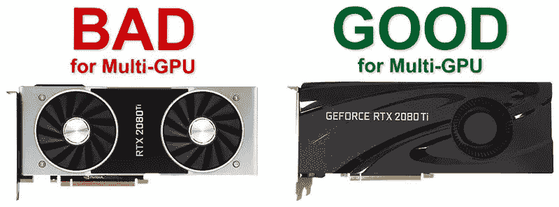
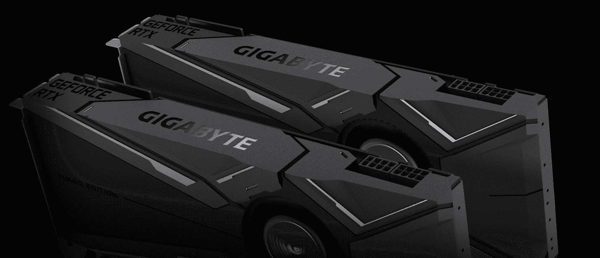

# 购买多 GPU 系统的经验

> 原文：<https://towardsdatascience.com/a-lesson-buying-a-multi-gpu-system-a14d3d1c710e?source=collection_archive---------7----------------------->

## 我在寻找用于深度学习实验的本地多 GPU 系统中学到了什么

这个故事是关于 H 字的，我指的是硬件或者更准确地说是用于繁重的深度学习任务的高端 GPU 系统。

所以在长时间使用 GPU 云实例，甚至[编写 PyTorch 检查点处理程序](https://medium.com/p/where-did-i-put-my-loss-values-acf6264ea347?source=email-486b68bc632a--writer.postDistributed&sk=39b0e303a259edd240b0068e41351c34)来支持保存和加载模型权重和其他超参数作为快照后，更容易在 spot 实例上工作。是时候购买一台本地机器了。我目前专注于视频相关的任务和训练繁重的 [I3D 型号](https://arxiv.org/abs/1705.07750)，所以我需要一台坚固的多 GPU 机器来支持这些工作。使用大的小批量会占用大量的 GPU 内存。最新最好的 NVIDIA GPU 是配备 24GB 内存的[泰坦 RTX](https://www.nvidia.com/en-us/titan/titan-rtx/) ，售价为 2499 美元，所以为什么不买四个这样的宝贝呢？我联系了几个推荐的供应商，以获得这种系统的规格建议和价格估计。听到其中一家供应商说这不可能，而其他供应商确实提出了建议，我有点惊讶。

他的完整回答是这样的:

> 它们会在没有**鼓风机**的情况下加热，最物有所值的是 [GeForce RTX 2080 Ti TURBO 11G](https://www.gigabyte.com/Graphics-Card/GV-N208TTURBO-11GC#kf) ，因为每个价格一半，有 11GB 内存，只需 8 个。

我最近确实购买了一台配有单个 [GEFORCE RTX 2080 Ti](https://www.nvidia.com/en-us/geforce/graphics-cards/rtx-2080-ti/) 的 GPU 机器，所以我问我是否可以为该机器添加更多 GPU，他问了确切的 GPU 型号，并再次表示:“不要**鼓风机，**机箱中会太热”。

## 那么这是怎么回事，鼓风机是什么？

困惑中，我开始寻找一个简单的答案，在谷歌的帮助下，我找到了这张图片和它所来自的伟大的博客文章。

A picture is worth a thousand words. The image is taken from: [NVIDIA RTX Graphics Card Cooling Issues](https://www.pugetsystems.com/blog/2019/01/11/NVIDIA-RTX-Graphics-Card-Cooling-Issues-1326/)

# 是的，在右边——一台鼓风机！

[技嘉网站](https://www.gigabyte.com/Graphics-Card/GV-N208TTURBO-11GC#kf)所写的鼓风机是:

> “千兆字节涡轮风扇冷却系统专为在空间有限的机箱中使用多个显卡的系统而设计。借助蒸汽室直触 GPU、鼓风机风扇和特殊形状的外部，它提供了更多的气流和更好的散热。”

The image is taken from: [GIGABYTE product page](https://www.gigabyte.com/Graphics-Card/GV-N208TTURBO-11GC#kf)

事实证明，游戏玩家模型，如[泰坦 RTX](https://www.nvidia.com/en-us/titan/titan-rtx/) ，并不专用于多 GPU 系统，而是为游戏而设计的。他们通过使用“露天”系统来降温。

在非服务器机架上组装多 GPU 系统迫使你将它们彼此靠近，而鼓风机的工作是负责散热。

所以下次你在寻找一个 GPU 来处理深度学习任务时，你最好问问你的供应商，GPU 是否有鼓风机。

更多阅读，推荐这篇很棒的博文:[https://www . pugetsystems . com/blog/2019/01/11/NVIDIA-RTX-显卡-散热-问题-1326/](https://www.pugetsystems.com/blog/2019/01/11/NVIDIA-RTX-Graphics-Card-Cooling-Issues-1326/)