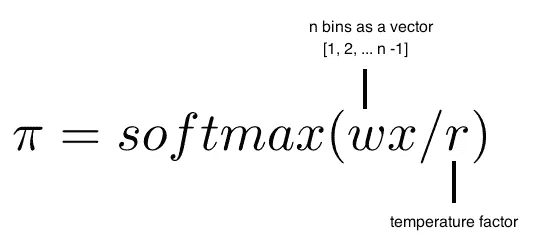
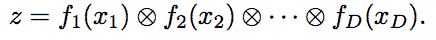
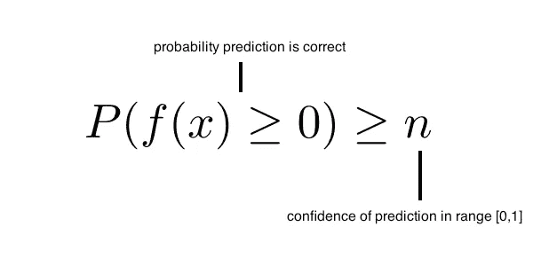
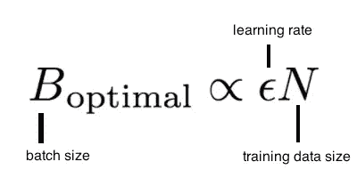

# 现代分类模型的一课

> 原文：<https://towardsdatascience.com/a-lesson-on-modern-classification-models-938cbd731d9d?source=collection_archive---------17----------------------->

## 揭开 ML 的最新进展，为您构建一个更好的分类模型

在机器学习中，**分类问题**是最根本的*令人兴奋*而*挑战*现有问题之一。一个合格的分类模型的含义是巨大的——这些模型被用于自然语言处理文本分类、图像识别、数据预测、强化训练以及无数的进一步应用。

然而，目前实现的分类算法很糟糕。在脸书期间，我发现任何机器学习分类问题的通用解决方案都是“扔一棵梯度下降推进树给它，然后抱最好的希望”。但情况不应该是这样的——研究正在投入到现代分类算法和改进中，这些算法和改进允许*显著*更准确的模型，而所需的训练数据却少得多。

在这里，我们探索一些特别有趣的现代分类算法的例子。这篇文章假设你对机器学习有一定的了解，但是，这篇文章的大部分内容不需要。

**深度神经决策树**

**深度神经网络**已经被证明在处理*感知数据*方面非常强大，比如图像和音频。然而，对于表格数据，**基于树的模型**更受欢迎有几个原因——其中一个重要原因是它们提供了自然的可解释性。

例如，考虑一个试图确定系统故障原因的企业。您可以使用几个参数创建一个预测模型，例如网络速度、正常运行时间、线程处理和系统类型。有了决策树，我们还可以了解系统失败的原因。

**深度神经决策树**结合了决策树的效用和神经网络产生的影响。由于它是通过神经网络实现的，DNDT 支持开箱即用的 GPU 加速和对不适合内存的数据集的最小批量学习，这要归功于现代深度学习框架。因此，在许多数据集上，它们比传统的决策更加准确。此外，它们易于使用——在 TensorFlow 或 PyTorch 中，一个实现需要*大约 20 行代码*。

我们可以探索模型核心数学背后的概念。首先，我们需要一种方法来做出**分割决策**(即我们如何决定选择树的哪条路径)。然后，我们需要将我们分开的决策组合在一起，构建**决策树**。

我们通过一个 **宁滨函数**做出拆分决定。宁滨函数接受一个输入，并生成该输入所属的条柱的索引。在我们的模型中，每个箱代表一个特性——例如，正常运行时间、网络速度或系统类型。

我们通过其自己的*一层神经网络*(我们模型的“深度神经”部分)和以下激活函数来绑定每个特征。

The activation function of each bin.

然后，我们通过克罗内克乘积将我们的箱彼此相乘，以构建我们的决策树。

每个特征都被它们自己的神经网络分类。这就给我们返回了一个表示 *x* 的分类的索引(即树中叶子节点的索引)，完成了我们深度神经决策树的构建。

**置信度加权线性分类**

许多机器学习任务，特别是在自然语言处理中，最终会有许多不同的特征，其中大多数是二进制的，很少被操作。这导致*数据稀疏*，这需要大的训练集和非常大的参数向量。

考虑一个产品评论分类器，其目标是将评论标记为正面或负面。许多评论可能会说“我喜欢这个作者”，因此会将“喜欢”这个词与正面评论相关联。想象一下一个稍加修改的负面评论:“我喜欢这个作者，但觉得这本书索然无味”。分类器可能不会经常看到世界“沉闷”，这可能会错误地将该评论分类为积极的，因为该评论使用短语“喜欢该作者”，从而降低了收敛速度。

我们可以用**置信度加权学习**来解决这个问题，这是一种在每个参数中保持概率置信度的学习方法。较不自信的参数比较自信的参数更新得更积极。

在置信度加权学习中，我们确保对于每次迭代，每个训练实例的正确预测的*概率大于或等于该预测的*置信度。*这可以正式定义。*

就其本身而言，这可以附加到任何其他模型上(您需要决定如何度量置信度——一些想法是贝叶斯方法，如变分贝叶斯)。这导致模型的变化，趋向于解决稀疏数据集涉及的上述问题。

**决定批量大小的贝叶斯原则**

除了选择一个有代表性的模型，还有一系列的变量会影响我们的模型所代表的准确度。一个是*批量大小*——训练期间每次迭代使用的训练数据量。研究表明，不仅存在最大化测试准确性的最佳批量，而且我们可以应用贝叶斯原理来计算作为**学习率**和**训练数据量**的比例函数。计算本身是一个多步骤的过程，超出了本文的范围，但是结果可以表示为一个线性比例函数:

由此，我们可以得出两个有益的结论。

首先，随着我们的训练数据的大小增加，每个批量迭代的大小应该增加相同的量。第二，随着学习数据的增加，我们应该增加批量。这使我们能够确定单个实验的最佳批量，并对其进行缩放，以确定任意数量的不同实验的批量，从而全面优化测试精度。

**结论**

这只是对现代机器学习研究中分类问题的广度(和深度)的一个尝试——本文中的所有内容都是在过去几个月中发表的。希望这向您展示了一点令人兴奋的复杂性，人们在未来选择分类模型时可能会考虑到这一点！