# R 语言中的文本分析简介

> 原文：<https://towardsdatascience.com/a-light-introduction-to-text-analysis-in-r-ea291a9865a8?source=collection_archive---------6----------------------->

## 使用语料库、文档术语矩阵、情感分析等…

## 介绍

这是我在 r 中使用一些文本分析工具的第一个项目的快速浏览。这个项目的目标是探索文本分析的基础，如使用语料库、文档术语矩阵、情感分析等…

## **使用的包**

*   [***tm***](https://cran.r-project.org/web/packages/tm/tm.pdf)
*   [](https://cran.r-project.org/web/packages/SentimentAnalysis/SentimentAnalysis.pdf)
*   *[](https://cran.r-project.org/web/packages/syuzhet/syuzhet.pdf)*
*   **其他:tidyverse，SnowballC，wordcloud，RColorBrewer，ggplot2，RCurl**

## **快速查看数据源**

**我使用了我最新的 [***网络搜集项目***](https://medium.com/@brianward1428/exploring-the-job-market-for-data-scientists-and-data-analysts-in-boston-new-york-and-9b3c32210334) 中的职位描述。实际上，大约有 5300 个职位空缺。**

**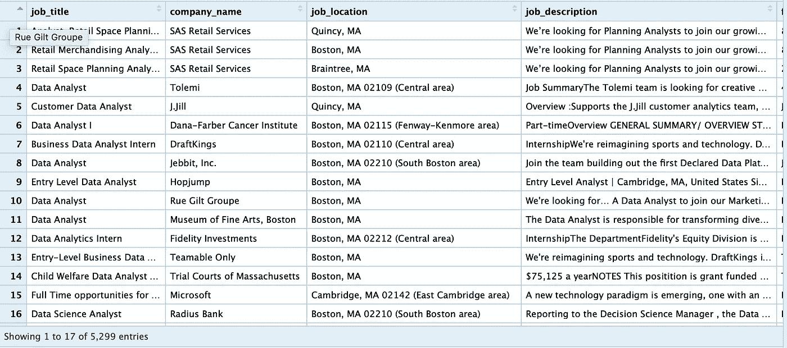**

**我们将在这里集中讨论职位描述，因为它们包含了最多的文本和信息。让我们看看我们的第一份工作描述，看看我们在做什么。**

```
**postings1$job_description[1]**
```

**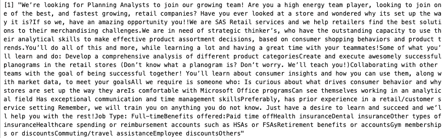**

**正如您所看到的，这是一个很大的字符串，包含了工作列表中的所有文本。**

## **创建语料库**

**语料库(corpora pl。)只是一种存储文本数据的格式，在整个语言学和文本分析中使用。它通常包含每个文档或文本集，以及一些帮助描述该文档的元属性。让我们使用 tm 包从我们的工作描述中创建一个语料库。**

```
**corpus <- SimpleCorpus(VectorSource(postings1$job_description))
# And lets see what we have
view(corpus)**
```

**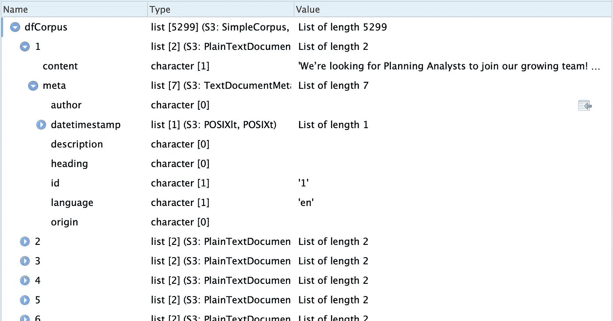**

**你可以看到我们最外面的列表是一个**类型=列表**，长度= 5299，这是我们拥有的工作描述(或文档)的总数。当我们查看列表中的第一项时， **[1]，**，我们看到这也是一个**类型=列表**，长度= 2。如果我们看这两个项目，我们会看到有**内容**和**元。内容**属于**类型=字符**，包含字符串形式的工作描述文本。M **eta** 为**类型=列表**，长度为 7。这是自动添加到简单语料库中的 7 个元属性，即使我没有它们的任何值。**

1.  **作者=空**
2.  **日期-时间戳=另一个列表…但是对于我的数据是空的**
3.  **描述=空**
4.  **标题=空**
5.  **id = '1 '(由职位自动创建)**
6.  **language = 'en '(我假设是 tm 包的默认值)**
7.  **原点=空。**

**现在你知道了。这是一个简单语料库的一般格式。请记住，您可以编辑元属性来包含您想要的任何内容。**

## **转换:清理我们的语料库**

**tm 包中的转换指的是在进行任何分析之前，我们可能要对文本进行预处理或格式化。我们将执行 5 个快速转换，这将为我们的分析准备数据。**

```
**# 1\. Stripping any extra white space:
dfCorpus <- tm_map(dfCorpus, stripWhitespace)# 2\. Transforming everything to lowercase
dfCorpus <- tm_map(dfCorpus, content_transformer(tolower))# 3\. Removing numbers 
dfCorpus <- tm_map(dfCorpus, removeNumbers)# 4\. Removing punctuation
dfCorpus <- tm_map(dfCorpus, removePunctuation)# 5\. Removing stop words
dfCorpus <- tm_map(dfCorpus, removeWords, stopwords("english"))**
```

**除了**移除停用词**功能，大多数转换都是自解释的。那到底是什么意思？停用词基本上只是被确定为对某些文本分析(如情感分析)没有什么价值的常用词。这是 tm 包将删除的停用词列表。**

```
**stopwords(“english”)**
```

**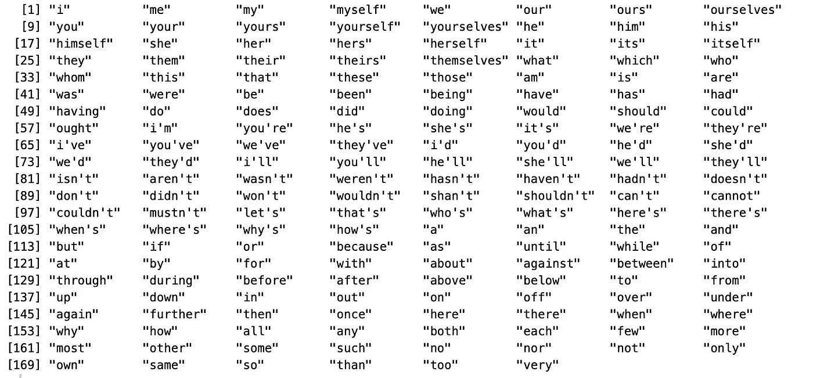**

**现在我们已经转换了我们的工作描述，让我们再看一下我们的第一个清单，看看有什么变化。**

```
**corpus[[1]]$content**
```

**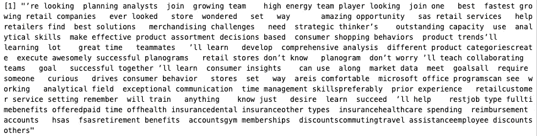**

## **堵塞物**

**词干提取是将单词压缩成共同词根的过程，这有助于词汇的比较和分析。tm 包使用 [***波特词干算法***](https://tartarus.org/martin/PorterStemmer/) 来完成这个任务。让我们继续干我们的数据。**

```
**dfCorpus <- tm_map(dfCorpus, stemDocument)**
```

**现在让我们最后一次看一下我们的工作描述，看看有什么不同。**

```
**corpus[[1]]$content**
```

**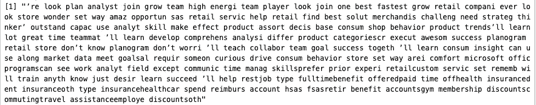**

**很好，现在所有的工作描述都被清理和简化了。**

## **创建文档术语矩阵(DTM)**

**文档术语矩阵是比较每个文档中所有术语或单词的简单方法。如果你把数据简单地看成一个矩阵；每行代表一个唯一文档，每列代表一个唯一的术语。矩阵中的每个单元格都是该术语在文档中出现次数的整数。**

```
**DTM <- DocumentTermMatrix(corpus)
view(DTM)**
```

**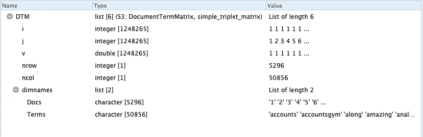**

**如你所见，DTM 实际上并不是作为矩阵存储在 R 中，而是属于**类型= simple_triplet_matrix** 。这是一种更有效的存储数据的方式。你可以在这里 更好地了解它们是如何被格式化的 [***。出于我们的目的，最好把它想成一个矩阵，我们可以用`inspect()`函数看到它。***](https://www.rdocumentation.org/packages/slam/versions/0.1-45/topics/simple_triplet_matrix)**

```
**inspect(DTM)**
```

**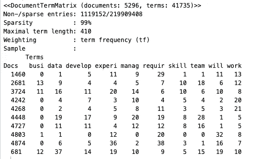**

**因此，我们可以看到我们有 5296 个文档*(删除了三个 NA)*和 41735 个术语。我们还可以看到一个 DTM 样图。现在让我们来看看在所有的招聘启事中最常用的词是什么。**

## **创建最常用术语的词云**

**为此，我们首先要将 DTM 转换成一个矩阵，这样我们就可以对各列求和，从而得到所有文档的总术语数。然后，我可以在整个语料库中挑出前 75 个最常用的单词。**

*****注意:*** *我选择使用无词干版本的语料库，这样我们就有了单词 cloud 的完整单词。***

```
**sums <- as.data.frame(colSums(as.matrix(DTM)))
sums <- rownames_to_column(sums) 
colnames(sums) <- c("term", "count")
sums <- arrange(sums, desc(count))
head <- sums[1:75,]wordcloud(words = head$term, freq = head$count, min.freq = 1000,
  max.words=100, random.order=FALSE, rot.per=0.35, 
  colors=brewer.pal(8, "Dark2"))**
```

**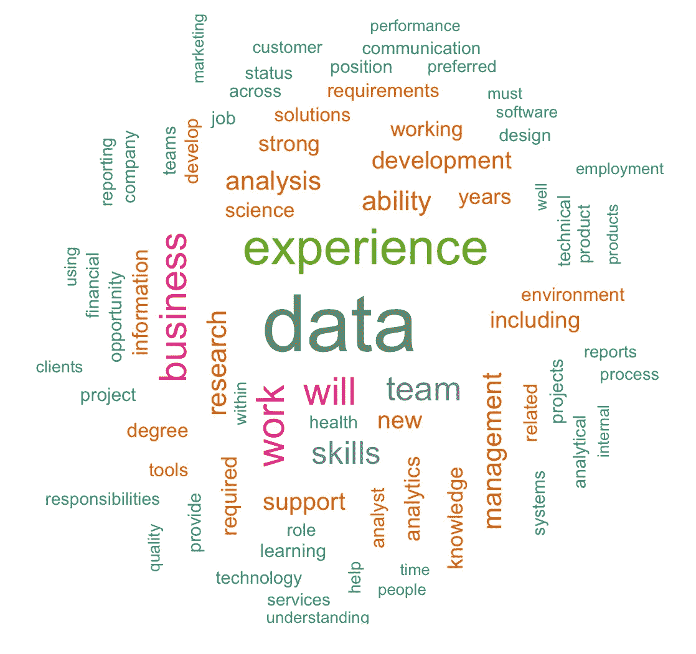**

**所以，这里没有什么太疯狂的，但我们可以很好地感受到这个工具有多强大。支持、学习、理解、沟通等术语可以帮助描绘出这些公司在候选人身上寻找什么。**

# **情感分析**

> **“情绪(名词) :对某事的总体感觉、态度或看法。”——剑桥英语词典**

**情感分析的目标很简单，但实现这一目标的过程却很复杂。桑杰·米娜有一篇很棒的介绍，值得一读:**

**[](https://medium.com/seek-blog/your-guide-to-sentiment-analysis-344d43d225a7) [## 你的情感分析指南

### 情感分析帮助你发现人们对你的产品或服务的看法、情感和感受

medium.com](https://medium.com/seek-blog/your-guide-to-sentiment-analysis-344d43d225a7) 

我们将开始使用'**sensitement analysis**'包，使用[*Harvard-IV dictionary(General Inquirer)*](http://www.wjh.harvard.edu/~inquirer/homecat.htm)做一个简单的极性分析，这是一个与积极(1915 个单词)或消极(2291 个单词)情绪相关的单词字典。

```
sent <- analyzeSentiment(DTM, language = "english")# were going to just select the Harvard-IV dictionary results ..  
sent <- sent[,1:4]#Organizing it as a dataframe
sent <- as.data.frame(sent)# Now lets take a look at what these sentiment values look like. 
head(sent)
```

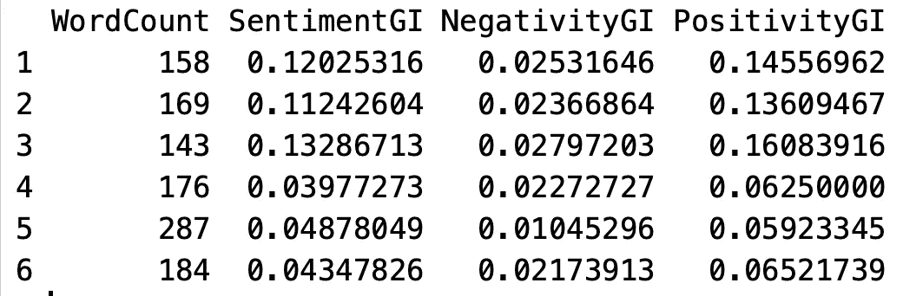

如你所见，每份文件都有字数统计、消极得分、积极得分和总体情绪得分。让我们来看看我们整体情绪的分布。

```
summary(sent$SentimentGI)
```

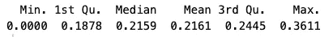

好的，总的来说，我们的工作描述是积极的。所有文件中的最低分是 0.0，所以看起来这些公司在写他们的职位描述方面做得很好。现在，为了好玩，让我们看看排名前五和后五的公司的情绪得分。

```
# Start by attaching to other data which has the company names 
final <- bind_cols(postings1, sent)# now lets get the top 5 
final %>% group_by(company_name) %>%
  summarize(sent = mean(SentimentGI)) %>%
  arrange(desc(sent)) %>%
  head(n= 5)
```

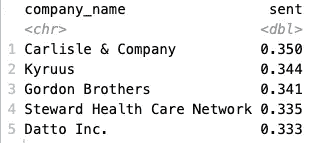

```
# And now lets get the bottom 5 
final %>% group_by(company_name) %>%
  summarize(sent = mean(SentimentGI)) %>%
  arrange(sent) %>%
  head(n= 5
```

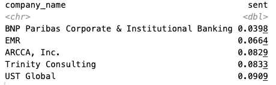

就这样。现在，这显然不是一个很好的情感分析用例，但它是理解过程的一个很好的介绍。

## 情感

我们可以做的另一件有趣的事情是从工作描述中提取情感。我们将使用 [*NRC 情感词典*](http://saifmohammad.com/WebPages/NRC-Emotion-Lexicon.htm) 使用 [*syuzhet 包*](https://cran.r-project.org/web/packages/syuzhet/syuzhet.pdf) 来完成这项工作，该词典将单词与相关情感以及积极或消极情感联系起来。

```
sent2 <- get_nrc_sentiment(postings1$job_description)# Let's look at the corpus as a whole again:
sent3 <- as.data.frame(colSums(sent2))
sent3 <- rownames_to_column(sent3) 
colnames(sent3) <- c("emotion", "count")ggplot(sent3, aes(x = emotion, y = count, fill = emotion)) + geom_bar(stat = "identity") + theme_minimal() + theme(legend.position="none", panel.grid.major = element_blank()) + labs( x = "Emotion", y = "Total Count") + ggtitle("Sentiment of Job Descriptions") + theme(plot.title = element_text(hjust=0.5))
```

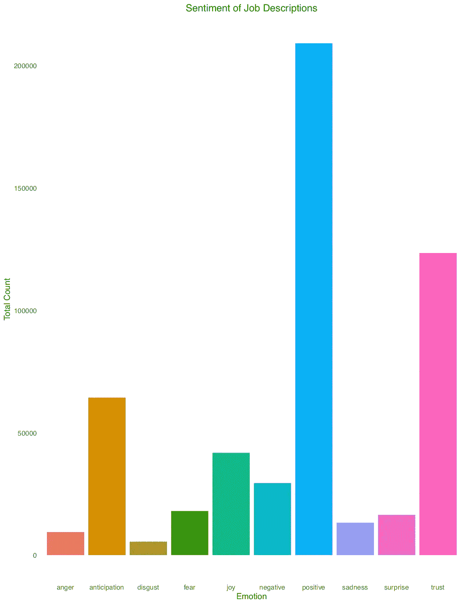

太棒了。我们已经知道工作描述大多是积极的，但令人感兴趣的是看到更高价值的信任和期望。显而易见，这可以应用于其他类型的数据，如评论或评论，以将大量文本数据简化为快速洞察。** 

**感谢您的阅读，我希望这篇文章能够帮助其他初学者开始使用 R 的文本分析包。我很乐意听到任何问题或反馈，因为我自己也刚刚开始。**