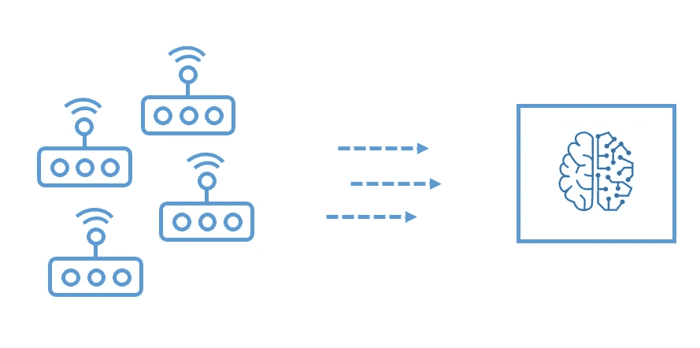
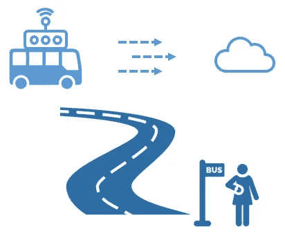
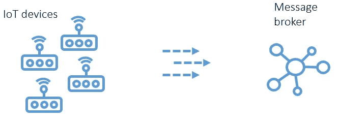
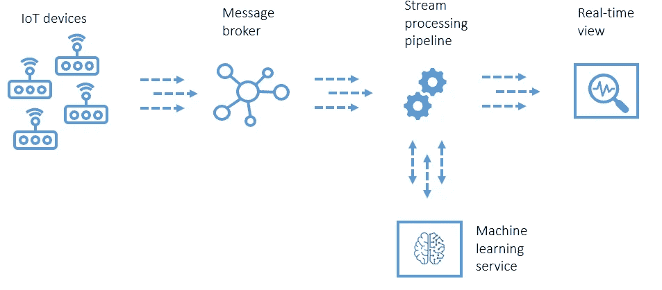
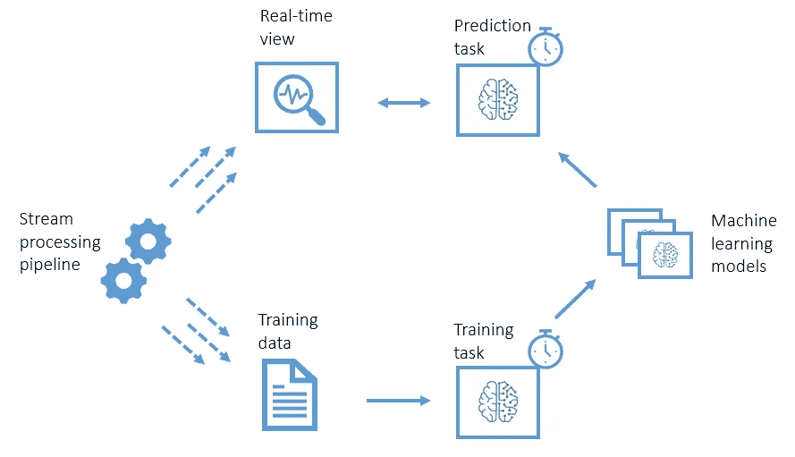

# 面向物联网流的轻量级机器学习架构

> 原文：<https://towardsdatascience.com/a-lightweight-machine-learning-architecture-for-iot-streams-bd1bf81afa2?source=collection_archive---------20----------------------->

**在高频流数据上运行机器学习模型不一定要花大价钱。通过考虑我们的实时需求，我们可以设计更容易扩展的高效架构。**

在过去的一年半时间里，我和我的团队一直在试图预测公共道路上的公共汽车的运动，并预测它们在公共汽车站的到达和离开时间。我们的客户，一家名为 Kolumbus 的公共交通公司，已经在许多车辆上安装了物联网(IoT)网关，每秒钟都在向微软 Azure 云发送消息。

虽然我们的大部分数据是地理空间数据，但问题本质上是时间问题。对它的研究让我思考时间的概念，以及它与实时系统各部分的关系。

# 伴随着大数据而来的是巨大的责任

86,400.这是一天中的秒数，这个数字解释了为什么物联网成为大数据时代的海报儿童。

单个传感器通常一天只能记录这么多信息。根据有效载荷的大小，这可能会产生大约 5 MB 的数据。虽然这听起来可能不多——只有一个略大的 mp3 文件的大小——但物联网解决方案很少只有一个传感器。嵌入式设备通常会连接几个传感器，它们依次连接到网关，网关路由来自多个设备的流量。此外，一个典型的流处理管道会在几个步骤中咀嚼、处理和丰富原始有效载荷，我们手上有一些重要的数据。

物联网设备产生大量数据，机器学习需要大量处理。当你把它们放在同一个句子中，通常不会首先想到“轻量级”这个词。现在你可能想知道为什么这三个都出现在这篇文章的标题中。我们会谈到这一点。

如果您在行业环境中从事物联网工作，您可能对以下场景很熟悉。

支持 IP 的物联网设备或网关使用 MQTT 或 AMQP 等通信协议向公共云中的中央消息代理发送遥测数据。该代理可以是像 Azure IoT Hub 或 AWS Kinesis 这样的云原生服务，也可以是像 Apache Kafka 或 Flink 这样的开源框架。这些技术可以以合理的成本接收来自数百万设备的消息，这意味着我们可以可靠地收集所有传感器数据。到目前为止，一切顺利。

对数据采取行动并产生可行见解的愿望不可避免地导致以下问题:

> 现在怎么办？

正是在这一点上，组织通常会雇用像我这样的顾问。

# 满足对数据的渴望

顾问们通常会提出这样的建议。

流处理器订阅来自代理的消息，并动态地对其进行反应性处理，然后立即将其提供给丰富数据的实时视图。在记录原始消息后的几百毫秒内，结果就可以在实时视图中显示，并显示在报告仪表板中。机器学习 web 服务与流处理器挂钩，并执行预测分析，成为实时输出的一部分。这被称为“从消防水管喝水”，是在流处理平台中使用机器学习模型的规范方式。它是这类系统的两个主要标准架构的核心:所谓的 Lambda 和 Kappa 架构。

当设计一个实时系统时，我们应该问自己的第一个问题是，它如何适应项目的特定约束和需求。将机器学习模型直接挂钩到流意味着请求将到达每一条物联网消息的预测端点。这可能意味着服务器集群和相当大的托管费用。当速度和数量增加时，成本、复杂性和延迟也会增加。

虽然在某些情况下从消防水管喝水是必要的，但从一杯水中啜饮通常更舒服。

# 实时的神话

设计软件时，我们有时会谈到“近实时”。这里的“近”暗指我们永远不可能在任何系统中实现零延迟。在系统能够响应之前，不可避免地要经过一些非零的处理时间。当它非常快时，我们作弊，称之为实时。但是我们在哪里划定界限呢？100 毫秒？一秒钟？一分钟？

在我们甚至考虑我们是否能够实现适当的实时或接近实时之前，我们应该考虑实时*需求*，这是另一个完全不同的地方。我们应该问自己一个更基本的问题，而不是简单地考虑技术上的可能性:缓慢响应的后果是什么？

实时要求分为三类:

*   **硬**实时。延迟将导致整个系统的失败。也许它们会导致发电厂爆炸，飞机坠毁，太空探测器错失目标，或者无人驾驶飞机轰炸无辜平民。你通常列举的可怕事故。
*   **实盘**实时。偶尔延迟是可以的。延迟的输出是无用的，但是系统仍然是可操作的。想象一下网飞。虽然偶尔停顿的电影流可能很烦人，但你可能不会因此失眠。
*   **软**实时。频繁的延误完全没问题。一个迟来的回应可能没那么有价值，但它仍然是有用的。

让我们面对现实吧。极少数系统实际上有严格的实时要求。但是，即使是严格的实时要求也很少。大多数系统都有相当宽松的时间限制。

回到我们的公交预测，这是一个具有软实时需求的系统的经典案例。如果我们在 8:30 预测一辆公共汽车将在 9:00 到达某个车站，那么这个预测在几秒钟后仍然有效并且几乎同样准确。即使是在 8:31 或 8:32，预计到达时间(ETA)也不会发生根本性的变化。

# 时间窗口

对于软实时要求，我们可以选择对数据进行下采样。毕竟，传感器信号的频率只是我们用来从设备中采样的任意时间段。我们并不需要处理每一条传入的消息。

流处理也有一种规范的方式来做到这一点，它被称为时间窗口。

这个简单的函数叫做滚动窗口，所有主流的流处理框架都支持它。通过查看固定大小的时间窗口，我们可以以某种方式聚集数据，或者只处理批处理中最新的消息。

在后一种情况下，我们只对捕捉传感器的最新状态感兴趣。当你想到它时，这就是物联网设备已经在做的事情，只是速度更快。

这允许稍微不同的架构。

在这种设置中，一个计划任务(如 cron 作业)会在特定的时间间隔醒来，查看来自流式管道的最新输出，生成预测，然后再次进入睡眠状态。当我们等待任务再次触发时，旧的预测仍然有效。记住，考虑到我们的软实时需求，预测在有限的时间内是有价值的。

这可能不是在每种情况下都有效，但是在适用的情况下，它可以大大降低系统的成本。借助现代云服务，我们通常不会为闲置的处理单元付费。

另一个好的方面是，我们将预测分析与我们希望对每条消息进行的更简单的处理形式分离开来。

作为旁注，我们也可以将一些相同的哲学应用于模型训练。对于在大型数据集上训练模型，下采样通常是一种不受重视的策略。

# 付诸实践

在我们的实时总线系统中，我们已经将预测和训练功能从流层中分离出来，并将它们放入单独的 Docker 容器中，这些容器在需要时会旋转起来。

通过这种方式，我们拥有了一个自包含的基础设施，只要流式管道接收到物联网消息，它就可以根据新数据保持训练模型并生成实时预测。

系统的这一部分目前每天处理几百万条消息，每月花费大约 60 美元。这包括托管、计算和存储。我们通过利用“容器即服务”( CaaS)和“功能即服务”( FaaS )(也称为“无服务器”)的云模式来实现这一目标。

目前，我们正在一个小型 Docker 容器上运行预测任务，该容器只有一个 CPU 内核和 2.5 GB 的内存，它的响应速度仍然相对较快。这还没有太多的优化。事实上，我们正在并行运行一些不同的机器学习模型，以评估它们在生产中的性能，所有这些都是在那个容器实例上进行的。限制流向终端的流量使我们可以享受这些自由。

但是推论是廉价的。那么训练呢？

训练模型需要更强大的服务器，但我们仍然运行一个相对适中的实例，具有四个 CPU 核心和 5 GB 内存。我们对数据进行了大量的缩减采样，每天只运行几分钟。通过这样做，我们将这项特殊任务的成本保持在每月 2 美元的低得离谱的水平。

我们预计我们系统的入站物联网流量将增加至少一个数量级，但负载测试结果显示，我们的设置可以相对轻松地处理它。训练容器可能需要更大的马力，但是考虑到它只运行一小部分时间，即使我们使用像 Kubernetes 这样的集群技术扩展到多个节点，它仍然是廉价的。

# 最后的想法

我上面所描述的并不适用于所有的问题。有些情况下，你需要连续预测每一个事件。但在物联网场景中，通常情况下你可以跳过时间步骤。事实上，平滑信号甚至有助于防止模型过度拟合。

我们的系统以惊人的低成本运行在最小的基础设施上，同时满足我们的性能要求。我们已经在 Azure 上部署了这个，但是我故意避免为我们的组件使用市场名称，因为这个概念和一般架构可以在任何通用的云平台上实现。

我的观点不是建议我们的架构作为每个人都要遵循的标准。它只是呼吁数据科学家和数据工程师在设计过于复杂和沉重的系统之前，考虑他们机器学习管道中每个单独组件的时间约束和实时要求。