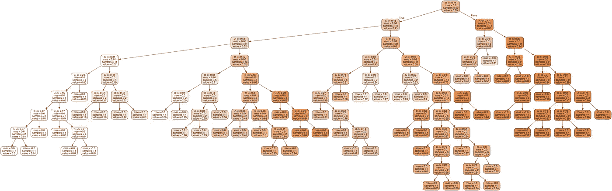
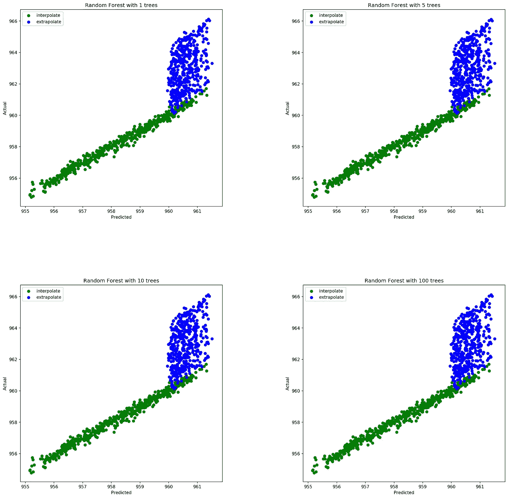
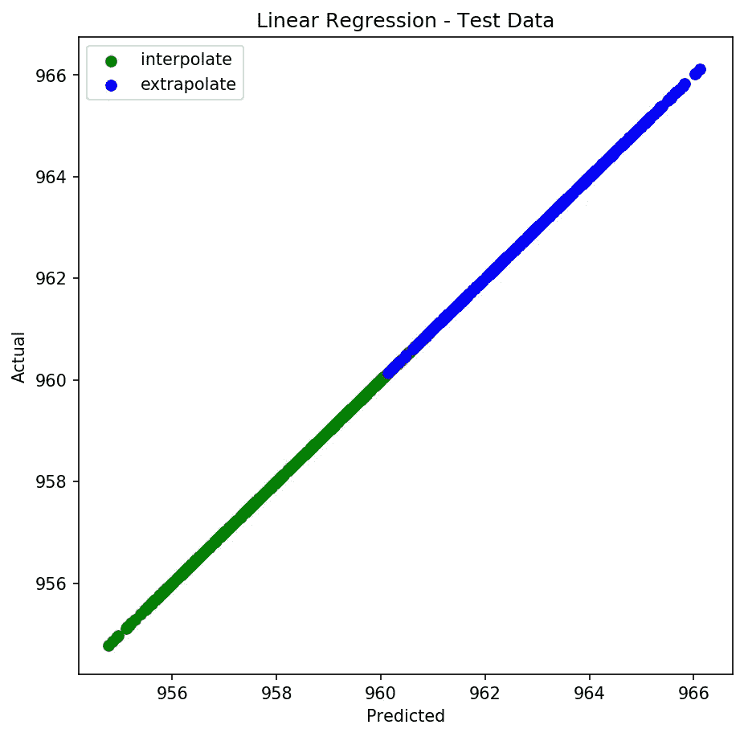

# 随机森林回归的一个局限性

> 原文：<https://towardsdatascience.com/a-limitation-of-random-forest-regression-db8ed7419e9f?source=collection_archive---------5----------------------->

## 邻居的规则如何影响你的预测。



One Tree from a Random Forest of Trees

[随机森林](https://en.wikipedia.org/wiki/Random_forest)是一种流行的机器学习模型，通常用于分类任务，这在许多学术论文、Kaggle 竞赛和博客帖子中可以看到。除了分类，随机森林还可以用于回归任务。随机森林的非线性特性可以帮助它超越线性算法，成为一个很好的选择。但是，了解您的数据并记住随机森林无法进行外推是很重要的。它只能做出预测，该预测是先前观察到的标签的平均值。从这个意义上说，它非常类似于 [KNN](https://en.wikipedia.org/wiki/K-nearest_neighbors_algorithm) 。换句话说，在回归问题中，随机森林可以做出的预测范围受到训练数据中最高和最低标签的限制。在训练和预测输入的范围和/或分布不同的情况下，这种行为会变得有问题。这被称为[协变量移位](https://www.analyticsvidhya.com/blog/2017/07/covariate-shift-the-hidden-problem-of-real-world-data-science/)，对于大多数模型来说很难处理，尤其是对于随机森林，因为它不能外推。

例如，假设您正在处理具有潜在趋势的数据，如股价、房价或销售额。如果您的训练数据缺少任何时间段，您的随机森林模型将会根据趋势低估或高估训练数据中时间段之外的示例。如果您将模型的预测值与真实值进行对比，这一点会非常明显。让我们通过创建一些数据来看看这一点。

```
import numpy as np
import matplotlib.pyplot as plt
from sklearn.linear_model import LinearRegression
from sklearn.ensemble import RandomForestRegressor
%matplotlib inline#make fake data with a time trend
X = np.random.rand(1000,10)#add time feature simulating years 2000-2010
time = np.random.randint(2000,2011,size=1000)#add time to X
X = np.hstack((X,time.reshape(-1,1)))#create target via a linear relationship to X
weights = np.random.rand(11)
y = X.dot(weights)#create test data that includes years
#not in training data 2000 - 2019
X_test = np.random.rand(1000,10)
time_test = np.random.randint(2000,2020,size=1000)
X_test = np.hstack((X_test,time_test.reshape(-1,1)))
y_test = X_test.dot(weights)
```

让我们看看一个随机森林能多好地预测测试数据。

```
#fit and score the data using RF
RF = RandomForestRegressor(n_estimators=100)
RF.fit(X,y)
RF.score(X_test,y_test)
>>0.5872576516824577
```

那不太好。让我们对照它们的已知值来绘制我们的预测，看看发生了什么。

```
#plot RF as trees increase
#set starting point for subplots
index = 1#set the size of the subplot to something large
plt.figure(figsize=(20,20))#iterate through number of trees in model
#and plot predictions v actual
for i in [1,5,10,100]:
    plt.subplot(2, 2, index)
    RF_plot = RandomForestRegressor(n_estimators=i)
    RF_plot.fit(X,y)
    #split data btw vals RF can interploate vs. data
    #it needs to exptrapolate
    interpolate_index = X_test[:,10]<=2010
    extrapolate_index = X_test[:,10]>2010
    X_interpolate = X_test[interpolate_index]
    X_extrapolate = X_test[extrapolate_index]
    y_interpolate = y_test[interpolate_index]
    y_extrapolate = y_test[extrapolate_index]
    #plot predictions vs. actual
    plt.scatter(RFplot.predict(X_interpolate),
                y_interpolate,
                color="g",label="interpolate")
    plt.scatter(RFplot.predict(X_extrapolate),
                y_extrapolate,
                color="b",label="extrapolate")
    plt.xlabel('Predicted')
    plt.ylabel('Actual')
    plt.title('Random Forest with {} trees'.format(i))
    plt.subplots_adjust(wspace=.4, hspace=.4)
    plt.legend(loc="best")
    index += 1
```



Predicted vs. Actual Random Forest

该图清楚地表明，模型可以预测的最高值约为 961，而数据中的潜在趋势将更近的值推高至 966。不幸的是，随机森林无法外推线性趋势，也无法准确预测时间值高于训练数据(2000–2010)中所见时间值的新示例。即使调整树木的数量也不能解决问题。在这种情况下，由于我们对数据施加了完美的线性关系，因此像线性回归这样的模型将是更好的选择，并且在检测数据趋势和对训练数据中时间范围之外的数据做出准确预测方面不会有问题。

```
#fit the data using Linear Regression
LR = LinearRegression()
LR.fit(X,y)
LR.score(X_test,y_test)
>>1.0#plot predictions of Linear Regression against actual
plt.figure(figsize=(7,7))
plt.xlabel('Predicted')
plt.ylabel('Actual')
plt.title('Linear Regression - Test Data')
_ = plt.scatter(LR.predict(X_interpolate),y_interpolate,
               color="g",label="interpolate")
_ = plt.scatter(LR.predict(X_extrapolate),y_extrapolate,
               color="b",label="extrapolate")
plt.legend(loc="best")
```



Predicted vs. Actual Linear Regression

虽然随机森林通常是一个很好的模型选择，但了解它是如何工作的，以及在给定数据的情况下它是否有任何限制仍然很重要。在这种情况下，因为它是一个基于邻域的模型，所以它阻止我们对训练数据之外的时间范围进行准确预测。如果你发现自己处于这种情况，最好是测试其他模型，如线性回归或立体模型，和/或考虑在模型集合中使用随机森林。预测快乐！