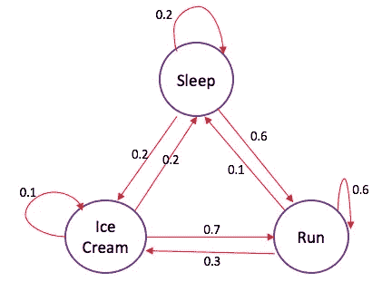

# 马尔可夫链简介

> 原文：<https://towardsdatascience.com/a-lite-introduction-to-markov-chains-eebe239f9147?source=collection_archive---------17----------------------->

Photo by [JJ Ying](https://unsplash.com/@jjying?utm_source=medium&utm_medium=referral) on [Unsplash](https://unsplash.com?utm_source=medium&utm_medium=referral)

之前我写了一篇关于潜在狄利克雷分配的简介，作为深入探究自然语言处理(NLP)为何如此伟大的一部分。随着人工智能的不断发展，NLP 将在未来几年内(确切地说，直到 2025 年)加速发展。它是关键驱动因素之一，而且随着它继续成为我们日常生活的一部分，也许有必要了解它在幕后是如何工作的。有大量不同的概念、数学和模型进入不同的 NLP 用例，但我们只打算在基础层面上理解一个，那就是马尔可夫链。

启动马尔可夫链不仅用于 NLP。数字还有其他应用，但我们现在只关注它与 NLP 的关系。此外，还有许多与马尔可夫链(例如，转移图、转移概率矩阵和初始状态分布矩阵)和数学相关的术语，我们不会讨论。这篇文章是对马尔可夫链的简单介绍。在后面的系列文章中，我们可以深入探讨，但首先，让我们了解一下它的基本要点。

马尔可夫链，它的同名者是俄罗斯数学家安德烈·马尔可夫。定义为“…描述一系列可能事件的随机模型，其中每个事件的概率仅取决于前一个事件达到的状态。”随机模型是一种随机性模型。我们试图根据这个变量及其相关变量来发现接下来会发生什么。事实上，这个模型非常容易理解，但是理解它的基础是马尔可夫性。

马尔可夫性质表明我们不知道所有的历史，只知道以前的历史，我们是无记忆的。做出预测只需要最近的事件和未来事件的可能性。想象一下今天正在下雨，而你不知道过去还发生过什么天气事件。然而，你知道明天有 50%的可能会下雨，30%的可能是晴天，20%的可能是阴天。选择你的冒险。我们用最大概率去吧。现在继续到第二天，我们再次忘记前一天发生的事情，知道今天下雨，为了简单起见，概率是相同的，我们选择这次是晴天，一个新的状态，这意味着某事发生的新概率。如果太阳多的概率是 10%，下雨的概率是 20%，但是下雪的概率是 70%呢？

如果你看马尔可夫链，你可能会看到像这样的图像四处浮动。让我们来分解一下，从冰淇淋开始。这有点令人眼花缭乱，所以请原谅我。如果你吃了冰淇淋，有 10%的几率你会再次吃冰淇淋，20%的几率你会去睡觉，70%的几率你会去跑步。如果你跑步，你有 60%的机会再次跑步，30%的机会吃冰淇淋，10%的机会睡觉。如果你睡觉，有 20%的几率你会继续睡觉，20%的几率你会吃冰淇淋，60%的几率你会跑步。看起来宇宙，又名马尔可夫链，正试图告诉你一些事情:快跑！！

应用到自然语言处理中，我们可以用这个来预测单词。给定单词“我”，在它后面会有什么单词？在文本语料库中，我们可以找到所有直接跟在 I 后面的单词，并把它们放入字典中，以“I”作为关键字，所有与之相关的单词作为值。如果一个单词出现超过两次，那么它的概率就会增加，太少的话，它的概率就会下降。从那里，选择一个单词，然后我们继续下一个键:值对来做出另一个决定。只要你觉得你在代码中创建的函数合适，这个过程就会一直持续下去。

在 NLP 中使用它的问题是理解模型做得有多好。这个模型就是所谓的分室模型，在这个模型中，我们指定所考虑的不同状态，并且我们确定移动到下一步的概率，不管有多少个。如果我们用数字工作，这很容易评估它是如何工作的。一个生存或死亡的双态模型说明了这一点。假设我们有 1000 个人活着，你有 5%的几率死去，95%的几率活着。有了这些严格的数字，我们可以为自己的每次迭代创建期望。在第一次迭代中，50 人死亡，950 人活着，第二年又有 50 人死亡，900 人活着。我们可以不断设定期望值，然后运行我们的模型，看看它有多接近这些数字。这个例子很容易看出我们如何评估它，但现在想象一个有 1000 个单词的语料库和与之相关的每个单词的概率。这有点难以计算。我最近用它来生成文本，我能评估它的唯一方法是确定它听起来语法不正确，只是一堆混乱的单词。我能做的唯一实际评估是，把它和马尔可夫链创造的句子进行比较。将来，如果您打算使用 Markov Chain 来生成文本(它主要用于 NLP ),请尝试将其与递归神经网络模型生成的文本进行比较，看看 Markov Chain made 版本的效果如何。