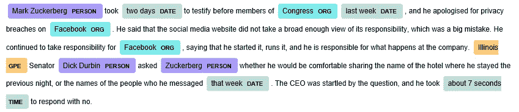

# 供思考的一点空间:易于使用的 NLP 框架

> 原文：<https://towardsdatascience.com/a-little-spacy-food-for-thought-easy-to-use-nlp-framework-97cbcc81f977?source=collection_archive---------19----------------------->

在下面的文章中，你将会看到如何快速简单地开始使用 spaCy。这是特别有用的初学者爱好者在 NLP 领域的一步一步的指示和光明的例子。

spaCy 是一个 NLP 框架，由 Explosion AI 于 2015 年 2 月发布。它被认为是世界上最快的。易于使用和有能力使用神经网络是它的其他优势。

**第一步:安装空间**

打开您的终端(命令提示符),写下:

```
pip install spacy
```

**第二步:下载语言模型**

编写以下命令(仍在您的终端中):

```
python -m spacy download en_core_web_lg
```

型号(en_core_web_lg)是 spaCy 最大的英文型号，大小为 788 MB。有英文版的小模型，也有其他语言版的模型(英语、德语、法语、西班牙语、葡萄牙语、意大利语、荷兰语、希腊语)。

**第三步:导入库并加载模型**

在 python 编辑器中编写了以下几行代码后，您就可以享受 NLP 的乐趣了:

```
import spacy
nlp = spacy.load(‘en_core_web_lg’)
```

**步骤 4:创建样本文本**

```
sample_text = “Mark Zuckerberg took two days to testify before members of Congress last week, and he apologised for privacy breaches on Facebook. He said that the social media website did not take a broad enough view of its responsibility, which was a big mistake. He continued to take responsibility for Facebook, saying that he started it, runs it, and he is responsible for what happens at the company. Illinois Senator Dick Durbin asked Zuckerberg whether he would be comfortable sharing the name of the hotel where he stayed the previous night, or the names of the people who he messaged that week. The CEO was startled by the question, and he took about 7 seconds to respond with no.”doc = nlp(sample_text)
```

**步骤 5:拆分段落的句子**

让我们把这篇文章分成几个句子，并在句尾写上每个句子的字符长度:

```
sentences = list(doc3.sents)
for i in range(len(sentences)):
 print(sentences[i].text) 
 print(“Number of characters:”, len(sentences[i].text))
 print(“ — — — — — — — — — — — — — — — — — -”)
```

*输出:*

```
Mark Zuckerberg took two days to testify before members of Congress last week, and he apologised for privacy breaches on Facebook.
Number of characters: 130
-----------------------------------
He said that the social media website did not take a broad enough view of its responsibility, which was a big mistake.
Number of characters: 118
-----------------------------------
He continued to take responsibility for Facebook, saying that he started it, runs it, and he is responsible for what happens at the company.
Number of characters: 140
-----------------------------------
Illinois Senator Dick Durbin asked Zuckerberg whether he would be comfortable sharing the name of the hotel where he stayed the previous night, or the names of the people who he messaged that week.
Number of characters: 197
-----------------------------------
The CEO was startled by the question, and he took about 7 seconds to respond with no.
Number of characters: 85
-----------------------------------
```

**步骤 6:实体识别**

实体识别性能是自然语言处理模型的一个重要评价标准。spaCy 用一行代码就成功地实现了这一点:

```
from spacy import displacy
displacy.render(doc, style=’ent’, jupyter=True)
```

*输出*:



**步骤 7:标记化和词性标注**

让我们对文本进行标记化，并查看每个标记的一些属性:

```
for token in doc:
 print(“{0}\t{1}\t{2}\t{3}\t{4}\t{5}\t{6}\t{7}”.format(
 token.text,
 token.idx,
 token.lemma_,
 token.is_punct,
 token.is_space,
 token.shape_,
 token.pos_,
 token.tag_
 ))
```

*输出*:

```
Mark	0	mark	False	False	Xxxx	PROPN	NNP
Zucker.	5	zucker.	False	False	Xxxxx	PROPN	NNP
took	16	take	False	False	xxxx	VERB	VBD
two	21	two	False	False	xxx	NUM	CD
days	25	day	False	False	xxxx	NOUN	NNS
to	30	to	False	False	xx	PART	TO
testify	33	testify	False	False	xxxx	VERB	VB
before	41	before	False	False	xxxx	ADP	IN
members	48	member	False	False	xxxx	NOUN	NNS
of	56	of	False	False	xx	ADP	IN
```

同样，它非常容易应用，并立即给出令人满意的结果。关于我打印出来的属性的简要说明:

```
text: token itselfidx: starting byte of the tokenlemma_: root of the wordis_punct: is it a punctuation symbol or notis_space: is it a space or notshape_: shape of the token to show which letter is the capitalpos_: the simple part of speech tagtag_: the detailed part of speech tag
```

什么是言语标记？

它是在将整个文本分割成标记后，给每个标记(如名词、动词、形容词)分配标记的过程。

**第八步:只有数字**

当我们在处理语言和文本时，数字从何而来？

由于机器需要把一切都转换成数字来理解世界，所以在 NLP 世界中每个单词都用一个数组(单词向量)来表示。以下是《空间词典》中“人”的词向量:

```
[-1.7310e-01,  2.0663e-01,  1.6543e-02, ....., -7.3803e-02]
```

spaCy 的词向量的长度是 300。在其他框架中可以不同。

在建立单词向量之后，我们可以观察到上下文相似的单词在数学上也是相似的。以下是一些例子:

```
from scipy import spatialcosine_similarity = lambda x, y: 1 — spatial.distance.cosine(x, y)print(“apple vs banana: “, cosine_similarity(nlp.vocab[‘apple’].vector, nlp.vocab[‘banana’].vector))print(“car vs banana: “, cosine_similarity(nlp.vocab[‘car’].vector, nlp.vocab[‘banana’].vector))print(“car vs bus: “, cosine_similarity(nlp.vocab[‘car’].vector, nlp.vocab[‘bus’].vector))print(“tomatos vs banana: “, cosine_similarity(nlp.vocab[‘tomatos’].vector, nlp.vocab[‘banana’].vector))print(“tomatos vs cucumber: “, cosine_similarity(nlp.vocab[‘tomatos’].vector, nlp.vocab[‘cucumber’].vector))
```

*输出*:

```
apple vs banana:  0.5831844210624695
car vs banana:  0.16172660887241364
car vs bus:  0.48169606924057007
tomatos vs banana:  0.38079631328582764
tomatos vs cucumber:  0.5478045344352722
```

印象深刻？当比较两种水果或蔬菜或两种交通工具时，相似性更高。当两个不相关的物体如一辆汽车和一根香蕉进行比较时，相似性很低。当我们检查西红柿和香蕉的相似性时，我们观察到它高于汽车对香蕉的相似性，但低于西红柿对黄瓜和苹果对香蕉的相似性，这反映了现实。

**第九步:国王=王后+(男人——女人)？**

如果一切都用数字来表示，如果我们可以用数学的方法计算相似性，我们可以做一些其他的计算吗？比如我们把“男”减去“女”，把差加到“后”，能不能找到“王”？让我们试试:

```
from scipy import spatial

cosine_similarity = lambda x, y: 1 — spatial.distance.cosine(x, y)

man = nlp.vocab[‘man’].vector
woman = nlp.vocab[‘woman’].vector
queen = nlp.vocab[‘queen’].vector
king = nlp.vocab[‘king’].vectorcalculated_king = man — woman + queenprint(“similarity between our calculated king vector and real king vector:”, cosine_similarity(calculated_king, king))
```

*输出*:

```
similarity between our calculated king vector and real king vector: 0.771614134311676
```

我觉得还不错。你可以用不同的单词替换来尝试，你会观察到相似的有希望的结果。

**总之；**

本文的目的是对 spaCy 框架做一个简单的介绍，并展示一些简单的 NLP 应用示例。希望它是完美的。你可以在他们设计精良、内容丰富的网站[https://spacy.io/](https://spacy.io/)上找到详细的信息和大量的例子。

如果你有任何进一步的问题，请不要犹豫，写信给:haydarozler@gmail.com。