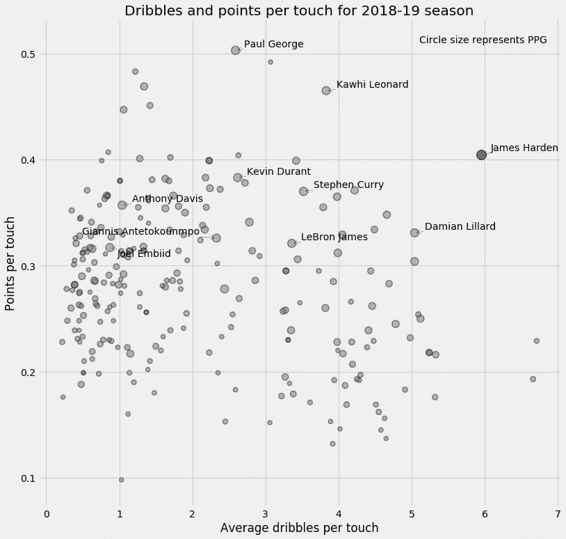
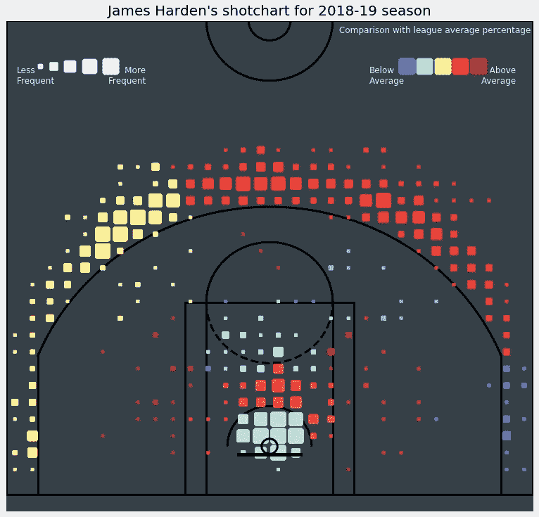
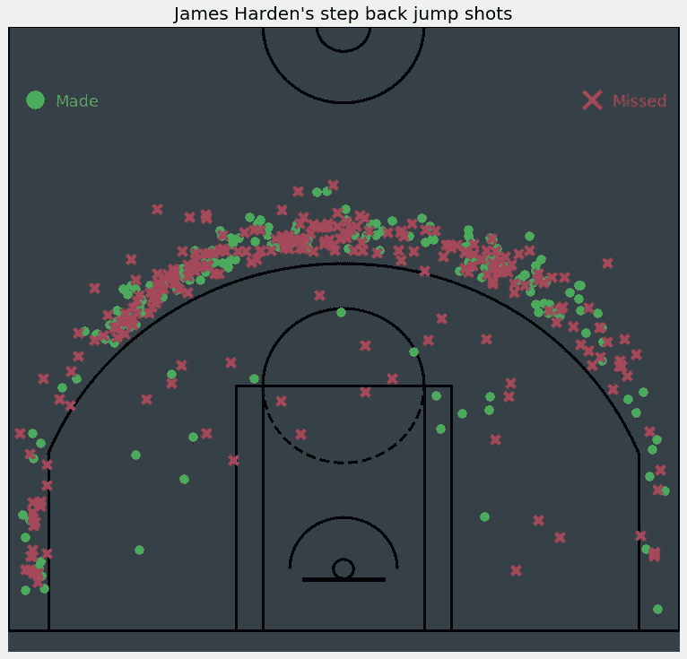
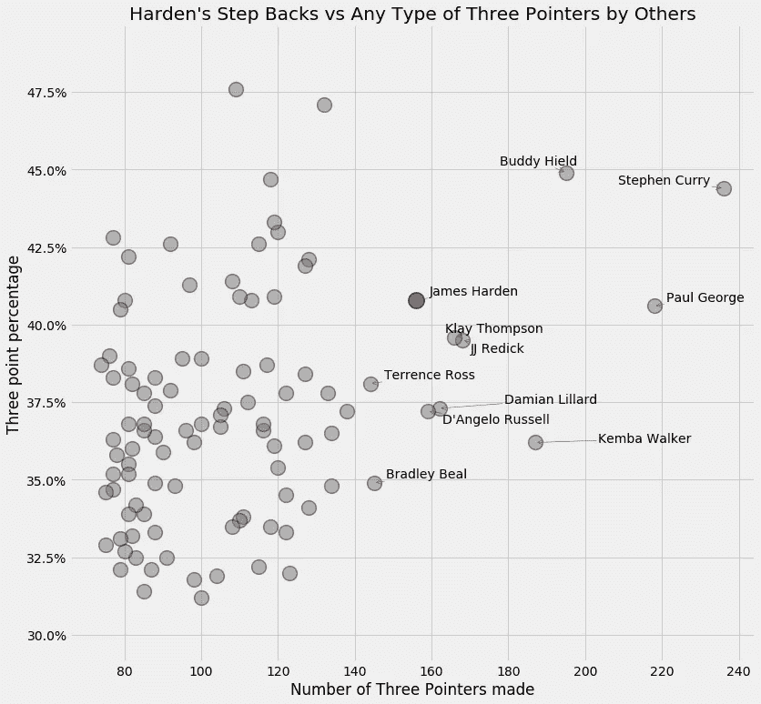
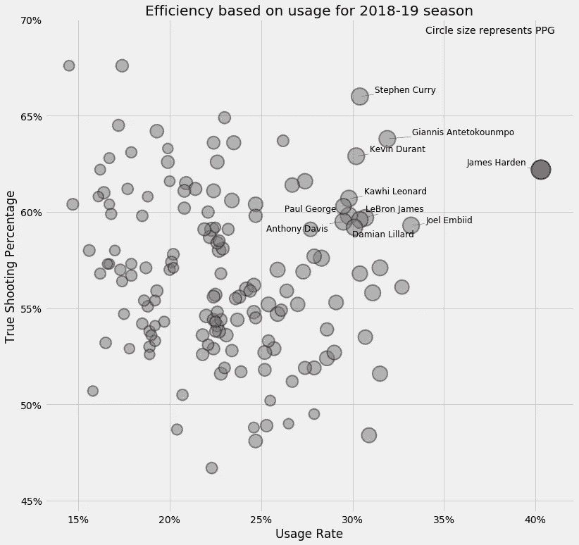
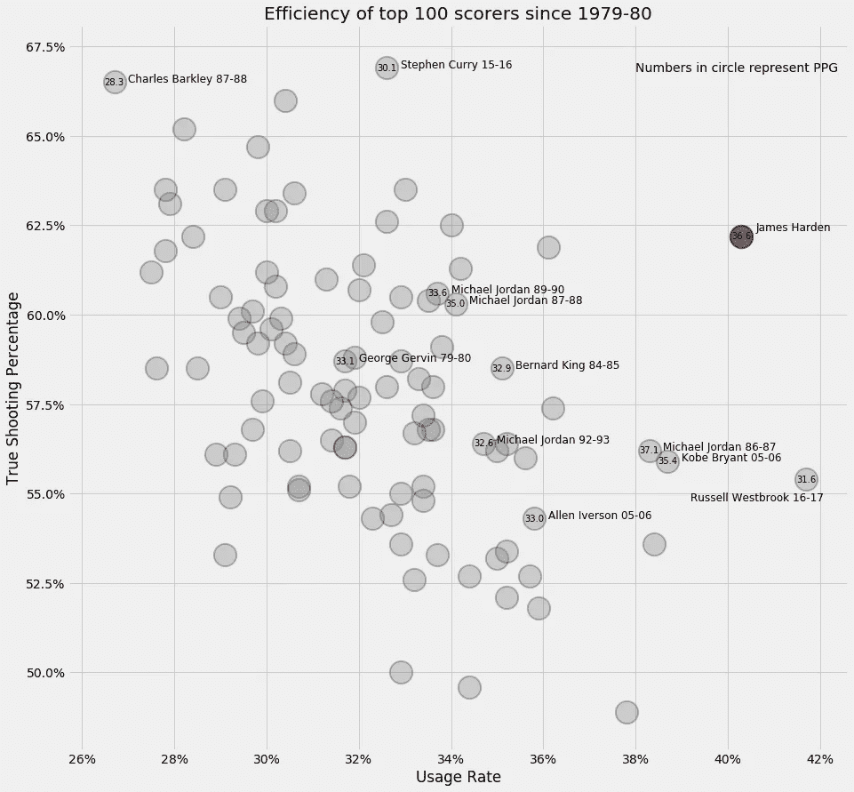
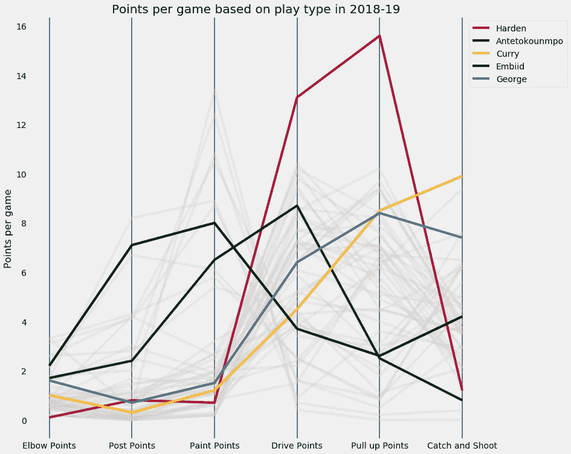
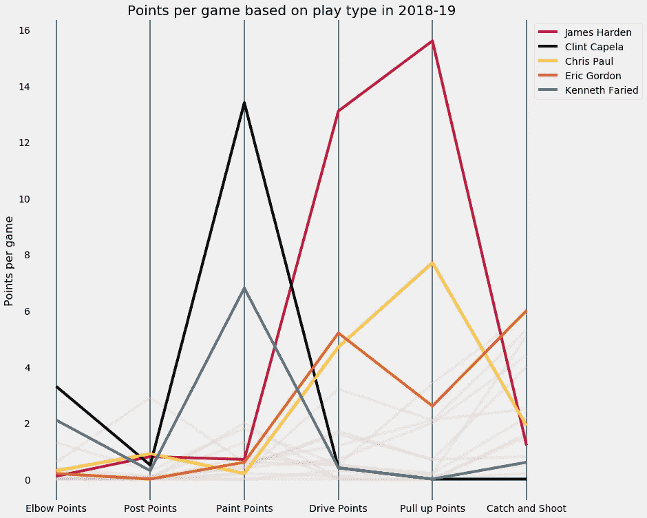

# 从各种图表看詹姆斯·哈登的《可笑的季节》

> 原文：<https://towardsdatascience.com/a-look-at-ridiculous-season-by-james-harden-through-various-charts-cbc790ff5d7f?source=collection_archive---------23----------------------->

很多人爱哈登，更有甚者，受不了他的比赛。但他正在经历现代篮球史上最令人印象深刻的赛季之一。他在没有太多低效的情况下打出了惊人的高投篮命中率。他正在做的这一切都要归功于他的(甚至更令人讨厌的)顶级武器。

# 单人军队

没有必要去搜索高级统计数据来了解詹姆斯·哈登背上的负担有多大。他已经连续 31 场比赛得分超过 30 分，这是除了伟大的威尔特·张伯伦之外 NBA 历史上最长的连胜纪录。但那是一些不同的时代，在 1979-80 年开始的三分时代，连续 30 场比赛得分最多的第二名是科比·布莱恩特，连续 16 场比赛，第三名是特雷西·麦克格雷迪，14 场比赛。他们都在 2002-03 赛季取得了这样的成就。

那个荒谬的事实让我研究了哈登本赛季的统计数据，我接着寻找的第一件事就是助攻/无助攻投篮命中率。我收集了从 1999-00 赛季到今年的数据。从 1996-97 赛季开始跟踪助攻得分的百分比，但我排除了前几个赛季，因为三分球线较短，三分球的数量过多。

Assisted vs Unassisted field goals made since 1999–00 — Image by Author

在上面的图表中，你可以看到自 1999-00 赛季以来，前 10 名得分手在每个赛季中助攻和无助攻的投篮次数。我还标记了那段时间总得分最高的 10 名球员。有趣的是，威斯布鲁克，艾弗森，甚至勒布朗的投篮总数大致相同。虽然代表罚球的圆圈大小比威斯布鲁克的大一点，但区别在于只有 50 次罚球，这使他领先拉塞尔约 150 分。

Assisted vs Unassisted 3pt field goals since 1999–00 — Image by Author

所有这些想法促使我制作了第二张图表。这里可以看到，他比其他球员的优势是由于疯狂的无辅助三分球数量而实现的。他在除了詹姆斯·哈登以外的任何球员面前都有超过 100 个无助攻三分球。

## 运球和每次触球得分

看到哈登疯狂的无助攻投篮次数，我想看看他每次运球次数和得分之间的相关性。

Dribbles per touch and points per touch — Image by Author

只有两个球员的每次运球次数超过哈登，他们是托尼·帕克和 DJ 奥古斯丁。一般来说，很多每次运球超过 4 次的球员都是控卫，这是符合逻辑的，因为他们通常会带球过球场，并叫停比赛，等等。但即使这样，哈登的每次触球得分也非常高。这意味着大多数触球不仅仅是带球穿过球场，而是带球，最终创造投篮机会，大多数时候是投篮。

我不知道他的高 PPT(每触得分)和高运球次数是否比保罗·乔治每触得分半分更令人印象深刻，这意味着他每第二次触球得分。他看起来真的是威斯布鲁克的完美球员，也是真正的 MVP 候选人。

# 拍摄图表

这篇文章的第二部分将致力于分析詹姆斯·哈登的投篮图表，以及他的投篮选择。类似于我之前的帖子，关于[Luka don CII](https://medium.com/@danielbratulic/in-depth-look-at-luka-doncics-performance-b69ff60004ba)。

Image by Author

首先，这里是哈登本赛季所有投篮的常规投篮图。他投了很多三分球，更重要的是，他的命中率很高。在真正的*莫雷球*精神中，中距离跳投并不多，所以在投篮不够的情况下，百分比真的不重要。

# 退后跳投

但现在我们来到了这篇文章最有趣的部分之一，也是哈登最危险的武器。当然，他的武器库中最有争议的一个镜头是[《退后一步》](https://www.youtube.com/watch?v=gSDJ-HffHrU)。如果你看了视频，你会注意到有一些看起来像旅行的尝试。这就是所有大惊小怪的地方。但是我不会在这篇文章中深入探讨这个问题。我只想看看詹姆斯·哈登在退后一步跳投方面有多棒。

如果你看了我关于卢卡·东契奇的帖子(我把上面的几段链接了起来)，你可能会注意到我为他的后退跳投做了一个原始的投篮图表。

Too Cluttered — Image by Author

我试着在这里做同样的事情，但是结果是毫无意义的。这是因为詹姆斯·哈登退后跳投的次数几乎是他所有投篮尝试的三分之一(总共 1316 次投篮尝试中的 417 次退后)。这种镜头的数量对于这个原始镜头图表来说太大了，没有意义，所以我像绘制普通镜头图表一样绘制它。

Image by Author

现在，这个图表真的令人印象深刻。与联盟平均百分比的比较与上面图表中的方法相同。这意味着他在每个区域的得分百分比是用所有类型的击球来计算的，而不仅仅是后退。从这张图表中我们可以得出结论，詹姆斯·哈登的退后一步跳投远高于任何类型投篮的平均 3%的命中率。

为了更好地理解詹姆斯·哈登退后一步跳投的效率有多荒谬，这里有另一个图表。

Image by Author

只有几个球员的三分球比詹姆斯·哈登还多。确切的说，只有八个。他也很有效地把握住了这些机会，超过 40%的尝试都成功了。

卡里姆有他的天勾，乔丹，科比和德克有他们自己版本的后仰投篮，哈基姆有梦摇，哈登有后退。

# 效率和使用

当人们想到哈登时，他们会想到几件事:

退后跳投。

走向罚球线。

成为一个投很多球的投手。

第一点我已经讲过了。在这篇文章中，除了在几个图表中作为*的辅助数据*，我没有触及罚球的话题。但我将试图揭穿围绕他的第三个想法。

首先，让我解释一下将在接下来的几个图表中看到的术语使用率。根据[篮球参考](https://www.basketball-reference.com/about/glossary.html)，使用率百分比(或比率)是一个球员在场上使用的团队比赛百分比的估计。更具体地说，这意味着使用率是一个衡量球员在场上的所有比赛中有多少次投篮、罚球或失误的指标。

Image by Author

现在我们用效率和使用量来看看今年的情况。这张图表显示了 PPG 排名前 100 位的运动员。就使用而言，詹姆斯·哈登是他自己的故事，乔尔·恩比德落后 7%。这里可以看出总的趋势，随着使用率的上升，真实命中率下降。最大的异类肯定是哈登，但值得一提的是库里，詹尼斯和杜兰特也是异类。

Image by Author

这张图表显示了三分时代前 100 名得分手的效率，取决于使用情况。如前所述，我没有包括老一代的玩家，因为没有使用率和其他高级指标的数据。

根据 basketball-reference 的数据，詹姆斯·哈登的使用率在现代历史上(嗯，跟踪使用率的历史)排名第二，仅次于拉塞尔·维斯特布鲁克的 monster 2016-17 赛季。但是，他的真实投篮命中率(PTS / (2 * (FGA + 0.44 * FTA))比他高大约 7%。事实上，真实的百分比也比联盟平均水平高 7%,同时具有历史最高的使用率。

在此期间，我还标记了前 10 名得分手，以及查尔斯·巴克利 1987-88 赛季和斯蒂芬·库里令人难以置信的高效 2015-17 赛季，令人难以置信的 67%的 TS%。

这两张图表本身应该足以阻止哈登投篮命中率低和效率低的说法。

# 基于情况类型的评分

我要讲的最后一个话题是基于动作类型的分数。这也是我在关于 don ci 的帖子中提到的东西，但是我为这个帖子做了一个更有趣的可视化。我决定将这些值绘制成一个平行图，这导致了下面的图表。

Image by Author

我试着想象 MVP 的前 5 名候选人是如何得分的。用灰色线条，我也代表了本赛季前 50 名的得分手。这实际上只是根据这六种类型的评分来概述分数的大致分布。展示哈登在得分和拉高得分方面的差距，以及展示他的接球和投篮得分有多少。他在这方面得分如此之少是有道理的，因为整个赛季他有大约 70 个助攻进球，但人们会认为这个数字会更高。

在那之后，我很好奇休斯顿火箭队球员的情况。

Image by Author

和预期的差不多。卡佩拉和法里德在内线得分和一些肘部跳投中占据主导地位，每个人都专注于接球和投篮(每场比赛大约有 6 名球员在 4 分左右徘徊)。似乎只有克里斯·保罗和埃里克·戈登是另外两个在某些时候创造进球机会的球员。

如果你现在仔细看第一张图表，你会发现卡佩拉在得分上领先联盟。保罗和哈登这两个伟大的组织者显然是一个巨大的推动。

## 辅助图表

对于本帖的最后一张图表，我决定看看哈登助攻的一些投篮得分，看看他是如何为队友服务的。我受到启发，想到多亏了我在 [Nylon Calculus](https://fansided.com/2019/02/17/nylon-calculus-charting-player-passing-lanes/?fbclid=IwAR2pCDHIt-khMCfhaHmheTOSq_XAQh7WwJomvbyVWU8O1kLPJ9bBkj08FNM) 上看到的这个很棒的帖子。不幸的是，我没有传球起点的位置，换句话说，哈登从哪里传球，所以我的图表看起来不那么有吸引力。

Image by Author

简而言之，这是一张图表，非常粗糙，因为我不知道如何在视觉上改进它，但它很有用。看到他的助攻有 8 次中距离投篮(如果不算 PJ 塔克在篮下的投篮，就更少了)，真是令人印象深刻。看起来哈登要么把球踢到三分范围内，要么只是把球投低上篮/扣篮。正如我已经说过的，以真正的*莫雷球*的方式。

# 结论

最后，我想说研究哈登的数据是一件非常有趣和简单的事情。无论你在哪里看，他都在一些历史上很好的数据上表现，除了在防守上，但即使在那里他也是在最差的平均数据上。

有些人仍然试图淡化本赛季和 MVP 候选资格，因为防守和我提到的其他一些要点(罚球，退后一步旅行，等等。)，但事实是詹姆斯·哈登是一个进攻怪兽，他正在经历 NBA 篮球历史上最繁荣和高效的赛季之一。对我来说，他是 MVP 竞争中的主要领跑者，尽管也有一些伟大的候选人，如保罗·乔治，詹尼斯，当然还有斯蒂芬库里。这将会是一个有趣而激动人心的赛季，MVP 也是如此。

所有这些图表都是由来自 stats.nba.com 或 T2 的数据生成的。所有图表都是用 Python 创建的，使用的是 matplotlib 和 seaborn。代码以 Jupyter 笔记本的形式存在于我的 [Github 库](https://github.com/danchyy/Basketball_Analytics)中。