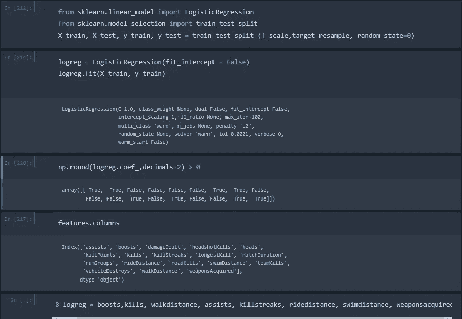
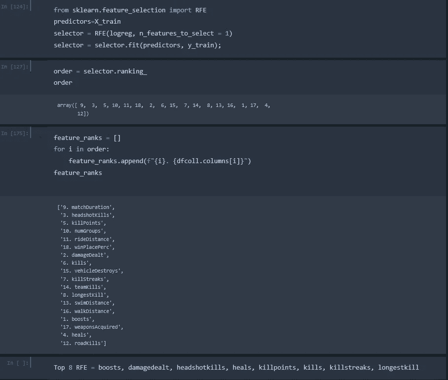
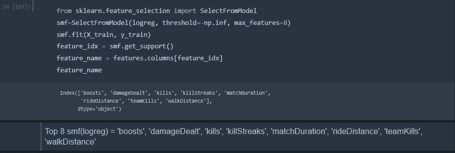

# 逻辑回归模型中特征重要性的研究

> 原文：<https://towardsdatascience.com/a-look-into-feature-importance-in-logistic-regression-models-a4aa970f9b0f?source=collection_archive---------2----------------------->

在完成了一个调查 PUBG 中 winning 的项目([https://medium . com/@ jasonrichards 911/winning-in-PUBG-clean-data-does-mean-ready-data-47620 a 50564](https://medium.com/@jasonrichards911/winning-in-pubg-clean-data-does-not-mean-ready-data-47620a50564))之后，我突然想到不同的模型会产生不同的功能重要性排名。对于模型选择的级别(逻辑回归、随机森林、XGBoost)并不奇怪，但在我的数据科学头脑中，我必须挖掘得更深，特别是在逻辑回归中。

让我们为那些已经准备点击后退按钮的人换一个方向。特征选择是模型调整中的一个重要步骤。简而言之，它降低了数据集中的维数，从而提高了模型的速度和性能。现在，我知道这涉及到一个更老的(我们称之为“有经验的”)模型…但是我们知道有时候老狗正是你所需要的。

稍微研究了一下之后，我发现了三种在逻辑回归模型中排列特性的方法。这将通过系数值、递归特征消除(RFE)和 sci-kit Learn 的 SelectFromModels (SFM)来实现。

所有这些方法都应用于 sklearn.linear_model。物流回归，因为 RFE 和 SFM 都是 sklearn 包。另请注意，运行 Statsmodels 版本的逻辑回归(Logit)来比较初始系数值，初始排名是相同的，因此我会假设在 Logit 模型上执行任何其他方法都会产生相同的结果，但我确实讨厌 ass-u-me 这个词，因此如果有任何人想要测试该假设，请随意使用。在执行这些方法之前，数据也被擦洗、清洁和白化。

现在来看本质。第一，系数。系数越高，特征的“重要性”越高。为了设置基线，决定选择前八个特性(这就是项目中使用的特性)。数据被拆分和拟合。如果你看看下面的图片，碰巧所有的正系数都产生了前八个特性，所以我只是将布尔值与列索引相匹配，并列出下面的八个。(靴子，杀死，步行距离，助攻，杀死条纹，骑距离，游泳距离，武器获得)。

LogReg Feature Selection by Coefficient Value

接下来是 RFE，可在 sklearn.feature_selection.RFE 中找到。RFE 没有深入研究细节，它是一种**特征选择方法，适合模型**，并删除最弱的特征(或多个特征)，直到达到指定的特征数量。要获得特性的完整排名，只需设置参数 n_features_to_select = 1。如果将它设置为大于 1 的任何值，它会将前 n 名排序为 1，然后按顺序递减。在这里，在一点点列表操作(增强，伤害，爆头，治疗，杀伤点，杀伤，连续杀伤，最长杀伤)后，排名是非常明显的。

LogReg Feature Selection by RFE

使用的最后一个方法是 sk learn . feature _ selection . selectfrommodel。该函数的预期方法是，它将按重要性选择特性，您可以将它们保存为自己的特性数据帧，并直接实施到调整后的模型中。操纵代码来提供所选列的名称需要一点工作，但是有了咖啡因、时间和 Stackoverflow，一切皆有可能。(提升，伤害，死亡，死亡条纹，比赛持续时间，骑行距离，团队死亡，步行距离)。

LogReg Feature Selection with SFM

现在来看看从每种方法中选择的特性是如何改进模型的。具有所有特征(总共 18 个)的原始 LogReg 函数产生 0.9771113517371199 的“曲线下面积”(AUC)和 93%的 F1 分数。

系数排名:AUC:0.975317873246652；F1: 93%。*因为我们确实减少了一半以上的功能，失去. 002 是一个相当不错的结果。*

RFE:AUC:0.9726984765479213；F1: 93%。*实际表现比系数选择稍差，但差不了多少。*

SFM:AUC:0.976537660071581；F1: 93%。*最佳性能，但也差不了多少*。

结论:总的来说，这两种方法的性能没有太大的差别。从计算开销的角度来看，系数排名是目前最快的，SFM 紧随 RFE 之后。需要记住的是，在超参数调整后，精确度可能会受到指数影响，如果这是在一场以美元为单位的 Kaggle 竞赛中排名第一或第二之间的差异，那么如果逻辑回归是最适合的模型，那么用尽您的特征选择选项**可能值得一点额外的计算费用。**

顺便提一下:我的 XGBoost 选择了 **(** 击杀、步行距离、最长击杀、获得武器、治疗、增强、辅助、爆头击杀)，这导致了(在超参数调整之后)99.4%的测试准确度分数。