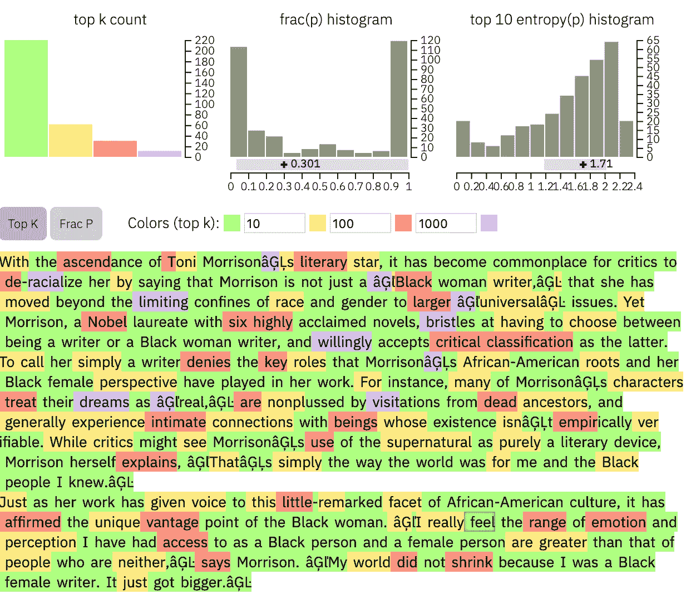
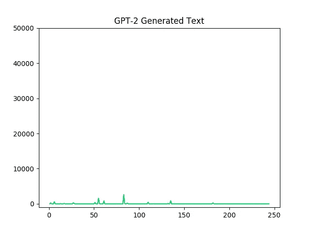
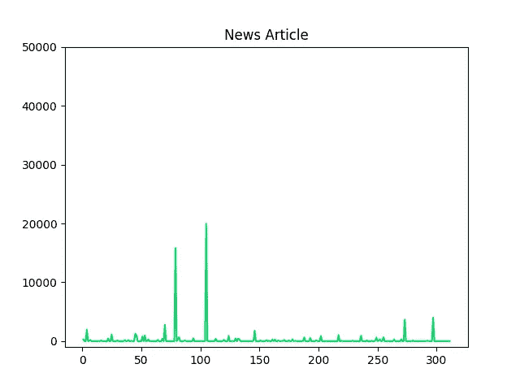
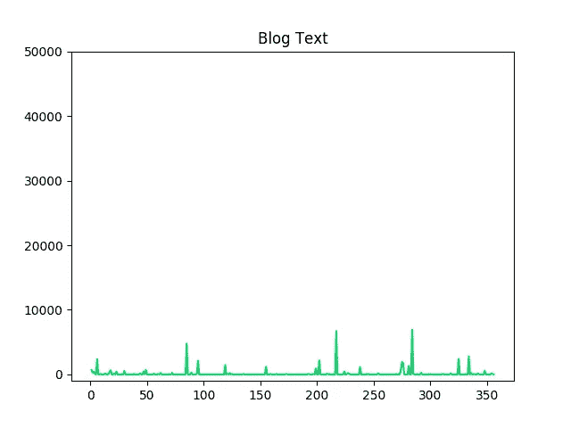

# GLTR 研究(使用 GPT 新协议)

> 原文：<https://towardsdatascience.com/a-look-into-gltr-using-gpt-2-76d823057421?source=collection_archive---------12----------------------->



Taken from [http://gltr.io/](http://gltr.io/)

随着 BERT 模型[1]的发布，自然语言处理(NLP)领域在过去的一年中取得了巨大的进步，该模型改善了许多问题的技术水平，如文本分类、问题回答等。现在，Open AI [2]发布了名为 GPT-2 [3]的语言模型，据称该模型能够生成无法识别为机器或人类所写的文本样本。

最近，来自麻省理工学院-IBM 沃森人工智能实验室和[哈佛大学的合作团队推出了一款名为**G**iant**L**angauge Model**T**est**R**oom(**GLTR**)的文本取证工具。GLTR 基本上使用 GPT-2 语言模型来区分人类生成的文本和机器生成的文本。](http://nlp.seas.harvard.edu/)

在这篇文章中，我将使用**GLTR(Python 中的)**来分析不同来源的文本片段，看看它们在文本的平滑度方面有何不同。我将使用 https://github.com/HendrikStrobelt/detecting-fake-text[的 GLTR 代码。](https://github.com/HendrikStrobelt/detecting-fake-text)

下面是这段代码，**将文本作为输入**并使用 GPT-2 模型来**输出包含三样东西的有效载荷**。

1.  给定上下文中每个单词的概率。
2.  给定上下文，整个词汇表中每个单词的等级。
3.  给定上下文，前 K 个单词及其概率。

```
*import* numpy *as* np
*import* torch
*import* time
*import* nltk

*from* pytorch_pretrained_bert *import* (GPT2LMHeadModel, GPT2Tokenizer,
                                     BertTokenizer, BertForMaskedLM)

*from* matplotlib *import* pyplot *as* plt

*class* AbstractLanguageChecker():
    *"""
    Abstract Class that defines the Backend API of GLTR.

    To extend the GLTR interface, you need to inherit this and
    fill in the defined functions.
    """

    def __init__*(*self*):
        *'''
        In the subclass, you need to load all necessary components
        for the other functions.
        Typically, this will comprise a tokenizer and a model.
        '''
        self*.device = torch.device(
            "cuda" *if* torch.cuda.is_available() *else* "cpu")

    *def* check_probabilities(*self*, in_text, topk=40):
        *'''
        Function that GLTR interacts with to check the probabilities of words

        Params:
        - in_text: str -- The text that you want to check
        - topk: int -- Your desired truncation of the head of the distribution

        Output:
        - payload: dict -- The wrapper for results in this function, described below

        Payload values
        ==============
        bpe_strings: list of str -- Each individual token in the text
        real_topk: list of tuples -- (ranking, prob) of each token
        pred_topk: list of list of tuple -- (word, prob) for all topk
        '''
        raise* NotImplementedError

    *def* postprocess(*self*, token):
        *"""
        clean up the tokens from any special chars and encode
        leading space by UTF-8 code '\u0120', linebreak with UTF-8 code 266 '\u010A'* ***:param*** *token:  str -- raw token text* ***:return****: str -- cleaned and re-encoded token text
        """
        raise* NotImplementedError

*def* top_k_logits(logits, k):
    *'''
    Filters logits to only the top k choices
    from https://github.com/huggingface/pytorch-pretrained-BERT/blob/master/examples/run_gpt2.py
    '''
    if* k == 0:
        *return* logits
    values, _ = torch.topk(logits, k)
    min_values = values[:, -1]
    *return* torch.where(logits < min_values,
                       torch.ones_like(logits, dtype=logits.dtype) * -1e10,
                       logits)

*class* LM(AbstractLanguageChecker):
    *def __init__*(*self*, model_name_or_path="gpt2"):
        super(LM, *self*).__init__()
        *self*.enc = GPT2Tokenizer.from_pretrained(model_name_or_path)
        *self*.model = GPT2LMHeadModel.from_pretrained(model_name_or_path)
        *self*.model.to(*self*.device)
        *self*.model.eval()
        *self*.start_token = '<|endoftext|>'
        print("Loaded GPT-2 model!")

    *def* check_probabilities(*self*, in_text, topk=40):
        *# Process input* start_t = torch.full((1, 1),
                             *self*.enc.encoder[*self*.start_token],
                             device=*self*.device,
                             dtype=torch.long)
        context = *self*.enc.encode(in_text)
        context = torch.tensor(context,
                               device=*self*.device,
                               dtype=torch.long).unsqueeze(0)
        context = torch.cat([start_t, context], dim=1)
        *# Forward through the model* logits, _ = *self*.model(context)

        *# construct target and pred* yhat = torch.softmax(logits[0, :-1], dim=-1)
        y = context[0, 1:]
        *# Sort the predictions for each timestep* sorted_preds = np.argsort(-yhat.data.cpu().numpy())
        *# [(pos, prob), ...]* real_topk_pos = list(
            [int(np.where(sorted_preds[i] == y[i].item())[0][0])
             *for* i *in* range(y.shape[0])])
        real_topk_probs = yhat[np.arange(
            0, y.shape[0], 1), y].data.cpu().numpy().tolist()
        real_topk_probs = list(map(*lambda* x: round(x, 5), real_topk_probs))

        real_topk = list(zip(real_topk_pos, real_topk_probs))
        *# [str, str, ...]* bpe_strings = [*self*.enc.decoder[s.item()] *for* s *in* context[0]]

        bpe_strings = [*self*.postprocess(s) *for* s *in* bpe_strings]

        *# [[(pos, prob), ...], [(pos, prob), ..], ...]* pred_topk = [
            list(zip([*self*.enc.decoder[p] *for* p *in* sorted_preds[i][:topk]],
                     list(map(*lambda* x: round(x, 5),
                              yhat[i][sorted_preds[i][
                                      :topk]].data.cpu().numpy().tolist()))))
            *for* i *in* range(y.shape[0])]

        pred_topk = [[(*self*.postprocess(t[0]), t[1]) *for* t *in* pred] *for* pred *in* pred_topk]
        payload = {'bpe_strings': bpe_strings,
                   'real_topk': real_topk,
                   'pred_topk': pred_topk}
        *if* torch.cuda.is_available():
            torch.cuda.empty_cache()

        *return* payload

    *def* sample_unconditional(*self*, length=100, topk=5, temperature=1.0):
        *'''
        Sample `length` words from the model.
        Code strongly inspired by
        https://github.com/huggingface/pytorch-pretrained-BERT/blob/master/examples/run_gpt2.py

        '''* context = torch.full((1, 1),
                             *self*.enc.encoder[*self*.start_token],
                             device=*self*.device,
                             dtype=torch.long)
        prev = context
        output = context
        past = *None
        # Forward through the model
        with* torch.no_grad():
            *for* i *in* range(length):
                logits, past = *self*.model(prev, past=past)
                logits = logits[:, -1, :] / temperature
                *# Filter predictions to topk and softmax* probs = torch.softmax(top_k_logits(logits, k=topk),
                                      dim=-1)
                *# Sample* prev = torch.multinomial(probs, num_samples=1)
                *# Construct output* output = torch.cat((output, prev), dim=1)

        output_text = *self*.enc.decode(output[0].tolist())
        *return* output_text

    *def* postprocess(*self*, token):
        with_space = *False* with_break = *False
        if* token.startswith('Ġ'):
            with_space = *True* token = token[1:]
            *# print(token)
        elif* token.startswith('â'):
            token = ' '
        *elif* token.startswith('Ċ'):
            token = ' '
            with_break = *True* token = '-' *if* token.startswith('â') *else* token
        token = '“' *if* token.startswith('ľ') *else* token
        token = '”' *if* token.startswith('Ŀ') *else* token
        token = "'" *if* token.startswith('Ļ') *else* token

        *if* with_space:
            token = '\u0120' + token
        *if* with_break:
            token = '\u010A' + token

        *return* token
```

为了检查一篇文章的通顺程度，我会画出每个单词的排名。根据 GPT-2 语言模型，如果文本中单词的排名较高，则文本将是不平滑的。以下代码用于为文本创建这些绘图。

```
*def* plot_text(vals, what, name):
    *if* what=="prob":
        ourvals = vals[0]
        x = list(range(1,len(ourvals)+1))
        y = ourvals
        plt.plot(x, y, color='orange')
        plt.ylim(0,1)
        plt.savefig(name + ".png")
        *# plt.show()
    elif* what=="rank":
        ourvals = vals[1]
        x = list(range(1, len(ourvals) + 1))
        y = ourvals
        plt.plot(x, y, color='orange')
        plt.ylim(-1000, 50000)
        plt.savefig(name + ".png")
        *# plt.show()**def* main_code(raw_text):
    lm = LM()
    start = time.time()
    payload = lm.check_probabilities(raw_text, topk=5)
    *# print(payload["pred_topk"])* real_topK = payload["real_topk"]
    ranks = [i[0] *for* i *in* real_topK]
    preds = [i[1] *for* i *in* real_topK]
    plot_text([preds, ranks], 'rank', "rank_")
    end = time.time()
    print("{:.2f} Seconds for a check with GPT-2".format(end - start))
```

现在，让我们看看不同来源的文本在流畅度方面是否有所不同。我们将检查以下文本。

1.  由 GPT-2 语言模型生成的文本。
2.  新闻文章中的文字。
3.  来自博客的文本。

以下是情节:



Rank plot for GPT-2 Generated Text



Rank plot for News Article



Rank plot for Blog Text

GPT-2 生成的文本的等级图非常平滑，因为它是由 GPT-2 模型本身检查的。博客和新闻文章数据有一些峰值，这表明围绕这些词有一些不一致之处。

作为一个有趣的练习，你可以分析不同类型的文章，看看在流畅度方面有什么不同。

GLTR 的一个主要用途可能是在 Grammarly 这样的系统中。它可以指出导致不一致的单词，并提示用户进行更改。这至少是一个不错的 GitHub 项目。

## **参考文献**

[1][https://arxiv.org/abs/1810.04805](https://arxiv.org/abs/1810.04805)

[2]https://openai.com/

[3][https://d4mucfpksywv . cloudfront . net/better-language-models/language _ models _ are _ unsupervised _ multask _ learners . pdf](https://d4mucfpksywv.cloudfront.net/better-language-models/language_models_are_unsupervised_multitask_learners.pdf)