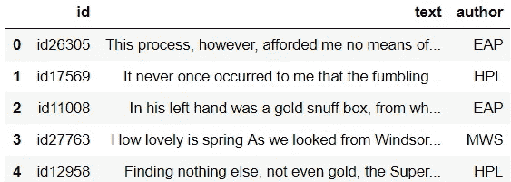
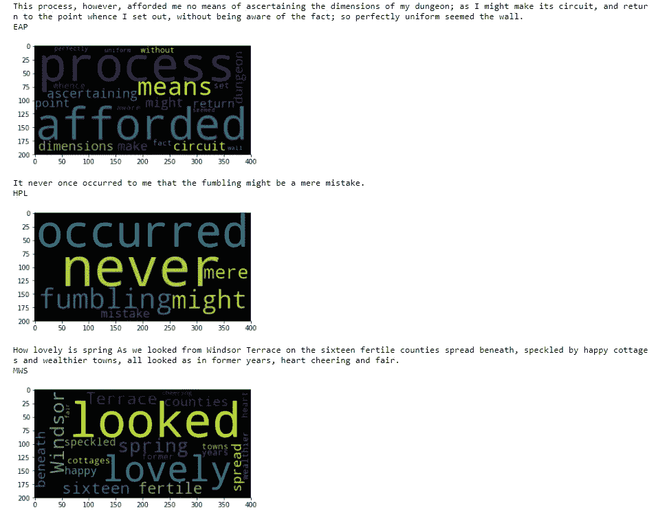
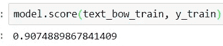
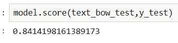
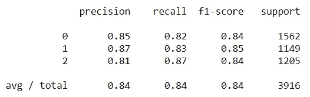
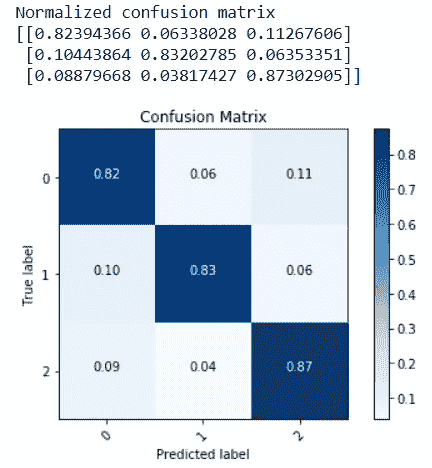

# 从文本片段中识别恐怖小说作者的机器学习方法

> 原文：<https://towardsdatascience.com/a-machine-learning-approach-to-author-identification-of-horror-novels-from-text-snippets-3f1ef5dba634?source=collection_archive---------3----------------------->

## 让我们开始吧…


有许多小说正在被创作，但其中一些在多年后获得了狂热的地位，并被人们铭记了很久。小说有几种体裁和跨体裁(几种体裁的混合)。恐怖小说是一种特殊的小说类型。有许多著名的恐怖小说，即使在发行几十年后，仍然是读者的绝对最爱。例如，RL Stine 的*鸡皮疙瘩系列(1998–2016)*已经家喻户晓，是现代最著名的恐怖小说之一。但是许多经典的恐怖小说出现在 21 世纪之前。比如 H.P .洛夫克拉夫特的恐怖小说*【未知卡达思的寻梦(1943)* 已经是 20 世纪必读的恐怖小说之一。从这里，如果我们再回到 19 世纪，怎么会有人忘记玛丽·雪莱的*弗兰肯斯坦(1818 & 1823)* 和埃德加·爱伦·坡的*厄舍古屋的倒塌(1839)* ？但是有一点很明显，

***每位作家，无论是洛夫克拉夫特、玛丽·雪莱还是爱伦坡，都有自己的写作风格，其中包括使用特定词汇的标志性时尚，这使得他们的文学作品独一无二，易于辨认***

所以，让我们利用这一事实，从他们的恐怖小说中摘录或引用的文字片段中确定作者(洛夫克拉夫特/玛丽·雪莱/坡)。自然语言处理(NLP)支持的机器学习是解决上述问题的一个很好的方案。所以，我们把问题陈述清楚，开始行动吧！！！

**问题陈述**:*给出埃德加·爱伦·坡、玛丽·雪莱和惠普·洛夫克拉夫特的著名小说中的文字片段/引文，指出该文字片段或引文的作者是谁*

为此，考虑由 Kaggle 准备的 [***幽灵作者识别数据集***](https://www.kaggle.com/c/spooky-author-identification/data) 。

所以，让我们使用 NLTK(自然语言工具包)和 Scikit-Learn 开始用 Python 开发机器学习模型吧！！！

I. **使用 Pandas 加载(读取)数据集:**

```
import pandas as pddf = pd.read_csv('train.csv')
df.head(5) # **for showing a snapshot of the dataset**
```



Snapshot of the Dataset in which under label **author**, **EAP** -> (**Edgar Allan Poe**), **HPL** -> (**HP Lovecraft**) and **MWS** -> (**Mary** **Wollstonecraft Shelley**)

二。**文本处理步骤:**

1.  删除标点符号→从数据集(语料库)的所有文本片段(实例或文档)中删除所有标点符号。
2.  一个词的词形变化叫做引理。例如，(正在学习，已学习)是词根单词 study 的变形形式或引理。因此，一个单词的词条被分组在单个词根下。这样做是为了使语料库中的词汇只包含不同的单词。
3.  停用词的去除→停用词通常是冠词(a，an，the)，介词(in，on，under，…)以及其他不提供任何关键或必要信息的频繁出现的词。它们被从数据集(语料库)中存在的所有文本片段中移除。

```
# **Importing necessary libraries** import string
from nltk.corpus import stopwords
from nltk.stem import WordNetLemmatizerlemmatiser = WordNetLemmatizer()# **Defining a module for Text Processing** def text_process(tex):
    # **1\. Removal of Punctuation Marks** 
    nopunct=[char for char in tex if char not in string.punctuation]
    nopunct=''.join(nopunct)
    # **2\. Lemmatisation** a=''
    i=0
    for i in range(len(nopunct.split())):
        b=lemmatiser.lemmatize(nopunct.split()[i], pos="v")
        a=a+b+' '
    # **3\. Removal of Stopwords** return [word for word in a.split() if word.lower() not 
            in stopwords.words('english')]
```

三。**类别标签编码:**

因为这是一个分类问题，这里的类是上面提到的三个作者。但是在数据集中，可以看到标签是非数字的(MWS、EAP 和 HPL)。这些是标签编码，使其成为数字，从 0 开始，按字母顺序描述每个标签，即(0 → EAP，1 → HPL 和 2 → MWS)

```
# **Importing necessary libraries** from sklearn.preprocessing import LabelEncodery = df['author']
labelencoder = LabelEncoder()
y = labelencoder.fit_transform(y)
```

四。**字云可视化:**

随着机器学习模型的开发，基于作者在文本中使用特定单词时有自己独特的风格这一事实，在单词云的帮助下，取分别属于 3 个作者的 3 个文本片段，完成 3 个作者最常用的单词到最少使用的单词的可视化。

```
# **Importing necessary libraries** from PIL import Image
from wordcloud import WordCloud
import matplotlib.pyplot as pltX = df['text']wordcloud1 = WordCloud().generate(X[0]) # **for EAP**
wordcloud2 = WordCloud().generate(X[1]) # **for HPL**
wordcloud3 = WordCloud().generate(X[3]) # **for MWS** print(X[0])
print(df['author'][0])
plt.imshow(wordcloud1, interpolation='bilinear')
plt.show()print(X[1])
print(df['author'][1])
plt.imshow(wordcloud2, interpolation='bilinear')
plt.show()print(X[3])
print(df['author'][3])
plt.imshow(wordcloud3, interpolation='bilinear')
plt.show()
```



**Word Clouds for the 3 authors taking their text-snippet samples**

动词 （verb 的缩写）**特色工程用词袋:**

机器学习算法只对数字数据有效。但是在这里，数据仅以文本的形式出现。为此，通过某种方式，需要将文本数据转换成数字形式。这样做的一种方法是特征工程。在这种方法中，从文本数据中提取或设计数字特征。存在许多特征工程技术。在这个问题中，使用了特征工程的词袋技术。

= >词汇袋:

这里，存在于语料库中的词汇被维护。这些单词充当每个实例或文档(这里是文本片段)的特征。针对作为特征的每个单词，考虑其在当前文档(文本片段)中的频率。因此，以这种方式，从文本数据或语料库中设计或提取单词特征。

```
# **Importing necessary libraries**
from sklearn.feature_extraction.text import CountVectorizer
from sklearn.model_selection import train_test_split# **80-20 splitting the dataset (80%->Training and 20%->Validation)** X_train, X_test, y_train, y_test = train_test_split(X, y
                                  ,test_size=0.2, random_state=1234)# **defining the bag-of-words transformer on the text-processed corpus** # **i.e., text_process() declared in II is executed...** bow_transformer=CountVectorizer(analyzer=text_process).fit(X_train)# **transforming into Bag-of-Words and hence textual data to numeric..**
text_bow_train=bow_transformer.transform(X_train)#**ONLY TRAINING DATA**# **transforming into Bag-of-Words and hence textual data to numeric..** text_bow_test=bow_transformer.transform(X_test)#**TEST DATA**
```

不及物动词**训练模型:**

多项式朴素贝叶斯算法(分类器)已经被用作分类机器学习算法[1]。

```
# **Importing necessary libraries** from sklearn.naive_bayes import MultinomialNB# **instantiating the model with Multinomial Naive Bayes..** model = MultinomialNB()# **training the model...** model = model.fit(text_bow_train, y_train)
```

七。**车型性能分析:**

= >训练准确度

```
model.score(text_bow_train, y_train)
```



**Training Accuracy**

= >验证准确性

```
model.score(text_bow_test, y_test)
```



**Test/Validation Accuracy**

= >精确度、召回率和 F1–分数

```
# **Importing necessary libraries** from sklearn.metrics import classification_report

# **getting the predictions of the Validation Set...**
predictions = model.predict(text_bow_test)
# **getting the Precision, Recall, F1-Score** print(classification_report(y_test,predictions))
```



**Classification Report**

= >混淆矩阵

```
# **Importing necessary libraries** from sklearn.metrics import confusion_matrix
import numpy as np
import itertools
import matplotlib.pyplot as plt# **Defining a module for Confusion Matrix...** def plot_confusion_matrix(cm, classes,
                          normalize=False,
                          title='Confusion matrix',
                          cmap=plt.cm.Blues):
    """
    This function prints and plots the confusion matrix.
    Normalization can be applied by setting `normalize=True`.
    """
    if normalize:
        cm = cm.astype('float') / cm.sum(axis=1)[:, np.newaxis]
        print("Normalized confusion matrix")
    else:
        print('Confusion matrix, without normalization')print(cm)plt.imshow(cm, interpolation='nearest', cmap=cmap)
    plt.title(title)
    plt.colorbar()
    tick_marks = np.arange(len(classes))
    plt.xticks(tick_marks, classes, rotation=45)
    plt.yticks(tick_marks, classes)fmt = '.2f' if normalize else 'd'
    thresh = cm.max() / 2.
    for i, j in itertools.product(range(cm.shape[0])
                                  , range(cm.shape[1])):
        plt.text(j, i, format(cm[i, j], fmt),
                 horizontalalignment="center",
                 color="white" if cm[i, j] > thresh else "black")plt.tight_layout()
    plt.ylabel('True label')
    plt.xlabel('Predicted label')cm = confusion_matrix(y_test,predictions)
plt.figure()
plot_confusion_matrix(cm, classes=[0,1,2], normalize=True,
                      title='Confusion Matrix')
```



**Normalized Confusion Matrix**

根据性能分析，可以得出结论，NLP 驱动的机器学习模型已经成功地有效地正确分类了 84.14%的未知(验证集)样本。换句话说，84.14%的文本片段被正确地识别出属于三个作者中的哪一个。

**基于我们的模特表演，能不能得出哪位作者的文笔最独特？**

答案是肯定的！！！让我们看看归一化的混淆矩阵。这里标签 2 是最正确的分类。由于标签 2 指的是玛莉·渥斯顿克雷福特·雪莱，因此可以得出结论

玛莉·渥斯顿克雷福特·雪莱写恐怖小说的风格最独特的是埃德加·爱伦·坡和惠普·洛夫克拉夫特。

另外，换个角度，**我们能说玛丽·雪莱、埃德加·爱伦·坡和惠普·洛夫克拉夫特谁是最多才多艺的作家吗？**

同样，答案是肯定的！！！再次查看混淆矩阵，标签 0 是分类最不正确的。标签 0 指的是埃德加·爱伦·坡，所以可以得出结论

埃德加·爱伦·坡比惠普·洛夫克拉夫特和玛丽·雪莱都多才多艺。

这样，可以使用机器学习和自然语言处理来开发文本检测模型。

使用经过训练的伯努利朴素贝叶斯(而不是多项式朴素贝叶斯)的相关网络应用程序也已经使用 Flask API 在 Heroku 开发和部署。Web 应用程序的链接如下所示:

[https://authoridentifier.herokuapp.com/](https://authoridentifier.herokuapp.com/)

**参考文献**

[1][https://towards data science . com/multinomial-naive-Bayes-classifier-for-text-analysis-python-8dd 6825 ECE 67](/multinomial-naive-bayes-classifier-for-text-analysis-python-8dd6825ece67)