# 自动化顾客满意度调查的机器学习方法

> 原文：<https://towardsdatascience.com/a-machine-learning-approach-to-automated-customer-satisfaction-surveys-946d2604e309?source=collection_archive---------6----------------------->

## 泰勒·多尔，马修·巴辛，凯·尼科尔斯，西德尼·约翰逊

在浏览我的一些文档时，我偶然发现了一篇我在大学时参与的论文，我认为它非常适合分享。作为背景，这篇论文是为我的一个班级写的，在那里我们有一个由一家公司赞助的项目。就我而言，我与马修·布辛、凯·尼科尔斯和西德尼·约翰逊合作了一个由 ProKarma 赞助的项目，试图实现客户满意度调查的自动化。这篇论文最初发表在我们的课程网站[这里](http://cs-courses.mines.edu/csci370/FS2018/FinalReport/ProKarma.pdf)。它已被改编以适应这种格式，原文被嵌入在文章的结尾。尽情享受吧！

# 介绍

自然语言处理(NLP)是一个关于捕获、分析和解释人类
语言的广泛学科。特别地，NLP 可以用于评估人类语音
，以便确定关于其说话者、上下文、
和情感的不同品质。这些评估可用于通知人机交互、可访问性、自动化和自然语言的统计分析。

这个 NLP 项目是由 ProKarma 的 Edge Intelligence group 提出的，pro karma 是一家 IT 解决方案公司，总部位于内布拉斯加州，提供数字化转型和分析咨询。ProKarma 的
Edge Intelligence group 正在研究如何通过结合机器学习来增加电信行业的客户
服务呼叫，从而改善客户
服务。提高客户服务满意度的一种方法
包括确定客户对特定产品的态度，并通过对客户电话数据进行情感和话题分析，有效地实现自动化客户服务调查。

自动化的客户满意度数据收集将提供
关于消费者对产品
和服务态度的可操作信息，其响应水平比单纯依赖
在线完成电话调查的客户要高得多。这个自动化系统可以与许多无线运营商目前采用的传统电话调查并行运行。对电话中提到的产品的自动化情感分析
可以根据客户完成电话后调查
的情况进行验证
。

由于自然语言中包含大量变量，传统的分析方法很难适应这一目的。机器学习算法允许简单的音频数据线性插值以及强大的模式
查找工具。出于这个原因，神经网络被开发用于
的主题和情感分类。这些模型发现产品类型和消费者态度之间的模式
，这提供了从客户电话音频中生成自动化客户满意度
调查所需的
信息。

# 方法

完成
自动化调查过程的最终目标需要三个模型:语音转文本转录、情感
建模和主题建模。

*   语音转文本转录:为了自动转录呼叫数据，需要一种自动语音识别(ASR)策略。为了执行后面的主题和情感分析，准确和高性能的 ASR 实现是至关重要的，这些分析将简单语言的抄本作为输入。作为输入，抄本比纯音频更可取，原因有二:首先，主题建模不能直接在音频上执行，因为主题是必须从文本源中直接提取或解释的字符串；其次，音频文件可以用于检测有声情绪，但不能检测非情绪情绪(例如，单调的客户说“谢谢您的帮助”，或者活泼的客户高兴地说“我的电话打不开”)。
*   情绪模型:由于情绪分析对于确定客户满意度非常重要，因此需要开发一个机器学习模型来根据转录的文本输入检测对客户服务代表的情绪(积极、消极或中立)。ProKarma 的 Edge Intelligence group 之前实施了一个双向长短期记忆递归神经网络(LSTM RNN)，该网络使用开源数据集进行训练，如交互式情感二元运动捕捉(IEMOCAP)数据库，以便对从音频剪辑中提取的声学特征进行情感和情绪分类。在这个项目中，我们基于抄本的模型旨在捕捉整体情绪，而不是像以前基于声学的模型那样捕捉声音特征。
*   主题模型:为了交叉分析客户情绪和谈话主题，产生了分类模型来识别抄本中的概念和特定主题。对话话题的趋势可以用来理解个人客户对产品和服务的态度，也可以用来理解一般客户群的态度。

这些模型最终形成了一个对客户通话录音进行端到端音频分析的引擎。所有项目代码都是使用
Python 3.6 编写的，通过
Keras 接口使用了 Google 的 TensorFlow 机器学习库，并使用了 Python/R Anaconda 发行版。
使用 git 执行版本控制，GitHub 用于
托管所有项目存储库。该项目是使用
敏捷工作流程开发的，团队协作和沟通是使用软件 Slack
促进的。

# 系统架构和设计

该项目的目的是证明将客户
服务呼叫作为输入，并将与客户满意度调查相关的数据作为输出是可能的。为完成这项任务而构建的系统，如图 1 所示，由三个主要模型组成:语音到文本模型、主题模型和情感模型。语音转文本模型在网络搜集的客户服务呼叫音频文件上进行训练。主题模型是在一个无线运营商的 FAQ 和论坛帖子的 web 废弃语料库上训练的。情感模型是在注释 IEMOCAP 转录本和电子评论的组合数据集上训练的。然后，客服电话音频通过语音转文本程序生成文字记录，然后输入主题和情感模型。后两种模型输出对整体主题和逐句情感标签的预测。然后将这两个输出进行汇总，以生成客户满意度指标的可视化，如通话过程中随时间推移的情绪以及与特定主题相关的情绪。

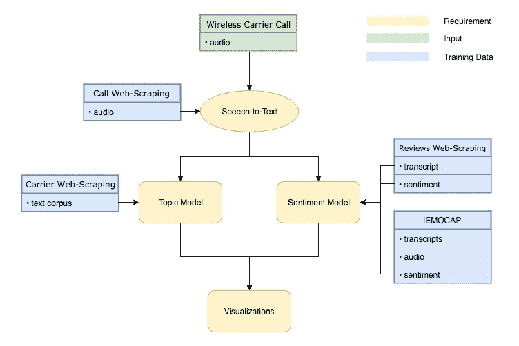

Figure 1: Diagram of general system architecture.

# 技术设计

将卷积神经网络(CNN)用于自然语言处理是最近的发展。CNN 最广为人知的是他们在图像分类中的成功，从过滤器的自然能力中识别图像的组成部分，如线条和形状。用于图像的 CNN 可以成功地
找到形状中的模式，而用于语言的 CNN 的过滤器同样能够
找到 n-gram 中的模式。

用于测试的网络如图 2 所示，并在图 3 中详细说明
，有两个卷积层。第一卷积
层有 64 个滤波器，滤波器大小为 4，第二卷积层有 32 个滤波器
，滤波器大小为 6。这些是测试
型号功能的起点。这些参数可以进一步调整
以提高模型的准确性。使用 CNN 进行情感
分析时，建议使用更多数量的过滤器
和 3–5 范围内的过滤器尺寸，以便根据紧密相邻的
单词之间的关系捕获大量上下文
信息。图中的脱落层旨在防止
过拟合。

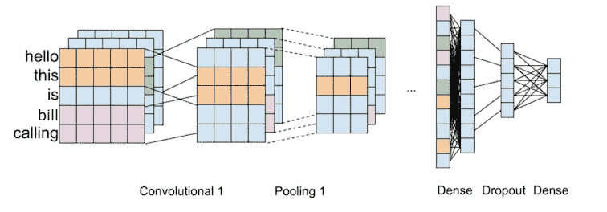

Figure 2: Convolutional neural network architecture.

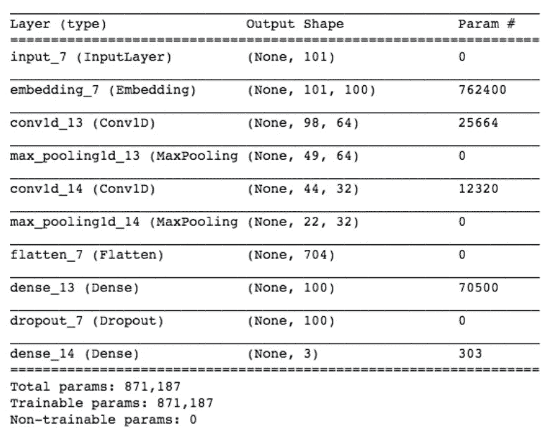

Figure 3: CNN layer type, output shape, and number of parameters.

潜在狄利克雷分配(LDA)主题模型广泛用于
识别一组文档中的潜在主题。给定 K 个要查找的主题
，LDA 模型将根据最常出现的单词和它们各自的主题
将文档中的单词分类成不同的
主题。这通过一个生成过程
工作，其中 LDA 模型假设如下:一个文档由一组主题
组成，每个主题由一组单词
组成。然后，它对这个过程进行逆向工程，以便
识别语料库中的主题。图 4 是图版
符号，其中:

*   m 是文档的数量
*   n 是文档中的字数
*   α是每个文档的主题分布
*   β是每个主题的单词分布
*   m 是文档 m 的主题分布
*   φ_k 是主题 k 的单词分布
*   Z_mn 是文档 m 中第 n 个单词的主题
*   W_mn 是特定的单词

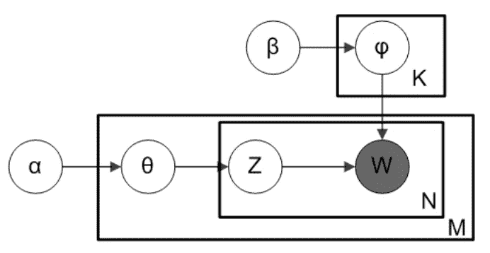

Figure 4: Diagram of smoothed LDA model.

为了将客户服务记录数据分类到
主题中，使用了无线运营商的在线技术支持讨论板和常见问题解答部分
。通过使用该数据集，主题
可以被预先确定，并且模型可以被调整以识别
特定主题。图 5 提供了主题信息
的例子，这些信息可以用来识别主题。为了做到这一点，
β以如下方式定义:

*   对于每个主题，所有的单词最初都被赋予 1 / *语料库
    词汇量*分布
*   然后，对于给定的主题，被预先确定为更频繁使用的单词
    被严重偏向(1000 倍的权重)

这使得模型偏向于在
文档中查找特定主题，而不是确定自己的主题。

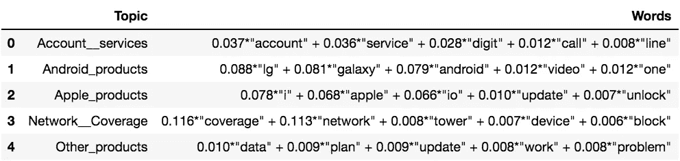

Figure 5: Example of raw output from the LDA model.

# 设计决策

一些工具跨越了项目的所有部分。整个项目中使用的通用
数据科学工具包括:

*   Python: Python 是一种强大的通用编程语言
    ，有一套健壮的库。它是一个具有广泛支持网络的行业标准
    。
*   TensorFlow: TensorFlow 是一个开源库，用于跨不同平台部署高性能数值计算。
*   Anaconda:Anaconda 发行版包含了大量的数据科学
    包，包括 conda，它是一个独立于操作系统的
    包和虚拟环境管理器，允许跨机器轻松安装
    包。
*   Jupyter Notebook:Jupyter Notebook 是包含文本和嵌入代码的文档，可以很容易地在文档中运行。它们易于共享，并为我们的 python 代码提供高质量的交互式输出。Jupyter notebooks 的解释器、降价和可视化
    环境的散文式格式
    促进了代码和概念的协作。
*   Pandas: Pandas 是一个强大的 python 库，在
    数据科学中无处不在。在这个项目中，它用于管理培训
    和测试数据。
*   Matplotlib: Matplotlib 是一个用于数据可视化的 python 库。在这个
    项目中，它用于情感分析
    和主题建模数据的最终可视化。
*   Pickle: Pickle 是一个用于对象序列化和数据
    存储的 python 库。在这个项目中，它对导出模型配置
    和相关数据框很有用。

由于这是一个影响深远的项目，涉及许多移动部件，因此需要各种
技术工具来具体完成每个主要公用事业公司的
目标:

## 语音转文本转录

*   ffmpeg:由于语音到文本引擎处理音频
    文件的方式，使用与引擎预期一致的音频编码
    是很重要的。FFmpeg 是一个免费的、轻量级的
    命令行音频编码器，可以无缝地融入
    我们的音频处理工作流程。最终的编码模式
    由 16 kHz 采样频率的单声道音频、
    16 位位深度和 300/3000 Hz 高/低通
    滤波组成，以专门捕捉语音音频。
*   Audacity:除了编码，我们的数据需要少量的编辑，主要是以短语划分的形式。Audacity 的
    “Silence Finder”实用程序允许我们将长音频
    片段分解成短语长度的声音片段，并轻松导出它们
    ，以便在 DeepSpeech 中立即进行转录处理。
*   DeepSpeech: DeepSpeech 是一个免费的语音转文本引擎，具有高精度上限和简单的转录和训练功能。DeepSpeech 还带有预训练的
    模型，可以通过转移学习进行优化
    以提高任何特定类型音频的准确性，从而避免
    需要延长训练时间或极其庞大的
    数据集。我们的迁移学习过程包括移除 DeepSpeech 的最终解释层
    ，用随机初始化的层
    替换它，冻结所有子层并训练最终层
    。

## 主题模型

*   gensim: gensim 是一个用于 python
    的通用主题建模库，具有许多有用的特性。Gensim 主要用于其 LDA 模型
    ，因为它非常强大且易于训练
    并根据我们的需求进行调整。
*   NLTK: NLTK 代表自然语言工具包，是一个用于自然语言处理的
    python 库。这个库
    用于我们的主题模型，在通过我们的 LDA 模型运行文档
    之前对它们进行规范化。
*   pyLDAvis: pyLDAvis 是一个 python 包，用于可视化
    LDA 模型，并被用于这个项目，因为它
    与 gensim 接口良好。pyLDAvis 允许我们轻松地
    可视化我们的 LDA 模型的性能。
*   斯坦福 NER:斯坦福命名实体识别器模型
    用于识别语料库中的命名实体，如人员、
    地点和组织。这有助于我们识别文档的主题。
*   斯坦福词性标注器:斯坦福词性标注器用于识别语料库中每个单词的词性。这有助于我们识别电话记录句子的主语、动词和宾语。

## 情感模型

*   单词嵌入:Tensorflow_hub 的单词嵌入模块
    被选为我们神经网络分类
    模型的输入，因为它们允许我们将句子映射到数字
    值，并保留词序信息。这些
    模块很容易通过 tensorflow_hub
    实现，并经过预训练。
*   手动特征选择(MFS):手动特征选择
    用于 SVM 和随机森林分类器模型
    ，因为它允许更快的训练，因此可以处理
    更多的特征。这允许我们训练我们的
    模型来识别手边特定主题的词汇。
*   (MFS) NLTK 词干化:在手动特征选择中，单词
    被词干化，因此具有相同词根的单词将被
    识别为相同的单词，这减少了我们的特征
    空间。选择 NLTK 的词干模块是为了便于使用。
*   (MFS)过滤:超过 25 个字符的单词，短于 3 个字符的单词
    ，出现超过 2000 次的单词，
    和出现少于 5 次的单词都被过滤掉
    以减少特征空间。
*   二元模型:二元模型被添加到特征空间以嵌入一些关于词序的信息。
*   分类模型:探索了各种分类算法
    来比较我们的
    模型对训练数据的准确性。探索的模型有
    SVM 分类器、随机森林分类器、LSTM 递归
    神经网络和卷积神经网络。
*   Sklearn、Tensorflow 和 Keras: Tensorflow 和 Keras 用于神经网络训练。Sklearn 被用于
    其他分类算法。
*   NLTK 和 NLTK-trainer: NLTK 用于情感分析，
    因为它有几个预置的情感模型。这使得
    我们可以快速建立一个标准模型，并与我们自己的模型迭代进行比较。

## 绩效结果

## 语音转文本转录

DeepSpeech，我们客户首选的自动语音识别(ASR)引擎
，是一个端到端可训练的字符级
LSTM 递归神经网络。DeepSpeech 已经被用于产生非常低的单词错误率(WER)，特别是 LibriSpeech 上 6%的 WER，这是一个开源的 1000 小时自然语音数据集。6%大约是人类的
错误率。开箱后，DeepSpeech 的通用模型在我们的客户服务电话测试数据上返回了 65.4%的 WER，超过人工处理 WER 的 10 倍。
在使用非常小的训练数据语料库
生成的定制模型上，该 WER 最终减少到大约 18.7%
。

DeepSpeech 在翻译句子长度、
< 10 秒的音频剪辑时效果最佳。Deep-
Speech 为每个音频片段创建一个抄本所需的处理时间在 4 到
9 秒之间，平均为 7.14 秒。因此，5 分钟的
音频可能需要 DeepSpeech 差不多 4 分钟的
处理时间。

## 情感模型

各种模型的准确性在 80/20 分割的
训练/测试数据上进行比较，这些数据由 IEMOCAP 数据集和
电子评论的网络搜集数据集组成，具有图 6 中包含的情感
分类准确性。这些
是三类分类器，其中情感类别是
积极、消极和中立。然后比较了不同特性实现的精度，结果如图 7 中的
所示。一些特性实现不容易
在不同的分类
模型上运行，因此缺少数据。

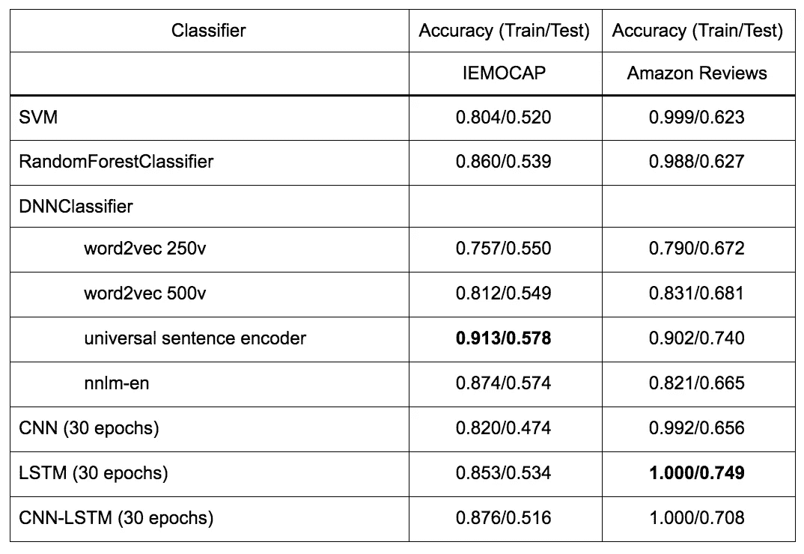

Figure 6: Accuracy results of different classifiers for sentiment.

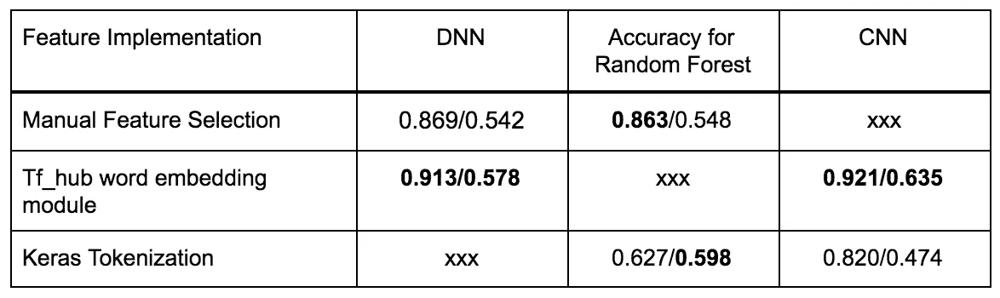

Figure 7: Accuracy results of different feature implementations.

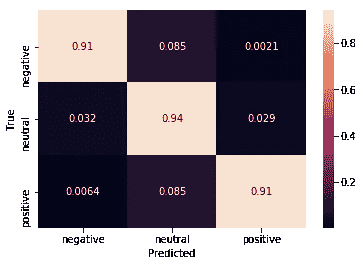

Figure 8: Confusion matrix for training data on the final LSTM model.

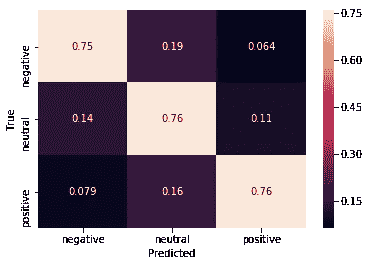

Figure 9: Confusion matrix for testing data on the final LSTM model.

在不同的数据集和实现中，最好的
结果是在使用 tf_hub
单词嵌入模块的神经网络分类器上。在单词嵌入模块中，
通用句子编码器的表现优于其他模块。
在相同的功能实现下，一个更深层次的神经网络优于 sklearn 的 DNNClassifier
，并且是所有实现中性能最高的
，测试集精度比第二个竞争者高出约 10%
。最好的
模型迭代是 LSTM RNN，它使用 tf_hub 的通用
句子编码器作为特征输入。该模型在 IEMOCAP 和
电子评论数据集上的
测试集准确率为 77.6%。从 3 个类别中随机选择一个类别的基线准确率为 33.3%。

## 主题模型

使用从无线运营商的在线讨论
论坛和常见问题部分收集的数据，训练数据被组织成 5 个主题
:账户和服务、安卓产品、
苹果产品、网络和覆盖范围以及其他产品。
这些主题中的每一个还包括一些带有偏见的
植入 LDA 模型的关键词(例如
苹果产品的“iphone”，安卓产品的“galaxy”等)。使用
这个训练数据来训练 LDA 模型，它能够成功地
以 57.6%的时间预测测试数据上的主题。从 5 个类别中随机选择一个类别的基线准确度为 20%。这个 LDA 的可视化可以在图 10 中找到。

使用自然语言工具包
(NLTK)中包含的语料库
来训练词性主题标识符(PoSSI)模型，然后在上述网络搜集的无线运营商
数据上进行测试。这个模型能够产生
连贯的主谓宾(SVO)结果，但是因为
网络抓取的数据集是未标记的，所以没有定量的
方法来分析准确性，除非所有网络抓取的数据
都被手工标记了词性。手工标记整个
网络抓取的数据集不在这个项目的范围内。

## 客户呼叫数据的可视化和分析

在通话过程中可视化情绪显示了我们可能预期的趋势
:绿色、积极的第一句话介绍
，随后是红色、消极的问题介绍
，以及接近通话结束的深绿色(即更强烈的积极情绪)
。

这些令人鼓舞的结果表明，情感分析
可以应用于自动化客户满意度调查的环境中。

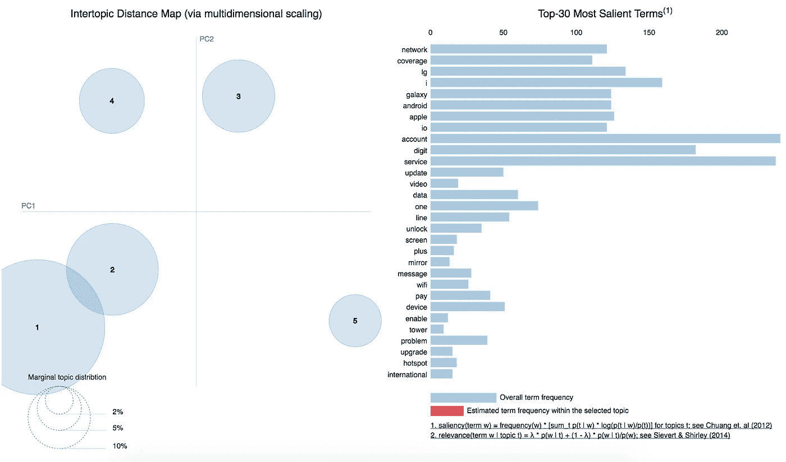

Figure 10: A visualization of the topics and the vocabulary found in the training corpora.

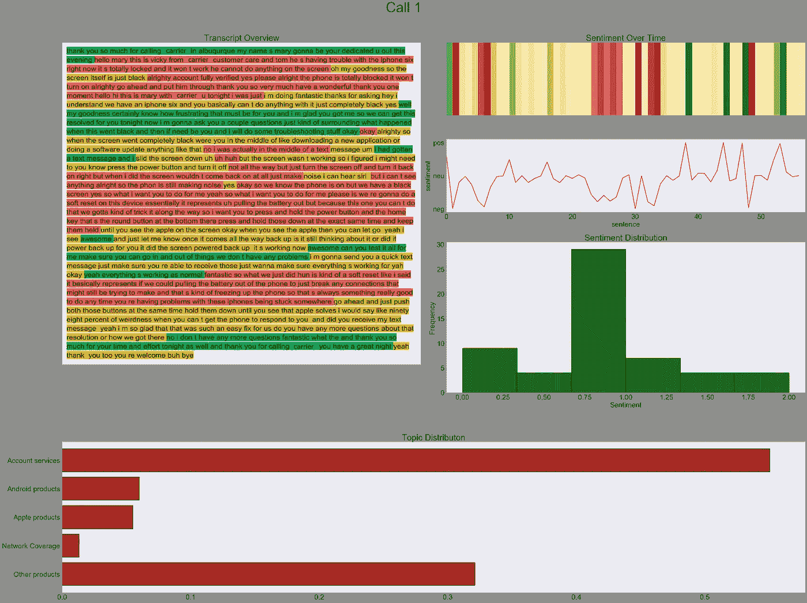

Figure 11: Top left: sentiment for each clip of the call displayed over the call transcript; Top right from top down: a heat-map of the intensity of the sentiment of each sentence of the call, a line graph displaying the intensity of the sentiment during each sentence of the call; Middle: the distribution of sentiment among keywords for each category; Bottom: the distribution of probabilities the call belongs into one of the five topic categories.

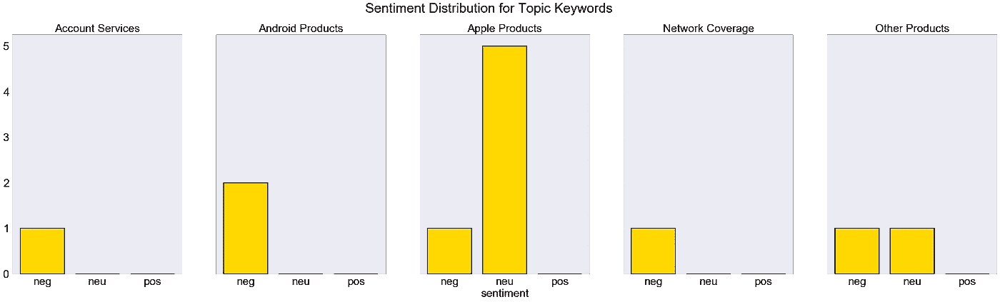

Figure 12: Sentiment distribution for sample service keywords.

# 结论

## 语音转文本转录

DeepSpeech 是高度可训练的，但是有 1.2 亿个参数，
需要大规模的训练语料库，数百小时的训练和昂贵的设备。迁移学习以冻结模型
的所有子层并重新训练最后一层的形式进行
。改变
先前图层的实验无法产生改进。转移
学习是一个可行的行动过程，可以为未来的转录需求定制深度-
语音，但应该使用更多高质量的音频剪辑进行
训练。
在我们的测试
数据上，DeepSpeech 的表现明显优于 Kaldi 和 CMUSphinx
等替代 ASR 引擎，以及隐马尔可夫模型
等传统 ASR 方法。

*未来工作*在为转录准备
低质量通话数据方面，以及在转录后处理
以产生更正确的语音
(由于 DeepSpeech 是字符级的，所以有时会产生
废话)方面，可能会有进一步的改进。在大型行业专用 copora 上重新训练 DeepSpeech 的权重也可能会产生更高的精确度，但在计算时间和所需的数据量方面会明显更加昂贵。

## 情感模型

对所测试的情感分析模型的准确性
影响最大的两个因素是数据准备
和模型选择。数据准备和输入格式化
对较小的数据集有较大的影响。模型选择
对较大的数据集有较大的影响。在我们尝试的各种模型迭代中，使用了三种不同类型的数据输入格式:

*   手动特征选择(在 SVM 和随机森林-
    分类器中使用):手动特征选择通过使用技术
    词干化、过滤和标记化来完成。使用 NLTK 的词干模块对单词
    进行词干处理，因此不同时态的所有
    单词将对应于同一个
    标记。当单词长度小于 3、大于 25 时，不包括在训练/测试
    集中，当单词在完整语料库中出现超过 2000 次或少于 5 次
    时，不包括在
    集中。然后为语料库中所有的
    可行的单字和双字创建标记。
*   预训练单词嵌入模块(用于 DNNClassifier)
    -来自 tensorflow_hub
    的预训练单词嵌入模块用于 DNN 分类器。
    -NNLM 嵌入基于一个具有两个隐藏层的神经网络
    语言模型。最不常用的
    令牌被散列到桶中。
    - Word2vec 是一个基于令牌的嵌入模块，在英文维基百科文章语料库上进行训练
    。
    -通用句子编码器对句子进行编码，用于文本分类
    。它使用深度平均
    网络进行训练，并具有编码语义
    相似性的特征。
*   标记化:长度小于 1 的单词被删除，然后使用 Keras 的文本预处理模块
    对
    句子进行矢量化。为
    训练输入中的每个单词选择一个标记。所有的句子都被填充成相等的长度，单词被替换成了记号。

考虑到我们的数据集相对较小的词汇量，
使用预先训练的单词嵌入模块给出了最好的
结果，超过了使用什么模型的影响。还开发了替代
型号，例如:

*   SVM 和兰登森林:这两个模型是第一个被用来衡量可以达到何种精度的
    模型，以及预计
    可以击败的更复杂的模型。sklearn SVM 分类器和 Random-
    森林分类器被用于这项任务。这是两种常用的高性能分类器。
*   DNN:这个模型是来自
    Tensorflow 的预建深度神经网络。该模型用于评估神经网络在数据集上的性能
    ，并测试 tf_hub 的单词嵌入模块的使用
    。
*   LSTMs 目前是像自然语言这样的顺序数据的行业标准模型。
*   CNN:卷积神经网络已经被证明
    通过
    使用
    卷积层捕获关于 n-grams 的信息，从而在句子分类方面提供了出色的结果。
*   美国有线电视新闻网-LSTM:一个组合的美国有线电视新闻网-LSTM 模型已经被证明
    通过用
    卷积层编码区域信息和用
    LSTM 层编码跨越
    句子的长距离依赖而工作良好。

对于中小规模的训练数据集，当使用具有数千个参数的神经网络(如 RNN 和 CNN 神经网络)时，过度适应训练集的风险要高得多。这可以从我们的性能结果中测试和训练集准确性之间的巨大差异中看出。停止训练的理想点是当训练和测试分数开始偏离时，训练分数继续上升，但测试分数开始下降。在训练模型的上下文中，这意味着在训练时保存检查点是很重要的，这样模型就可以恢复到尚未过度拟合的旧检查点。参见附录 B，了解培训和各时期测试分数的示例。过拟合也可以通过向损失函数添加正则化参数或引入漏失层来减少。在大多数类型的神经网络中，向层中添加辍学已经取得了成功。然而，这种方法在使用 LSTM 单位的 RNNs 上效果不佳，而这种类型的模型在这个项目中表现最佳。为了减轻对我们的小训练数据集的过度拟合，我们仅对非递归层应用 dropout。

*未来工作*

*   手动特征选择:当进行手动特征
    选择时，NLTK 词干模块用于寻找
    词根。词汇化可能会给出更好的结果，
    但是需要词性标注。实现
    这将创建一个更精确的特征空间。这可以通过结合使用 NLTK 的 WordNetLemmatizer 和 NLTK 的 pos_tag 来完成。
*   训练数据:使用更大的训练数据集。IEMOCAP
    数据集的词汇量为 3000 个单词，相对来说
    比较小，测试数据很容易包含
    看不见的单词。这一点通过加入
    电子评论数据集得到了改善，该数据集将词汇量
    增加到了大约 8000 个单词。此外，数据并不像可能的那样 T13 是领域特定的。IEMOCAP 非常通用
    目的，由演员阅读关于
    日常情景的剧本来表演。电子评论针对的是与技术
    无线运营商客户电话故障排除中讨论的产品类似的电子
    产品，但不是最近的
    。可以引入更多特定于无线
    运营商客户服务呼叫中讨论的内容的数据，
    例如更近期的电子设备评论或手动
    带注释的无线运营商论坛帖子。
*   预训练单词嵌入模块:迁移学习
    可以在这些模块上使用与正在尝试分类
    的文本数据类型相关的文本语料库
    来实现。在这种情况下，单词嵌入
    模块可以在
    无线运营商相关文本的语料库上进一步训练，例如从
    特定无线运营商的在线 FAQ 部分和讨论
    论坛帖子中搜集的数据。
*   CNN 和 LSTM 神经网络:对层
    及其参数的微调，以及向模型提供更多的
    数据可以在神经网络模型上得到改进。
    这些努力的目的是提高精度
    和减少过拟合。

## 主题模型

LDA 模型的低准确度结果是预料之中的，因为
LDA 模型并不意味着被强制加入预定义的主题
，而是应该用于在语料库中寻找隐藏的主题信息
。使用词性和 NER
标记的 SVO 提取能够产生一致的结果，但是这些结果
在主题之间并不一致，这在尝试按主题对文档进行排序时提出了挑战
。

*未来工作*

*   LDA 模型可以通过使用更特定领域的
    词性标注器(而不是 NLTK 的默认词性
    标注功能)以及更精确的 alpha
    (文档-主题密度)和 beta(主题-词密度)参数来改进。
*   PoSSI 模型可以在几个方面进行改进:
    -使用一个 POS 标记器和一个命名实体识别
    (NER)标记器在特定领域的语料库上进行训练
    -一个更特定领域的 POS 标记器模型(目前
    使用斯坦福的研究模型)
    -一个更特定领域的 NER 标记器模型(目前
    使用斯坦福的研究模型)
    -一种更好的从标记的
    文档中提取主题的方法，例如结合特定领域语料库
    的上下文无关
    语法的解析器-速度改进，因为该模型对于
    大型文档可能非常慢。
    -这两种模型可以结合起来识别生成的 svo 中的主题
    。

# 文献学

A.G. Tripathi 和 N. S .,“用于情感分析的特征选择和分类方法
”,“机器学习和应用:
国际期刊，第 2 卷，第 2 期，第 01–16 页，2015 年。

B.C. Busso、M. Bulut、C. Lee、A. Kazemzadeh、E. Mower、S. Kim、
J. Chang、S. Lee 和 S. Narayanan，“IEMOCAP:交互式情感
二元运动捕捉数据库”，《语言资源与评估杂志》
，第 42 卷第 4 期，第 335–359 页，2008 年 12 月。

C.Y. Bengio、R. Ducharme、P. Vincent 和 C. Jauvin，“一种神经
概率语言模型”，《机器学习研究杂志
，第 3 卷，第 1137-1155 页，2013 年 3 月。

D.T. Mikolo、K. Chen、G. Corrado 和 J. Dean，“向量空间中单词表示的有效估计
”, CoRR，第 abs/1301.3781 卷，
2013 年 1 月。

E.D. Cer，Y. Yang，S.-yi Kong，N. Hua，N. Limtiaco，R. St. John，
N. Constant，M. Guajardo-Cespedes，S. Yuan，C. Tar，Y.-H. Sung，B.
Strope，R. Kurzweil，《通用句子编码器》，CoRR，vol .
ABS/1803.1175，2018 .

F.W. Zaremba、I. Sutskever 和 O. Vinyals，“递归神经网络
正则化”，CoRR，第 abs/1409.2329 卷，2014 年。

G.胡和刘。"挖掘和总结客户评论."ACM SIGKDD 国际知识会议论文集
发现数据挖掘，2004 年 8 月。

H.金达尔和刘。“意见垃圾和分析。”第一届 ACM 网络搜索和数据挖掘国际会议论文集
，2008 年 2 月。

一、刘倩、高志强、刘冰、张元林。观点挖掘中面向抽取的自动
规则选择。国际人工智能联合会议论文集
，2015 年 7 月
。

J.Y. Kim，“用于句子分类的卷积神经网络”，
CoRR，第 abs/1408.5882 卷，2014 年。

K.张量流。(2018).文本模块|张量流。【在线】。

长度 X. Ma 和 E. Hovy，“通过双向
进行端到端序列标记的 LSTM-CNN-CRF”，
计算语言学协会第 54 届年会论文集，2016 年第 1 卷。

米（meter 的缩写））J. Cheng，L. Dong，M. Lapata，“机器阅读的长短期记忆-
网络”，2016 年自然语言处理经验方法会议论文集
，2016 年。

名词（noun 的缩写）Y. Goldberg，“自然语言处理的神经网络模型入门”，人工智能研究杂志，
第 57 卷，2016 年 11 月。

O.王、余立春、赖、张，“使用区域 CNN-LSTM 模型的维度情感分析”，计算语言学协会第 54 届年会论文集(第 2 卷:短文)，2016 年。

页（page 的缩写）A. Y. Hannun，C. Case，J. Casper，B. Catanzaro，G. Diamos，E.
Elsen，R. Prenger，S. Satheesh，S. Sengupta，A. Coates 和 A. Y. Ng，
“深度语音:扩大端到端语音识别”，CoRR，
第 abs/1412.5567 卷，2004 年。

Q. J .昆泽、l .基尔希、I .库伦科夫、a .克鲁格、j .约翰斯迈尔和
S .斯托伯，“预算内语音识别的迁移学习”，

NLP 第二届表征学习研讨会论文集，2017。

R.S. Bansal 与自然语言处理和机器学习，
《Python 中主题建模的初学者指南》，Analytics Vidhya，
29-Aug-2016。【在线】。

南 J. Brownlee，“如何开发用于情感分析的 N 元多通道卷积
神经网络”，机器学习
掌握，2018 年 2 月 14 日。

T.S. Axelbrooke，“LDA Alpha 和 Beta 参数—直觉”，
LDA Alpha 和 Beta 参数—直觉|思维向量
博客，2015 年 10 月 21 日。【在线】。

单位 A. Crosson，“使用自然语言处理提取文档主题”，
Medium，2016 年 6 月 8 日。【在线】。

动词 （verb 的缩写）J. R. Finkel、T. Grenager 和 C. Manning，“通过 Gibbs
抽样将非局部
信息纳入信息提取系统”，计算语言学协会第 43 届年会会议记录——ACL 05，第 363–370 页，2005 年。

W.K. Toutanova 和 C. D. Manning，“丰富最大熵词性标记器中使用的知识来源”，2000 年在
举行的关于自然语言处理和超大规模语料库的经验方法
的 2000 年联合 SIGDAT 会议的会议记录
与
计算语言学协会第 38 届年会，第 63–70 页，2000 年。

X.S. Bird、E. Klein 和 e . Loper,
Python 的自然语言处理:用自然语言工具包分析文本。北京:
奥雷利，2009 年。

Y.平滑的 LDA。维基百科，2009 年。

Z.S. Ruder，“NLP 最佳实践的深度学习”，Sebastian Ruder，
2017 年 7 月 25 日。【在线】。

Original PDF of our Final Report