# 线性关系的度量

> 原文：<https://towardsdatascience.com/a-measure-of-linear-relationship-5dd4a995ee7e?source=collection_archive---------24----------------------->

## 统计数字

## 皮尔逊与 Jupyter 笔记本的积矩相关性


Photo by [olena ivanova](https://unsplash.com/@olena2552?utm_source=medium&utm_medium=referral) on [Unsplash](https://unsplash.com?utm_source=medium&utm_medium=referral)

```
**Table of Contents**[**Introduction**](#ae6d)1\. [Import necessary libraries](#bde6)
2\. [Finding the regression line](#e399)
3\. [Pearson’s correlation coefficient](#14c9)
4\. [Finding Pearson’s correlation coefficient](#0513)
5\. [Degree of freedom and critical values](#8a6e)
6\. [The least-squares regression line](#d12c)
7\. [The mean point on the line of best fit](#b71a)
8\. [Real-life example](#a7b5)
9\. [Finding r from more than two arrays](#1b9e)
10\. [Heat map](#591d)[**Conclusion**](#1dbc)
```

# 介绍

在本文中，我使用 Python 来分析二元数据，使用皮尔逊的积差相关系数 r，绘制散点图、最佳拟合线和最小二乘回归线。二元数据涉及两种类型的相关数据。皮尔逊的积差相关系数告诉你这两个数据的线性相关程度。我们可以在散点图上显示收集的数据。横轴称为 x 轴，我们称 x 轴的坐标为独立变量。纵轴称为 y 轴，我们称 y 轴的坐标为因变量。

我从这个[链接](https://stats.oecd.org/Index.aspx?DataSetCode=HOUSE_PRICES)下载了数据。

# 导入必要的库

让我们创建一个样本数据。

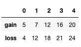

我们需要转置数据，以便按列对数据进行分类。熊猫转置不修改原始数据。

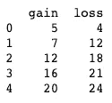

我们使用 Seaborn 创建一个散点图。

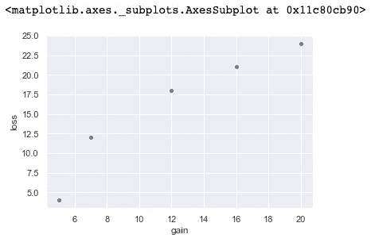

# 寻找回归线

`linregress`返回斜率、截距、r 值和 p 值。

```
The equation of reegression line is y=1.221x+1.151.
Pearson's product-moment correlation coefficient is {r_value:.4f}.
p-value is {p_value:.4f}.
```

# 皮尔逊相关系数

## 对于人口数据

两组总体数据 x 和 y 的皮尔逊积差相关系数为:


其中 cov 是协方差， *𝜎𝑥* 和 *𝜎𝑦* 是 x 和 y 的总体标准差


其中 *𝜇𝑥* 是 x 的平均值，而 *𝜇𝑦* 是 y 的平均值


## 对于示例数据

两组样本数据 x 和 y 的皮尔逊积差相关系数为:


其中 *𝑠𝑥𝑦* 是协方差， *𝑠𝑥* 和 *𝑠𝑦* 是 x 和 y 的样本标准差

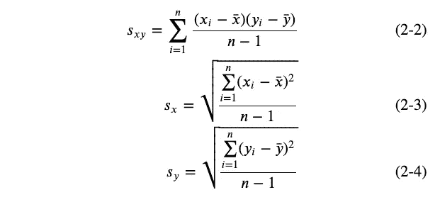

因此:

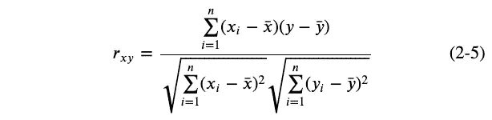[](/discover-the-strength-of-monotonic-relation-850d11f72046) [## 使用有序数据的 Spearman 等级相关系数

### 发现单调关系的力量

towardsdatascience.com](/discover-the-strength-of-monotonic-relation-850d11f72046) 

# 求皮尔逊相关系数

让我们使用样本数据。


## 数学上使用 Numpy

```
0.93050085576319
```

在熊猫中，`ddf=0`代表种群，`ddf=1`代表样本。因为我们使用所有数据，所以这里使用 0。

## 使用`scipy.stats.pearsonr`

```
0.9305008557631897
```

`pearsonr`返回皮尔逊的积差相关系数和 p 值。

# 自由度和临界值

您可以在此处找到皮尔森相关性临界值表[。自由度(dof)是数据点数减 2。在上面的例子中，自由度= 5–2 = 3。对于具有统计显著性的 95%置信度，我们使用临界值表中的 0.05 显著性水平。这给出了 0.878。如果|r| >临界值，那么相关性可能不是由于变化而产生的，这意味着它在统计上是显著的。在上面的例子中，|0.9928| > 0.878，所以有 95%的把握认为两个变量之间存在统计上显著的正相关关系。](https://www.statisticssolutions.com/table-of-critical-values-pearson-correlation/)

# 最小二乘回归线

最小二乘回归线称为最佳拟合线。由于`linregress()`返回斜率和 y 轴截距，我们用它们来做一条回归线。

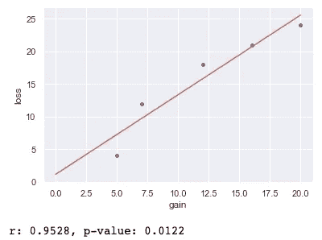

# 最佳拟合线上的平均点

我们找到每个数据集的平均值，并将其绘制在同一个图表上。

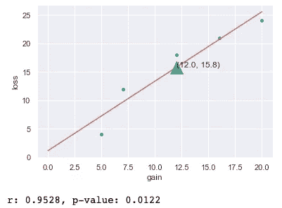[](/gentle-introduction-to-chi-square-test-for-independence-7182a7414a95) [## 卡方独立性检验简介

### 使用 Jupyter 笔记本的卡方初学者指南

towardsdatascience.com](/gentle-introduction-to-chi-square-test-for-independence-7182a7414a95) 

# 现实生活中的例子

我们将探讨澳大利亚人口和劳动力之间的线性关系。我们使用经合组织的历史人口。让我们用`read_csv`找到尺寸(形状)并用`shape`和`head()`显示前五个数据。

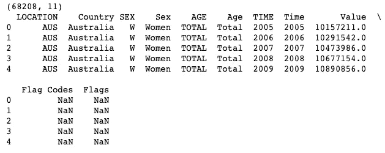

从历史人口数据来看，我们选取澳大利亚。我们还需要在性别列中选择 TOTAL，在年龄列中选择 Total。


我们需要选择值列。我将向你展示两种不同的方法。[本网站](https://www.shanelynn.ie/select-pandas-dataframe-rows-and-columns-using-iloc-loc-and-ix/)告诉你如何使用`loc`和`iloc.`由于 Python 索引从 0 开始，所以位于第 8 列。

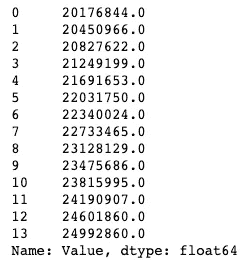

在第二种方法中，我们使用`&`逻辑运算符。你可以在这篇[文章](https://jakevdp.github.io/PythonDataScienceHandbook/02.06-boolean-arrays-and-masks.html#Aside:-Using-the-Keywords-and/or-Versus-the-Operators-&/%7C)中读到更多关于`loc`和`iloc`的细节。我们选择国家为澳大利亚、器械包为总计、年龄为总计的列。


我们还需要一份经合组织的数据。数据是 ALFS 的劳动力。我们选择国家为澳大利亚的数据。`head()`显示前 5 个数据。

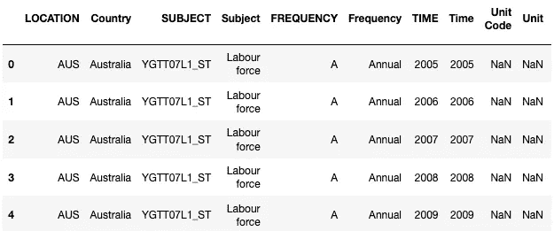

我们需要第 15 个索引的值列，所以我们在`iloc`中使用 14。记住 Python 索引是从 0 开始的。

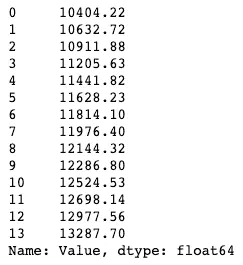

我们可以从`df_pop`和`df_lab`中找到皮尔逊相关系数。`pearsonr`返回`r`和`p-value`。

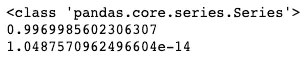

我们使用`linregress`找到梯度/斜率和 y 截距。我们用海牛和熊猫数据框创建了一个散点图。

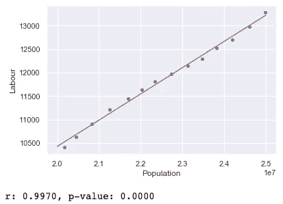

澳大利亚的人口和劳动力之间有很强的正相关关系。

# 从两个以上的数组中寻找 r

有时候你想找出哪一对数据的线性关系最强。可以用`corr()`来找。

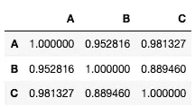

请注意 A 和 B 的皮尔逊相关系数是 0.952816，和我们之前发现的一样。在这种情况下，A 和 C 的线性关系最强。

# 热图

我们可以使用 [Seaborn](https://seaborn.pydata.org/generated/seaborn.heatmap.html) 来绘制[热图](https://stackabuse.com/seaborn-library-for-data-visualization-in-python-part-2/)。由于在上一节中我们有最小值 0.88 和最大值 1.00，因此我们相应地设置了`vmax`和`vmin`。我们使用`Blues`作为配色方案。

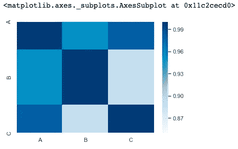

# 结论

通过使用 Python 及其库，您可以用几行代码找到所有必要的数据。此外，您可以轻松地可视化您的数据。

**通过** [**成为**](https://blog.codewithshin.com/membership) **的会员，可以完全访问媒体上的每一个故事。**


[https://blog.codewithshin.com/subscribe](https://blog.codewithshin.com/subscribe)

# 参考

*   [https://data.oecd.org/](https://data.oecd.org/)
*   [https://www . statistics solutions . com/table-of-critical-values-Pearson-correlation/](https://www.statisticssolutions.com/table-of-critical-values-pearson-correlation/)
*   [https://stack abuse . com/seaborn-library-for-data-visualization-in-python-part-2/](https://stackabuse.com/seaborn-library-for-data-visualization-in-python-part-2/)
*   [https://www . shanelynn . ie/select-pandas-data frame-rows-and-columns-using-iloc-loc-and-IX/](https://www.shanelynn.ie/select-pandas-dataframe-rows-and-columns-using-iloc-loc-and-ix/)
*   [https://seaborn.pydata.org/generated/seaborn.heatmap.html](https://seaborn.pydata.org/generated/seaborn.heatmap.html)