# 一个极简的端到端的零碎教程(第一部分)

> 原文：<https://towardsdatascience.com/a-minimalist-end-to-end-scrapy-tutorial-part-i-11e350bcdec0?source=collection_archive---------2----------------------->

## 面向初学者的系统化网页抓取


Photo by [Paweł Czerwiński](https://unsplash.com/@pawel_czerwinski?utm_source=medium&utm_medium=referral) on [Unsplash](https://unsplash.com?utm_source=medium&utm_medium=referral)

[第一部分](https://medium.com/@HarryWang/a-minimalist-end-to-end-scrapy-tutorial-part-i-11e350bcdec0?source=friends_link&sk=c9f8e32f28a88c61987ec60f93b93e6d)、[第二部分](/a-minimalist-end-to-end-scrapy-tutorial-part-ii-b917509b73f7?source=friends_link&sk=ebd3a9cee8b2097b3857194fee3821a6)、[第三部分](/a-minimalist-end-to-end-scrapy-tutorial-part-iii-bcd94a2e8bf3?source=friends_link&sk=a1fdde9c9dd5383d8de2e08395ee3f98)、[第四部分](https://medium.com/@HarryWang/a-minimalist-end-to-end-scrapy-tutorial-part-iv-3290d76a2aef?sk=6f0902f9a15092575814ab533a56f8ef)、[第五部分](https://medium.com/@HarryWang/a-minimalist-end-to-end-scrapy-tutorial-part-v-e7743ee9a8ef?source=friends_link&sk=c1c5110f63c7ccbe4eb8c6209ee2f57c)

网络抓取是数据科学家的一项重要技能。在过去的几年里，我使用 Python、BeautifulSoup 和 Scrapy 开发了许多专门的 web 抓取项目，并阅读了一些书籍和大量在线教程。然而，我还没有找到一个简单的初学者水平的教程，它是端到端的，涵盖了一个典型的零碎的 web 抓取项目中的所有基本步骤和概念(因此标题中的*极简主义者*)——这就是为什么我写这篇文章，并希望代码回购可以作为一个模板，帮助启动您的 web 抓取项目。

很多人问:我应该用 BeautifulSoup 还是 Scrapy？它们是不同的东西:BeautifulSoup 是一个用于解析 HTML 和 XML 的库，Scrapy 是一个 web 抓取框架。如果你愿意，你可以使用 BeautifulSoup 而不是 Scrapy 内置选择器，但是将 BeautifulSoup 与 Scrapy 进行比较就像将 Mac 键盘与 iMac 进行比较，或者更好的比喻，如官方文档中所述“就像将 jinja2 与 Django 进行比较”，如果你知道它们是什么的话:)—简而言之，如果你想进行严肃而系统的 web 抓取，你应该学习 Scrapy。

TL；博士，给我看看代码:

 [## 哈利旺/剪贴簿-教程

### 这个报告包含了我的教程的代码:一个极简的端到端的零碎教程(…

github.com](https://github.com/harrywang/scrapy-tutorial) 

在本系列教程中，我将讲述以下步骤:

1.  (本教程)从头开始一个 Scrapy 项目，开发一个简单的蜘蛛。一件重要的事情是使用 Scrapy Shell 来分析页面和调试，这是你应该使用 Scrapy 而不是 BeautifulSoup 的主要原因之一。
2.  ([第二部分](https://medium.com/@HarryWang/a-minimalist-end-to-end-scrapy-tutorial-part-ii-b917509b73f7?sk=ebd3a9cee8b2097b3857194fee3821a6))介绍 Item 和 ItemLoader，并解释为什么要使用它们(尽管它们让你的代码一开始看起来更复杂)。
3.  ([第三部分](https://medium.com/@HarryWang/a-minimalist-end-to-end-scrapy-tutorial-part-iii-bcd94a2e8bf3?sk=a1fdde9c9dd5383d8de2e08395ee3f98))通过管道使用 [ORM](https://blog.bitsrc.io/what-is-an-orm-and-why-you-should-use-it-b2b6f75f5e2a) (SQLAlchemy)将数据存储到数据库，并展示如何建立最常见的一对多和多对多关系。
4.  ([第四部分](https://medium.com/@HarryWang/a-minimalist-end-to-end-scrapy-tutorial-part-iv-3290d76a2aef?sk=6f0902f9a15092575814ab533a56f8ef))将项目部署到 Scrapinghub(你必须为预定的抓取作业等服务付费)或者通过使用伟大的开源项目 [ScrapydWeb](https://github.com/my8100/scrapydweb) 和 Heroku 完全免费地建立自己的服务器。
5.  ( [Part V](https://medium.com/@HarryWang/a-minimalist-end-to-end-scrapy-tutorial-part-v-e7743ee9a8ef?source=friends_link&sk=c1c5110f63c7ccbe4eb8c6209ee2f57c) )我创建了一个单独的 repo ( [Scrapy + Selenium](https://github.com/harrywang/scrapy-selenium-demo) )来展示如何抓取动态网页(比如通过滚动加载附加内容的页面)以及如何使用代理网络(ProxyMesh)来避免被禁止。

一些先决条件:

*   Python(本教程 Python 3)、虚拟环境、自制等基础知识。，参见我的另一篇文章，了解如何设置环境:[如何为 Python 开发设置 Mac](https://link.medium.com/tw6Ylq9wjZ)
*   Git 和 Github 的基础知识。我推荐 [Pro Git 的书](https://git-scm.com/book/en/v2)。
*   数据库和 ORM 的基础知识，如[结构化查询语言(SQL)介绍](https://www.coursera.org/learn/intro-sql)。

我们开始吧！

首先创建一个新文件夹，在文件夹里面设置 Python 3 虚拟环境，安装 Scrapy。为了使这一步变得容易，我创建了一个 [starter repo](https://github.com/harrywang/scrapy-tutorial-starter) ，你可以派生和克隆它(如果需要，请参见 [Python3 虚拟环境文档](https://docs.python.org/3/tutorial/venv.html)):

```
$ git clone [https://github.com/yourusername/scrapy-tutorial-starter.git](https://github.com/yourusername/scrapy-tutorial-starter.git)
$ cd scrapy-tutorial-starter
$ python3.6 -m venv venv
$ source venv/bin/activate
$ pip install -r requirements.txt
```

您的文件夹应该如下所示，我假设我们总是在虚拟环境中工作。注意到目前为止我们在 requirements.txt 中只有一个包。

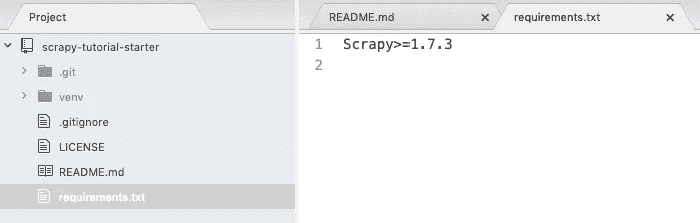

运行`scrapy startproject tutorial`创建一个空的 scrapy 项目，你的文件夹看起来像:

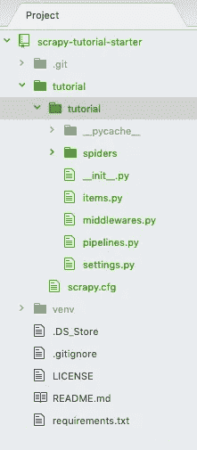

创建了两个相同的“教程”文件夹。我们不需要第一级“教程”文件夹—删除它，并将第二级“教程”文件夹及其内容向上移动一级—我知道这很混乱，但这就是你对文件夹结构所做的一切。现在，您的文件夹应该看起来像这样:

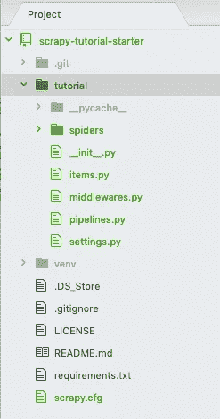

到目前为止，不要担心自动生成的文件，我们稍后将回到这些文件。本教程基于官方 [Scrapy 教程](https://docs.scrapy.org/en/latest/intro/tutorial.html)。所以我们要爬的网站是[http://quotes.toscrape.com](http://quotes.toscrape.com)，很简单:有几页引用作者和标签:

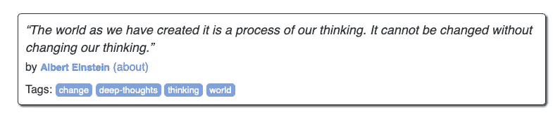

当您单击作者时，它会转到作者详细信息页面，包括姓名、生日和简历。

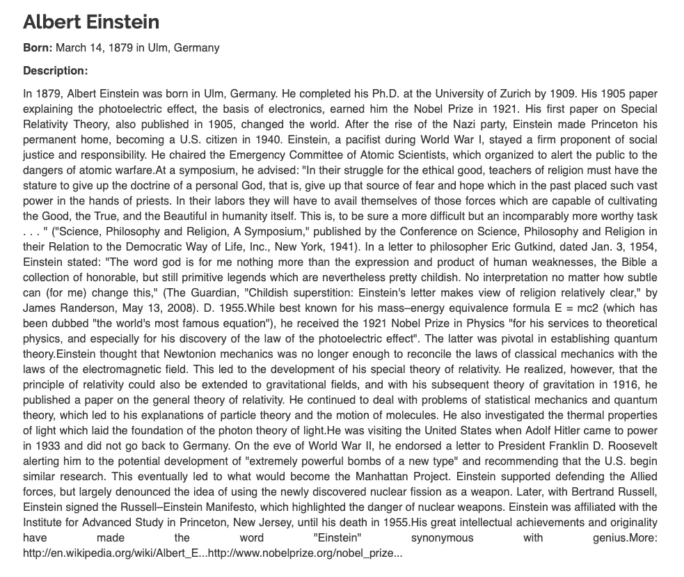

现在，在“spider”文件夹中创建一个名为“quotes-spider.py”的新文件，其内容如下:

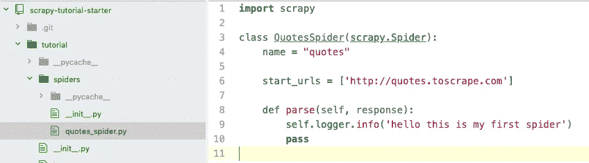

您刚刚创建了一个名为“quotes”的蜘蛛，它向[http://quotes.toscrape.com](http://quotes.toscrape.com)发送请求，并从服务器获得响应。然而，到目前为止，蜘蛛在解析响应时不做任何事情，只是向控制台输出一个字符串。让我们运行这个蜘蛛:`scrapy crawl quotes`，您应该会看到如下输出:

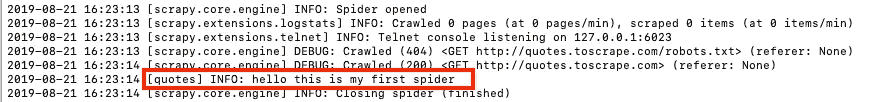

接下来，让我们使用 Scrapy Shell 通过运行以下命令来分析响应，即位于[http://quotes.toscrape.com](http://quotes.toscrape.com)的 HTML 页面:

```
$ scrapy shell http://quotes.toscrape.com/...2019-08-21 20:10:40 [scrapy.core.engine] INFO: Spider opened2019-08-21 20:10:41 [scrapy.core.engine] DEBUG: Crawled (404) <GET http://quotes.toscrape.com/robots.txt> (referer: None)2019-08-21 20:10:41 [scrapy.core.engine] DEBUG: Crawled (200) <GET http://quotes.toscrape.com/> (referer: None)[s] Available Scrapy objects:[s]   scrapy     scrapy module (contains scrapy.Request, scrapy.Selector, etc)[s]   crawler    <scrapy.crawler.Crawler object at 0x105d01dd8>[s]   item       {}[s]   request    <GET http://quotes.toscrape.com/>[s]   response   <200 http://quotes.toscrape.com/>[s]   settings   <scrapy.settings.Settings object at 0x106ae34e0>[s]   spider     <DefaultSpider 'default' at 0x106f13780>[s] Useful shortcuts:[s]   fetch(url[, redirect=True]) Fetch URL and update local objects (by default, redirects are followed)[s]   fetch(req)                  Fetch a scrapy.Request and update local objects[s]   shelp()           Shell help (print this help)[s]   view(response)    View response in a browser>>>
```

您可以使用 [Xpath 选择器](https://www.w3schools.com/xml/xpath_syntax.asp)或 [CSS 选择器](https://www.w3schools.com/cssref/css_selectors.asp)和 [Chrome DevTools](https://developers.google.com/web/tools/chrome-devtools/css/) 来选择元素，它们通常用于分析页面(我们不会涉及选择器细节，请阅读文档以了解如何使用它们):

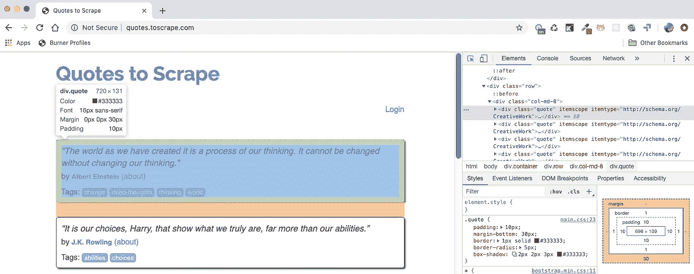

例如，您可以测试选择器并在 Scrapy Shell 中查看结果——假设我们想要获得上面显示的报价块:

可以使用 Xpath `response.xpath(“//div[@class=’quote’]”).get()` ( `.get()`显示第一个选中的元素，使用`.getall()`显示全部)或者 CSS `response.css(“div .quote”).get()`。我用粗体显示了我们希望从这个报价块中获得的报价文本、作者和标签:

```
>>> response.xpath("//div[@class='quote']").get()'<div class="quote" itemscope itemtype="http://schema.org/CreativeWork">\n        <span class="text" itemprop="text">**“The world as we have created it is a process of our thinking. It cannot be changed without changing our thinking.”**</span>\n        <span>by <small class="author" itemprop="author">**Albert Einstein**</small>\n        <a href="/author/Albert-Einstein">(about)</a>\n        </span>\n        <div class="tags">\n            Tags:\n            <meta class="keywords" itemprop="keywords" content="change,deep-thoughts,thinking,world"> \n            \n            <a class="tag" href="/tag/change/page/1/">**change**</a>\n            \n            <a class="tag" href="/tag/deep-thoughts/page/1/">**deep-thoughts**</a>\n            \n            <a class="tag" href="/tag/thinking/page/1/">**thinking**</a>\n            \n            <a class="tag" href="/tag/world/page/1/">**world**</a>\n            \n        </div>\n    </div>'
```

我们可以继续在 shell 中获取如下数据:

*   将所有报价块转换成“报价”
*   使用“quotes”中的第一个引号:quotes[0]
*   尝试 css 选择器

```
>>> quotes = response.xpath("//div[@class='quote']")
>>> quotes[0].css(".text::text").getall()['“The world as we have created it is a process of our thinking. It cannot be changed without changing our thinking.”']>>> quotes[0].css(".author::text").getall()['Albert Einstein']>>> quotes[0].css(".tag::text").getall()['change', 'deep-thoughts', 'thinking', 'world']
```

看起来上面显示的选择器得到了我们需要的东西。注意，出于演示目的，我在这里混合了 Xpath 和 CSS 选择器——在本教程中不需要两者都用。

现在，让我们修改蜘蛛文件并使用关键字`yield`将选择的数据输出到控制台(注意，每个页面都有许多引用，我们使用一个循环来遍历所有引用):

```
import scrapyclass QuotesSpider(scrapy.Spider):
    name = "quotes"start_urls = ['[http://quotes.toscrape.com'](http://quotes.toscrape.com')]def parse(self, response):
        self.logger.info('hello this is my first spider')
        quotes = response.css('div.quote')
        for quote in quotes:
            yield {
                'text': quote.css('.text::text').get(),
                'author': quote.css('.author::text').get(),
                'tags': quote.css('.tag::text').getall(),
            }
```

再次运行蜘蛛:`scrapy crawl quotes`可以在日志中看到提取的数据:

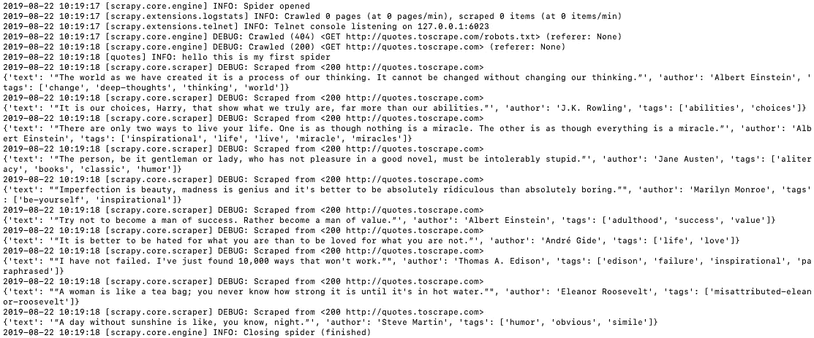

您可以通过运行`scrapy crawl quotes -o quotes.json`将数据保存在一个 JSON 文件中

到目前为止，我们从第一页获得所有报价信息，我们的下一个任务是抓取所有页面。您应该注意到首页底部有一个“下一页”按钮用于页面导航，逻辑是:单击“下一页”按钮进入下一页，获取报价，再次单击“下一页”直到没有“下一页”按钮的最后一页。

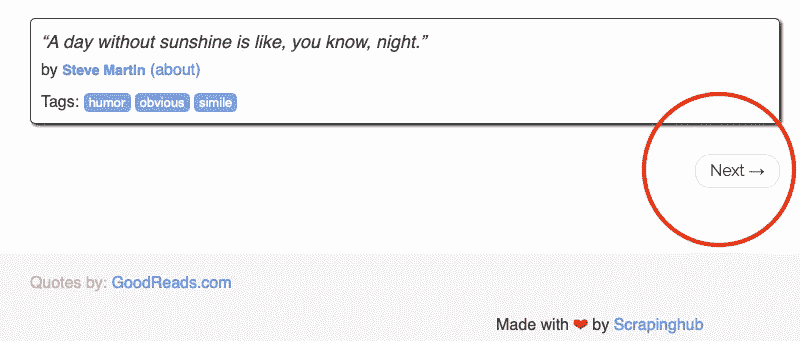

通过 Chrome DevTools，我们可以获得下一页的 URL:

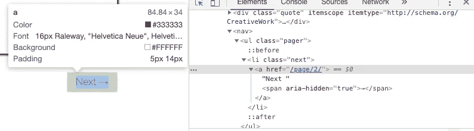

让我们通过再次运行`scrapy shell [http://quotes.toscrape.com/](http://quotes.toscrape.com/)`在 Scrapy Shell 中进行测试:

```
$ scrapy shell [http://quotes.toscrape.com/](http://quotes.toscrape.com/)
...>>> response.css('li.next a::attr(href)').get()'/page/2/'
```

现在，我们可以编写以下代码，让蜘蛛浏览所有页面以获取所有报价:

`next_page = response.urljoin(next_page)`获取完整的 URL，`yield scrapy.Request(next_page, callback=self.parse)`发送一个新的请求来获取下一个页面，并使用回调函数调用相同的解析函数来获取新页面的报价。

可以使用快捷键进一步简化上面的代码:[参见本节](https://docs.scrapy.org/en/latest/intro/tutorial.html#a-shortcut-for-creating-requests)。本质上，`response.follow`支持相对 URL(不需要调用`urljoin`)，并自动为`<a>`使用`href`属性。因此，代码可以进一步缩短:

```
for a in response.css('li.next a'):
            yield response.follow(a, callback=self.parse)
```

现在，再次运行蜘蛛程序`scrapy crawl quotes`,你应该会看到所有 10 页的引文都被提取出来了。坚持住——我们就要完成第一部分了。下一个任务是抓取单个作者的页面。

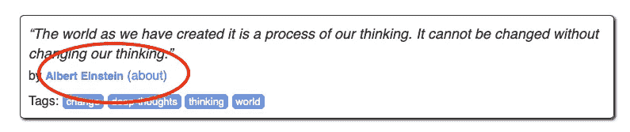

如上所示，当我们处理每个报价时，我们可以通过跟随突出显示的链接进入单个作者的页面—让我们使用 Scrapy Shell 来获得链接:

```
$ scrapy shell [http://quotes.toscrape.com/](http://quotes.toscrape.com/)
...
>>> response.css('.author + a::attr(href)').get()'/author/Albert-Einstein'
```

因此，在提取每个引文的循环过程中，我们发出另一个请求，以转到相应作者的页面，并创建另一个`parse_author`函数来提取作者的姓名、生日、出生地点和简历，并输出到控制台。更新后的蜘蛛如下所示:

再次运行 spider`scrapy crawl quotes`并再次检查您需要提取的所有内容是否正确输出到控制台。注意 Scrapy 基于 [Twisted](https://twistedmatrix.com/trac/) ，这是一个流行的 Python 事件驱动网络框架，因此是异步的。这意味着单独的作者页面可能不会与相应的报价同步处理，例如，作者页面结果的顺序可能与页面上的报价顺序不匹配。我们将在后面的部分讨论如何将报价与其对应的作者页面链接起来。

恭喜你，你已经完成了本教程的第一部分。

在[第二部分](https://medium.com/@HarryWang/a-minimalist-end-to-end-scrapy-tutorial-part-ii-b917509b73f7?sk=ebd3a9cee8b2097b3857194fee3821a6)中了解更多关于物品和物品装载器的信息。

[第一部分](https://medium.com/@HarryWang/a-minimalist-end-to-end-scrapy-tutorial-part-i-11e350bcdec0?source=friends_link&sk=c9f8e32f28a88c61987ec60f93b93e6d)，[第二部分](/a-minimalist-end-to-end-scrapy-tutorial-part-ii-b917509b73f7?source=friends_link&sk=ebd3a9cee8b2097b3857194fee3821a6)，[第三部分](/a-minimalist-end-to-end-scrapy-tutorial-part-iii-bcd94a2e8bf3?source=friends_link&sk=a1fdde9c9dd5383d8de2e08395ee3f98)，[第四部分](https://medium.com/@HarryWang/a-minimalist-end-to-end-scrapy-tutorial-part-iv-3290d76a2aef?sk=6f0902f9a15092575814ab533a56f8ef)，[第五部分](https://medium.com/@HarryWang/a-minimalist-end-to-end-scrapy-tutorial-part-v-e7743ee9a8ef?source=friends_link&sk=c1c5110f63c7ccbe4eb8c6209ee2f57c)