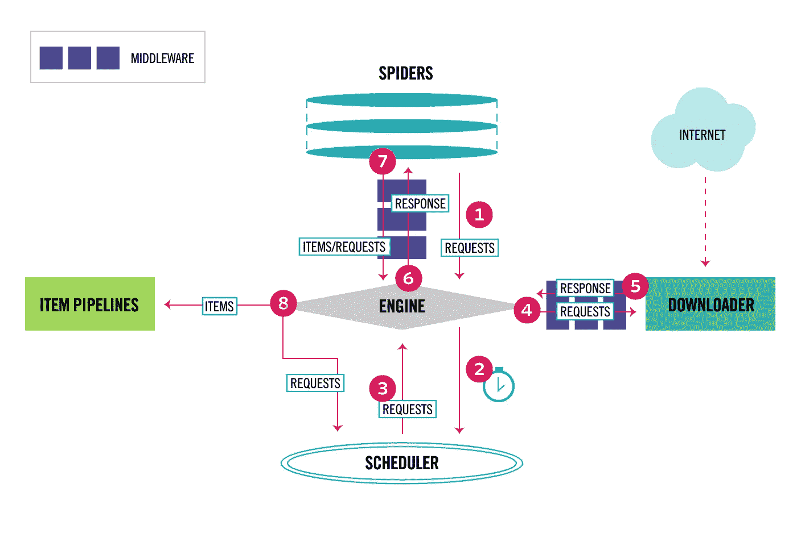
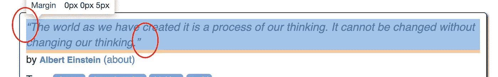
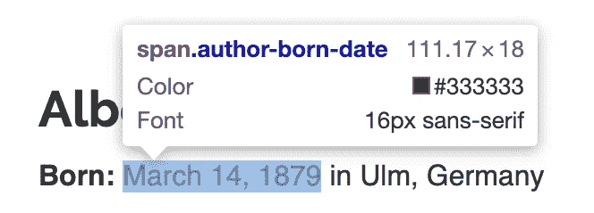
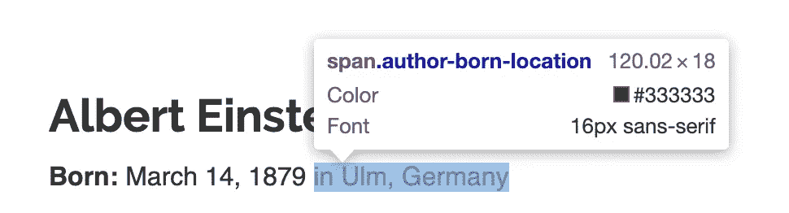

# 一个极简的端到端剪贴簿教程(第二部分)

> 原文：<https://towardsdatascience.com/a-minimalist-end-to-end-scrapy-tutorial-part-ii-b917509b73f7?source=collection_archive---------5----------------------->

## 面向初学者的系统化网页抓取


Photo by [Igor Son](https://unsplash.com/@igorson?utm_source=medium&utm_medium=referral) on [Unsplash](https://unsplash.com?utm_source=medium&utm_medium=referral)

[第一部分](https://medium.com/@HarryWang/a-minimalist-end-to-end-scrapy-tutorial-part-i-11e350bcdec0?source=friends_link&sk=c9f8e32f28a88c61987ec60f93b93e6d)、[第二部分](/a-minimalist-end-to-end-scrapy-tutorial-part-ii-b917509b73f7?source=friends_link&sk=ebd3a9cee8b2097b3857194fee3821a6)、[第三部分](/a-minimalist-end-to-end-scrapy-tutorial-part-iii-bcd94a2e8bf3?source=friends_link&sk=a1fdde9c9dd5383d8de2e08395ee3f98)、[第四部分](https://medium.com/@HarryWang/a-minimalist-end-to-end-scrapy-tutorial-part-iv-3290d76a2aef?sk=6f0902f9a15092575814ab533a56f8ef)、[第五部分](https://medium.com/@HarryWang/a-minimalist-end-to-end-scrapy-tutorial-part-v-e7743ee9a8ef?source=friends_link&sk=c1c5110f63c7ccbe4eb8c6209ee2f57c)

在第一部分中，您了解了如何设置 Scrapy 项目并编写了一个基本的蜘蛛程序来通过页面导航链接提取网页。但是，提取的数据仅显示在控制台上。在第二部分中，我将介绍 Item 和 ItemLoader 的概念，并解释为什么应该使用它们来存储提取的数据。

我们先来看看[刺儿头架构](https://docs.scrapy.org/en/latest/topics/architecture.html):



正如您在第 7 步和第 8 步中看到的，Scrapy 是围绕项目的概念设计的，即，蜘蛛将把提取的数据解析成项目，然后项目将通过项目管道进行进一步处理。我总结了使用 Item 的一些关键原因:

1.  Scrapy 是围绕 Item 和 expect Items 设计的，作为 spider 的输出——您将在第四部分看到，当您将项目部署到 ScrapingHub 或类似的服务时，会有默认的 ui 供您浏览项目和相关的统计数据。
2.  项目在一个单独的文件中明确定义了通用的输出数据格式，这使您能够快速检查您正在收集的结构化数据，并在您错误地创建不一致的数据时提示异常，例如在代码中拼写错误的字段名称，这种情况比您想象的更常见:)。
3.  您可以(通过 ItemLoader)为每个项目字段添加前/后处理，如修剪空格、删除特殊字符等。，并将这个处理代码从主蜘蛛逻辑中分离出来，以保持代码的结构化和整洁。
4.  在第三部分中，您将学习如何添加不同的项目管道来完成诸如检测重复项目和将项目保存到数据库中之类的事情。

在第一部分的结尾，我们的蜘蛛产生了以下数据:

```
yield {
                'text': quote.css('.text::text').get(),
                'author': quote.css('.author::text').get(),
                'tags': quote.css('.tag::text').getall(),
            }
```

和

```
yield {
            'author_name': response.css('.author-title::text').get(),
            'author_birthday': response.css('.author-born-date::text').get(),
            'author_bornlocation': response.css('.author-born-location::text').get(),
            'author_bio': response.css('.author-description::text').get(),
        }
```

你可能会注意到`author`和`author_name`是同一个东西(一个来自报价页面，一个来自对应的个人作者页面)。因此，我们实际上提取了 6 条数据，即引用文本、标签、作者姓名、生日、出生地点和简历。现在，让我们定义保存这些数据的项目。

打开自动生成的`items.py`文件，更新其内容如下:

我们只定义了一个名为“QuoteItem”的 Scrapy 项，它有 6 个字段来存储提取的数据。在这里，如果您以前设计过关系数据库，您可能会问:我是否应该有两个项目 QuoteItem 和 AuthorItem 来更好地逻辑表示数据？答案是可以的，但是在这种情况下**不推荐**，因为 Scrapy 以异步方式返回条目，并且您将添加额外的逻辑来匹配报价条目和其对应的条目——在这种情况下，将相关的报价和作者放在一个条目中要容易得多。

现在，您可以将提取的数据放入蜘蛛文件的条目中，如下所示:

```
from tutorial.items import QuoteItem
...
quote_item = QuoteItem()
...for quote in quotes:
    quote_item['quote_content'] = quote.css('.text::text').get()
    quote_item['tags'] = quote.css('.tag::text').getall()
```

或者，更好的方法是使用 ItemLoader，如下所示:

```
from scrapy.loader import ItemLoader
from tutorial.items import QuoteItem
...

for quote in quotes:
    loader = ItemLoader(item=QuoteItem(), selector=quote)
    loader.add_css('quote_content', '.text::text')
    loader.add_css('tags', '.tag::text')
    quote_item = loader.load_item()
```

嗯，ItemLoader 的代码看起来更复杂——为什么要这么做？简单的回答是:从 css 选择器获得的原始数据可能需要进一步解析。例如，提取的`quote_content`在 Unicode 中有引号，需要去掉。



生日是一个字符串，需要解析成 Python 日期格式:



出生位置在提取的字符串中有“in ”,需要删除:



ItemLoader 使预处理/后处理功能可以很好地从 spider 代码中指定，并且项目的每个字段都可以有不同的预处理/后处理功能集，以便更好地重用代码。

例如，我们可以创建一个函数来删除前面提到的 Unicode 引号，如下所示:

MapCompose 使我们能够对一个字段应用多个处理函数(在本例中我们只有一个)。ItemLoader 返回一个列表，比如标签的`[‘death’, ‘life’]`。对于作者姓名，虽然返回一个列表值，如`[‘Jimi Hendrix’]`，但 TakeFirst 处理器取列表的第一个值。添加额外的处理器后，items.py 看起来像:

现在的关键问题是，我们从报价页面加载两个字段`quote_content`和`tags`，然后发出另一个请求来获取相应的作者页面以加载`author_name`、`author_birthday`、`author_bornlocation`和`bio`。为此，我们需要将项目`quote_item`作为元数据从一个页面传递到另一个页面，如下所示:

```
yield response.follow(author_url, self.parse_author, meta={'quote_item': quote_item})
```

而在作者解析函数中，你可以得到条目:

```
def parse_author(self, response):
        quote_item = response.meta['quote_item']
```

现在，在添加了 Item 和 ItemLoader 之后，我们的 spider 文件看起来像这样:

在控制台 Scrapy stats 中运行蜘蛛`scrapy crawl quotes`，可以找到提取的物品总数:

```
2019-09-11 09:49:36 [scrapy.statscollectors] INFO: Dumping Scrapy stats:
...'downloader/request_count': 111,
...'item_scraped_count': 50,
```

恭喜你。您已经完成了本教程的第二部分。

[第一部分](https://medium.com/@HarryWang/a-minimalist-end-to-end-scrapy-tutorial-part-i-11e350bcdec0?source=friends_link&sk=c9f8e32f28a88c61987ec60f93b93e6d)，[第二部分](/a-minimalist-end-to-end-scrapy-tutorial-part-ii-b917509b73f7?source=friends_link&sk=ebd3a9cee8b2097b3857194fee3821a6)，[第三部分](/a-minimalist-end-to-end-scrapy-tutorial-part-iii-bcd94a2e8bf3?source=friends_link&sk=a1fdde9c9dd5383d8de2e08395ee3f98)，[第四部分](https://medium.com/@HarryWang/a-minimalist-end-to-end-scrapy-tutorial-part-iv-3290d76a2aef?sk=6f0902f9a15092575814ab533a56f8ef)，[第五部分](https://medium.com/@HarryWang/a-minimalist-end-to-end-scrapy-tutorial-part-v-e7743ee9a8ef?source=friends_link&sk=c1c5110f63c7ccbe4eb8c6209ee2f57c)