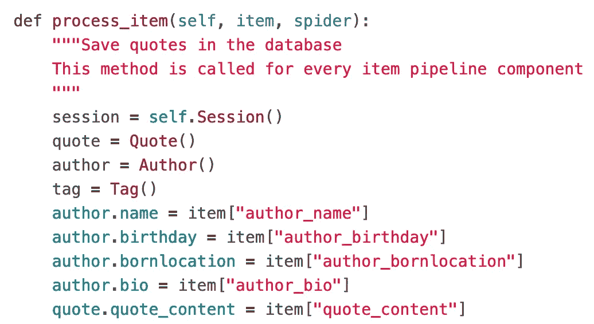

# 一个极简的端到端剪贴簿教程(第三部分)

> 原文：<https://towardsdatascience.com/a-minimalist-end-to-end-scrapy-tutorial-part-iii-bcd94a2e8bf3?source=collection_archive---------3----------------------->

## 面向初学者的系统化网页抓取


Photo by [Sarah Dorweiler](https://unsplash.com/@sarahdorweiler?utm_source=medium&utm_medium=referral) on [Unsplash](https://unsplash.com?utm_source=medium&utm_medium=referral)

[第一部分](https://medium.com/@HarryWang/a-minimalist-end-to-end-scrapy-tutorial-part-i-11e350bcdec0?source=friends_link&sk=c9f8e32f28a88c61987ec60f93b93e6d)，[第二部分](/a-minimalist-end-to-end-scrapy-tutorial-part-ii-b917509b73f7?source=friends_link&sk=ebd3a9cee8b2097b3857194fee3821a6)，[第三部分](/a-minimalist-end-to-end-scrapy-tutorial-part-iii-bcd94a2e8bf3?source=friends_link&sk=a1fdde9c9dd5383d8de2e08395ee3f98)，[第四部分](https://medium.com/@HarryWang/a-minimalist-end-to-end-scrapy-tutorial-part-iv-3290d76a2aef?sk=6f0902f9a15092575814ab533a56f8ef)，[第五部分](https://medium.com/@HarryWang/a-minimalist-end-to-end-scrapy-tutorial-part-v-e7743ee9a8ef?source=friends_link&sk=c1c5110f63c7ccbe4eb8c6209ee2f57c)

在第二部分中，您已经从网站中提取了所有需要的数据，并将它们存储在 Items 中。在第三部分中，我将引入项目管道，使用 [ORM](https://blog.bitsrc.io/what-is-an-orm-and-why-you-should-use-it-b2b6f75f5e2a) (SQLAlchemy)将提取的数据保存到数据库中，并处理重复数据问题。

由蜘蛛返回的每个项目被顺序发送到项目管道(如果有的话),以进行额外的处理，例如将项目保存到数据库、数据验证、删除重复项等。项目管道在`pipelines.py`文件中被定义为类，打开这个自动生成的文件，可以看到一个空管道被定义为“TutorialPipeline”:


您需要在`settings.py`文件中指定启用哪个管道以及管道的顺序——默认情况下，没有管道被启用。要启用上面的空管道，请在`settings.py`中注释掉以下部分:


整数值(通常范围从 0 到 1000)，例如上面所示的 300，决定了管道的执行顺序(较低值的管道首先运行)。

接下来，让我们开发一个管道来将项目保存到数据库中。在这里，我使用面向对象的范例，使用对象关系映射(ORM)来查询和操作数据库中的数据。特别是，我使用 [SQLAlchemy](https://www.sqlalchemy.org) 。我不会涉及 ORM 的细节，请参考[这篇文章](https://blog.bitsrc.io/what-is-an-orm-and-why-you-should-use-it-b2b6f75f5e2a)了解一些利弊。

首先，让我们设计数据库模式。注意，该项目有 6 个字段，如`quote_content`、`tags`、`author_name`、`author_birthday`、`author_bornlocation`和`bio`。我将使用三个表来存储这些数据，即报价、标签、作者。引用和标记之间存在多对多关系(一个引用可以有一个或多个标记，一个标记可以与一个或多个引用相关联)，作者和引用之间存在一对多关系(一个作者可以有一个或多个引用，但是一个引用只属于一个作者)。

要通过 SQLAlchemy 使用 ORM 定义这个模式，您需要:

*   在`requirements.txt`中添加`SQLAlchemy>=1.3.6`，在虚拟环境中运行`pip install -r requirements.txt`安装软件包
*   用以下内容创建一个`models.py`:


`db_connect()`功能使用`create_engine(get_project_settings().get(“CONNECTION_STRING”))`连接到数据库。`CONNECTION_STRING`在`settings.py`文件中指定。您可以更改连接字符串以连接到不同的数据库系统，如 SQLite、MySQL、Postgres，而无需更改代码。在本教程中，我使用 SQLite，它本质上是一个名为`scrapy_quotes.db`的本地文件，在蜘蛛第一次运行时在根文件夹中创建。

`CONNECTION_STRING = ‘sqlite:///scrapy_quotes.db’`

我还提供了一个连接 MySQL 的示例(注释掉了):

```
# MySQL
CONNECTION_STRING = "{drivername}://{user}:{passwd}@{host}:{port}/{db_name}?charset=utf8".format(
     drivername="mysql",
     user="harrywang",
     passwd="tutorial",
     host="localhost",
     port="3306",
     db_name="scrapy_quotes",
)
```

现在，让我们创建将项目保存到数据库的管道。打开`pipelines.py`文件，添加以下类(管道):

确保您还导入了所需的包和函数:


下面的 init 函数使用`models.py`中的函数连接到数据库(`db_connect`)并创建表格(`create_table`)，如果表格还不存在的话(否则被忽略)。


在`process_item`函数中，我首先为数据库会话和三个表创建实例。然后，我将作者信息和引用文本值分配给相应的表列。



接下来，我们需要检查当前条目的作者和标签是否已经存在于数据库中，如果到目前为止它们还不存在，则只创建新的作者/标签:


最后，我将报价添加到数据库中:


请注意，由于您在 ORM ( `quote.author`和`quote.tags`)中指定的关系，您不需要显式添加作者和标签—新的作者/标签(如果有)将由 SQLAlchemy 自动创建和插入。

现在，运行蜘蛛`scrapy crawl quotes`，你应该看到一个名为`scrapy_quotes.db`的 SQLite 文件被创建。您可以使用 SQLite 命令行打开文件以查看提取的内容:

```
$ sqlite3 scrapy_quotes.db
...sqlite> .tables
author     quote      quote_tag  tagsqlite> select * from quote limit 3;1|The world as we have created it is a process of our thinking. It cannot be changed without changing our thinking.|12|Imperfection is beauty, madness is genius and it's better to be absolutely ridiculous than absolutely boring.|23|The person, be it gentleman or lady, who has not pleasure in a good novel, must be intolerably stupid.|3sqlite> .quit
```

或者用于 SQLite 的 [DB 浏览器](https://sqlitebrowser.org):


请注意，我们提取了 50 个报价。假设网站可能会添加额外的报价，并且您希望每周运行一次蜘蛛来收集新报价(如果有的话)。所以，让我们再次运行蜘蛛`scrapy crawl quotes`，你可能会注意到一个问题:我们现在在数据库中有 100 个报价——同样的 50 个报价被再次提取和存储！

接下来，让我们添加另一个管道来检查该项，以查看该项是否是重复的，如果是，则删除该项，以便该项不会通过其余的管道。

打开 pipelines.py 文件并添加以下类(pipeline):

确保导入 DropItem 异常:`from scrapy.exceptions import DropItem`。逻辑很简单:执行数据库查询，查看当前商品的报价文本是否已经存在，如果存在，则删除该商品。现在，您需要在`settings.py`中启用这个管道，并确保在保存到数据库管道之前执行复制管道:


您可以先删除 SQLite 文件，然后运行几次蜘蛛程序，您将看到只有第一次数据库被填充了 50 个引号。之后，您可以看到警告信息，指示重复的项目已被删除。

```
2019-09-12 11:16:04 [scrapy.core.scraper] WARNING: Dropped: Duplicate item found...
2019-09-12 11:16:04 [scrapy.core.engine] INFO: Closing spider (finished)2019-09-12 11:16:04 [scrapy.statscollectors] INFO: Dumping Scrapy stats:
...'item_dropped_count': 50,'item_dropped_reasons_count/DropItem': 50,...
```

你已经完成了第三部分！！干杯。在第四部分中，我将向您展示如何部署蜘蛛来进行周期性的爬行和监视，例如，每 10 分钟自动运行一次蜘蛛。

[第一部分](https://medium.com/@HarryWang/a-minimalist-end-to-end-scrapy-tutorial-part-i-11e350bcdec0?source=friends_link&sk=c9f8e32f28a88c61987ec60f93b93e6d)、[第二部分](/a-minimalist-end-to-end-scrapy-tutorial-part-ii-b917509b73f7?source=friends_link&sk=ebd3a9cee8b2097b3857194fee3821a6)、[第三部分](/a-minimalist-end-to-end-scrapy-tutorial-part-iii-bcd94a2e8bf3?source=friends_link&sk=a1fdde9c9dd5383d8de2e08395ee3f98)、[第四部分](https://medium.com/@HarryWang/a-minimalist-end-to-end-scrapy-tutorial-part-iv-3290d76a2aef?sk=6f0902f9a15092575814ab533a56f8ef)、[第五部分](https://medium.com/@HarryWang/a-minimalist-end-to-end-scrapy-tutorial-part-v-e7743ee9a8ef?source=friends_link&sk=c1c5110f63c7ccbe4eb8c6209ee2f57c)