# 一个极简的端到端剪贴簿教程(第四部分)

> 原文：<https://towardsdatascience.com/a-minimalist-end-to-end-scrapy-tutorial-part-iv-3290d76a2aef?source=collection_archive---------11----------------------->

## 面向初学者的系统化网页抓取


Photo by [Paweł Czerwiński](https://unsplash.com/@pawel_czerwinski?utm_source=medium&utm_medium=referral) on [Unsplash](https://unsplash.com?utm_source=medium&utm_medium=referral)

[第一部分](https://medium.com/@HarryWang/a-minimalist-end-to-end-scrapy-tutorial-part-i-11e350bcdec0?source=friends_link&sk=c9f8e32f28a88c61987ec60f93b93e6d)，[第二部分](/a-minimalist-end-to-end-scrapy-tutorial-part-ii-b917509b73f7?source=friends_link&sk=ebd3a9cee8b2097b3857194fee3821a6)，[第三部分](/a-minimalist-end-to-end-scrapy-tutorial-part-iii-bcd94a2e8bf3?source=friends_link&sk=a1fdde9c9dd5383d8de2e08395ee3f98)，[第四部分](https://medium.com/@HarryWang/a-minimalist-end-to-end-scrapy-tutorial-part-iv-3290d76a2aef?sk=6f0902f9a15092575814ab533a56f8ef)，[第五部分](https://medium.com/@HarryWang/a-minimalist-end-to-end-scrapy-tutorial-part-v-e7743ee9a8ef?source=friends_link&sk=c1c5110f63c7ccbe4eb8c6209ee2f57c)

在前三部分中，您已经开发了一个蜘蛛，它从[http://quotes.toscrape.com](http://quotes.toscrape.com)中提取报价信息，并将数据存储到本地 SQLite 数据库中。在这一部分，我将向您展示如何将蜘蛛部署到云中。

首先，让我们看看你如何部署到[https://scrapinghub.com](https://scrapinghub.com)——开源 Scrapy 框架背后的团队运行的商业服务。

创建一个免费帐户和一个新项目:

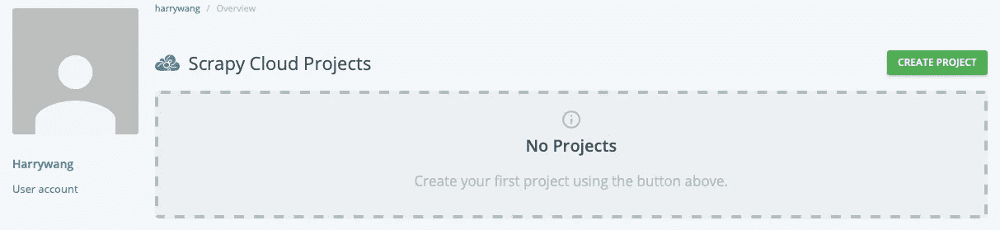

然后，点击 Code and deployments 菜单，按照屏幕上显示的说明安装`shub`——记录您的 API 密钥和部署号。

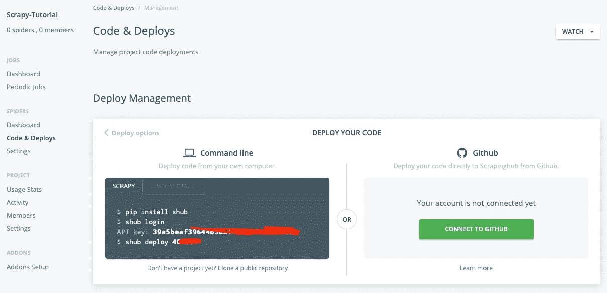

回到 scrapy-tutorial 的根目录(scrapy 项目的根目录)，使用命令`shub login`和`shub deploy`将你的项目部署到 Scrapy hub:

```
(venv) dami:scrapy-tutorial harrywang$ shub login
Enter your API key from [https://app.scrapinghub.com/account/apikey](https://app.scrapinghub.com/account/apikey)
API key: xxxxx
Validating API key...
API key is OK, you are logged in now.(venv) dami:scrapy-tutorial harrywang$ shub deploy 404937
Messagepack is not available, please ensure that msgpack-python library is properly installed.
Saving project 404937 as default target. You can deploy to it via 'shub deploy' from now on
Saved to /Users/harrywang/xxx/scrapy-tutorial/scrapinghub.yml.
Packing version b6ac860-master
Created setup.py at /Users/harrywang/xxx/scrapy-tutorial
Deploying to Scrapy Cloud project "404937"
{"status": "ok", "project": 4xxx, "version": "b6ac860-master", "spiders": 3}
Run your spiders at: [https://app.scrapinghub.com/p/404937/](https://app.scrapinghub.com/p/404937/)
```

Scrapinghub 配置文件`scrapinghub.yml`在根文件夹中创建，您需要编辑它来指定我们特定的软件包需求。否则，将使用默认设置:

*   运行 Python 3 的 scrapy 1.7
*   其他包的需求文件

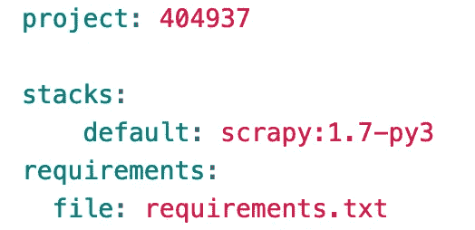

运行`$ shub deploy`再次部署，新配置生效。

假设我在 repo 中有 3 个蜘蛛(`quotes_spider_v1.py`和`quotes_spider_v2.py`是用于演示目的的中间蜘蛛)，您应该在已部署的项目中看到 3 个蜘蛛(`quotes_spider.py`是主蜘蛛):

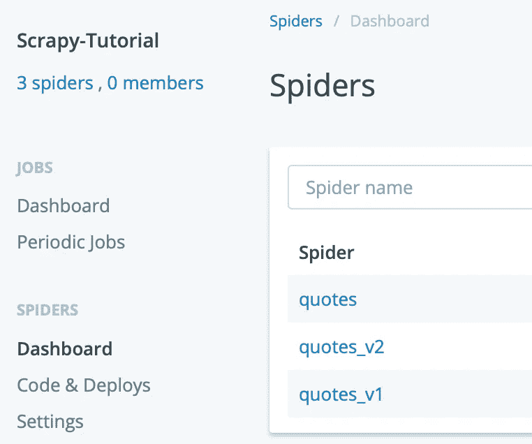

现在，你可以运行你的蜘蛛:

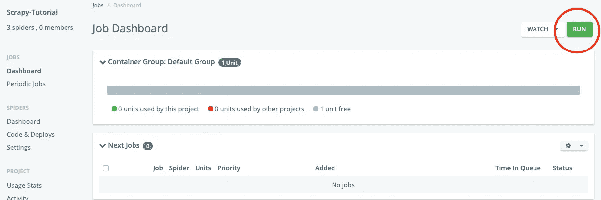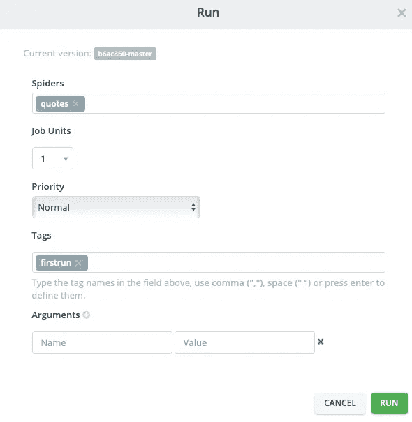

作业完成后，您可以检查结果并下载不同格式的项目:

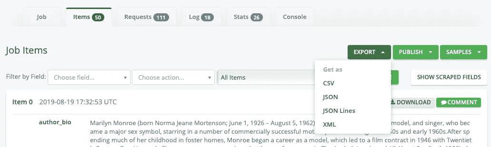

但是，您必须付费才能运行定期作业，例如，每周二上午 8 点运行您的蜘蛛。

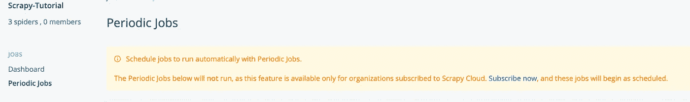

在搜索运行定期爬行作业的免费选项时，我遇到了由 [my8100](https://github.com/my8100) 开发的伟大的开源项目 S[crapydWeb](https://github.com/my8100/scrapydweb)——非常感谢作者开发了这样一个具有伟大特性和文档的好项目。接下来，我将带你通过 Heroku 使用 ScrapydWeb 建立你自己的“ScrapingHub.com”的过程(你也可以按照[作者的文档](https://github.com/my8100/scrapyd-cluster-on-heroku))。

下图显示了 ScrapydWeb 的架构，该架构旨在支持分布式爬行。

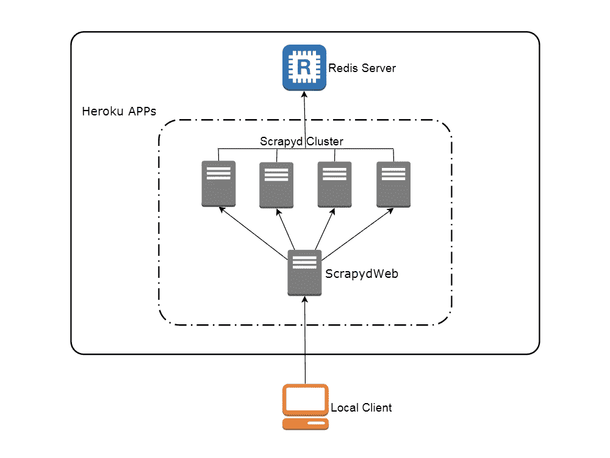

source: [https://github.com/my8100/scrapyd-cluster-on-heroku](https://github.com/my8100/scrapyd-cluster-on-heroku)

在本教程中，我不介绍分布式爬行。相反，我将只设置两个服务器:一个 **ScrapydWeb 服务器**(该服务器提供 web UI 来管理不同的蜘蛛和作业)和一个 **Scrapyd 服务器**(该服务器托管您的蜘蛛代码并实际发送/接收请求/响应)。

ScrapydWeb 的作者通过在他的 repo 中预先配置 Heroku 使这个部署过程变得非常简单，repo 位于[ttps://github . com/my 8100/scrapyd-cluster-on-Heroku](https://github.com/my8100/scrapyd-cluster-on-heroku)。

*   scrapyd-cluster-on-heroku/ScrapydWeb:该文件夹包含 **ScrapydWeb 服务器**的 Heroku 配置
*   Scrapyd-cluster-on-heroku/Scrapyd:该文件夹包含 **Scrapyd 服务器**的 Heroku 配置

我们需要定制部署，因为我们的 scrapy 项目有特定的包需求，例如，SQLAlchemy、MySQL、Python 3.x 等。因此，你需要将[https://github.com/my8100/scrapyd-cluster-on-heroku](https://github.com/my8100/scrapyd-cluster-on-heroku)的副本放到你的 github 账户中，例如[https://github.com/harrywang/scrapyd-cluster-on-heroku](https://github.com/harrywang/scrapyd-cluster-on-heroku)并做一些修改来支持本教程。

您可以在[https://github . com/Harry Wang/scrapyd-cluster-on-heroku/commit/e 612 dcb 9 a6 c 158 da 4b 744d 311 e 82 c 529497 fba7c](https://github.com/harrywang/scrapyd-cluster-on-heroku/commit/e612dcb9a6c158da4b744d311e82c529497fba7c)查看我对作者回购的修改，包括:

*   在 scrapyd/requirements.txt 中添加 MySQL 和 SQLAlchem 包
*   在 scrapyd/runtime.txt 中将 python 版本更改为 python-3.6.8
*   打开 Scrapy web 服务器认证，在 Scrapy web/Scrapy web _ settings _ v10 . py 中设置用户名和密码(不要这样公开用户名和密码)

接下来，在 heroku.com 创建一个免费账户并安装 Heroku CLI: `brew tap heroku/brew && brew install heroku`

然后，克隆回购:

```
git clone [https://github.com/harrywang/scrapyd-cluster-on-heroku](https://github.com/harrywang/scrapyd-cluster-on-heroku)
cd scrapyd-cluster-on-heroku/
```

登录 Heroku:

```
scrapyd-cluster-on-heroku harrywang$ heroku login
heroku: Press any key to open up the browser to login or q to exit:
Opening browser to [https://cli-auth.heroku.com/auth/browser/3ba7221b-9c2a-4355-ab3b-d2csda](https://cli-auth.heroku.com/auth/browser/3ba7221b-9c2a-4355-ab3b-d2csda)
Logging in… done
Logged in as [xxx@gmail.com](mailto:xxx@gmail.com)
```

部署垃圾服务器/应用程序:

*   首先转到/scrapyd 文件夹，并通过运行以下 git 命令使该文件夹成为 git repo:

```
git init
git status
git add .
git commit -a -m "first commit"
git status
```

*   创建一个名为`scrapy-server1`的新应用程序(如果这个应用程序被占用，请选择另一个)
*   设置一个名为 heroku 的 git 遥控器
*   检查 git 遥控器
*   将/scrapyd 文件夹中的内容推送到遥控器以部署应用程序

```
$ pwd
/Users/harrywang/xxx/scrapyd-cluster-on-heroku/scrapyd$ heroku apps:create scrapy-server1$ heroku git:remote -a scrapy-server1set git remote heroku to https://git.heroku.com/scrapy-server1.git$ git remote -vheroku https://git.heroku.com/scrapy-server1.git (fetch)heroku https://git.heroku.com/scrapy-server1.git (push)origin https://github.com/harrywang/scrapyd-cluster-on-heroku (fetch)origin https://github.com/harrywang/scrapyd-cluster-on-heroku (push)$ git push heroku master
```

您可以为远程垃圾服务器设置环境变量，例如设置时区:

```
$ heroku config:set TZ=US/EasternSetting TZ and restarting ⬢ scrapy-server1... done, **v4**TZ: US/Eastern
```

现在，你有了一个运行在 http://scrapy-server1.herokuapp.com 的 scrapyd 服务器

接下来，让我们设置 web 应用程序，它为我们添加 scrapyd 服务器、上传 scrapy 项目和安排爬行作业提供了 UI。

同样，让我们部署 ScrapydWeb 服务器/应用程序:

*   首先转到/scrapydweb 文件夹，通过运行以下 git 命令使该文件夹成为 git repo:

```
git init
git status
git add .
git commit -a -m "first commit"
git status
```

*   创建一个名为`scrapyd-web`的新应用
*   设置一个名为 heroku 的 git 遥控器
*   检查 git 遥控器
*   将/scrappy web 文件夹中的内容推送到远程设备以部署应用程序
*   设置时区

```
$ pwd/Users/harrywang/xxx/scrapyd-cluster-on-heroku/scrapydweb$ heroku apps:create scrapyd-web$ heroku git:remote -a scrapyd-webset git remote heroku to [https://git.heroku.com/scrapyd-web.git](https://git.heroku.com/scrapyd-web.git)$ git remote -v
$ git push heroku master
$ heroku config:set TZ=US/Eastern
Setting TZ and restarting ⬢ scrapyd-web... done, **v6**TZ: US/Eastern
```

您需要向 web 服务器添加至少一个 Scrapyd 服务器(让我们添加您刚刚在[scrapy-server1.herokuapp.com](http://scrapy-server1.herokuapp.com)上面设置的服务器)。您可以以类似的方式添加更多用于分布式爬网的 scrapyd 服务器:

```
$ heroku config:set SCRAPYD_SERVER_1=scrapy-server1.herokuapp.com:80Setting SCRAPYD_SERVER_1 and restarting ⬢ scrapyd-web... done, **v6**SCRAPYD_SERVER_1: scrapy-server1.herokuapp.com:80
```

现在，你有了运行在 http://scrapyd-web.herokuapp.com 的 scrapyd 网络服务器。在浏览器中打开该地址，使用您在 scrapydweb/scrapydweb _ settings _ v10 . py 文件中指定的用户名和密码登录，您应该会看到 web 服务器的管理 UI:

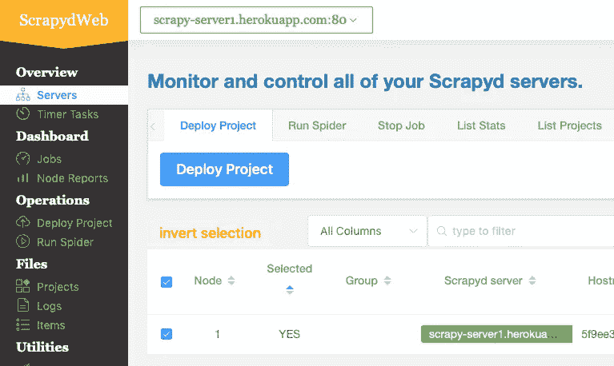

最后一个任务是使用`[scrapyd-client](https://github.com/scrapy/scrapyd-client)`部署我们的 scrapy 项目。

去我们的 scrapy 项目回购:

```
$ pwd/Users/harrywang/xxx/scrapy-tutorial
```

使用`pip install git+[https://github.com/scrapy/scrapyd-client](https://github.com/scrapy/scrapyd-client)`安装 scrapyd-client。

打开`scrapy.cfg`文件，修改其内容，添加如下部署配置:

```
[settings]
default = tutorial.settings[deploy]
url = [http://scrapy-server1.herokuapp.com](http://scrapy-server1.herokuapp.com)
username = admin
password = scrapydweb
project = scrapy-tutorial
```

然后，使用`scrapyd-deploy`将我们的项目打包并部署到 scrapyd 服务器:

```
$ scrapyd-deploy/Users/harrywang/xxx/scrapy-tutorial/venv/lib/python3.6/site-packages/scrapyd_client/deploy.py:23: ScrapyDeprecationWarning: Module `scrapy.utils.http` is deprecated, Please import from `w3lib.http` instead.from scrapy.utils.http import basic_auth_headerPacking version 1568331034Deploying to project "scrapy-tutorial" in http://scrapy-server1.herokuapp.com/addversion.jsonServer response (200):{"node_name": "5f9ee34d-f6c8-4d80-ac05-3657c4920124", "status": "ok", "project": "scrapy-tutorial", "version": "1568331034", "spiders": 3}
```

在浏览器中打开[http://scrapyd-web.herokuapp.com/1/projects/](http://scrapyd-web.herokuapp.com/1/projects/)，您应该看到项目成功部署:

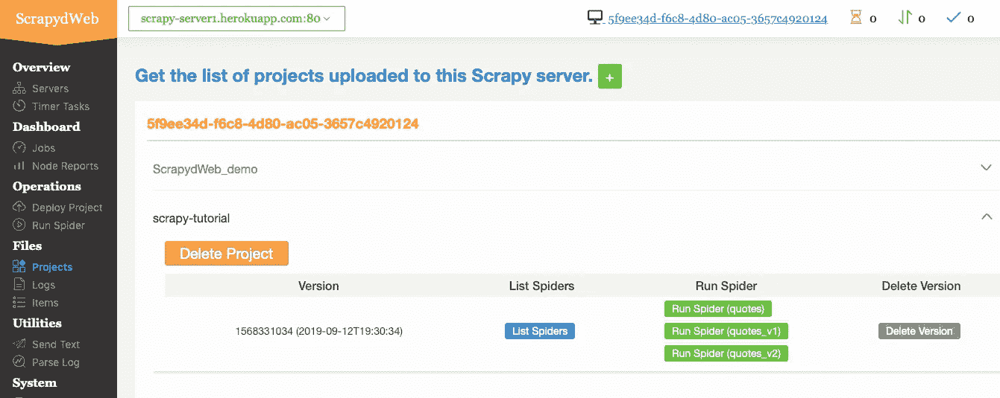

点击菜单"运行蜘蛛"，可以运行"行情"蜘蛛:

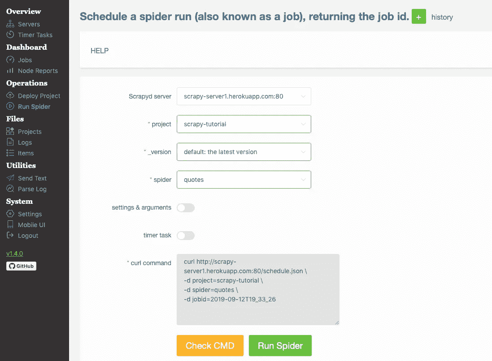

然后，您可以在“作业”菜单中检查结果，并在“项目”菜单中下载项目——您可以尝试其他菜单来查看统计数据、错误等。：

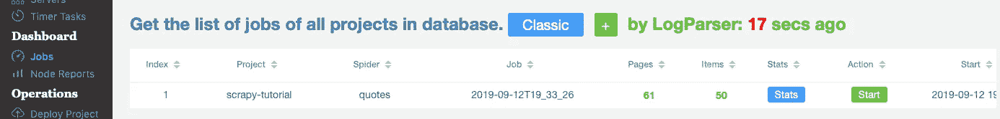

最后一个任务是指定一个定时任务，比如每 10 分钟自动运行一次报价蜘蛛:点击“定时器任务”，下面的截图显示了一个每 10 分钟运行一次的任务——定时器任务的特性是基于一个名为 [APScheduler](https://apscheduler.readthedocs.io/en/latest/) 的高级 Python 调度器库，参见[这部分文档](https://apscheduler.readthedocs.io/en/latest/modules/triggers/cron.html#expression-types)来弄清楚如何为定时器设置不同的值。

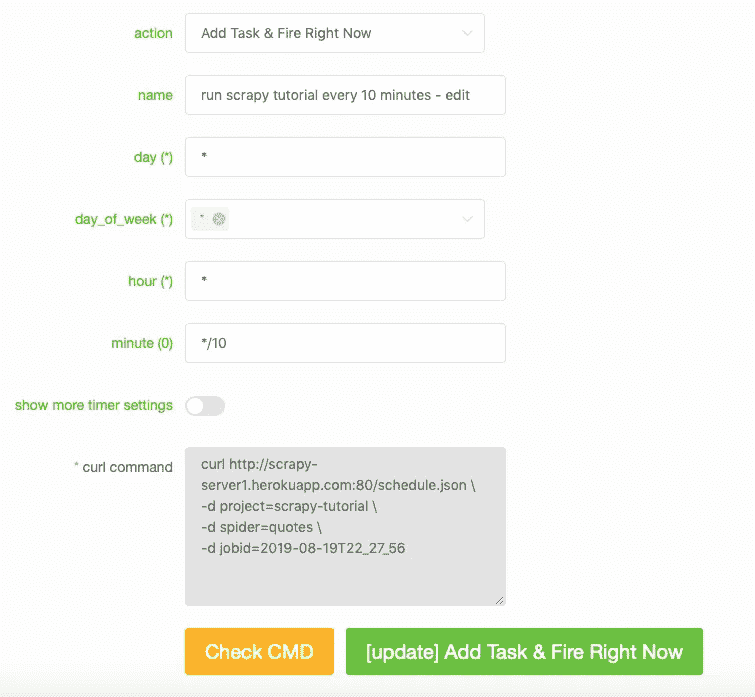

然后，您可以检查任务结果:

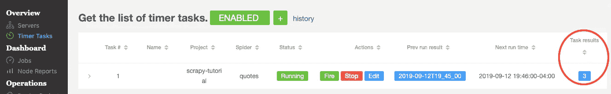

下面显示计时器任务已经触发了 4 次:

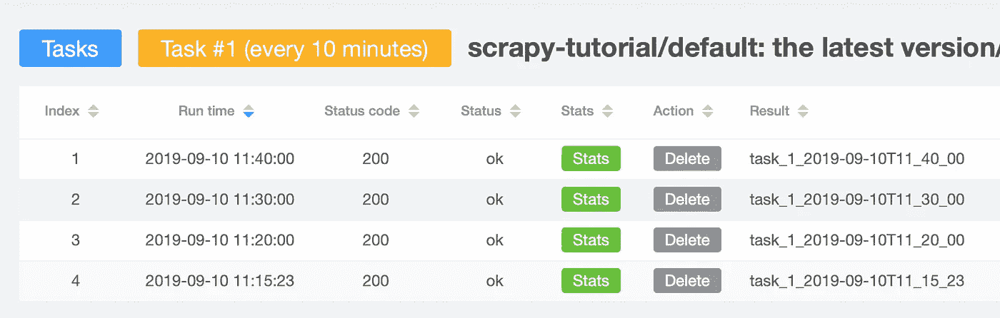

注意，在将我们的项目部署到服务器时，我们不应该使用本地 SQLite 数据库。相反，我们应该保存到一个远程数据库，比如 MySQL 服务器——您只需要像我们在第三部分中讨论的那样更改 CONNECTION_STRING 变量。

**恭喜你！你已经完成了本教程，我希望你喜欢学习。**

作为奖励，我还创建了一个单独的 repo ( [Scrapy + Selenium](https://github.com/harrywang/scrapy-selenium-demo) )来展示如何抓取动态网页(例如通过滚动加载附加内容的页面)以及如何使用代理网络(ProxyMesh)来避免被禁止，请阅读第五部分。

[第一部分](https://medium.com/@HarryWang/a-minimalist-end-to-end-scrapy-tutorial-part-i-11e350bcdec0?source=friends_link&sk=c9f8e32f28a88c61987ec60f93b93e6d)、[第二部分](/a-minimalist-end-to-end-scrapy-tutorial-part-ii-b917509b73f7?source=friends_link&sk=ebd3a9cee8b2097b3857194fee3821a6)、[第三部分](/a-minimalist-end-to-end-scrapy-tutorial-part-iii-bcd94a2e8bf3?source=friends_link&sk=a1fdde9c9dd5383d8de2e08395ee3f98)、[第四部分](https://medium.com/@HarryWang/a-minimalist-end-to-end-scrapy-tutorial-part-iv-3290d76a2aef?sk=6f0902f9a15092575814ab533a56f8ef)、[第五部分](https://medium.com/@HarryWang/a-minimalist-end-to-end-scrapy-tutorial-part-v-e7743ee9a8ef?source=friends_link&sk=c1c5110f63c7ccbe4eb8c6209ee2f57c)