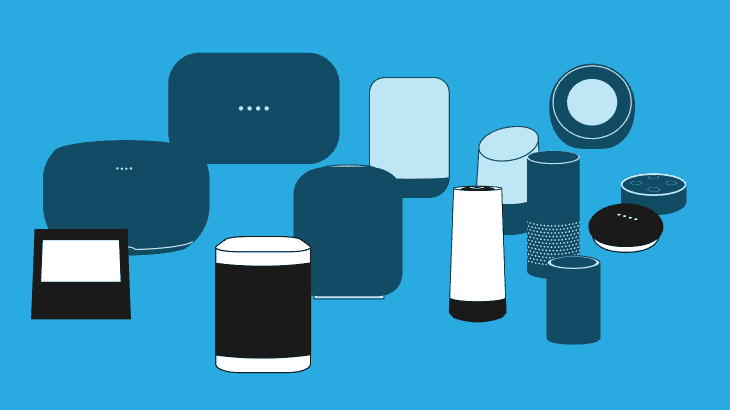
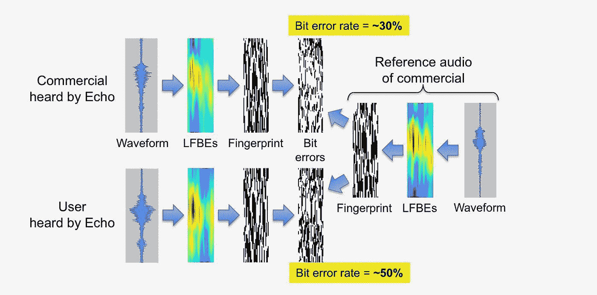
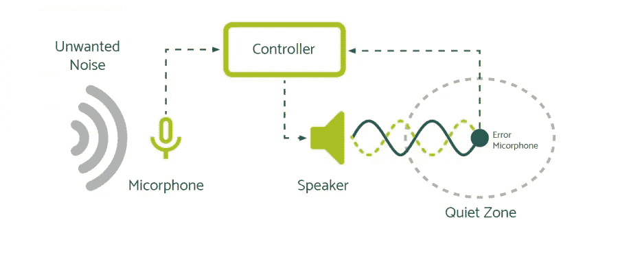
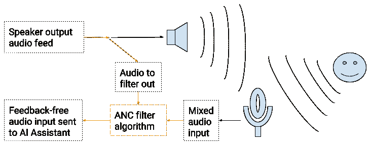

# 防止语音助手误触发的建议

> 原文：<https://towardsdatascience.com/a-modest-proposal-for-voice-assistants-91ee48ed1325?source=collection_archive---------16----------------------->

## 只需使用内部噪音消除来防止语音助手用反馈触发自己

就是这样。标题说明了一切。

Image by [TechCrunch](https://techcrunch.com/2017/10/08/comparing-alexa-google-assistant-cortana-and-siri-smart-speakers/)

开个玩笑，我会进一步解释这个想法，为什么我认为这是解决问题的必要方法，为什么我觉得我首先需要写这篇文章。

# 两句外卖

由于音频反馈，Alexa、Cortana 和谷歌助手等语音助手目前似乎能够在输出的声音包含唤醒词或至少足够接近的内容时触发自己。我建议通过过滤掉助理音频输出的噪声控制算法来输入他们的麦克风输入，从而解决这个问题。

# 问题是

你曾经通过你的助理设备(Google Home、Amazon Echo 等)播放过播客、新闻甚至音乐吗？)只是为了让它说出那些可怕的单词“Ok Google”/“Alexa”？那么毫无疑问，你已经经历了我试图解决的问题。本质上，这些助手能够通过说出自己的唤醒词来逗自己，然后对唤醒词做出回应。更糟糕的是，当这种情况发生时，唤醒词/短语甚至没有说。

## 亚马逊朝着正确方向迈出的一步

最近亚马逊的 Alexa 团队想出了一个聪明的方法，可以部分地帮助解决这个问题，但它不是万无一失的。本质上，他们创建了一个已知假阳性“Alexa”触发器(如亚马逊商业广告)的指纹数据库，然后每当它认为有人说了唤醒词时，就会根据这个数据库检查新的触发器。如果你有一个 Echo 设备，并观看了最近的超级 Owl handegg 游戏，你可能会注意到 Alexa 的商业广告令人惊讶地没有让你的 Echo 发疯。此外，Amazon 创建了一种方法来自动扩展此数据库，以防止第三方误报，方法是用相似的指纹标记来自多个客户的唤醒事件，将其记录为“媒体事件”。

*An illustration of how fingerprints are used to match audio. Different instances of Alexa’s name result in a bit error rate of about 50% (random bit differences). A bit error rate significantly lower than 50% indicates two recordings of the same instance of Alexa’s name. Image by the* [*Amazon’s developer blog*](https://developer.amazon.com/blogs/alexa/post/37857f29-dd82-4cf4-9ebd-6ebe632f74d3/why-alexa-won-t-wake-up-when-she-hears-her-name-in-amazon-s-super-bowl-ad)

虽然这应该提供了显著的改进，但是这种方法不足以完全解决这个问题，特别是因为我们现在消费的大多数媒体是流式的，因此是非同步的，所以许多错误触发不会同时发生。此外，这种方法涉及比较云中除了最可预测的触发器之外的所有触发器的指纹，这增加了助理使用的处理时间和带宽。我称赞亚马逊实现了这样一种新颖的方法(尽管它并不完全新颖，因为我非常确定谷歌的个性化语音识别模型遵循了类似的设计模式)，即使它不是包罗万象的。

## 但是多麦克风系统的噪音消除怎么样呢？

的确，现在大多数(如果不是全部的话)语音助手设备都带有多个麦克风来检测背景噪音并将其过滤掉，使用一种称为[波束形成](https://en.wikipedia.org/wiki/Beamforming#For_speech_audio)的噪音控制技术来专注于你的声音。然而，这个问题只是与手头的问题无关。例如，多麦克风设置非常适合在关掉房间中的大音量电视时清晰(或多或少)地听到您的命令，但当设备在附近没有人说话的情况下听到命令时，这种设置就不是完成任务的正确工具。

# “大”的想法

我的提议真的很简单，简单到我曾经以为语音助手的所有主要参与者都在使用这种方法。然而，随着我花更多的时间在家里对着机器人大喊大叫告诉我这个消息，我开始意识到他们要么没有这样做，要么如果他们这样做了，他们做得不好。在听了许多其他人的轶事后，我知道我不是唯一一个确保用耳机听我最喜欢的技术播客的人，以免让我过于热切的人工智能助手产生错误的想法。

好吧，也许他们现在的语音助手不会这么做，但这种方法现在应该已经在其他地方提出来了，对吧？也许吧，但我不这么认为。我使用各种相关的术语和各种平台进行了几次搜索，从常规的[谷歌搜索](https://lmgtfy.com/)，到[谷歌学术](https://scholar.google.com/)搜索，再到[语义学者](https://www.semanticscholar.org/)搜索。如果有一篇研究论文、专利、博客文章或任何其他公开的资源，那么我觉得我应该找到它；我通常能找到我想要的。如果我错过了什么关键的东西，我很想听听。我找到了大量关于主动噪声控制(ANC)的资源，以及更多关于人工智能语音助手的资源，但我能找到的最接近这一应用的是这篇关于语音助手噪声消除的论文，但可惜的是，范围仅限于外部噪声，正如上文针对多麦克风设置所讨论的:[https://pdfs . semantic scholar . org/e448/5 abce 7703 bace 8 FDD 3 ba 3 e 65688 e 1c 60d 827 . pdf？_ ga = 2.71900052](https://pdfs.semanticscholar.org/e448/5abce7703bace8fdd3ba3e65688e1c60d827.pdf?_ga=2.71900052.669585245.1549069009-41674264.1549069009)41670009-4167009

Diagram by [Silentium](https://www.silentium.com/technology/)

## 术语的快速概述:

[主动噪声控制(ANC)](https://en.wikipedia.org/wiki/Active_noise_control#Explanation) ，有时也称为主动噪声消除，通过记录不想要的噪声，然后回放其相反的波形(基本上就是相同的声音在时间上向后移动了半个相位)来过滤掉不想要的噪声，从而消除不想要的噪声，同时保留想要的噪声。

我们的问题实际上可以归结为音频反馈，即系统在音频输入中拾取自己的音频输出。在像剧院这样的现场音响系统中，由于[反馈回路](https://en.wikipedia.org/wiki/Audio_feedback)放大高频，反馈很快转变为震耳欲聋的尖叫。幸运的是，我们的语音助手不会屈服于反馈循环，因为他们不会立即输出他们的输入音频，但每当你的助手触发自己时，它都会对反馈做出反应。我在影音系统方面的背景可能是我之前假设这种方法已经被广泛使用的原因。

## 工作原理:

该系统应该能够完全在大多数语音助理系统的软件中实现，因此能够在当前一代语音硬件(如 Google Homes 和 Amazon Echos)上部署更新。我建议使用发送到扬声器的音频馈送，而不是使用独立的外部麦克风作为 ANC 滤波器的输入。由于设备正在生成音频，我们可以 100%确定我们不需要使用任何音频作为输入。这不仅可以防止反馈意外触发助手，还可以帮助助手在音频输出时专注于人类的命令，从而在你想与助手交谈时更容易通过你的音乐大喊。最重要的是，与亚马逊的方法不同，这种方法不需要 ping 云进行验证，也不会给助理设备增加过多的处理开销，因为 ANC 可以是一种相对简单的计算。就像大多数人无法挠自己痒痒一样，因为我们的大脑知道我们自己的行为产生了什么输入，这种方法将使人工智能助手无法触发自己。

The orange elements represent the software bits that I propose adding to the system.

## 这个想法的类似实现:

虽然我无法找到这种技术用于语音助手设备的任何证据，但我确实发现这种方法在其他应用中得到利用，例如专业音频音响系统或扬声器电话中的反馈抑制，就像这个过期的专利:【https://patents.google.com/patent/US6212273B1/en】T4

因此，如果这已经是现有人工智能助手设计的一部分，我很抱歉重复这一显而易见的内容，但请继续阅读，因为有一些方法可以建立在这个想法上，我认为这些方法还没有开发出来。据我所知，这种方法或任何类似的方法目前没有在任何人工智能助手中使用。

## 潜在的障碍:

一个可能的问题是，如果设备没有拾取到显著的声反馈，则以数字方式引入反馈。许多语音助手设备具有非常复杂的麦克风阵列和扬声器，旨在最大限度地减少反馈，因此，如果麦克风拾取的音频不够响亮，理论上可以将新音频添加到输入中。这是由于 ANC 的工作方式:简单地异相播放相同的音频。避免这一问题的一种方法是，根据来自麦克风输入的音频电平，调整发送到 ANC 的输出音频的增益/音量。这种缩放可以作为 ANC 算法的函数动态发生，并且可以在每次设备上电时设置基线，作为针对其特定声学环境对其进行校准的方式。

另一个潜在的缺点可能是需要重新训练触发字检测算法，以考虑 ANC 算法的过滤。然而，从我对算法的理解来看，它们可能足够健壮，能够在这些不同的参数下很好地运行。此外，如果他们用非常干净的音频进行训练，这种过滤后的音频可能会更接近训练数据。

Gif by [tenor](https://tenor.com/view/kelly-the-office-talk-gif-9343590)

## 更多功能:

人工智能语音接口的[圣杯是与人工智能的](https://www.recode.net/2018/6/27/17508166/google-duplex-assistant-demo-voice-calling-ai)[全双工通信](http://telecom.hellodirect.com/docs/Tutorials/DuplexExplained.1.080801.asp)，其中人工智能说话和人类说话之间可以有重叠，双方都可以跟上。当前版本的语音助手就像对讲机，如果你打断它，它必须停止说话；这被称为半双工。虽然制作一个令人信服的人类语音人工智能的步骤比避免反馈要复杂得多，但反馈肯定会成为人工智能的主要绊脚石。这种方法应该有助于我们到达那里:通过阻止人工智能听自己的话。

此外，虽然这种方法讨论的是一个器件的输出通过 ANC 滤波器以数字方式馈入，但没有理由将我们的思维局限于同一器件的反馈。该助理可能从听力范围内的任何设备接收音频馈送。比方说，我们不想让 Chromecast 或智能电视的音频干扰我们的助理，您可以设置这些设备以数字方式将音频馈送发送给助理，以便它过滤掉不相关或不需要的信号。与上面提到的问题类似，如果缺少声音反馈，设备在其环境中进行自我校准将是至关重要的。这可以通过每当一个人启动时，它播放一个快速校准音来实现，然后在听力范围内的助理用它来设置 ANC 滤波器的适当水平。这将解决亚马逊试图利用 Alexa 指纹数据库的问题，只需让电视告诉助手忽略来自它的所有音频，包括任何潜在的触发因素。

# 为什么要提出这个建议

以我对这个想法的详细程度和我对类似应用的研究，我可能会成功申请专利。但是我相信分享好的想法，据我所知，这个想法从来没有被分享过，尽管它对我来说似乎非常明显。另外，这应该算作*的现有技术*来阻止任何人申请将内部 ANC 应用于语音助手的专利。我没有足够的资源来实现我的每一个想法，所以为什么不把它们放在那里，看看其他人是否能从中受益？如果你最终使用了这个想法，或者你想在某件事情上合作，我很乐意听到你的意见。

如果任何 ANC、HCI(语音)、对话式 AI 或任何其他相关领域的专家正在阅读，并且希望更深入地探索这一点，请告诉我。我愿意进一步研究或测试它。也许我错过了一些关键因素或已经提出这种方法的工作。如果是这样，我真的很想了解一下。

另外，我有一个用超声波频率防止人工智能意外触发的想法。如果有人有兴趣了解更多，请告诉我，我很乐意进一步发展这个想法。

我期待听到任何人对这篇文章或讨论的话题的反馈或问题，无论是在这里还是在社交媒体上。随时联系我(只要告诉我你看到这篇文章了)→

【twitter.com/theNathanielW 

[linkedin.com/in/theNathanielWatkins](https://www.linkedin.com/in/theNathanielWatkins/)