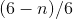
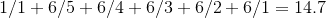

# 计算掷骰子的期望值的蒙特卡罗实验

> 原文：<https://towardsdatascience.com/a-monte-carlo-experiment-for-calculating-the-expected-value-of-a-full-dice-roll-af8a3f9a612e?source=collection_archive---------43----------------------->

## 在看到所有 6 个数字之前，掷骰子的期望值是多少？数学和程序上的解释。

Monte Carlo, Wikipedia Commons by MartinP.

这个问题是很多面试中的常见问题，下面是一个使用随机抽样解决这个问题的程序化方法。这个想法是，运行许多实验，在这些实验中，你滚动骰子(均匀分布的样本)，直到你看到所有 6 个数字都出现在一个正常和公平的骰子中。最后，你计算[期望值](https://en.wikipedia.org/wiki/Expected_value)。

## 数学

再说几率，第一次掷出一个数字的几率是 1，看到第二个数字的几率是 5/6 等等。

我们可以用这个公式来概括:

为了解决这个问题并且由于结果是[几何分布](https://en.wikipedia.org/wiki/Geometric_distribution)。一个数字出现的概率是 1/p，这意味着从上面的公式中计算出的每个数字都应该放在而不是“p”作为分母。

最后，我们计算掷骰子直到看到每个数字所需的平均时间，即 14.7。

## 代码

我们可以使用几行代码，通过运行蒙特卡罗实验，即 10K 随机实验，从 1 到 6 之间的均匀分布中抽取数字，并计算在每个实验中我们掷出所有 6 个数字的次数。所有这些实验的平均值就是期望值。大约是 14.7，你可以改变滚动的次数，看看它在这个模拟环境中的效果。

我要感谢我的同事 Shay Yehezkel。

Ori Cohen 博士拥有计算机科学博士学位，专注于机器学习。他在 [Zencity.io](https://zencity.io/) 领导研究团队，试图积极影响市民生活。