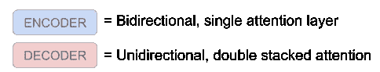

# 带有 BERT、Transformer-XL 和 Seq2Seq 的多任务音乐模型

> 原文：<https://towardsdatascience.com/a-multitask-music-model-with-bert-transformer-xl-and-seq2seq-3d80bd2ea08e?source=collection_archive---------5----------------------->

*Buzzwordy clickbait 标题本意，但仍然是一个简单的概念。*

这是“构建人工智能音乐生成器”系列的第三部分。我将讲述音乐模型多任务训练的基础知识——我们将用它来做一些非常酷的事情，如和声、旋律生成和歌曲混音。我们将在[第一部](https://medium.com/@andrew.t.shaw/creating-a-pop-music-generator-with-the-transformer-5867511b382a)和[第二部](https://medium.com/@andrew.t.shaw/practical-tips-for-training-a-music-model-755c62560ec2)的基础上展开。

## 背景

如你所知，变形金刚最近革新了自然语言处理领域。您可能也知道，有几种不同的变压器变体。它们都有相同的基本注意层，但有些是专门用于不同的任务。这里有 3 个最酷的:

[Seq2Seq](https://arxiv.org/abs/1706.03762) (序列到序列翻译)——使用编码器-解码器架构在语言之间进行翻译。这就是开启革命的 OG 变形金刚。

[transformer XL](https://ai.googleblog.com/2019/01/transformer-xl-unleashing-potential-of.html)—这款正向解码器是一款令人惊叹的文本生成器。记忆和相对位置编码使超快速和准确的预测成为可能。我们在第二部分中使用了这个模型。

[BERT](https://ai.googleblog.com/2018/11/open-sourcing-bert-state-of-art-pre.html)—这个双向编码器在回答问题和填空时产生 SOTA 结果。令牌屏蔽和双向允许特殊的上下文。

> 该死，所有这些变化都太酷了！与其选择一个，为什么不把它们结合起来呢？

等待..什么？！？

请稍等片刻。

# 多任务模型来统治他们

如果你正在训练一个语言模型，那么结合这三个模型是没有意义的。

*TransformerXL* 非常适合生成文本。Seq2Seq 非常适合语言翻译。伯特擅长填空。你没有理由想同时做这三件事。

## 对于音乐一代来说，这是一个不同的故事。

让我们来看几个你在考虑作曲时的场景:

任务 1。我有几个音符想做成一首 ***的歌***

> TransformerXL 非常擅长序列生成。让我们用它来自动完成你的歌曲想法。

**任务 2a。我的旋律需要一些和声。
**任务 2b。我有一个和弦进行。现在我需要一个钩子。****

> S **eq2Seq** 非常适合翻译任务。我们可以用这个把旋律翻译成和弦。反之亦然。

**任务 3a。**我现在有了一首歌，但听起来有些不对劲。
**任务 3b。这首歌需要更好的节奏。**

> 伯特很擅长填空。我们可以删除歌曲的某些部分，用伯特来产生一个新的变奏。

如你所见，每一种变形都有助于产生歌曲创意。我们要训练一个能解决所有这些任务的模型。

# 先玩，后理解

为了理解我们在这里试图做什么，尝试一下我们试图创建的多任务模型可能会有所帮助。


每个演示都是为了解决特定的任务而生成的。在预测值(红色音符)和原始值(绿色音符)之间切换，听出不同之处。

任务 1。宋一代
[《典藏 D》作者帕赫尔贝尔](https://musicautobot.com/#/predict/e06828d196b2d5182cd459c273d609ac)

**任务 2a** 。和谐的旋律
[《爱在哪里》黑眼豆豆](https://musicautobot.com/#/predict/2b4f5e6613f366bad7b4f39c61be32b9)

**任务 2b** 。现有和弦进行的新旋律
[【史奇雷克斯](https://musicautobot.com/#/predict/2674406ddc3eed0adaa47355d92a7e8f)的《可怕的怪物和可爱的小精灵》

任务 3a。同节拍，异曲
《关卡》由中航工业

**任务 3b。**同一首歌，混音节拍
贝多芬的《富尔伊利斯》

# 建造怪物

你回来了。现在让我们来建造这个东西。

一开始听起来可能有点令人畏惧，但是说实话并不复杂。我们的多任务模型本质上是 Seq2Seq 架构。我们所做的只是修改它来训练不同的任务。

我假设你已经知道 Seq2Seq 翻译是如何工作的。如果没有，请访问这个不可思议的 [*变形金刚插图*](http://jalammar.github.io/illustrated-transformer/) *。*

## Seq2Seq

好了，现在让我们想象一下 Seq2Seq 变压器如何为音乐工作。


非常类似于你如何翻译一种语言。*和弦*(输入语言)被翻译成*旋律*(目标语言)。

“先前的输出”被反馈到解码器，所以它知道什么已经被翻译。

## 编码器与解码器

该模型被分成蓝色编码器块和红色编码器块。了解这两者之间的区别很重要，因为我们将在其他任务中重新使用它们。



**蓝色编码块** *是* *单双向注意层*。他们能够看到以前和将来的令牌。

**红色解码块**为*双层叠前向注意层*。双堆叠块使用编码器输出和“先前输出”作为上下文来预测旋律。前向图层无法看到未来的令牌，只能看到之前的令牌。

正如你可能已经猜到的，蓝色双向编码器是训练 BERT 模型的完美匹配。同样，前向解码器层可以重新用于训练 TransformerXL 任务。

让我们来看看。

## 伯特

擦掉一些笔记，伯特会填空:


*Masked notes prevent bidirectional layers from cheating*

我们训练编码器预测正确的音符(红色)，只要它看到一个屏蔽的令牌(蓝色)。

## **变压器 XL —下一个字**

你会从以前的文章中认出这个图表。


*Next tokens are attention masked to prevent cheating*

我们训练解码器通过将目标移动一位来预测下一个令牌。

# **综合考虑**

如您所见，Seq2Seq 型号是 BERT 编码器和 TransformerXL 解码器的组合。这意味着我们可以重用 Seq2Seq 模型中的编码器和解码器来训练 BERT 和 TransformerXL 任务。唯一改变的是输入和目标。

这里提醒一下我们之前的三项任务:

**任务 1。**使用 TransformerXL 生成音乐

**任务 2a/2b。**使用 Seq2Seq 进行旋律到和弦/和弦到旋律的翻译

**任务 3a/3b。**宋与伯特的混音

## **解决多任务#2。**

前面你看到了如何进行旋律到和弦的翻译(2a。).和弦到旋律的任务(2b。)是完全相同的，但是输入和目标被翻转。


## **多任务#1 和#3**

由于 BERT 仅使用编码器层，而 TransformerXL 仅使用解码器层，因此可以同时训练任务#1 和任务#3。在 BERT 端，我们屏蔽输入并通过编码器发送。同时，我们将移位后的输入馈入解码器以训练 TransformerXL。

看起来是这样的:


*   编码器接受屏蔽任务的训练。
*   单独且并行地，解码器在下一个令牌任务上被训练。

*注意，解码器只有一个箭头作为输入。对于此任务，它不使用编码器输出。*

# 瞧啊。这是我们的模型代码

希望这个模型对使用过 PyTorch 的人来说非常清楚。

```
Model architecture:
Encoder - Bi-directional attention layers
Decoder - Uni-directional double-stacked attention layers
Head - Dense layer for token decodingForward Prop:
1\. If the input is masked ('msk'), train the encoder.
2\. If the input is shifted ('lm'), train the decoder.
3\. If the input contains both translation input ('enc') and previous tokens ('dec'), use both encoder and decoder.
```

运行此[笔记本](https://github.com/bearpelican/musicautobot/blob/master/notebooks/multitask_transformer/Train.ipynb)进行实际训练。

## 这就是训练多任务模型的全部内容。

它实际上只是一个编码器/解码器模型，针对各种类型的输入和输出进行训练。

屏蔽令牌训练编码器(BERT)。移位令牌训练解码器(TransformerXL)。成对序列训练两者(Seq2Seq)。

# 关于结果

如果你使用了本文开头的例子，那么你已经看到了结果。[音乐机器人](https://musicautobot.com)网络应用由多任务转换器驱动。与其听我喋喋不休地谈论结果，不如回去自己创造结果，你会更开心！

要启用**任务 1、2a、2b、3a、3b** ，只需拨动此开关:


## 备选计划*yg ground*

如果你觉得需要更多的动手操作，这个 python [笔记本](https://github.com/bearpelican/musicautobot/blob/master/notebooks/multitask_transformer/Generate.ipynb)用代码生成了所有相同的例子。通过浏览笔记本，你会更好地理解预测是如何工作的。

# 将结果更进一步

呜哇！我们可以生成一些很酷的结果，但是…它似乎缺少了一些流行音乐的魔力。在我们的下一篇文章中，我们将揭开一些神奇的酱料。

[**第四部分。使用一个音乐机器人来重新混合烟鬼**](https://medium.com/@andrew.t.shaw/how-to-remix-the-chainsmokers-with-a-music-bot-6b920359248c)——这是我最喜欢的最后一篇文章了！

# 谢谢你对我的包容！

> 特别感谢肯尼斯、 [*、杰瑞米·霍华德*](https://www.fast.ai/) 、 [SPC](https://medium.com/@southparkcommons) 和 [PalapaVC](https://www.palapavc.com/) 的支持。