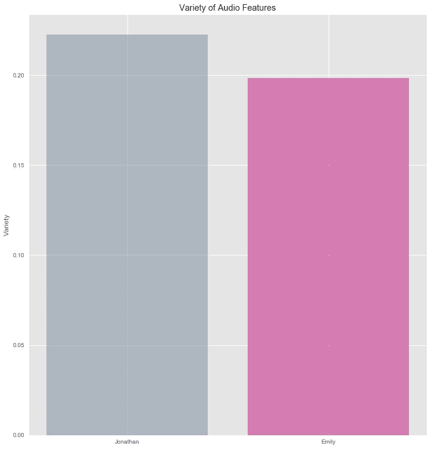
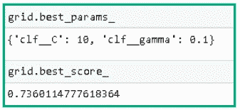

# 使用 Spotify API 和 Python 进行音乐品味分析。

> 原文：<https://towardsdatascience.com/a-music-taste-analysis-using-spotify-api-and-python-e52d186db5fc?source=collection_archive---------3----------------------->

## 探索音频特征并构建机器学习方法


几天前，我读了一篇非常有趣的文章，作者是我的一个朋友([鲁兹](https://medium.com/mundo-ia/an%C3%A1lise-de-dados-de-uma-playlist-do-spotify-com-python-e-power-bi-bc848aa0880c))，他使用 API(应用编程接口)分析了他的 Spotify 播放列表。读完之后，我打开应用程序，看了看我的播放列表，意识到我一周甚至一整天都在听不同风格的音乐。我可能一分钟前还在听桑巴，过一会儿又开始听重金属。想到这一点，我决定不仅分析我的音乐品味，也分析我未婚妻的音乐品味，以弄清楚数据对此有何说明。

因此，为了做到这一点，我首先使用 Spotify 的 API 提取了我们在 Spotify 上听得最多的 10 位艺术家的音频特征，以便我能够进行音乐品味分析。除此之外，我训练了一个机器学习模型来预测一首歌更有可能属于的每个列表。

另一个值得注意的事实是，我有一些来自[数据科学做零](https://minerandodados.com.br/curso-de-data-science/)的参考资料，这是巴西一个著名的数据科学社区。

***你可以在我的***[***Github***](https://github.com/jmcabreira)***页面*** 上查看我开发的所有代码

# **工具:**

- Spotify 库获取 Spotify 平台音乐数据
- Seaborn 和 matplotlib 实现数据可视化
- Pandas 和 numpy 实现数据分析
- Sklearn 构建机器学习模型

# Spotify 音频功能

众所周知，Spotify 是全球最受欢迎的音频流媒体平台之一。同样，Twitter、Slack 和脸书也为开发者提供了一个 API 来探索他们的音乐数据库，并深入了解我们的收听习惯。

基于此，我选择了十位我日常经常听的艺术家，并让我的未婚妻给我一张她最喜欢的艺术家的名单。有了艺术家列表后，我使用了[稀有战利品](https://medium.com/@RareLoot/extracting-spotify-data-on-your-favourite-artist-via-python-d58bc92a4330)帖子作为参考来获取音频特征数据，以便进行分析。

获得的第一个数据集包含 16 列，其中 1433 首歌曲来自我的列表，691 首来自 Emily 的 lit。因此，为了平衡歌曲的数量，我构建了一个函数，从我的列表中随机删除一些行。在删除过程之后，我们总共找到了 1394 首歌曲(703 首来自我的列表，691 首来自 Emily 的列表)。

值得一提的是，我并没有使用所有的 16 列进行分析。相反，我只选择了那些与音频特性相关的栏目。您可以在下面找到每个功能的解释(过去/复制自 Spotify 网站)。

*   声音:一种置信度，从 0.0 到 1.0，表示音轨是否是声音的。1.0 表示音轨是声学的高置信度。
*   可跳舞性:可跳舞性描述了一个曲目在音乐元素组合的基础上适合跳舞的程度，包括速度、节奏稳定性、节拍强度和整体规律性。值 0.0 最不适合跳舞，1.0 最适合跳舞。
*   能量:能量是一个从 0.0 到 1.0 的度量，代表强度和活动的感知度量。通常，高能轨道感觉起来很快，很响，很嘈杂。例如，死亡金属具有高能量，而巴赫前奏曲在音阶上得分较低。对该属性有贡献的感知特征包括动态范围、感知响度、音色、开始速率和一般熵。
*   乐器性:预测音轨是否不包含人声。“Ooh”和“aah”在这种情况下被视为乐器。Rap 或口语词轨道明显是“有声的”。乐器度值越接近 1.0，轨道不包含人声内容的可能性就越大。高于 0.5 的值旨在表示乐器轨道，但随着该值接近 1.0，置信度会更高。
*   活跃度:检测录音中是否有观众。较高的活跃度值表示音轨被现场执行的概率增加。高于 0.8 的值很有可能表示该音轨是实时的。
*   响度:轨道的整体响度，以分贝(dB)为单位。响度值是整个轨道的平均值，可用于比较轨道的相对响度。响度是声音的质量，是与体力(振幅)相关的主要心理因素。值的典型范围在-60 和 0 db 之间。
*   语速:语速检测音轨中是否存在口语单词。越是类似语音的录音(例如脱口秀、有声读物、诗歌)，属性值就越接近 1.0。高于 0.66 的值描述可能完全由口语单词组成的轨道。介于 0.33 和 0.66 之间的值描述可能包含音乐和语音的轨道，可以是分段的，也可以是分层的，包括说唱音乐。低于 0.33 的值很可能代表音乐和其他非语音类轨道。
*   配价:从 0.0 到 1.0 的一种量度，描述音轨所传达的音乐积极性。高价曲目听起来更积极(例如，快乐、愉快、欣快)，而低价曲目听起来更消极(例如，悲伤、沮丧、愤怒)。
*   速度:轨道的整体估计速度，单位为每分钟节拍数(BPM)。在音乐术语中，速度是给定作品的速度或节奏，直接来源于平均节拍持续时间。


Features

# 数据分析

在我决定做这篇文章之前，我从来没有真正考虑过我的音乐品味。事实上，在思考这个问题后，我意识到我没有一个每天都听的特定类型的音乐。其实那要看我的心情了…有些天我醒来听 pagode(来自里约热内卢的巴西风格音乐)，有些天起床后只想听一首真正有活力的歌比如铁娘子，等等。所以，我很好奇不仅调查我的，也调查 Emily 的 Spotify 音频功能。也就是说，让我们直接进入分析。我将首先绘制一个柱状图和一个雷达图，显示我们的特征，以便对它们进行比较。

情节表明，在我的艺术家名单中，最突出的特征是**活力**——可能是因为 ACDC、铁娘子和摩托头乐队等摇滚乐。另一方面，观察 Emily 的特征，我们可以注意到**可跳舞性**和**能量**是她列表中普遍的音频属性。这真的很有道理，因为她喜欢听 Ludmila(巴西放克歌手)和 Rihanna 等艺术家的歌曲。


速度是音乐分析的一个重要特征。它可以像旋律、和声或节奏一样重要，因为它代表了歌曲的速度和它唤起的情绪。例如，一首歌的 BPM 越高，这首歌的速度就越快，因此也就越令人振奋和快乐。另一方面，低 BPM 意味着歌曲较慢，这可能表明悲伤、浪漫或戏剧。

查看下图，我们可以看到我们的列表平均速度接近 120 BPM，这表明速度适中/较快。基于这一点，我认为这两种类型的赛道对那些喜欢快走和跑步的人都有兴趣，因为一首 120 BPM 的歌曲通常可以与一个人的步幅模式和他们的步伐同步，以使跑/走更难和更快。


为了比较音频特性，请务必查看下面的条形图。它显示了我的和 Emily 的歌单的每个属性的平均值之间的差异。

与此一致，我们可以清楚地看到，我的列表比她的更有活力，更生动，更具工具性。此外，我们还可以注意到在我们的**语音**变量上的微小差异，并且看到**化合价、**和**声音**在她这边占据首位。


# 名单有多多样化？！

可以通过检查我们歌曲流派的差异来调查列表的多样性。如果大多数歌曲属于同一流派，我们会说它们变化不大。

问题是:我们如何分析这个问题？嗯，答案很简单:让我们检查每个音频变量的标准偏差，并对它们进行检查。

虽然音频特征本身的标准偏差不能给我们提供太多信息(正如我们在下面的图中看到的)，但我们可以将它们相加，并计算列表标准偏差的平均值。通过这样做，我们得到了“各种音频特性”图中表示的值，在我的列表中值为 0.22，在 Emily 的列表中值为 0.20。

我们该如何解释呢？！好吧，让我们说，我们可以有一些歌曲的某个特定特征的值很高，比如能量，而其他歌曲的相同属性的值很低。简而言之，这些数字表明我的歌曲比艾米丽的更多样化。



Variety of Audio Features


Standard Deviation of the Audio Features

# 变量之间的相关性

我们还可以构建相关图，如散点图，来显示变量之间的关系。在我们的例子中，我们将把描述音乐积极性的特征效价与可舞性和能量联系起来。

为了解释下面的情节，我们必须记住数字一(绿点)和数字零(灰点)分别代表我和艾米丽的歌曲。也就是说，让我们检查散点图。

## 化合价和能量

配价和能量之间的相关性表明，有一个高能量和低水平的配价歌曲聚集。这意味着我的许多充满活力的歌曲听起来更消极，带有悲伤、愤怒和抑郁的感觉(NF 在这里占据特殊位置哈哈)。然而，当我们看灰色的点时，我们可以看到，随着积极情绪水平的增加，歌曲的能量也增加了。虽然她的数据是分裂的，但我们可以识别这种模式，表明变量之间存在某种“线性”相关性。


## 配价和可舞性

现在，看看化合价和可跳舞性之间的关系，我们可以看到 Emily 的歌曲在情节的第一和第二象限中具有高的可跳舞性值。另一方面，我的歌曲大多要么在第三象限，要么在第一象限，就这两个特征而言，表现出一种多样性。


# 机器学习方法

好了，我们从数据中得到了一些启示。为了使这篇文章简短，让我们直接进入最好的部分(至少对我来说)，那就是机器学习(ML)算法。

重要的是要记住，我并不是 100%关注模型的准确性。此外，我们将使用支持向量机(SVM ),因为它是我目前正在研究的。此外，我不会解释 SVM 是如何工作的。相反，让我们说它是一种监督的 ML 方法，用于分类和回归问题。此外，它的主要任务(分类)是通过定义一个区分它们的最佳超平面来分离所有的类。也就是说，让我们建立一个算法来预测一首歌更有可能属于我的列表还是 Emily 的列表。

## 移除功能

第一步是预处理我们的数据集，以便得到一个在所有列中都有数值的数据帧。因此，让我们首先删除所有与我们的模型不相关的特征，如 id、专辑、名称、URI、流行度和 track_number，并将目标(who 列)与我们的数据框架分开。我们可以通过构建函数 features_removal 轻松地做到这一点，该函数接收一个列表，其中包含我们希望作为参数删除的特性。

请注意，在删除它之后，我们仍然有一个分类特征(艺术家)。所以，我们必须在第二步处理这个问题。另外，重要的是要提到我们有两个稍微平衡的类(who 列),这两个类表示这首歌属于谁的列表。简而言之，我的列表中有 703 首歌曲，她的列表中有 691 首，这种数量上的平衡对我们的模型很重要。


## 标签编码器

第二个任务是将所有分类数据(艺术家姓名)转换成数字数据。为何如此？ML 算法只接受数字数据，因此，我们必须使用 LabelEncoder 类将每个艺术家的名字编码成一个特定的数字。编码过程如下所示。

```
#Set Labels
artist_label = enc.fit_transform(df_couple.artist)#Create column containing the labels
df_couple['labels_artists'] = artist_label#Remove colum artist (cathegorical data)
features_removal(['artist']) 
```

## 管道

现在我们的数据集几乎准备好了，我们可以建立我们的模型。你可能想知道:准备好了吗？！当我们处理一些最大似然算法时，我们必须记住，其中一些算法需要特定范围或结构的数据。例如，有时我们不得不将数据转换到一个更高的维度，以便找到分类的界限，如下图所示。为了实现这一点，我们使用了一种叫做内核技巧的技术，这种技术提供了一种高效且成本较低的方法来实现这种映射。此外，它使用不同的函数(核)，其中最流行的是多项式，线性和径向基函数(RBF)。例如，最后一种方法需要以 0 为中心的特征，并且具有相同数量级的方差，这就是我们必须预处理数据的原因。


Kernel Trick


Radial Basis Function (RBF)

```
# Import libraries
from sklearn.pipeline import Pipeline
from sklearn.preprocessing import StandardScaler
from sklearn.preprocessing import MinMaxScaler
from sklearn.preprocessing import Normalizer# Cross-validation and accuracy of the model
def accuracy(clf, data, target):
    results = cross_val_predict(clf, data ,target ,cv = 10)
    return metrics.accuracy_score(target,results)
```

管道:

```
# Pipelines 
pip_1 = Pipeline([('scaler',StandardScaler()),
                  ('clf', svm.SVC())
])pip_2 = Pipeline([('scaler',StandardScaler()),
                ('clf', svm.SVC(kernel = 'linear'))               
])

pip_3 = Pipeline([('scaler', StandardScaler()),
                ('clf', svm.SVC(kernel = 'poly'))                
 ])pip_4 = Pipeline([('min_max_scaler', MinMaxScaler()),
                 ('clf', svm.SVC())               
])pip_5 = Pipeline([('min_max_scaler', MinMaxScaler()),
                 ('clf', svm.SVC(kernel= 'linear'))               
])pip_6 = Pipeline([('min_max_scaler', MinMaxScaler()),
                  ('clf', svm.SVC(kernel='poly'))               
])pip_7 = Pipeline([('Normalize', Normalizer()),
                  ('clf', svm.SVC() )    
])pip_8 = Pipeline([('Normalize', Normalizer()),
                  ('clf', svm.SVC(kernel='linear') )    
])pip_9 = Pipeline([('Normalize', Normalizer()),
                  ('clf', svm.SVC(kernel='poly') )    
])
```

带有管道的列表:

```
# list with pipelines
pip_list= []
pip_list.append(('Scaler_rbf', pip_1))
pip_list.append(('Scaler_linear', pip_2))
pip_list.append(('Scaler_poly', pip_3))pip_list.append(('Min_max_scaler', pip_4))
pip_list.append(('Min_max_scaler_linear', pip_5))
pip_list.append(('Min_max_scaler_poly', pip_6))pip_list.append(('Normalizer', pip_7))
pip_list.append(('Normalizer_linear', pip_8))
pip_list.append(('Normalizer_poly', pip_9))# Function to build models
def model_accuracy(clf_models, data, target):

    results = []
    names = []

    for name, pip in clf_models:
        cross_val = cross_val_predict(pip, data, target, cv = 10)
        accuracy = metrics.accuracy_score(target, cross_val)               
        print(f'name: {name} - Accuracy : {accuracy:.4f}')
```


## 把酒装入大酒桶

具有 RBF 核和标准缩放器预处理的模型给了我们最高的精度，但是我们可以通过调整它的超参数来改进它。让我们使用 GridSearchCV 详尽地组合 C 和 Gamma 的不同值，并在我们的算法中测试它们。

```
# Import GridSearchCV
from sklearn.model_selection import GridSearchCV
```

```
# Values for parameter CC_list = [0.001 , 0.01, 0.1 , 1 , 10 , 100]#Values for parameter Gamma
Gamma_list = [0.001, 0.01 , 0.1, 1, 10, 100]
```

```
# Dictionary with lists of parameters
Grid_parameters = dict(clf__C = C_list, clf__gamma = Gamma_list)
Grid_parameters
```

```
# Grid object with pip_1, Grid_parameters, numbers of folders (cv) and accuracy (scoring) as parameters 
grid = GridSearchCV(pip_1,Grid_parameters,cv = 10, scoring = 'accuracy')
```

```
#Apply gridsearch to our data and target 
grid.fit(df_couple,target)
```



# 结论

在这篇文章中，我使用 Spotify API 分析了我未婚妻和我的音乐列表的音频特征。我没有检查我们的播放列表，而是使用了我们在日常生活中听得最多的 10 位艺术家的特征。基于此，我得出结论，我的列表比她的更多样化，令人惊讶的是，我的歌曲更有活力。另一个见解(我预料到了:])是艾米丽的歌曲更适合跳舞。为了补充分析，我还建立了一个机器学习模型(SVM ),来预测一首歌是否更有可能被她或我听到。该模型的准确率约为 74%，这是很好的(尽管还可以改进)。

参考资料:

*   [https://medium . com/mundo-ia/anáLise-de-dados-de-uma-playlist-do-Spotify-com-python-e-power-bi-BC 848 aa 0880 c](https://medium.com/mundo-ia/an%C3%A1lise-de-dados-de-uma-playlist-do-spotify-com-python-e-power-bi-bc848aa0880c)
*   [https://medium . com/@ rare loot/extracting-Spotify-data-on-your-favorite-artist-via-python-d 58 BC 92 a 4330](https://medium.com/@RareLoot/extracting-spotify-data-on-your-favourite-artist-via-python-d58bc92a4330)
*   [https://towards data science . com/is-my-Spotify-music-boring-an-analysis-containing-music-data-and-machine-learning-47550 AE 931 de](/is-my-spotify-music-boring-an-analysis-involving-music-data-and-machine-learning-47550ae931de)
*   [https://datasciencedozero.landen.co/](https://datasciencedozero.landen.co/)

