# Python 中的 Apache Spark 尼安德特人指南

> 原文：<https://towardsdatascience.com/a-neanderthals-guide-to-apache-spark-in-python-9ef1f156d427?source=collection_archive---------0----------------------->


## 完全初学者的 PySpark 入门教程

# 你听说过 Apache Spark 吗

如果您和我一样，您听说了一种听起来很不错的技术，叫做 Spark，并且想要测试您的编码能力，看看您是否可以在您的数据科学工具包中添加另一种工具。希望你不要和我一样，因为在我的情况下，我很快碰到了安装墙，然后是术语墙，然后是概念墙，四个小时后，我还没有写出一行代码。所以，在花了几个小时在网上搜索，以及比我想提及的更多的所谓“初学者指南”之后，我决定写一篇“尼安德特人指南”，希望能让你免去一些我忍受的麻烦。

# 为什么要阅读本指南？

甚至在 Spark 上快速搜索学习资料也会让你沉浸在文档、在线课程(其中许多都不便宜)和其他资源中。根据我的经验，大多数人要么假设我对分布式计算了解太多(比如假设我知道分布式计算意味着什么)，要么他们提供了高级或背景信息，但没有帮助我理解如何在 Spark 中实际实现任何东西。

考虑到这一点，在本指南中，我试图尽我所能解释一个概念，或者用一个解释把你引向其他地方，所有的目标都是让你尽可能快地编写 Spark 代码。因为我尽可能多地尝试与 Spark 相关的主题，所以如果您已经很好地掌握了某个特定的主题，请随意跳转。我还会试着给你留下一些链接，这些链接是我在钻研 Spark 时发现的有用资源。

这是指南的结构:我首先解释一些关键的术语和概念，这样我们就可以对其余的材料保持一致，同时也降低了进入 Spark 上的外部资源的门槛，您可以在这里和其他地方找到这些资源。接下来，我将使用 Google Colab 在您的机器上运行 Spark 的工作版本。最后，我将通过一个用例来演示 PySpark 是如何实际实现的，以及第一次通过示例问题是什么样子的。

# 你会学到什么

*   足够的术语和概念，能够阅读其他 Spark 资源，而不会永远感到困惑
*   让 PySpark 在您的计算机上运行的相对简单的方法
*   如何开始使用 PySpark 进行数据探索
*   在 PySpark 中构建和评估基本线性回归模型
*   此处涵盖的大部分材料的有用外部资源

# 关键术语和概念

这里有一个各种术语和概念的列表，了解这些术语和概念将有助于您深入 Spark 的世界。

## 什么是火花

如果你谷歌过“什么是 Spark”，很有可能你遇到了下面的描述，或者类似的描述:*“Spark 是一个通用的分布式数据处理引擎”。*如果没有 Spark 的背景或者不熟悉这些术语的含义，这个定义是没有用的。让我们来分解一下:

*   **分布式数据/分布式计算** — Apache Spark 在一个与普通计算机科学略有不同的世界中运行。当数据集变得太大，或者新数据进入得太快时，单台计算机可能无法处理。这就是分布式计算的用武之地。这些任务可以在相互通信的多台计算机之间分配，以产生一个输出，而不是试图在一台计算机上处理一个巨大的数据集或运行计算量非常大的程序。这种技术有一些重要的好处，但是在多台计算机之间分配处理任务有其自身的挑战，并且不能以与正常处理相同的方式构建。当 Spark 说它与分布式数据有关时，这意味着它被设计来处理非常大的数据集，并在分布式计算系统上处理它们。

> 注意:在分布式计算系统中，每台单独的计算机被称为一个*节点*，所有这些计算机的集合被称为一个*集群*


(Comic from [xkcd](https://xkcd.com/908/))

*进一步阅读* — [分布式计算简介](https://medium.com/baseds/many-nodes-one-distributed-system-9921f85205c4) (8 分钟阅读)

*   **处理引擎/处理框架** —处理引擎，有时称为处理框架，负责执行数据处理任务(一个启发性的解释，我知道)。比较可能是理解这一点的最佳方式。Apache Hadoop 是一个开源软件平台，也处理“大数据”和分布式计算。Hadoop 有一个不同于 Spark 的处理引擎，叫做 MapReduce。MapReduce 有自己独特的方法来优化在多个节点上处理的任务，而 Spark 有不同的方法。Sparks 的优势之一是它是一个处理引擎，可以单独使用，也可以代替 Hadoop MapReduce 使用，充分利用 Hadoop 的其他特性。


(Image from [Brad Anderson](https://medium.com/@bradanderson.contacts/spark-vs-hadoop-mapreduce-c3b998285578))

*进一步阅读* — [解释和比较的处理引擎](https://www.digitalocean.com/community/tutorials/hadoop-storm-samza-spark-and-flink-big-data-frameworks-compared)(约 10 分钟阅读)

*   **通用**—Spark 的主要优势之一是它的灵活性，以及它有多少应用领域。它支持 Scala、Python、Java、R 和 SQL。它有一个专用的 SQL 模块，能够实时处理流数据，并且它有一个机器学习库和基于它的图形计算引擎。所有这些原因促使 Spark 成为大数据领域最受欢迎的处理引擎之一。

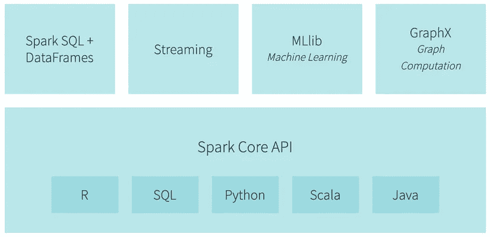

Spark Functionality (from [Databricks.com](https://databricks.com/spark/about))

*延伸阅读* — [理解火花意义的 5 分钟指南](https://mapr.com/blog/5-minute-guide-understanding-significance-apache-spark/)(大概更像是~10 分钟阅读)

## 分布式计算术语

*   分区数据(Partitioned Data)——当使用计算机集群时，你不能只是扔进一个普通的数据帧，然后期望它知道该做什么。因为处理任务将跨多个节点划分，所以数据也必须能够跨多个节点划分。分区数据是指经过优化能够在多个节点上处理的数据。

*进一步阅读* — [数据分区说明](/database-terminologies-partitioning-f91683901716) (2 分钟阅读)

*   **容错** —简而言之，容错指的是分布式系统即使在出现故障时也能继续正常工作的能力。例如，故障可能是一个节点突然起火，或者只是节点之间的通信中断。Spark 中的容错围绕着 Spark 的 RDDs(后面会讨论)。基本上，Spark 中处理数据存储的方式允许 Spark 程序在发生故障的情况下正常运行。

*进一步阅读* — [火花容错能力如何](https://www.quora.com/How-is-fault-tolerance-achieved-in-Apache-Spark) (~1 分钟阅读)

*   **懒惰评估** —懒惰评估，或懒惰计算，与代码如何编译有关。当一个不懒惰的编译器(称为严格求值)编译代码时，它会依次对遇到的每个表达式求值。另一方面，一个懒惰的编译器不会不断地计算表达式，而是等待，直到它真正被告知生成一个结果，然后一次执行所有的计算。因此，当它编译代码时，它会跟踪它最终必须评估的所有内容(在 Spark 中，这种评估日志可以说被称为谱系图)，然后每当它被提示返回某些内容时，它都会根据其评估日志中的内容执行评估。这是有用的，因为它使程序更有效，因为编译器不必评估任何实际上没有使用的东西。

*延伸阅读*——[什么是懒评](https://medium.com/background-thread/what-is-lazy-evaluation-programming-word-of-the-day-8a6f4410053f) (4 分钟阅读)

## 火花术语

*   **关系数据库、数据框架、数据集，天哪！**—**Spark rdd**(弹性分布式数据集)是数据结构，是 Spark 的核心构建块。RDD 是一个不可变的、分区的记录集合，这意味着它可以保存值、元组或其他对象，这些记录被分区以便在分布式系统上处理，并且一旦创建了 RDD，就不可能对其进行更改。这基本上概括了它的缩写:由于它们的不变性和谱系图(稍后将讨论)，它们是有弹性的，由于它们的分区，它们可以是分布式的，并且它们是数据集，因为它们保存数据。
    需要注意的一个关键点是，rdd*没有模式，*这意味着它们没有列结构。记录只是逐行记录，显示类似于列表。进入**火花数据帧**。不要与 Pandas 数据帧混淆，因为它们是不同的，Spark 数据帧具有 rdd 的所有特性，但也有一个模式。这将使它们成为我们开始使用 PySpark 的首选数据结构。
    Spark 有另一种数据结构， **Spark 数据集**。这些类似于 DataFrames，但*是强类型的，*意味着类型是在创建数据集时指定的，而不是从存储在其中的记录类型中推断出来的。这意味着 PySpark 中不使用数据集，因为 Python 是一种动态类型语言。对于这些解释的其余部分，我将参考 RDD，但要知道，对于 RDD 来说是正确的，对于数据帧来说也是正确的，数据帧只是被组织成一个列结构。

*进一步阅读* — [RDDs、数据帧、&数据集对比](https://databricks.com/blog/2016/07/14/a-tale-of-three-apache-spark-apis-rdds-dataframes-and-datasets.html)(约 5 分钟阅读)
*进一步阅读* — [Pandas v. Spark 数据帧](https://medium.com/@chris_bour/6-differences-between-pandas-and-spark-dataframes-1380cec394d2) (4 分钟阅读)
*进一步阅读* — [有用的 RDD 文档](https://jaceklaskowski.gitbooks.io/mastering-apache-spark/spark-rdd.html)(约 5 分钟阅读)

*   **变换** —变换是你在 Spark 中可以对 RDD 做的事情之一。它们是创建一个或多个新 rdd 的懒惰操作。值得注意的是，转换会创建*新的*rdd，因为，记住，rdd 是不可变的，所以一旦它们被创建，就不能以任何方式被更改。因此，本质上，转换将 RDD 作为输入，并根据被调用的转换对其执行一些功能，并输出一个或多个 rdd。回想一下关于惰性求值的部分，当编译器遇到每个转换时，它实际上并不构建任何新的 rdd，而是构建一个由这些转换产生的假设 rdd 链，这些转换只有在调用了*动作*后才会被求值。这个假设的链，或者“子”RDD，都逻辑地连接回原始的“父”RDD，就是谱系图。

*进一步阅读* — [有用的转型文档](https://jaceklaskowski.gitbooks.io/mastering-apache-spark/spark-rdd-transformations.html)(约 2 分钟阅读)*进一步阅读* — [更深入的文档](https://data-flair.training/blogs/spark-rdd-operations-transformations-actions/)(5-10 分钟阅读；上半年的转变)

*   **动作** —动作是不产生 RDD 作为输出的任何 RDD 操作。一些常见操作的例子是对数据进行计数，或者查找最大值或最小值，或者返回 RDD 的第一个元素，等等。如前所述，动作提示编译器评估谱系图并返回动作指定的值。

*延伸阅读* — [有帮助的行动文档](https://jaceklaskowski.gitbooks.io/mastering-apache-spark/spark-rdd-actions.html) (~1 分钟阅读)
*延伸阅读* — [更深入的文档](https://data-flair.training/blogs/spark-rdd-operations-transformations-actions/) (~5 分钟阅读；下半年的行动)

*   **沿袭图** —沿袭图的大部分内容在转换和操作部分都有描述，但概括来说，沿袭图概括了所谓的“逻辑执行计划”。这意味着编译器从不依赖于任何其他 RDD 的最早的 rdd 开始，并遵循一个逻辑转换链，直到它以一个动作被调用的 RDD 结束。这个特性是 Spark 容错的主要驱动力。如果某个节点由于某种原因失败了，所有关于该节点应该做什么的信息都存储在谱系图中，可以在其他地方复制。

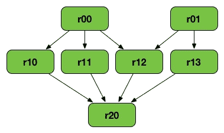

Visualization of example lineage graph; r00, r01 are parent RDDs, r20 is final RDD (from [Jacek Laskowski](https://jaceklaskowski.gitbooks.io/mastering-apache-spark/spark-rdd-lineage.html#logical-execution-plan) )

*延伸阅读*——[有用的血统文件](https://jaceklaskowski.gitbooks.io/mastering-apache-spark/spark-rdd-lineage.html#logical-execution-plan)(大约 2 分钟阅读)

*   Spark 应用和作业——当谈到像 Spark 这样的处理引擎如何在分布式系统上实际执行处理任务时，有很多细节。为了对某些 Spark 代码片段的作用有一个工作上的理解，下面是你需要知道的。在 Spark 中，当一个处理项目必须完成时，有一个“驱动”进程负责获取用户的代码并将其转换为一组多任务。还有“执行者”进程，每个进程在集群中的一个单独节点上运行，由驱动程序委派负责运行任务。为了运行任务，每个驱动程序进程都有一组它可以访问的执行器。Spark **应用**是一个用户构建的程序，由一个驱动程序和该驱动程序的相关执行器组成。Spark **job** 是一个或一组由执行器进程执行的任务，由驱动程序指导。作业由 RDD 操作的调用触发。这种东西可能相当令人困惑，所以如果一开始不太明白，也不要担心，熟悉这些术语有助于以后在代码中实现它们。如果你想了解更多信息，我已经在这个主题上包含了额外的资源。

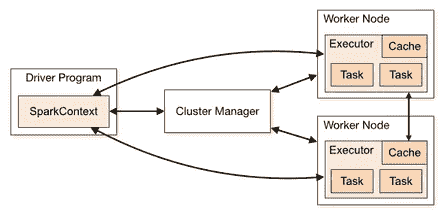

Visualization of Spark Architecture (from [Spark API](https://spark.apache.org/docs/latest/cluster-overview.html))

*延伸阅读* — [集群模式概述](https://spark.apache.org/docs/latest/cluster-overview.html)来自 Spark API (~3 分钟阅读)
*延伸阅读*—[stack overflow 上的有用回答](https://stackoverflow.com/questions/32621990/what-are-workers-executors-cores-in-spark-standalone-cluster) (~2 分钟阅读)
*延伸阅读*—[cloud era 上的 Spark 应用概述](https://www.cloudera.com/documentation/enterprise/5-6-x/topics/cdh_ig_spark_apps.html)(~ 2 分钟阅读)

**唷，你已经理解了所有的术语和概念！现在让我们开始实施吧！**

# 安装 Spark

这个标题可能有点用词不当，因为严格来说，本指南不会向您展示如何安装 Apache Spark。安装 Spark 可能是一件痛苦的事情。首先，可以用多种语言编写 Spark 应用程序，每种语言的安装都略有不同。Spark 的底层 API 是用 Scala 编写的，但是 PySpark 是用 Python 实现的上层 API。对于数据科学应用程序，使用 PySpark 和 Python 比 Scala 更受推荐，因为它相对更容易实现。因此，本指南将向您展示如何在 Google Colab 中运行 PySpark，而不是安装它。

## Google Colab

当我试图让 PySpark 在我的电脑上运行时，我不断收到关于从哪里下载它(例如，它可以从[spark.apache.org](https://spark.apache.org/downloads.html)或 pip installed 下载)、在什么地方运行它(它可以在 Jupyter 笔记本中运行或者在命令行中的本机 pyspark shell 中运行)的相互矛盾的指令，并且有许多模糊的 bash 命令散布在各处。作为一名数据分析师，我对非 pip 安装的 bash 命令的反应通常是厌恶和绝望的混合，所以我求助于 Google Colab。


Google Colab 是一个非常强大的交互式 python 笔记本(。ipynb)工具，它预装了许多数据科学库。关于它是什么以及如何运行它的更多信息，请查看这篇超级有用的文章 (8 分钟阅读)。

一旦你有了一个 Colab 笔记本，要让 Spark 运行，你必须运行下面的代码块(我知道这不是我的错，但我为它的丑陋道歉)。

```
!apt-get install openjdk-8-jdk-headless -qq > /dev/null
!wget -q [https://www-us.apache.org/dist/spark/spark-2.4.3/spark-2.4.3-bin-hadoop2.7.tgz](https://www-us.apache.org/dist/spark/spark-2.4.3/spark-2.4.3-bin-hadoop2.7.tgz)
!tar xf spark-2.4.3-bin-hadoop2.7.tgz
!pip install -q findspark
import os
os.environ["JAVA_HOME"] = "/usr/lib/jvm/java-8-openjdk-amd64"
os.environ["SPARK_HOME"] = "/content/spark-2.4.3-bin-hadoop2.7"
import findspark
findspark.init()
```

> 注意:当我第一次运行这段代码时，它没有运行。这是因为在我找到的代码编写完成后，已经发布了一个新版本的 Spark，而我试图访问一个找不到的旧版本的 Spark。因此，如果上面的代码不运行，仔细检查[这个网站](https://spark.apache.org/downloads.html)看看 Spark 的最新版本是什么，并把上面代码片段中你看到的“2.4.3”替换成任何最新版本。

基本上这段代码所做的就是下载正确版本的 Java (Spark 使用一些 Java)和 Spark，设置这些版本的路径，并在笔记本中初始化 Spark。

如果你想在除了 Colab 之外的另一个平台上使用 Spark，下面是我找到的最有用的指南(按有用性排序)，希望其中一个能帮助你:

*安装资源*—[PySpark 和 Jupyter 入门](https://blog.sicara.com/get-started-pyspark-jupyter-guide-tutorial-ae2fe84f594f)
*安装资源* — [如何在自己的电脑上使用 PySpark](/how-to-use-pyspark-on-your-computer-9c7180075617)
*安装资源* — [如何在本地安装 PySpark](https://medium.com/tinghaochen/how-to-install-pyspark-locally-94501eefe421)
*安装资源* — [如何入门 PySpark](/how-to-get-started-with-pyspark-1adc142456ec)

# PySpark 中的编码

因为我们想要处理列数据，所以我们将使用 Spark SQL 的一部分 DataFrames。

> 注意:为了避免可能的混淆，尽管我们将使用 Spark SQL，**这些都不是 SQL 代码**。当使用 Spark 数据帧时，您可以编写 SQL 查询，但您不必这样做。

## 配置火花会话

使用 Spark SQL 的入口点是一个名为`SparkSession`的对象。它启动一个 Spark *应用程序*，该会话的所有代码都将在其上运行。

```
from pyspark.sql import SparkSession
spark = SparkSession.builder \
    .master("local[*]") \
    .appName("Learning_Spark") \
    .getOrCreate()
```

> 注意:这个上下文中的“\”字符称为延续字符，它只是一个有用的换行工具，使长代码行更具可读性。

*   `.builder` —提供对用于配置会话的[构建器 API](https://spark.apache.org/docs/2.2.0/api/java/index.html?org/apache/spark/sql/SparkSession.Builder.html) 的访问。
*   `.master()` —决定程序运行的位置；`"local[*]"`将其设置为在所有内核上本地运行，但是您可以使用`"local[1]"`在一个内核上运行。在这种情况下，我们的程序将在谷歌的服务器上运行。
*   `.appName()` —命名 Spark 应用程序的可选方法
*   `.getOrCreate()` —获取一个现有的`SparkSession`，如果没有，则创建一个新的

在构建`SparkSession`时，检查[构建器 API](https://spark.apache.org/docs/2.2.0/api/java/index.html?org/apache/spark/sql/SparkSession.Builder.html) 以获得更多选项。

## 加载数据

要在 Google Colab 上打开一个本地文件，您需要运行以下代码，该代码将提示您从您的计算机中选择一个文件:

```
from google.colab import files
files.upload()
```

在本指南中，我们将使用 Kaggle 的视频游戏销售数据集。在这里可以找到[。](https://www.kaggle.com/gregorut/videogamesales)

现在使用`.read.csv()`函数将我们的数据加载到 Spark 数据帧中:(为了简洁起见，我缩短了文件名)

```
data = spark.read.csv('Video_Games_Sales.csv',inferSchema=True, header=True)
```

> 注意:这个函数专门用于将 CSV 文件读入 PySparkSQL 中的数据帧。它不适用于将数据加载到 RDD 中，并且不同的语言(除 Python 之外)具有不同的语法。在网上搜索帮助时要小心，因为许多资源并不假定 Spark SQL 或 Python。

## 数据探索

现在让我们开始了解如何更熟悉我们的数据！

我们可以做的第一件事是检查数据帧的形状。不像熊猫，这没有专用的方法，但是我们可以自己使用`.count()`和`.columns()`来检索信息。

```
data.count(), len(data.columns)>>> (16719, 16)
```

`.count()`方法返回 DataFrame 中的行数，而`.columns`返回列名列表。

> 注意:我们不必实际打印它们，因为 Colab 会自动显示每个单元格的最后输出。如果你想显示一个以上的输出，你必须打印它们(除非你使用[这个](https://stackoverflow.com/questions/36786722/how-to-display-full-output-in-jupyter-not-only-last-result)解决方法，它非常好，在 Jupyter 笔记本上也能工作)

**查看数据帧**
要查看数据帧，使用`.show()`方法:

```
data.show(5)
```

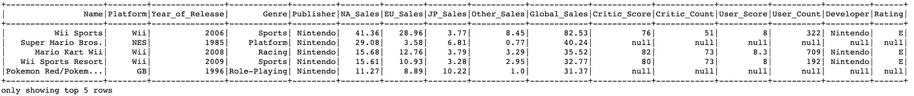

Output from data.show(5)

如您所见，运行`data.show(5)`显示了数据帧的前 5 行，以及标题。不带参数调用`.show()`将返回前 20 条记录。

让我们使用。`printSchema()`方法(也可以使用`.dtypes`):

```
data.printSchema()
```

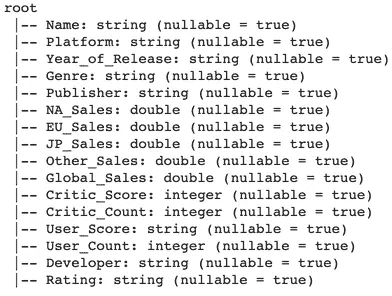

Output from data.printSchema()

此输出的一些要点是，Year_of_Release 和 User_Score 具有字符串类型，尽管它们是数字。它还告诉我们，每一列都允许空值，这在前 5 行中可以看到。

我们还可以用`.select()`方法有选择地选择我们想要显示的列。让我们只查看名称、平台、用户分数和用户计数:

```
data.select("Name","Platform","User_Score","User_Count") \
.show(15, truncate=False)
```

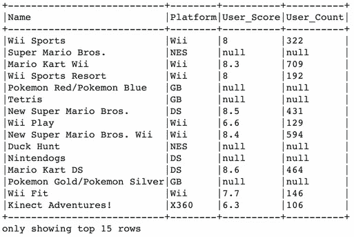

Output from data.select().show()

包含的`truncate=False`参数调整列的大小，以防止值被截断。

**汇总统计数据/信息**
我们可以使用`.describe()`方法来获取我们选择的列的汇总统计数据:

```
data.describe(["User_Score","User_Count"]).show()
```

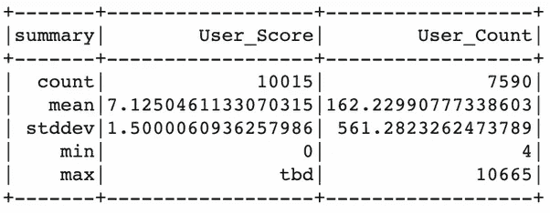

Output from data.describe().show()

从这个输出中可以看出，User_Score 列中似乎有一个奇怪的“tbd”值。User_Score 的计数也高于 User_Count，但很难判断这是因为 User_Score 中实际上有更多的值，还是“tbd”值人为地提高了计数。稍后我们将学习如何过滤掉这些值。

我们可能还想获得一些关于平台栏中有哪些平台以及它们是如何分布的信息。我们可以为此使用一个`groupBy()`，并使用`.orderBy()`对其进行排序:

```
data.groupBy("Platform") \
.count() \
.orderBy("count", ascending=False) \
.show(10)
```

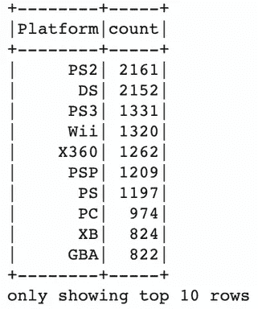

Output from data.groupBy().orderBy().show()

这里我们来看一下最常用的 10 个平台。我们可以说这个数据集很旧了，因为我在任何地方都没有看到 PS4🤔

**过滤数据帧** 让我们创建一个新的数据帧，其中 User_Score 和 User_Count 的值为空，使用`.filter()`方法过滤掉“待定”值:

```
condition1 = (data.User_Score.isNotNull()) | (data.User_Count.isNotNull())condition2 = data.User_Score != "tbd"data = data.filter(condition1).filter(condition2)
```

`condition1`对于 User_Score 或 User_Count 中没有空值的任何记录，返回 True。`condition2`对于 User_Score 中没有“tbd”的任何记录，返回 True。

我们可以通过重建先前的可视化来仔细检查我们的过滤是否有效

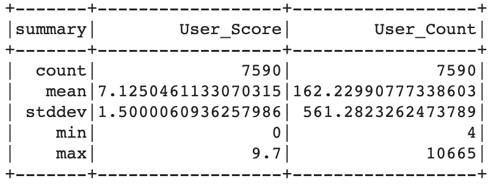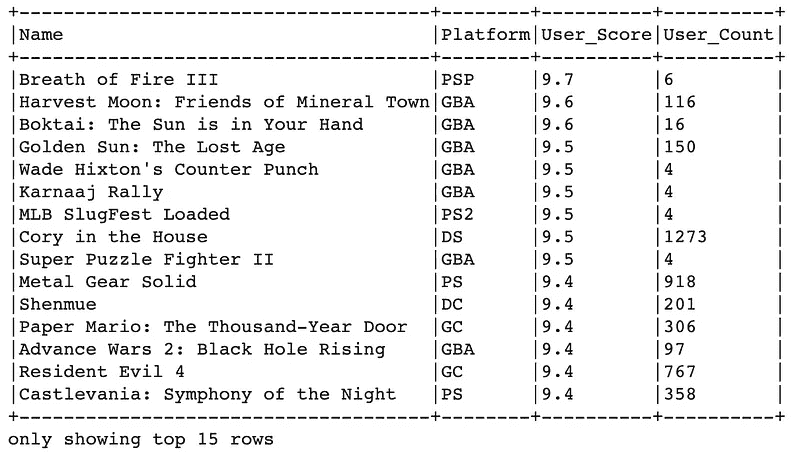

Reconstructed summary statistics and DataFrame with filtered out values

**这是足够的数据探索，现在让我们建立一个模型！**

## 在 PySpark 中构建模型

在 PySpark 中构建模型看起来和你可能习惯的有点不同，你会看到像*变压器、*和*参数这样的术语。本指南不会深入探讨这些术语的含义，但下面的链接会简要介绍它们的含义。*

*进一步阅读*—[Spark 中的机器学习](https://spark.apache.org/docs/latest/ml-pipeline.html)(约 5-10 分钟阅读)

**设置**
以线性回归为例，看看能否从 Year_of_Release、Global_Sales、Critic_Score、User_Count 预测 User_Score。

首先，让我们将所有的预测器重新编码为 Doubles(我发现这消除了后来一些非常棘手的错误)。

```
from pyspark.sql.types import DoubleTypedata2 = data2.withColumn("Year_of_Release", data2["Year_of_Release"].cast(DoubleType()))data2 = data2.withColumn("User_Score", data2["User_Score"].cast(DoubleType()))data2 = data2.withColumn("User_Count", data2["User_Count"].cast(DoubleType()))data2 = data2.withColumn("Critic_Score", data2["Critic_Score"].cast(DoubleType()))
```

我们使用方法`withColumn()`，它要么创建一个新列，要么替换一个已经存在的列。例如，Year_of_Release 列被替换为自身的一个版本，该版本被转换为 doubles。

下一步是将我们的数据转换成 PySpark 可以用来创建模型的形式。为此，我们使用一种叫做`VectorAssembler`的东西。

```
from pyspark.ml.feature import VectorAssemblerinputcols = ["Year_of_Release",  "Global_Sales", "Critic_Score", "User_Count"]assembler = VectorAssembler(inputCols= inputcols,
                            outputCol = "predictors")
```

在这里，我们已经描述了我们希望我们的模型使用什么特征作为预测器，以便`VectorAssembler`可以将这些列转换成一个列(名为“预测器”)，其中包含我们希望预测的所有数据。

```
predictors = assembler.transform(data)predictors.columns
```

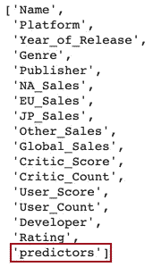

Output from VectorAssembler.transform().columns

`VectorAssembler.transform()`所做的是创建一个新的数据帧，在末尾有一个新的列，其中每一行都包含了我们在创建汇编程序时在`inputCols`参数中包含的所有特性的列表。

让我们的数据准备好在模型中使用的最后一步是收集我们刚刚制作的新预测列和 User_Score(我们的目标变量)在数据帧中。

```
model_data = predictors.select("predictors", "User_Score")model_data.show(5,truncate=False)
```

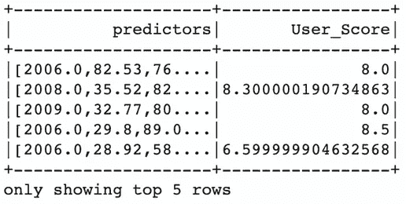

The final data we will use to build a model

接下来是将`model_data`拆分成一个训练和测试集:

```
train_data,test_data = model_data.randomSplit([0.8,0.2])
```

**模特训练**
现在来训练模特！

```
from pyspark.ml.regression import LinearRegressionlr = LinearRegression(
    featuresCol = 'predictors', 
    labelCol = 'User_Score')lrModel = lr.fit(train_data)pred = lrModel.evaluate(test_data)
```

从`pyspark.ml.regression`导入`LinearRegression`后，我们构建一个回归器，并指定它应该寻找一个名为“预测”的列作为模型的特征，一个名为“User_Score”的列作为模型的标签。接下来我们用`.fit()`训练它，最后用`.evaluate()`产生预测。

我们可以用下面的代码访问模型的参数

```
lrModel.coefficients
>>>
[-0.07872176891379576,-0.0350439561719371,0.06376305861102288,-0.0002156086537632538]lrModel.intercept
>>> 160.7985254457876
```

我们还可以查看我们的模型做出的最终预测:

```
pred.predictions.show(5)
```

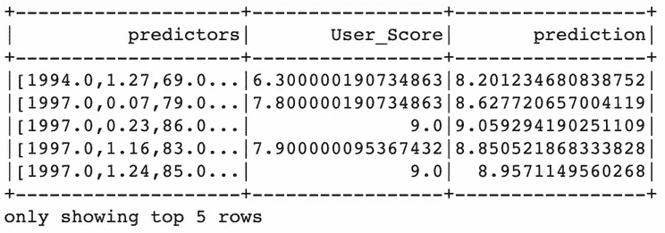

Model predictions

名为“pred”的对象是一个*linear regression summary*对象，因此要检索带有预测的数据帧，我们称之为`.predictions.show()`

**模型评估** 

```
from pyspark.ml.evaluation import RegressionEvaluatoreval = RegressionEvaluator(
    labelCol="User_Score", 
    predictionCol="prediction", 
    metricName="rmse")
```

让我们为模型计算一些统计数据:

```
rmse = eval.evaluate(pred.predictions)mse = eval.evaluate(pred.predictions, {eval.metricName: "mse"})mae = eval.evaluate(pred.predictions, {eval.metricName: "mae"})r2 = eval.evaluate(pred.predictions, {eval.metricName: "r2"})
```

它返回

```
rmse
>>> 1.125mse
>>> 1.266mae
>>> 0.843r2
>>> 0.386
```

由此我们可以理解，我们的模型倾向于偏离实际 User_Score 大约 1.125 个评分点(根据 rmse)。的 r 值告诉我们，我们模型中的预测值能够解释 User_Score 中总可变性的 40%以下。这只是一个初步的观察，我建议您使用模型参数和特性进行更多的实践！

*延伸阅读—* [线性回归的详细代码示例](https://databricks-prod-cloudfront.cloud.databricks.com/public/4027ec902e239c93eaaa8714f173bcfc/1779476228152266/1437143569842658/5673666086694627/latest.html) (~20+分钟完成整件事)
*延伸阅读—* [使用 SQL 的逻辑回归的详细代码示例](https://docs.databricks.com/spark/latest/mllib/binary-classification-mllib-pipelines.html) (~10 分钟)
*延伸阅读—* [线性回归、决策树和梯度推进树回归的示例](/building-a-linear-regression-with-pyspark-and-mllib-d065c3ba246a) (6 分钟阅读)

就您可以在 PySpark 中进行的建模而言，这只是冰山一角，但是我希望本指南已经为您提供了足够的知识，让您能够进入大数据的大门！

# 结论

哇哦。如果你能坚持到最后，那就恭喜你。您接触了大量新概念，从分布式计算和 Spark 的术语，到在 PySpark 中实现数据探索和数据建模技术。我希望这份指南能成为你继续使用 Spark 的资源！

本文使用的所有代码都可以在 GitHub [这里](https://github.com/evanheitman/Neaderthals_Guide_to_Apache_Spark/blob/master/Neanderthal's_Guide_to_Apache_Spark.ipynb)找到。