# 艺术风格的神经算法:一种现代创作形式

> 原文：<https://towardsdatascience.com/a-neural-algorithm-of-artistic-style-a-modern-form-of-creation-d39a6ac7e715?source=collection_archive---------10----------------------->

## **关于使用简单的机器学习算法创作专业外观的艺术品，你需要知道的一切**

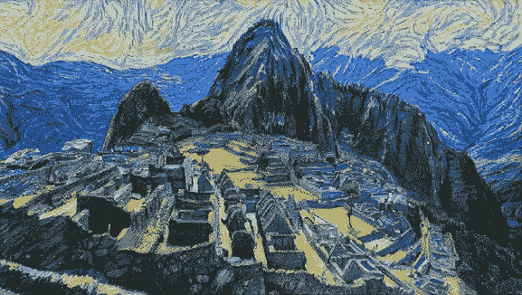

Machu picchu depicted in the style of starry night.

自从我们这个物种诞生以来，人类就一直通过艺术来传达思想。而且理由很充分；艺术是一种强有力的表现主义形式，是创造力的独特表现。因此，视觉作品及其创作者在社会中受到高度重视。

近年来，计算能力的提高已经允许机器开始模仿人类行为。由于艺术的重要性，毫不奇怪，研究人员已经开始开发算法，努力产生看不见的创造性内容。这既有争议，又令人着迷。在这篇文章中，我将专注于这场创造性革命的技术组成部分，而不是伦理辩论。

艺术风格的神经算法(N.A.A.S .)主要由 Leon A. Gatys 发明，是我迄今为止见过的最有趣、但最容易理解的人工艺术品之一。

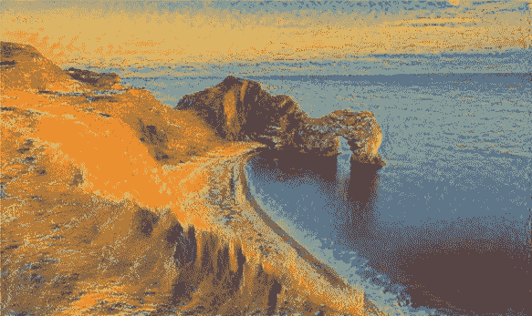

Artwork creating using N.A.A.S.

**目录:**

*   美国国家航空航天局简介。
*   理解卷积神经网络
*   虚拟 G.G .网络
*   内容表示和损失
*   风格表征与缺失
*   N.A.A.S 算法

## **艺术风格的 Gatys 神经算法介绍**

N.A.A.S .使用两个图像来创建输出:内容图像和样式图像。正如它们的标签所暗示的，样式图像的样式被编织到内容图像的内容中。这是通过一种巧妙的技术实现的，这种技术允许计算机使用卷积神经网络(conv 网或 CNN)来区分图片的内容和风格。将输出图像(最初是一组随机的像素)与指定的内容和样式进行比较，并逐步调整，直到它在数学上类似于所需的结果。

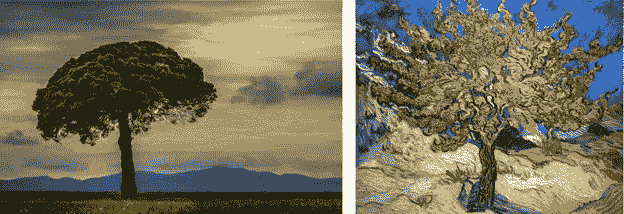

Content (left) and style (right) combined to create an output image.

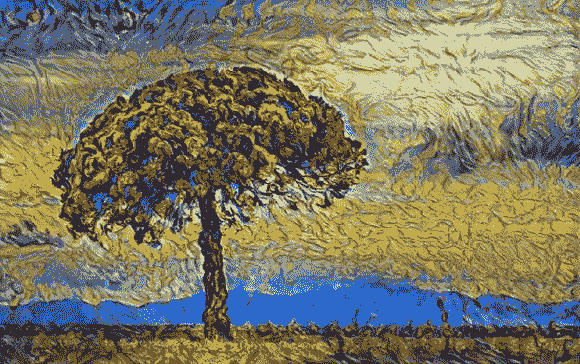

Output image

更详细地说，上面提到的风格和内容的比较是使用专门用于该算法的成本函数来完成的。通过改变优化图像的像素信息来最小化该函数。像素值是该技术的参数，这意味着它们的值将被改变以最小化 N.A.A.S .成本函数。如果你不明白什么是参数或损失函数，我强烈建议在继续之前浏览一下我的关于线性回归的文章，以获得对机器学习过程的介绍。

这并不是说你应该理解在引擎盖下发生了什么。重要的是要有基本的东西。

## **了解卷积神经网络**

鉴于卷积神经网络是整个 N.A.A.S .的基础概念，对它们的作用有一个清晰的概念是很重要的。如果你已经知道 CNN，那太好了。继续下一部分。

Conv 网是一种人工神经网络，它利用一些特殊的技术，使它们特别擅长于将图像分解成它们的基本内容。这个过程是分步骤进行的，每一步都是网络中的一个新层。一层简单的像一个文件柜放数据；它组织信息。层 x 由已经经历了 x 数学操作的输入数据的表示组成，在这种情况下是卷积。这些独特的计算集合构成了每个神经网络，并将数据从一层移动到另一层。一层中包含的每一位信息都存储在所谓的神经元中。神经元应该被认为是存储在每个虚拟橱柜中的文件，因为它们包含关于输入图像内容的信息。储存在神经元中的信息被称为激活或输出。激活是标量值。

CNN 就是这样储存信息的。现在让我们直接进入尘垢，看看图像剖析网络内部发生了什么。对于 conv 网，总共有三种用于分解图片的变换:卷积、池化和激活函数。

我们将从最重要的突变开始，卷积。卷积基本上是在图像上移动的一系列滤波器。这些过滤器是[矩阵](https://en.wikipedia.org/wiki/Matrix_(mathematics))，通常是形成方形棱柱的三维数值集合。这些结构的高度和宽度通常是 3 或 5。滤镜的深度将与图像的通道数相匹配。三个颜色通道(RBG)意味着深度为三。

当滤镜在图像中移动时，滤镜中的每个值都会乘以当前“位于其上”的像素值。这些乘积相加产生一个标量输出，存储在神经元中。一个神经元的持有量对人类来说可能没有多大意义，但这些信息对计算机来说是有价值的。然后，滤波器以用户指定的增量在图像周围移动(增量的大小称为步长)。一旦滤波器已经通过了图像中的每个位置，并且已经创建了充满输出值的整个矩阵，就用另一个滤波器重复该过程。

A simplified example of the relationship between an input image and its features map (above convolved feature in pink). The values of the filter are in small red font and the bounds of the filter itself in yellow. The filter would, in reality, be moved left to right across the image, at many horizontal positions.

过滤器的输出表示图像上的给定区域与过滤器正在搜索的内容相匹配的程度。较大的值意味着区域和所需特征之间的高度相关性。

来自卷积的所述输出被存储在所谓的特征图中。这听起来很复杂，但它只是过滤过程中产生的所有值的矩阵。要注意的关于特征地图的一个重要特性是它们被组织成在空间上与图像相关。这意味着查看图像左上角的滤波器的输出值也将在特征映射矩阵的左上角。

由于滤镜提供标量输出并在图像中移动，单个滤镜最终会产生二维输出。在图像上使用的每一个新的过滤器都会给特征图添加一个通道，使其成为一个三维矩阵。

*注意:通道是特征图的二维层，从深度上看是一个横截面。*

上面描述的只是一个卷积。大多数神经网络由许多层卷积组成。你怎么问？

这就像在特征图上运行另一组过滤器一样简单，可以创建一个新的特征图。在这种情况下，过滤器将具有与它们正在分析的地图相同的深度。除此之外，该过程与上面描述的过程相同。

滑动、乘法、求和、冲洗和重复。

如果你想知道这些神奇的过滤器是从哪里诞生的，你提出了一个非常有效的问题。每个过滤器中的每个数字称为一个参数。这意味着它是网络通过反向传播随着时间的推移而学习的。如果你不知道什么是 back prop，不要烦恼。只需知道 conv 网的机器学习方面是计算机逐步调整其过滤器，直到它们搜索并表示有意义的信息。

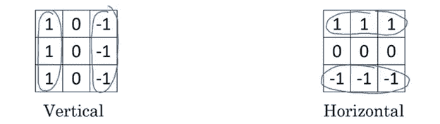

Above are two two-dimensional filters: one to pick up on horizontal lines, the other for vertical lines. Although these exact filters are unlikely to be seen in a real learning environment, they are good for exemplary purposes. Consider why each filter contains the values they do. Recall, multiply each value with a pixel value and sum the products. Higher output == high correlation to desired feature.

这在理论上很好，但让我们来看看这在实践中是如何使用的。

假设我们试图建立一个网络来直观地理解汽车，然后对汽车进行分类。一个 conv 网将被用于构建的理解方面。它将分解图像的信息，这样密集的神经网络可以很容易地将图像分类为“汽车”或“非汽车”。

在训练过程的开始，当我们开始将车辆图像输入年轻网络时，它将使用包含随机值的过滤器。随着时间的推移，网络开始学习，它会开发一套独特的过滤器来识别汽车。在网络的第一层，由于 conv 网的学习方式，过滤器可能会搜索非常基本的结构，如垂直线或水平线。随着时间的推移，通过网络层次结构的进展将意味着所呈现的数据的复杂性的进展。在较高层，网络可能会学习如何看到形状，在最后一层附近，过滤器可能会搜索镜子、窗户或轮胎。

不要忘记，只有第一套过滤器是直接看着输入图像的像素信息。除此之外，过滤器还会查看之前的图层，并分析其中的数据。

*注意:神经网络中的一层是一系列神经元，每个神经元保存一个值。当我描述池层或卷积层时，它指的是执行特定任务的网络部分(无论是池、卷积还是其他)。卷积层是接受值并执行卷积以* ***创建*** *特征图的层，而不是由特征图的* *组成的层* ***。***

在继续之前，我必须强调的最后一件事:*到目前为止，从这一部分学到的最重要的东西是，卷积网络的层代表输入图像的* ***内容*** *。*

这就是卷积的情况。让我们看看卷积网络的其他两个部分，接下来是池层。

一个**池层**是一个相对简单的概念。其目的是缩小特征地图的尺寸。可以在任何卷积层之前执行汇集过程。使用池有两个原因，第一个原因是减少网络中的计算量，从而提高网络速度。第二个原因，我劝你不要担心(但仍然应该承认)，是通过最小化数据的维数来防止过度拟合，从而降低数据分布的复杂性。用人类的话说，这使得网络在更多样化的数据集上表现得更好。

出于本文的目的，将只解释 max pooling 层。还有其他类型的池，但最大池是最常见的。

在给定输入的每个通道上，max pooling 四处移动，查看指定大小(通常为 2x2 正方形)的部分。它取该区域中的最大值，即最活跃的神经元，然后通过丢弃该区域中的所有其他值来改变特征图。它也保持了神经元的空间表现。

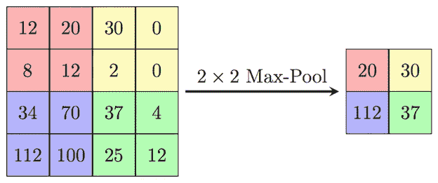

这个过程有助于丢弃大量无意义的信息，只保留最有价值的内容。

唉，激活功能。这是几乎每个神经网络的主要部分。它将非线性引入到网络中，使网络能够学习几乎任何可能的分布。

激活函数通过使它们通过期望的函数来改变特征图中的每个值(正如它们的名字所暗示的)。通常的做法是在每个卷积层之后执行激活变更。

卷积神经网络使用校正线性单元(ReLU)或泄漏 ReLU 激活函数表现最佳。

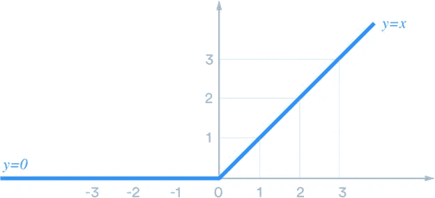

ReLU

ReLU 将每个负值接地为零。这是合乎逻辑的，因为负像素值是没有意义的。

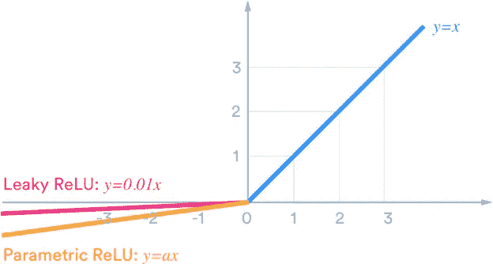

Leaky ReLU can be seen above in pink.

ReLU 变化(泄漏或参数)的目的是在反向传播过程中允许梯度流动。换句话说，泄漏 ReLU 帮助网络更稳定地学习其参数。

这是 conv 网的三个部分！这里有几个简单网络架构的例子:

卷积-> ReLU ->池->卷积-> ReLU ->池

或者

卷积-> ReLU ->卷积-> ReLU ->池->卷积-> ReLU ->卷积-> ReLU ->卷积-> ReLU->池

最后，现在所有的部分都就位了，让我们检查一个适当的网络的可视化。

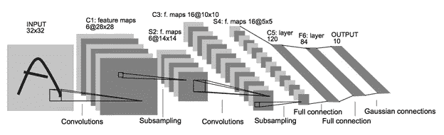

这是上面分解成几个阶段的图表:

阶段 1:在输入图像上使用 6 个大小为 5×5×1 的过滤器，产生大小为 28×28×6 的特征图(第 1 层)。

*注:数据的宽度和高度会发生变化，这是因为图像边缘的一些像素无法卷积，因为过滤器没有编程来解决图像周边出现的像素缺失问题。*

阶段 2:执行最大池化，将地图缩小到 14x14x6 的大小(第 2 层)。

阶段 3: 16 个大小为 5x5x6 的滤波器(每个包含 6 个通道)在层 2 上卷积，产生大小为 10x10x16 的特征图(层 3)。

阶段 4:在第 3 层上执行最大池化，将特征地图缩小到 5x5x16 的大小(第 4 层)。

阶段 5:这个网络的最后一部分与神经类型转移无关。在第 4 层之后，特征图被输入到一系列完全连接的层中，这些层对图像进行分类。同样，这与手头的概念无关，但可能会引起一些人的兴趣。

就是这样！你很好地理解了卷积神经网络的含义！让我们继续你来的目的:艺术风格的神经算法。

## **VGG 16 网**

神经风格研究论文推荐使用一个预先训练好的，非常有能力的 CNN，叫做 VGG 16。VGG 16 包括一个分类部分，但只有它的卷积部分用于 N.A.A.S .网络的架构如下:

*注意:在列出每一个卷积后，应用 ReLU 激活功能。网络中的所有过滤器都是 3×3 大小。网络中的池大小为 2x2。*

**卷积块 1:**

Conv1_1: 64 个滤波器，每个深度为 3。

Conv1_2: 64 个滤波器，每个深度为 64。

最大池 1

**卷积块 2:**

Conv2_1: 128 个滤波器，每个深度为 64。

Conv2_2: 128 个滤波器，每个深度为 128。

最大池 2

**卷积块 3:**

Conv3_1: 256 个滤波器，每个深度为 128。

Conv3_2: 256 个滤波器，每个深度为 256。

Conv3_3: 256 个滤波器，每个深度为 256。

Conv3_4: 256 个滤波器，每个深度为 256。

最大池 3

**卷积块 4:**

Conv4_1: 512 个滤波器，每个深度为 256。

Conv4_2: 512 个滤波器，每个深度为 512。

Conv4_3: 512 个滤波器，每个深度为 512。

Conv4_4: 512 个滤波器，每个深度为 512。

最大池 4

**卷积块 5:**

Conv5_1: 512 个滤波器，每个深度为 512。

Conv5_2: 512 个滤波器，每个深度为 512。

Conv5_3: 512 个滤波器，每个深度为 512。

Conv5_4: 512 个滤波器，每个深度为 512。

最大池 5

VGG Network, including FC layers

如您所见，VGG 16 网络的架构相当复杂。这不是一个可以在日常笔记本电脑上训练的网络。相反，先前获得的过滤器重量可以从网上下载。这优化了我们的结果，节省了大量的时间。

## **内容表示和损失**

现在我们进入算法的核心部分！

Gatys 提交的研究论文的第一部分描述了一种将内容图像的内容转移到优化图像的方法。这是通过数学上表示两个图像内容之间的差异并最小化所述表示来实现的。既然已经建立了对 conv 网的理解，成本函数的这一部分就相对直接了。

当我们将一幅图像传入 conv 网络时，它的内容由整个网络中的神经元来表示。注意，我说的是内容，而不是像素值。猫脸照片的内容与所有其他猫脸图像的内容非常相似。尽管猫的颜色或面部结构略有变化，conv 网仍然可以理解它在看一只猫。这是一个重要的细节，因为它允许内容以数字形式保留，尽管图像的样式被改变了。

也就是说，为了表示优化图像的所需内容，我们在将内容图像传递给 VGG 层(具体来说是 conv4_2 层，在执行 ReLU 之后)后，使用该层的值。

至于它的数学原理:

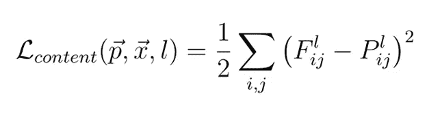

对于熟悉均方误差成本函数的人来说，这看起来应该非常相似。这个表达式说明了以下内容:

*关于内容图像 p 和优化图像 x，在 conv 网的层 l 处生成的内容损失是层 l 处 p 和 x 的每个内容表示或激活之间的平均方差*

这里，F 表示 conv 网的层 l 处的优化图像的表示。F(i，j)是来自层 l 的 F 的单个神经元。P 和 P(i，j)表示层 l 的内容图像表示及其激活。因此，对于 I 和 j 的每个值对，将激活 F(i，j)和 P(i，j)之间的平方差加到一个运行和中。这个过程完成后，用总和除以求和中的总迭代次数(等于 F 或 P 中的神经元数)。再除以 2。

让我们从逻辑上来思考这个问题。整个风格转换过程的目标是最小化 N.A.A.S .成本函数，内容损失占该函数的一半。为了最小化损失，必须改变优化图像，使得其内容表示 F 类似于内容图像的表示 p。这将把 p 的内容转移到 x 上，保留指定图像的所有重要细节。

就这样，一半的神经类型转移。不算太糟吧？

## **风格表现与缺失**

接下来，我们进入 N.A.A.S .更具创造性的部分:风格表现。所提出的区分风格和内容的方法是使用 gram 矩阵来计算特征之间的相关性。看看这是什么意思，好吗？

为了计算 gram 矩阵，我们采用ℓ层的内容表示，并将数据转换成二维矩阵。矩阵的每一行都是分析图层ℓ-1 的过滤器的完整输出。因为每个滤波器都在寻找特定的特征，所以也可以说矩阵中的每一行都是输入图像上不同位置的给定特征的表示。

现在，这些值已经被适当地构造，可以使用下面的等式来计算矩阵:

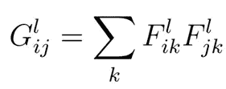

Gram matrix computation

该等式明确地说明了 gram 矩阵的元素(I，j)等于来自内容矩阵中两个不同行的元素的乘积之和。

为了对其进行分解，第 I 行的元素 1 乘以第 j 行的元素 1。元素 2 乘以元素 2，依此类推，直到元素 k。最后，将这些乘积求和以产生 gram 矩阵的单个元素。

因此，为了完整地计算 gram 矩阵，需要对矩阵中行的每个组合进行计算。

这是论文中最难住我的部分。简单的矩阵乘法如何表现一幅图像的风格？

请记住，矩阵的每一行都是一个展开的特征地图，包含关于特征存在的空间信息。通过将元素相乘，我们检查这些元素在图像中的位置是否重叠。对图像中的每一个位置和每一对可能的特征进行这种处理。然后进行求和，丢弃所有信息的空间相关性。

而这种元素之间的重叠或关联，不管它们在哪里，正是风格。蓝色圆圈与水平影线重叠的频率是多少？在整个图像中，小点与螺旋线交叉吗？这些特征以错综复杂、不易察觉的方式交织在一起，最终形成了一幅图像的风格。

这就是风格的表现。

现在，MSE 损失再次被使用。

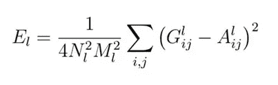

MSE Loss for style

这里，我们迭代优化图像(G)的 gram 矩阵和样式图像(A)的 gram 矩阵。我们对这两个矩阵的所有元素的平方差求和。这里，N 表示层 l 中的特征图的数量，M 表示这 N 个特征图中的元素的数量。然后，对于层 l 的最终风格损失，将该总和缩放 4 倍 N * M

Gatys 的论文指出，在比较多层图像的风格时，可以获得最佳结果。因此，总风格损失为:

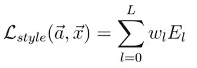

Complete style loss

其中 w(l)表示层 l 的损耗权重，E(l)是层 l 的损耗。

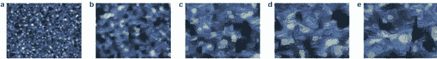

Style of starry night, as it is represented by gram matrices using activations in layers 1–5 (1 far left, 5 far right) of VGG.

由于算法的目标是最小化成本函数，优化图像的风格将慢慢地改变以类似于风格图像的风格。这将增加它们的 gram 矩阵的相似性，最终降低成本。

风格！这就是全部了！

## **艺术风格的神经算法**

你看过所有的部分。让我们把它们放在一本宜家说明书中。

首先要做的是指定一个样式图像和一个内容图像。为计算机提供了这些图像的路径。然后创建与内容图像大小相同的随机值张量。这是优化图像。其中的随机值是这个算法的参数。它们将随着时间的推移被计算机改变，成为输出图像。

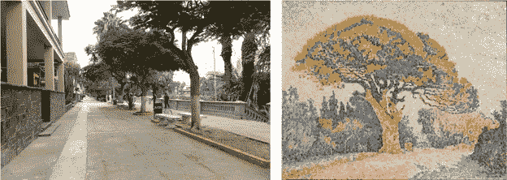

Content image (left) and style image (right)

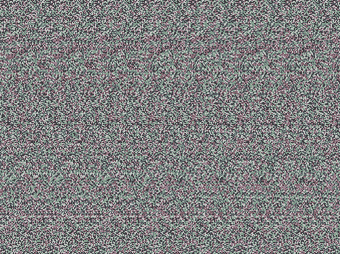

Random noise image for optimization

损失函数或优化目标设置为使用 VGG 图层 conv4_2 的制图表达的内容损失加上使用 VGG 图层 conv1_1、conv2_1、conv3_1、conv4_1 和 conv5_1 的制图表达的样式损失。发现由 Gatys 提出的这些层产生最好的结果。

超参数α和β用于调整输出内容和风格之间的平衡。

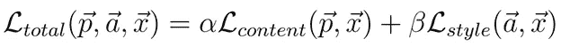

The complete N.A.A.S. cost function

现在，机器学习魔法开始发挥作用。鉴于你们中的一些人可能并不精通优化算法，并且这个主题不是在一篇短文中就能讲授的，我将保持这一部分的简洁。优化图像通过 VGG 网络反向传播，以获得其相对于成本函数的梯度。使用最小化算法(在这种情况下是 L-BFGS)，随机噪声张量的值被改变以降低成本函数的输出。慢慢地，噪声变成了样式和内容图像的融合。

然后使用 Gatys 提出的另一种技术将结果放大到更高的分辨率。这个概念尽管简单，但超出了本文的范围。它也没有风格转换算法本身有趣(在我看来)。

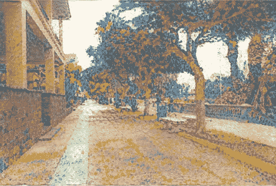

Fruits of the algorithm’s labor

仅此而已。一件不可思议的艺术品由机器学习诞生。这真是一个惊人的过程。

随着更多的神经艺术算法被开发出来，创造过程将会进一步加速和改善。在不久的将来，我将看到由机器创造的独一无二的作品，这让我非常兴奋。

**感谢阅读！出发前:**

*   查看 GitHub 上的代码
*   查看这份文件了解更多关于[CNN](http://cs231n.github.io/convolutional-networks/)
*   请随时在 [Linkedn](https://www.linkedin.com/in/faris-nolan-306050173/) 上与我联系