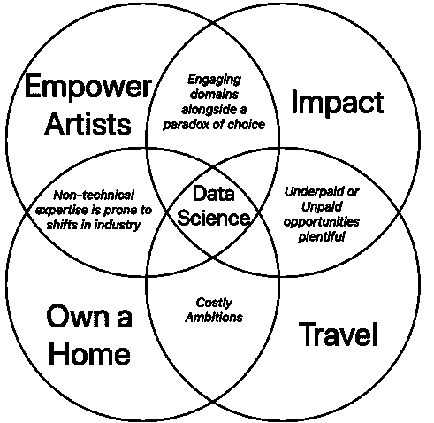
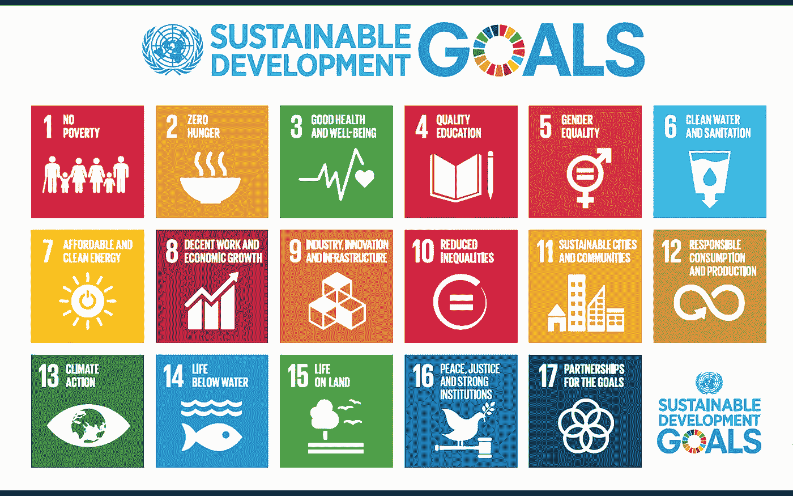
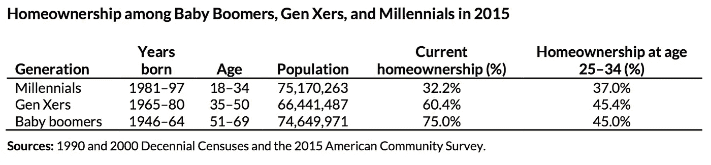

# 一位新数据科学家对文化、进步和技术的思考

> 原文：<https://towardsdatascience.com/a-new-data-scientists-reflections-on-culture-progress-technology-70054782880f?source=collection_archive---------24----------------------->

## 以及学习一项新技能可以。融合(内在、外在)动机

## 我第一次接触数据科学和机器学习

2018 年春天，加州伯班克又是一个阳光明媚的日子，我走向传奇娱乐公司的办公室，这是一家电影、电视和数字媒体的金融家和制作人，早在 2005 年就开始发行蝙蝠侠前传，这是我第一次在应用分析集团开始梦想中的演出。回到 NYU，我看到了一个关于创始人托马斯·图尔的案例研究，他努力将先进的数据分析纳入决策，以选择哪些电影创意值得花费数百万美元，以及如何以具有成本效益的方式将其推向市场。我从未想过有一天我会成为其中的一员。我知道我将向该公司的生产商和营销人员提供的见解来自波士顿定量分析师、工程师和研究人员的辛勤工作和敏锐思维，但我对计算机编程、高级统计学或产生的有价值数据的绝对范围知之甚少，这些数据可以为一家经常在创造性直觉上承担巨大财务风险的公司打开机会。

我只是很高兴能在那里，并成为制作惊人内容的一部分，但我对我们团队能力的迷恋让我意识到我只接触到了冰山一角。我不得不不断学习。2018 年秋天，我决定参加一个在线课程，看看数据科学是不是我想更认真地追求的东西。确实是。几周前，我离开了传奇公司，此后一直在西雅图熨斗学校的数据科学沉浸式训练营进行全日制学习，从今天起，我在这里给你写信。

## 动机:内在和外在

接受放弃一份好工作去接受更多教育的风险，给了我超越过去思考未来的自由。哪怕只是短暂的一瞬间，我的支持系统和好运给了我特权，让我抛开支付账单的思维模式，让我更深入地思考是什么在内在和外在激励着我。我希望利用这个平台来交流我对自己的结论的简化版本，以及我对这个世界的思考，在训练营结束后，我将带着一个新的工具箱重新加入这个世界。明确地说，这篇文章是非技术性的、探索性的头脑风暴，是动机、业务、文化和我对数据科学的热情的交汇。

我能够将我目前的主要动机简化为四个主要方面，以下没有特别的顺序。通过一点自我反省，我意识到在我知道数据科学需要什么之前，这些驱动力与我的选择相关，我希望每一个都以一种重要的方式坚持下去。

坦率地说，我热衷于用我的能力来推动艺术事业。我知道我想对人们和世界产生积极的影响。我喜欢旅行，我想继续旅行。我想最终拥有一个家。这些因素背后的*为什么*可能会导致一场私人的、令人兴奋的、可能是无休止的对话(我很高兴与任何感兴趣的人进行这种对话)。目前，我将坚持尝试理解这些动机如何与更严峻的现实相联系，以及为什么我认为数据科学将提供一个伟大的工具包来实现这些愿望。我的问题总是比答案多，但是当我思考一些与我的人生轨迹直接或间接相关的不同话题时，我邀请你们所有人加入对话。

## 友敌:创造力和技术

> *“每个人都生活在两个领域:内在和外在。内在是艺术、文学、道德和宗教中表达的精神目的的领域。外在是我们赖以生存的设备、技术、机制和工具的综合体。”*
> 
> **—马丁·路德·金**

我对艺术、创意文化和创意经济的迷恋为我提供了借口，让我可以考虑更多有趣的想法，参观更多有趣的地方，结识更多有趣的人。我相信电影、音乐、绘画、语言和其他形式的个人表达对人类进步的历史有着比看起来更独特的重要性，我很久以前就决定要利用我的能力来扶持我认为伟大的艺术家和思想家。经济学并不总是支持艺术家，但我确实认为技术有潜力使创造性的职业建设民主化。

随着 YouTube、Spotify 和网飞等降低优质创意产品进入门槛并引导向大众受众交付的组织的崛起，以及 Etsy、Patreon 和众筹平台 Kickstarter 和 Indiegogo 等组织最近的努力，一个创意能力和独立资源与财务状况更明确相关的世界正在我们眼前形成。超级设备正在降低规模化生产的成本，获奖的电影正在用智能手机创作([Tangerine(2015)——IMDb](https://www.imdb.com/title/tt3824458/))。互联网让寻找愿意为优秀内容付费的观众变得更加容易。区块链有可能淘汰利润分享中介([区块链&媒体——麻省理工斯隆评论](https://sloanreview.mit.edu/article/blockchain-is-changing-how-media-and-entertainment-companies-compete/))。好莱坞人才机构现在将分析视为了解消费者偏好的核心战略( [Parrot Analytics signs CAA](https://variety.com/2019/digital/news/caa-parrot-analytics-entertainment-data-1203189716/) )。在这种情况下，越来越多花在消费创意上的钱直接流入了艺术家的口袋，这是显而易见的。

“苦苦挣扎的艺术家”的概念不会在一夜之间被消除，但更多资源较少的人有更大的机会让这个概念停止。对新媒体内容的文化意义有明确或隐含承诺、依赖或简单开放的关键组织将需要数据科学家来帮助指导他们在未来无数职能领域的决策。不管你的想法相似还是不同，让我们继续对话。我很想听听你对科技赋能创意的愿景，以及你对创意经济发展方向的看法。

## 文化&令人上瘾的科技产业

> *“我们沉迷于我们的电子邮件、Instagram 赞和脸书订阅；我们沉迷于电视节目和 YouTube 视频；我们每年工作时间更长，平均每天花三个小时使用智能手机。我们中的一半人宁愿遭受骨折，也不愿手机坏掉，千禧一代的孩子花在屏幕前的时间太多了，他们很难与真实、活生生的人互动。”*
> 
> ***——*亚当·奥尔特的*不可抗拒的*关于成瘾技术的兴起**

财务义务和道德行为是否相互排斥？大型科技公司复杂的、充满法律术语的服务协议条款对于数据隐私来说足够透明吗？技术进步将继续要求自我监管，至少当华盛顿特区的老家伙们(即参议员哈奇)仍在向马克·扎克伯格提问时，他想知道他如何维持用户不为服务付费的商业模式。如果你想知道，他们刊登广告。扎克的回应是对这个话题的深思熟虑的阐述:“参议员，我们做广告。

我们使用的大多数设备和应用程序都是为了最大化我们的参与度，在许多情况下，吸引我们的自由支配支出。思想领袖警告说，我们已经接近危险的领域。作为一名用户，我当然对我警告的行为类型感到内疚。作为一名未来的数据科学家，我相信大数据赋予了追求利润的实体足够的不受监管的权力，以保证关于道德数据收集和利用的诚实对话。对于一个用例显然可以接受而另一个用例显然不可以的行业，很难在沙地上画出一条硬线。作为数据收集者，我们必须自己决定我们的底线在哪里。我很想了解其他以数据为中心的企业家和高管是如何承担这一责任的。与此同时，作为数据科学家和消费者，让我们保持自我意识，继续自我监管。

## 我们对彼此和自然世界的责任

> *“我们需要的转变要求我们承认，每个人都是发展的参与者……所有利益攸关方，无论大小，都应该找到发挥作用和做出贡献的地方。”*
> 
> *—* **联合国常务副秘书长阿米纳·默罕默德**

我总是想用我的技能和环境去帮助别人，尤其是那些存在于更麻烦的现实中的人。我把我的大部分幸福归功于两位慈爱的父母，他们设法离开了英国利物浦附近的一个工业小镇，这个小镇一直出现在英国的*垃圾镇*系列丛书中，并且显然激起了保罗·西蒙写*回家的路*。参观完我自己之后，我的父母努力在加州建立新生活的原因就很明显了。我很幸运。伴随着这种幸运而来的是向前回报的愿望，我相信数据科学家的工具包为我提供了一个提升影响力的真正机会。

我经常将联合国的可持续发展目标作为一个指南，让我自己适应世界上最紧迫的需求，以及那些拥有大数据技能的人参与进来的机会。贫困、饥饿、清洁水和基本人权是迫使我与越来越多的使命驱动型机构、非政府组织、以可持续方式推动影响和利润的私营企业以及像 [DataKind](https://www.datakind.org/) 这样的数据科学家武装的组织一起为可持续发展目标采取认真行动的问题，这些组织将拥有我现在正在学习的技能的人与正确的项目联系起来。在打造充实的生活和事业时，这不再是我觉得可以推迟的事情。也就是说，让世界变得更好的愿望在博客上发表比付诸行动更容易。我们应该如何优先考虑人类最迫切的需求？我们如何正确衡量影响？权力必须如何激励参与？我很想听到更多的想法，关于你们如何让自己对那些处境更差的人负责，同时保持自己在商业和技术领域的其他目标和参与不受影响。

A visual summary of the United Nations’ Sustainable Development Goals — a quick reference to orient us to the world’s most pressing needs

## 气候变化:科学与权威

> *“气候系统变暖的科学证据是明确的。”*
> 
> ***—* 政府间气候变化专门委员会(联合国)&美国宇航局**

科学家们达成了一致，但政策制定者们却不同意。一些坦率的话有助于推动与你的疯狂叔叔和充满政治色彩的朋友进行无益的辩论:全球气温正在上升。海洋正在变暖，酸性变得更强。海平面在上升，冰盖在缩小，冰川在退缩，积雪在融化。极端天气事件正在增加。2018 年底，由组成[美国全球变化研究计划](https://www.globalchange.gov/)的 13 个联邦机构(包括 EPA、NASA、五角大楼和美国国务院等)发布的一份国会授权报告得出结论，人类活动正在导致气候变化，如果没有精心策划的干预，我们将对我们的星球造成不可挽回的损害。似乎有一个无穷无尽的与世界末日相关的气候事实在我们的指尖上流行地分享在社交媒体上，尽管我不是气候科学家，但我相信辩论的时间已经过去了。迅速行动至关重要。数据科学可以有所帮助。我会继续学习。

总的来说，科学是我们用来衡量和理解我们在地球上的位置的最受审查和信任的研究领域。我相信人文学科，虽然我喜欢认为健康的怀疑主义通常是有根据的，但我们还没有发现比科学更令人信服的循证权威来源。也就是说，我们正处于一个脆弱的时刻，甚至科学家也被指责不诚实。脱离科学的政治行动和言论有多危险？科学发现何时成为事实，为什么否认科学变得如此容易？我们如何从这种深刻的制度不信任中走出来？大数据有什么帮助？我的问题比答案多，但我欢迎你在一个尊重的、持续的对话中提出你的想法。

## 千禧年理想主义、学生债务危机和房屋所有权

我承认，像许多千禧一代一样，我不想把我的激情和价值观与我的工作分开。当然，就像我心目中的英雄一样，我想让这个世界变得更好，并从所有明显的缺陷中拯救出来。不管我对朋友引用老子多少次，我都有很多欲望，其中有些是无可否认的物质欲望。我想自己赚钱，然后把钱花在旅游上，最后，如果运气好的话，花在房地产上。也就是说，我一边喝着一杯 3 美元的咖啡，一边在 MacBook 上写下这些话。我从未应征入伍，也没有目睹过战争。我在一个安全的社区的安全的家里长大。我的父母确保我没有错过一顿饭。我有幸梦想远大，却经常失败。理想主义并不总是能付清账单，但这两者并不相互排斥。我既是雄心勃勃的，又是幸运的，还心怀感激。

尽管我有很多幸运，但和我的同龄人一样，我也背负着一堆荒谬的学生债务。我认识的 30 岁以下的人中，唯一有希望在支付大学教育费用的同时攒钱买房的人是一些朋友，他们牺牲了很多，大学毕业后在华尔街找了份工作，然后多年来每周无眠地工作 80 多个小时。平均来说，在我们的膝盖变坏和头发变白之前，我这个年龄组的人并不期望能合理地拥有自己的房子。旧的美国梦可能已经变成了一种白日梦。

也就是说，我对技术带来的教育民主化持乐观态度。我非常支持在线课程和学位。EdX、训练营式的专业教育(向[熨斗学校大声喊出来，T3)以及奖励协作型教育者，他们喜欢优质内容和资源的真正生产者(例如](https://flatironschool.com/)[教师工资教师](https://www.teacherspayteachers.com/))。希望这些创新能挽回一些希望。学科多样性和包容性必须仍然是社会教育进步的核心。教育是一项人权，我们应该在所有年级庆祝学科和观点的多样性。最重要的是，在追求公共和私营部门的教育相关创新时，必须优先考虑教育工作者和学生，而不是让他们成为牺牲品。

我决定学习数据科学的最后一个原因是最重要的和最不吸引人的。这是一项需要的技能，目前需求大于供给(希望能持续到 7 月份！)有机会成为一家高速发展的公司不可或缺的一员，可能会让我在消除学生债务的道路上更加安心，并让我实现旅行并最终拥有一个家的雄心壮志。对于那些深陷学生债务的人，你有什么解救自己的策略？老师和学生们——教育或教育技术的哪些趋势给了你们希望，如果有的话？对于那些战胜学生债务的人来说，什么策略对你有效？在这个过程中你牺牲了什么？

## 数据科学:杂食者的美工刀

似乎没有大量的职业可以满足我似乎无穷无尽的兴趣和问题，但我对数据科学技能的追求让我可以果断地犹豫不决。除了技术技能之外，最优秀的数据科学家似乎还有一些不同的性格特征，可以在各种各样的领域开展强大而有趣的项目。

数据科学家必须提出正确的问题。组织需要哪些知识来对其战略道路充满信心，了解他们的客户，优化成本和流程，并找到新的机会？数据科学家必须将深厚的技术技能与领域专业知识和背景相结合，以便从原始数据中提取真正的价值。也就是说，数据科学家似乎可以在许多行业和研究领域变得有价值，那些已经在该领域建立的科学家似乎已经鼓励了一种灵活、对多面手和专家都友好的文化。

数据科学家也要有激情。最好的解决方案只有在有决心的情况下才会到来，我相信当内在动力比咖啡更能激发你每天的外在努力时，生活会更有趣。如果没有强有力的指导和一些完美主义者的品质，数据科学家可能会倾向于停止寻找最佳的前进方式。然而，高效的数据科学家知道什么时候停止分析，什么时候开始部署见解、制定建议、解决问题和激励行动。

数据科学家一定很好奇。解决问题通常有许多独特的方法，优秀的数据科学家必须经常考虑替代方案。我发现问自己是否有比我目前使用的方法更好的方法来获取、清理和合并数据是有益的。它需要过程和创造力才能有效。它要求你锻炼你的分析左脑来完成任务和项目，然后，走出去，闻一闻玫瑰花香，并创造性地思考下一步你可以在哪里有效地运用你的努力。这项工作同样受益于自主、不受干扰的方法，以及富有成效的关键团队对话。以驾驶员-导航员的形式和同事一起编程对生产率有复合效应。它是为好奇和开放的头脑而建造的，因为这个领域本身总是随着新的创新被采用而变化。一名优秀的数据科学家必须了解最新的新闻故事和进展，并跟上时代的步伐。

与无休止的好奇心相关的一个重要认识是，并非所有问题都能用数据解决。决策的某些方面必须依靠人类的直觉。数据应该用于提供决策信息和改进预测，但有些时候它不应该被视为永恒的真理。它容易出错，也有其局限性。它既是一门科学，也是一门艺术。有时模型是陈旧的。有时商业环境会改变。有时，预测会成为偏差、方差或数据社区最不喜欢的变量的牺牲品:“不可约误差”的概念。对预测的信心永远不会达到 100%，没有人能真正知道未来。我们只能通过充分利用已知的东西来改进我们在未知中航行的方式。

## 徐:未知

比追求新知识更强有力的是认识到总会有很多我们不知道的东西。我正在学习接受这一点，不管是在工作中，还是在生活中，尽管如此，我还是要前进。我不知道我的梦想、我的计划和我的技能是否会一起形成数据科学、快乐、成功和满足感的完美鸡尾酒，但我知道我从来没有后悔过一个经过计算的、教育第一的风险，它让我超出了我的舒适区。我有过的最有冲击力的经历，就是驻扎在这样的环境里。我学得越多，就越意识到，越来越确定，有太多的东西我不知道，还有太多的东西有待发现。也就是说，让我们一起保持好奇。让我们一起不断学习和提高。

感谢阅读，

亚历克斯

***请继续关注我的文章，随着我对数据科学的深入研究，我将发表越来越多的技术文章。我鼓励大家喜欢、评论、分享或直接给我发消息，告诉我你们对这里提出的想法的想法，或者对我今后应该研究的有趣主题的建议。***

【www.linkedin.com/in/alexshropshire 

[medium.com/@as6140](http://medium.com/@as6140)

[github.com/as6140](http://github.com/as6140)